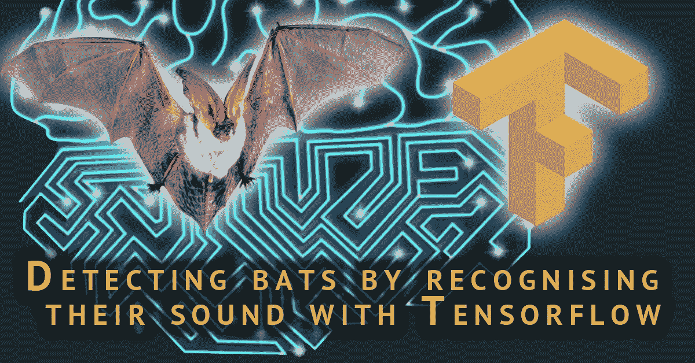
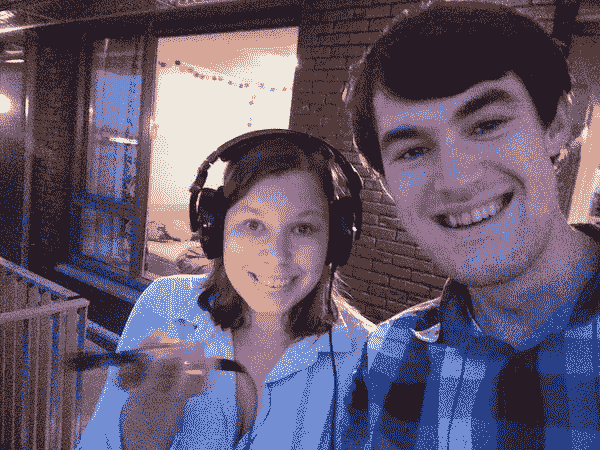
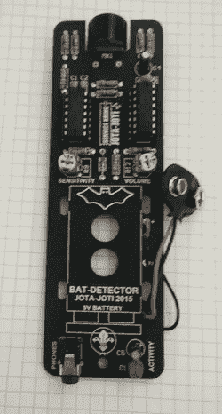
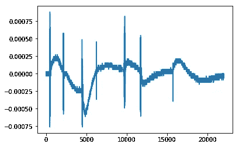
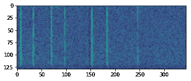
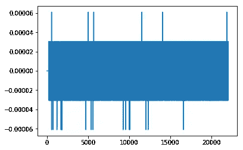
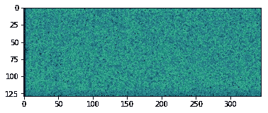
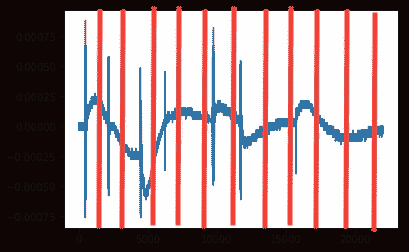
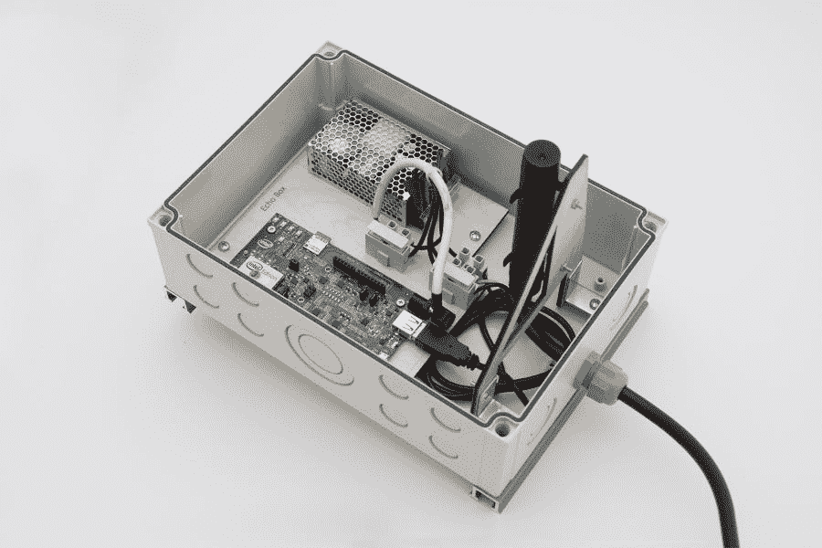

# 通过 Tensorflow 识别蝙蝠的声音来探测蝙蝠

> 原文：<https://towardsdatascience.com/detecting-bats-by-recognising-their-sound-with-tensorflow-cdd5e1c22b14?source=collection_archive---------13----------------------->



上周我发现我的公寓后面有蝙蝠。我立即抓起我的“蝙蝠探测器”:一种将蝙蝠用来回声定位的超声波信号从听不见的频率范围转换成听得见的频率范围的装置。因此，“蝙蝠探测器”这个名字是一个谎言:你可以用它来探测蝙蝠，但它本身并不能探测蝙蝠。在本教程中，我将向你展示如何使用 Tensorflow 建立一个真正的蝙蝠探测器。

[**不幸的是媒体不支持音频文件。去我的博客看看有声音的版本。**](http://www.pinchofintelligence.com/detecting-bats-recognising-sound-tensorflow/)



## 问题陈述

为了解决这个问题，我将蝙蝠探测器连接到我的笔记本电脑上，录下了几个片段。在一个[单独的 Jupyter 笔记本上，我创建了一个标签程序](https://github.com/rmeertens/batdetection/blob/master/Label%20data.ipynb)。这个程序创建了一秒钟的“声音片段”，我将其分为包含蝙蝠声音的片段和不包含蝙蝠声音的片段。我用数据和标签创建一个分类器来区分它们。

## 识别声音的图书馆

我导入了一些非常有用的库来构建声音识别管道。我导入的明显的库是 Tensorflow、Keras 和 scikit。我喜欢的一个声音专用库是 [librosa](https://github.com/librosa/librosa) ，它帮助我加载和分析数据。

在[1]中:

```
import random
import sys
import glob
import os
import time

import IPython
import matplotlib.pyplot as plt
from matplotlib.pyplot import specgram

import librosa
import librosa.display

from sklearn.preprocessing import normalize
import numpy as np
import tensorflow as tf
import keras
from keras.models import Sequential
from keras.layers import Dense, Conv2D, MaxPooling2D, Dropout, FlattenUsing TensorFlow backend.
```

## 用 Python 加载声音数据

在数据标签笔记本中，我们输入标签，并将声音字节保存到我们输入的文件夹中。通过从这些文件夹加载，我可以加载蝙蝠声音和非蝙蝠声音文件。取决于有多少声音文件加载此数据可能需要很长时间。我把一个压缩文件夹里的所有文件都上传到了谷歌云平台。

*   [标注声音](https://storage.googleapis.com/pinchofintelligencebucket/labeled.zip)
*   [原始声音](https://storage.googleapis.com/pinchofintelligencebucket/batsounds.zip)

注意，这个笔记本本身也可以从 Git 库下载。显然，Jupyter 笔记本中的声音比 wordpress/medium 中的声音要大得多。你可能得把声音调大一点！

在[2]中:

```
# Note: SR stands for sampling rate, the rate at which my audio files were recorded and saved. 
SR = 22050 # All audio files are saved like this

def load_sounds_in_folder(foldername):
    """ Loads all sounds in a folder"""
    sounds = []
    for filename in os.listdir(foldername):
        X, sr = librosa.load(os.path.join(foldername,filename))
        assert sr == SR
        sounds.append(X)
    return sounds

## Sounds in which you can hear a bat are in the folder called "1". Others are in a folder called "0". 
batsounds = load_sounds_in_folder('labeled/1')
noisesounds = load_sounds_in_folder('labeled/0')

print("With bat: %d without: %d total: %d " % (len(batsounds), len(noisesounds), len(batsounds)+len(noisesounds)))
print("Example of a sound with a bat:")
IPython.display.display(IPython.display.Audio(random.choice(batsounds), rate=SR,autoplay=True))
print("Example of a sound without a bat:")
IPython.display.display(IPython.display.Audio(random.choice(noisesounds), rate=SR,autoplay=True))With bat: 96 without: 1133 total: 1229 
Example of a sound with a bat:
```

您的浏览器不支持音频元素。

```
Example of a sound without a bat:
```

您的浏览器不支持音频元素。

## 用 Librosa 可视化声音

当你用耳机听蝙蝠的声音时，当一只蝙蝠飞过时，你可以听到清晰的声音。Librosa 库可以执行[傅立叶变换](https://en.wikipedia.org/wiki/Fourier_transform)来提取组成声音的频率。
在构建任何机器学习算法之前，仔细检查你正在处理的数据非常重要。在这种情况下，我决定:

*   听听声音
*   绘制声波图
*   绘制[频谱图(频率振幅随时间变化的可视化表示)](https://en.wikipedia.org/wiki/Spectrogram)。

在[3]中:

```
def get_short_time_fourier_transform(soundwave):
    return librosa.stft(soundwave, n_fft=256)

def short_time_fourier_transform_amplitude_to_db(stft):
    return librosa.amplitude_to_db(stft)

def soundwave_to_np_spectogram(soundwave):
    step1 = get_short_time_fourier_transform(soundwave)
    step2 = short_time_fourier_transform_amplitude_to_db(step1)
    step3 = step2/100
    return step3

def inspect_data(sound):
    plt.figure()
    plt.plot(sound)
    IPython.display.display(IPython.display.Audio(sound, rate=SR))
    a = get_short_time_fourier_transform(sound)
    Xdb = short_time_fourier_transform_amplitude_to_db(a)
    plt.figure()
    plt.imshow(Xdb)
    plt.show()
    print("Length per sample: %d, shape of spectogram: %s, max: %f min: %f" % (len(sound), str(Xdb.shape), Xdb.max(), Xdb.min()))

inspect_data(batsounds[0])
inspect_data(noisesounds[0])
```

您的浏览器不支持音频元素。



```
Length per sample: 22050, shape of spectogram: (129, 345), max: -22.786959 min: -100.000000
```

您的浏览器不支持音频元素。



```
Length per sample: 22050, shape of spectogram: (129, 345), max: -58.154167 min: -100.000000
```

## 数据分析

首先，重要的是要注意，我们正在处理的数据并不完全是大数据…只有大约 100 个阳性样本，深度神经网络很可能在这个 daa 上过度拟合。我们正在处理的一个问题是，收集阴性样本很容易(只需记录一整天没有蝙蝠的情况)，而收集阳性样本很难(蝙蝠每天只在这里呆 15-20 分钟左右，我需要手动标记数据)。在确定如何对数据进行分类时，我们会考虑少量的阳性样本。

## 可听声信号

正如我们从上面可以看到的，信号的幅度随着噪声而降低，而信号的幅度却很高。然而，这并不意味着所有有声音的东西都是蝙蝠。在这个频率下，你还会接收到其他噪音，如手指摩擦声或电话信号。我决定把每一个负面信号放在一个大的“负面”堆上，把电话信号、手指引起的噪音和其他东西放在一个大堆里。

## 光谱图

我希望能在我们的频谱图中看到蝙蝠产生的准确频率。不幸的是，看起来我的传感器在所有频率上都把它当成了噪音。看着声谱图，你仍然可以看到蝙蝠声音和噪音之间的明显区别。我的第一个尝试是使用这个频谱图作为卷积神经网络的输入。不幸的是，仅使用几个正样本，很难训练这个网络。因此，我放弃了这种方法。

最后，我决定采用“元数据方法”。我把每秒钟的声音分成 22 部分。对于每个部分，我确定样本的最大值、最小值、平均值、标准偏差和最大最小值。我采取这种方法的原因是因为“蝙蝠信号”在音频可视化中确实清楚地显示为非高振幅信号。通过分析音频信号的不同部分，我可以发现信号的多个部分是否具有某些特征(如高标准偏差)，从而检测到蝙蝠的叫声。



在[4]中:

```
WINDOW_WIDTH = 10
AUDIO_WINDOW_WIDTH = 1000 # With sampling rate of 22050 we get 22 samples for our second of audio
def audio_to_metadata(audio):
    """ Takes windows of audio data, per window it takes the max value, min value, mean and stdev values"""
    features = []
    for start in range(0,len(audio)-AUDIO_WINDOW_WIDTH,AUDIO_WINDOW_WIDTH):
        subpart = audio[start:start+AUDIO_WINDOW_WIDTH]
        maxval = max(subpart)
        minval = min(subpart)
        mean = np.mean(subpart)
        stdev = np.std(subpart)
        features.extend([maxval,minval,mean,stdev,maxval-minval])
    return features

metadata = audio_to_metadata(batsounds[0])
print(metadata)
print(len(metadata))[0.00088500977, -0.00076293945, 6.7962646e-05, 0.00010915515, 0.0016479492, 0.0002746582, 3.0517578e-05, 0.00017904663, 5.4772983e-05, 0.00024414062, 0.00057983398, -0.00057983398, -2.8137207e-05, 8.1624778e-05, 0.001159668, -9.1552734e-05, -0.0002746582, -0.00019345093, 3.922523e-05, 0.00018310547, 0.00048828125, -0.00076293945, -0.00036187744, 0.00015121402, 0.0012512207, -3.0517578e-05, -0.00057983398, -0.00027001952, 0.00015006117, 0.00054931641, 0.00045776367, -0.00036621094, 5.9234619e-05, 5.0381914e-05, 0.00082397461, 0.00015258789, 6.1035156e-05, 0.00011447143, 1.7610495e-05, 9.1552734e-05, 0.00015258789, 6.1035156e-05, 9.3963623e-05, 1.8880468e-05, 9.1552734e-05, 0.00082397461, -0.00048828125, 7.7423094e-05, 8.6975793e-05, 0.0013122559, 0.00021362305, 6.1035156e-05, 0.00014205933, 2.5201958e-05, 0.00015258789, 0.00054931641, -0.00061035156, 2.8991699e-05, 9.5112577e-05, 0.001159668, -3.0517578e-05, -0.00018310547, -0.00010638428, 2.9584806e-05, 0.00015258789, 3.0517578e-05, -9.1552734e-05, -2.7862548e-05, 2.323009e-05, 0.00012207031, 6.1035156e-05, -3.0517578e-05, 1.8341065e-05, 1.905331e-05, 9.1552734e-05, 0.00018310547, -0.00039672852, 4.9438477e-05, 4.7997077e-05, 0.00057983398, 0.00021362305, 9.1552734e-05, 0.00017184448, 2.1811828e-05, 0.00012207031, 0.00015258789, -6.1035156e-05, 5.0659179e-05, 4.6846228e-05, 0.00021362305, 0.0, -0.00015258789, -5.4656983e-05, 2.7488175e-05, 0.00015258789, -3.0517578e-05, -0.00012207031, -9.0820315e-05, 1.7085047e-05, 9.1552734e-05, 0.0, -0.00012207031, -7.2296141e-05, 1.917609e-05, 0.00012207031, 0.0, -9.1552734e-05, -4.4189452e-05, 1.8292634e-05, 9.1552734e-05]
110
```

## 数据管理

正如每个机器学习项目一样，建立输入输出管道非常重要。我们定义了从声音文件中获取“元数据”的函数:我们可以制作音频频谱图，并简单地从音频数据中提取多个元特征样本。下一步是将我们的预处理函数映射到我们的训练和测试数据。我首先对每个音频样本进行预处理，并将低音和非低音保存在两个不同的列表中。后来我加入了声音和标签。

在这种情况下，我们处理的是少量的“阳性”样本和大量的阴性样本。在这种情况下，将你所有的数据标准化是一个非常好的主意。我的阳性样本可能不同于正态分布，并且很容易被检测到。为此，我使用了 [scikit learn sklearn .预处理函数“normalize”](http://scikit-learn.org/stable/modules/preprocessing.html)。在培训期间，我发现我对标准化和规范化的想法与 scikit 的定义完全相反。在这种情况下，这可能不是一个问题，因为正常化蝙蝠声音可能仍然会产生不同于正常化噪音声音的结果。

在[5]中:

```
# Meta-feature based batsounds and their labels
preprocessed_batsounds = list()
preprocessed_noisesounds = list()

for sound in batsounds:
    expandedsound = audio_to_metadata(sound)
    preprocessed_batsounds.append(expandedsound)
for sound in noisesounds:
    expandedsound = audio_to_metadata(sound)
    preprocessed_noisesounds.append(expandedsound)

labels = [0]*len(preprocessed_noisesounds) + [1]*len(preprocessed_batsounds)
assert len(labels) == len(preprocessed_noisesounds) + len(preprocessed_batsounds)
allsounds = preprocessed_noisesounds + preprocessed_batsounds
allsounds_normalized = normalize(np.array(allsounds),axis=1)
one_hot_labels = keras.utils.to_categorical(labels)
print(allsounds_normalized.shape)
print("Total noise: %d total bat: %d total: %d" % (len(allsounds_normalized), len(preprocessed_batsounds), len(allsounds)))

## Now zip the sounds and labels, shuffle them, and split into a train and testdataset
zipped_data = zip(allsounds_normalized, one_hot_labels)
np.random.shuffle(zipped_data)
random_zipped_data = zipped_data
VALIDATION_PERCENT = 0.8 # use X percent for training, the rest for validation
traindata = random_zipped_data[0:int(VALIDATION_PERCENT*len(random_zipped_data))]
valdata = random_zipped_data[int(VALIDATION_PERCENT*len(random_zipped_data))::]
indata = [x[0] for x in traindata]
outdata = [x[1] for x in traindata]
valin = [x[0] for x in valdata]
valout = [x[1] for x in valdata](1229, 110)
Total noise: 1229 total bat: 96 total: 1229
```

## 机器学习模型

为了检测蝙蝠，我决定尝试一个非常简单的具有三个隐藏层的神经网络。由于可训练参数太少，网络只能区分无声和有声。有了太多的可训练参数，网络将很容易在我们拥有的小数据集上过度适应。

我决定在 Keras 中实现这个网络，这个库给了我最好的函数，让我可以很容易地在这个简单的问题上尝试不同的神经网络架构。

在[6]中:

```
LEN_SOUND = len(preprocessed_batsounds[0])
NUM_CLASSES = 2 # Bat or no bat

model = Sequential()
model.add(Dense(128, activation='relu',input_shape=(LEN_SOUND,)))
model.add(Dense(32, activation='relu'))
model.add(Dense(32, activation='relu'))
model.add(Dense(2))
model.compile(loss="mean_squared_error", optimizer='adam', metrics=['mae','accuracy'])
model.summary()
model.fit(np.array(indata), np.array(outdata), batch_size=64, epochs=10,verbose=2, shuffle=True) 
valresults = model.evaluate(np.array(valin), np.array(valout), verbose=0)
res_and_name = zip(valresults, model.metrics_names)
for result,name in res_and_name: 
    print("Validation " + name + ": " + str(result))_________________________________________________________________
Layer (type)                 Output Shape              Param #   
=================================================================
dense_1 (Dense)              (None, 128)               14208     
_________________________________________________________________
dense_2 (Dense)              (None, 32)                4128      
_________________________________________________________________
dense_3 (Dense)              (None, 32)                1056      
_________________________________________________________________
dense_4 (Dense)              (None, 2)                 66        
=================================================================
Total params: 19,458
Trainable params: 19,458
Non-trainable params: 0
_________________________________________________________________
Epoch 1/10
0s - loss: 0.2835 - mean_absolute_error: 0.4101 - acc: 0.9237
Epoch 2/10
0s - loss: 0.0743 - mean_absolute_error: 0.1625 - acc: 0.9237
Epoch 3/10
0s - loss: 0.0599 - mean_absolute_error: 0.1270 - acc: 0.9237
Epoch 4/10
0s - loss: 0.0554 - mean_absolute_error: 0.1116 - acc: 0.9237
Epoch 5/10
0s - loss: 0.0524 - mean_absolute_error: 0.1071 - acc: 0.9237
Epoch 6/10
0s - loss: 0.0484 - mean_absolute_error: 0.1024 - acc: 0.9237
Epoch 7/10
0s - loss: 0.0436 - mean_absolute_error: 0.1036 - acc: 0.9329
Epoch 8/10
0s - loss: 0.0375 - mean_absolute_error: 0.0983 - acc: 0.9481
Epoch 9/10
0s - loss: 0.0327 - mean_absolute_error: 0.0923 - acc: 0.9624
Epoch 10/10
0s - loss: 0.0290 - mean_absolute_error: 0.0869 - acc: 0.9644
Validation loss: 0.0440898474639
Validation mean_absolute_error: 0.101937913192
Validation acc: 0.930894308458
```

## 检测流水线的结果和实现

验证集的准确率达到了 95 %,看起来我们做得非常好。下一步是检查我们是否能在一段我们从未处理过的更长的音频中找到蝙蝠。我在蝙蝠几乎消失后录了一段录音，让我们看看是否能找到什么:

在[7]中:

```
soundarray, sr = librosa.load("batsounds/bats9.m4a")
maxseconds = int(len(soundarray)/sr)
for second in range(maxseconds-1):
    audiosample = np.array(soundarray[second*sr:(second+1)*sr])
    metadata = audio_to_metadata(audiosample)
    testinput = normalize(np.array([metadata]),axis=1)
    prediction = model.predict(testinput)

    if np.argmax(prediction) ==1:
        IPython.display.display(IPython.display.Audio(audiosample, rate=sr,autoplay=True))
        time.sleep(2)
        print("Detected a bat at " + str(second) + " out of " + str(maxseconds) + " seconds")
        print(prediction)
```

您的浏览器不支持音频元素。

```
Detected a bat at 514 out of 669 seconds
[[ 0.45205975  0.50231218]]
```

## 结论，以及类似项目

最后，在 26 分钟的音频中，我的传感器每次检测到 1 只蝙蝠，而外面可能没有蝙蝠(但我无法证实这一点)。我会断定我的程序有效！现在，我们能够将这个程序集成到一个小管道中，以便每当外面有蝙蝠时向我发出警告，或者我们可以每天进行记录，并每天测量蝙蝠的活动。

在这个项目中，自然智能城市项目创造了 T2 蝙蝠伦敦项目。通过传感器你可以[看到蝙蝠的活动](http://www.batslondon.com/sensors/7)。同样有趣的是，它们的传感器能够捕捉更有趣的声音，比如蝙蝠发出的社交叫声。很高兴看到其他人也对这一主题感兴趣，并且可以比较不同的方法。bats London 项目建造了漂亮的盒子，里面有一台计算机，它根据光谱图进行所有的处理。他们使用基于 3 秒声音文件的卷积神经网络，每 6 秒记录一次。将来他们甚至想开始区分不同种类的蝙蝠！他们在一个非常有趣的项目上做得非常好！

