# 利用深度学习检测乳腺癌

> 原文：<https://towardsdatascience.com/detecting-breast-cancer-with-a-deep-learning-10a20ff229e7?source=collection_archive---------7----------------------->

## 乳腺癌是女性中最常见的侵袭性癌症，是仅次于肺癌的女性癌症死亡的第二大原因。在本文中，我将构建一个基于 WideResNet 的神经网络，将幻灯片图像分为两类，一类包含乳腺癌，另一类不使用深度学习工作室(h[TTP://Deep cognition . ai/)](http://deepcognition.ai/)

浸润性导管癌(IDC)也称为浸润性导管癌，是最常见的乳腺癌类型。美国癌症协会估计**美国每年有超过 180，000 名女性发现她们患有浸润性乳腺癌。**这些癌症中的大多数被诊断为 IDC。

准确识别和分类乳腺癌亚型是一项重要的任务。基于人工智能的自动化方法可以显著节省时间并减少错误。

在这篇文章中，我将使用[深度学习工作室](http://deepcognition.ai/)构建一个基于 WideResNet 的神经网络，将幻灯片图像分为两类，一类包含乳腺癌，另一类不包含乳腺癌。

如果你不熟悉深度学习，看看这个:)

 [## 深度学习的“怪异”介绍

### 有关于深度学习的惊人介绍、课程和博文。但这是一种不同的介绍。

towardsdatascience.com](/a-weird-introduction-to-deep-learning-7828803693b0) 

如果你想了解更多关于深层认知的知识，请看这个:

 [## 深度认知让深度学习变得简单

### 在过去的一个月里，我有幸见到了 DeepCognition.ai 的创始人

becominghuman.ai](https://becominghuman.ai/deep-learning-made-easy-with-deep-cognition-403fbe445351) 

# 关于数据集

俄亥俄州克利夫兰凯斯西储大学的研究人员收集了这个问题的数据集。原始数据集在这里(编辑:原始链接不再工作，从 Kaggle 下载)。这个数据集是在 [Kaggle](https://www.kaggle.com/paultimothymooney/predict-idc-in-breast-cancer-histology-images/data) 由善良的人预处理的，这是我们工作的起点。

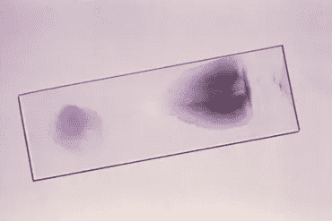

Each slide approximately yields 1700 images of 50x50 patches

数据集中有 162 张完整的载玻片图像。这些幻灯片是以 40 倍的分辨率扫描的。最后，这些幻灯片被分成 275，215 个 50x50 像素的小块。然后将 0 或 1 的一个标签分配给这些补丁中的每一个。对于包含 IDC 的修补程序，标签为 1，不包含 IDC 的修补程序标签为 0。

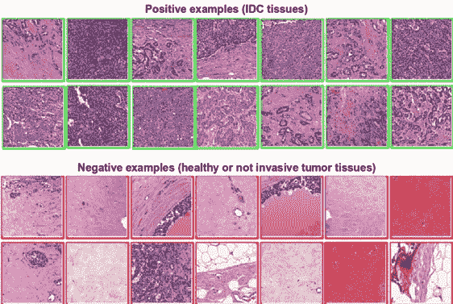

3 Example of positive and negative IDC tissue. [https://doi.org/10.1117/12.2043872](https://doi.org/10.1117/12.2043872)

# **用宽网分类载玻片**

使用剩余连接的 ResNet 体系结构在图像分类任务中非常成功。WideResNet 架构表明，可以用小得多的深度(小至 16 层)实现类似的性能。这有助于解决与非常深的结果相关的各种问题，如爆炸/消失梯度和退化。

利用文森特·冯和 T2 博客中的大量信息，我们可以对 ResNet 实际上在做什么有一些直觉。

ResNet 的核心思想是引入所谓的“身份快捷连接”，跳过一层或多层。

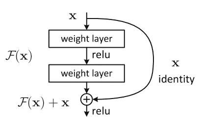

Residual Block

该论文的最初作者假设，让堆叠层拟合残差映射比让它们直接拟合所需的底层映射更容易。这表明较深的模型不应该比其较浅的模型产生更高的训练误差。

由于其引人注目的结果，ResNet 很快成为各种计算机视觉任务中最受欢迎的架构之一。

现在，一个**宽网**的存在是有原因的:每提高百分之一的精度都要花费近两倍的层数，因此训练非常深的残差网络有一个减少特征重用的问题，这使得这些网络训练非常慢。

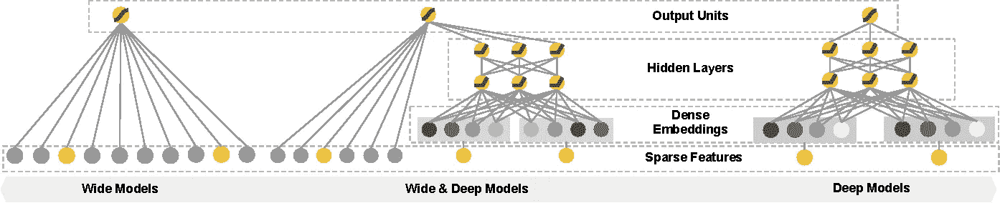

[https://dl.acm.org/citation.cfm?doid=2988450.2988454](https://dl.acm.org/citation.cfm?doid=2988450.2988454)

为了解决这些问题 [Zagoruyko 和 Komodakis](https://arxiv.org/pdf/1605.07146.pdf) 对 ResNet 块的架构进行了详细的实验研究(于 2016 年发表)，基于此，他们提出了一种新的架构，其中我们减少了深度，增加了剩余网络的宽度。他们称之为广泛残留网络。

现在，我们将展示使用 WideResNet 架构解决此问题的逐步过程。我们正在使用**深度学习工作室**，它允许我们快速构建神经网络，而无需担心编码、语法和数据集摄取。

## **1。项目创建**

当你登录到运行在本地或云中的深度学习工作室后，点击+按钮创建一个新项目。

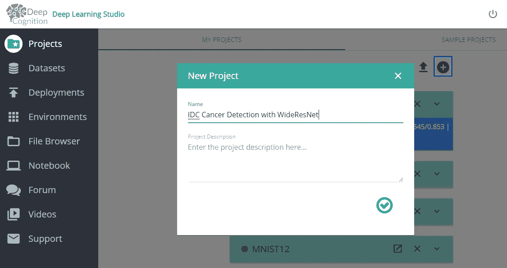

## **2。数据集摄入**

然后，我们在“数据”选项卡中为此项目设置数据集。通常 80% — 20%是训练和验证之间的一个很好的划分，但是如果您愿意，也可以使用其他设置。另外，如果你的机器有足够的内存来在内存中加载完整的数据集，不要忘记将内存中的加载数据集设置为“完整的数据集”。

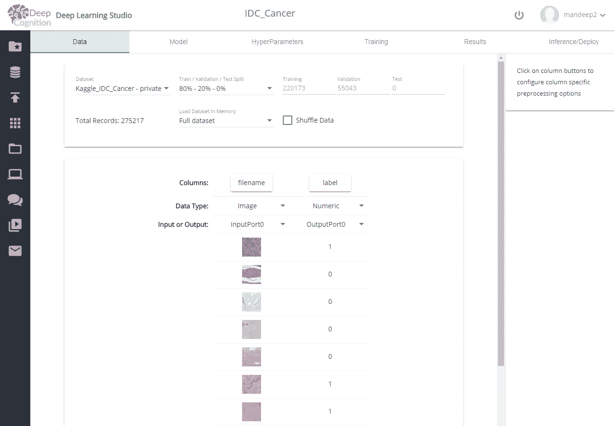

## **3。创建神经网络**

您可以通过拖放层来创建如下所示的神经网络。

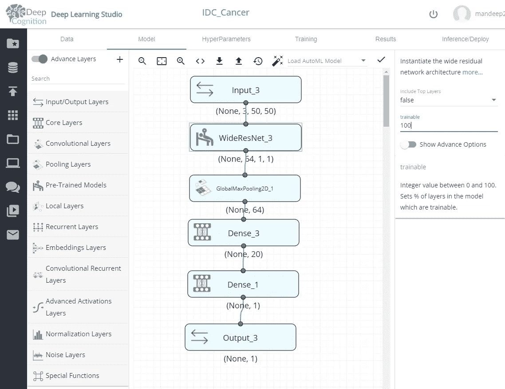

确保在右侧的属性中将 WideResNet 设置为 100%可训练。此外，第一密集层(Dense_3)应该具有 20 个左右的具有 ReLU 作为激活功能的神经元。最终密集层(Dense_1)的输出维度应为 1，激活为 sigmoid。这是因为我们把这个问题设定为回归而不是分类。如果回归输出低于 0.5，那么我们可以说输入属于 0 类(无 IDC 癌症)，否则它有 IDC 癌症。

## **4。** **超参数和训练**

我们使用的超参数如下所示。请随意更改并尝试它们。

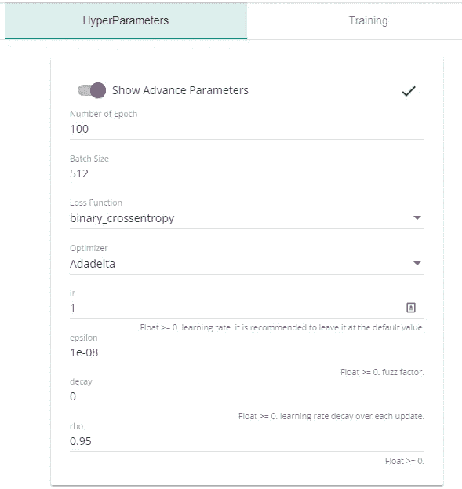

最后，您可以从“培训”选项卡开始培训，并使用培训仪表板监控进度。

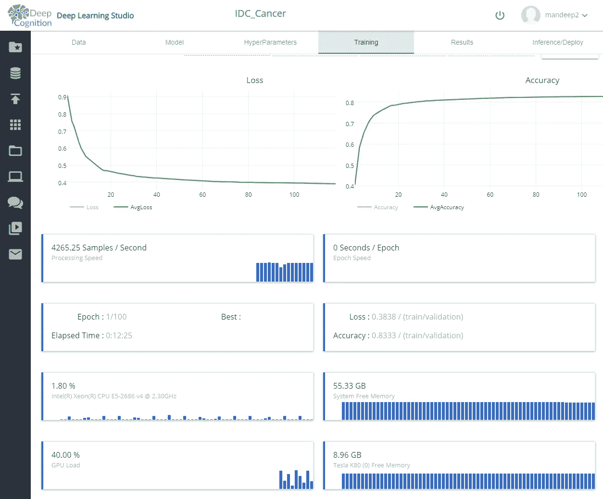

完成培训后，您可以在“结果”选项卡中查看结果。我们在一个 K80 GPU 上花了几个小时实现了超过 85%的准确率，这个 GPU 的价格大约是每小时 0.90 美元。

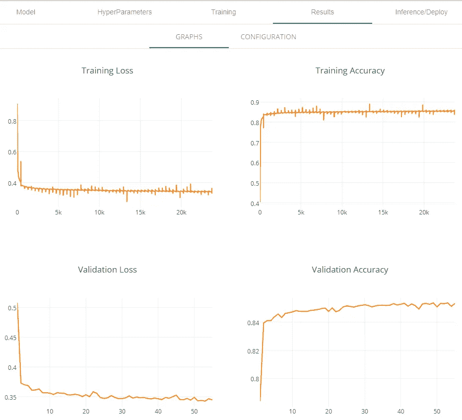

通过将 Deep Learning Studio 部署为 webapp 或 REST API，可以使用如下所示的部署选项卡轻松完成。

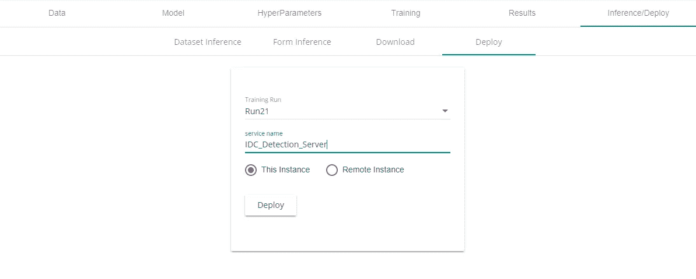

## 5.部署模型

部署的模型可以作为 WebApp 或 REST API 访问，如下所示:

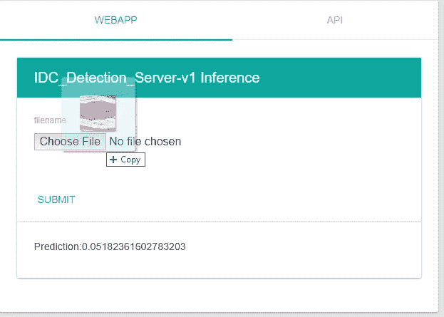

# **结束语**

所以你可以看到，使用 Deep Learning Studio，可以在几分钟内建立深度学习模型，并在几秒钟内部署。这种能力将使许多开发人员能够处理复杂的问题，而不用担心编码、API 等问题。

我在这里重复一下我在[“深度认知使深度学习变得容易”](https://becominghuman.ai/deep-learning-made-easy-with-deep-cognition-403fbe445351)博客中关于“**黑箱问题**”的话:

> 你脑海中会出现的事情是:好吧，我在做深度学习，但我不知道怎么做。
> 
> 实际上你可以下载产生预测的代码，你会看到它是用 Keras 写的。然后，您可以上传代码，并用系统提供的笔记本进行测试。
> 
> AutoML 特性和 GUI 拥有 Keras 和其他 DL 框架的精华，只需简单的点击，它的好处是为您选择 DL 的最佳实践，如果您对这些选择不完全满意，您可以在 UI 中轻松更改它们，或者与笔记本进行交互。
> 
> 这个系统建立的前提是让人工智能对每个人来说都很容易，当创建这个复杂的模型时，你不必成为专家，但我的建议是，你对自己正在做的事情有一个想法是好的，阅读一些 TensorFlow 或 Keras 文档，观看一些视频并获得信息。如果你是这方面的专家，那太好了！这将使你的生活更容易，你仍然可以在构建模型时应用你的专业知识。

感谢[深度认知](https://medium.com/u/561cb78751ed?source=post_page-----10a20ff229e7--------------------------------)帮我搭建这篇文章:)

感谢你阅读这篇文章。希望你在这里发现了一些有趣的东西:)

如果您有任何问题，请在 twitter 上添加我:

 [## 法维奥·巴斯克斯(@法维奥·巴斯克斯)|推特

### Favio Vázquez 的最新推文(@FavioVaz)。数据科学家。物理学家和计算工程师。我有一个…

twitter.com](https://twitter.com/FavioVaz) 

和 LinkedIn:

 [## Favio Vázquez —首席数据科学家— OXXO | LinkedIn

### 查看 Favio Vázquez 在世界上最大的职业社区 LinkedIn 上的个人资料。Favio 有 15 个工作职位列在…

linkedin.com](http://linkedin.com/in/faviovazquez/) 

那里见:)