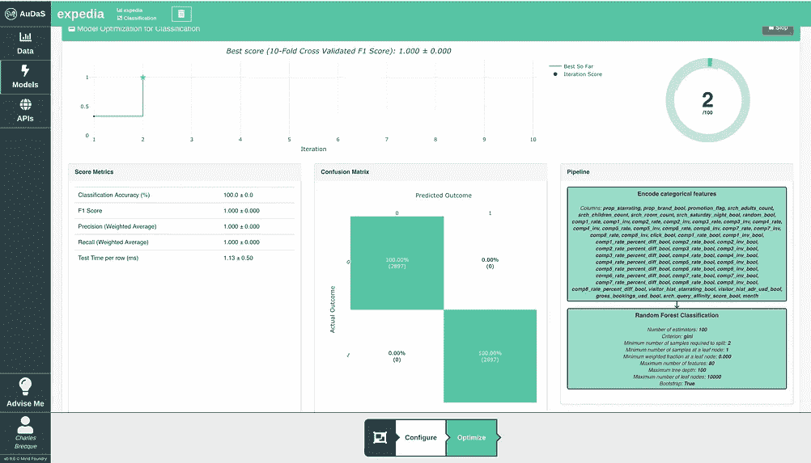
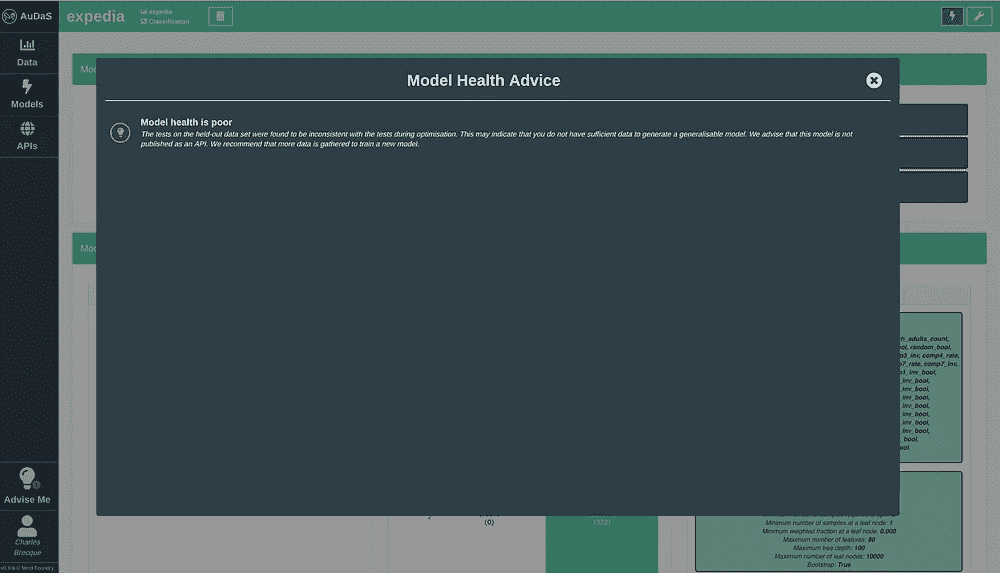
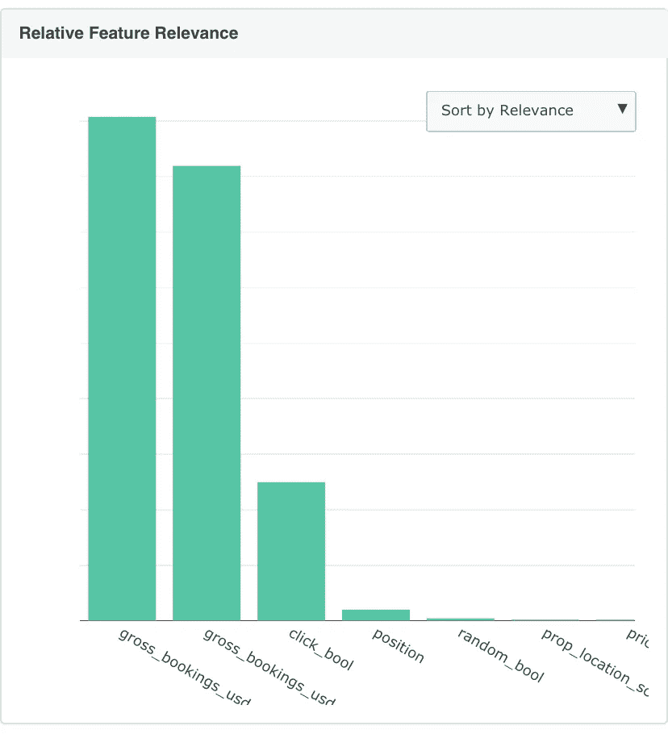
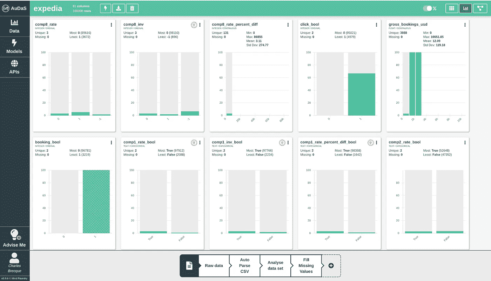
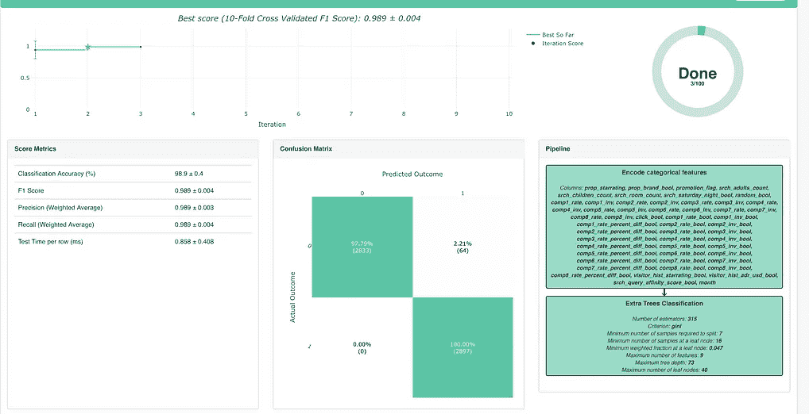
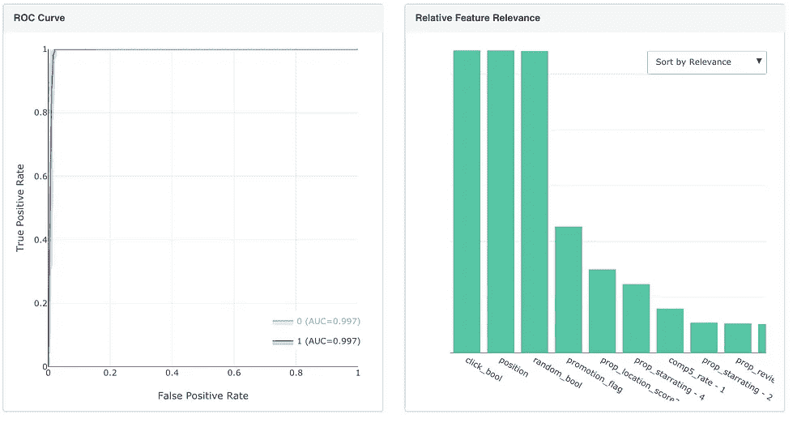
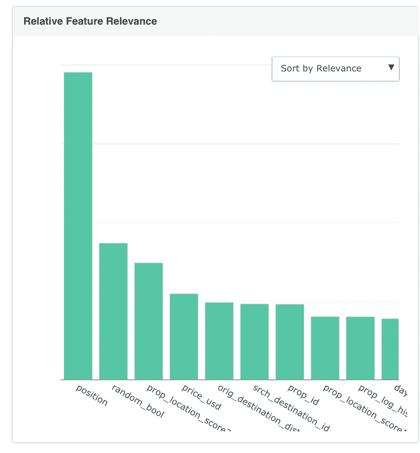
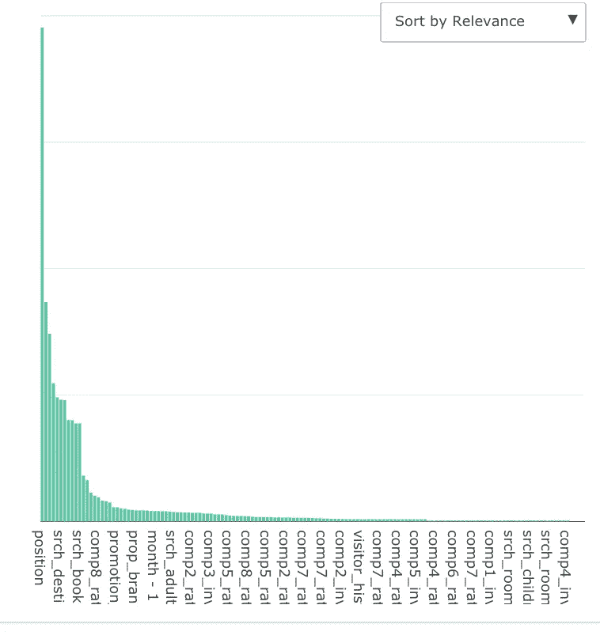
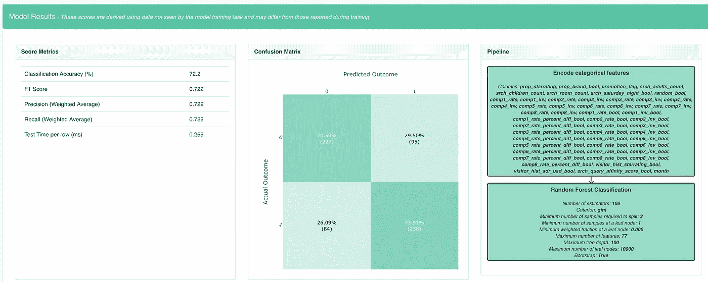

# 在为时已晚之前检测数据泄漏

> 原文：<https://towardsdatascience.com/detecting-data-leakage-before-its-too-late-afcfa4ea9f77?source=collection_archive---------7----------------------->

## 有时候好得难以置信。

**更新**:我开了一家科技[公司](http://www.legislate.tech)。你可以在这里找到更多

在阅读了 Susan Li 的 Expedia 案例研究文章后，我想看看我是否能使用 Mind Foundry 的自动化机器学习平台来重现结果。这些数据可在 [Kaggle](https://www.kaggle.com/c/expedia-personalized-sort/data) 上获得，包含酒店预订的客户网络分析信息(对与错)。这个竞赛的目标是预测顾客是否会预订。然而，在清理数据并在 3 分钟的训练后建立我的模型后，我达到了 100%的分类准确率，这立即触发了警报。我是数据泄露的受害者。

在这篇文章中，我们将看到奥达斯是如何拉响警报的，以及我如何在第一时间避免它！

## 检测泄漏

目标是对客户是否会预订进行分类，因此我在 AuDaS 中启动了一个简单的分类任务，并在达到 100%的准确率后立即触发了一个模型健康警告。

Model Health Warning raised by AuDaS

在进一步检查功能相关性后，我意识到泄漏是由包含与预订相关的$值的总预订列引起的。然后，我返回到 AuDaS 中的数据准备步骤，以排除它，最重要的是，看看是否有任何其他列我应该删除。

Feature Relevance in AuDaS

## 利用 AuDaS 主动检测数据泄漏

我决定使用 AuDaS 的自动直方图页面来识别完美的预订预测，然后从训练数据中排除。不足为奇的是，总预订量和点击率(无论酒店是否被点击)是预订的强有力的预测因素，因为为了进行预订，我们需要点击，然后链接，然后支付！

在排除总预订量并重新启动分类任务后，我仍然达到了 99%的分类准确率，这使我能够更近距离地观察正在发生的事情。

实际上，因为预订很少，AuDaS 平衡了训练和 10%的验证目的，click bool 列是预订的近乎完美的预测。

## 利用 AuDaS 进行稳健建模

最后，我决定排除点击来识别预测预订(以及点击)的关键特征，因为这是 Expedia 的主要目标。

分类准确率因此降低到 72%，但 AuDaS 能够识别出一个更细微的预订相关预测指标排名。

所选型号的主要特点是:

*   酒店在搜索结果页面上的位置
*   搜索结果的 A/B 排序方法
*   资产的位置得分和价格

## 关键外卖

数据科学中的数据泄漏经常会被忽视，这就是为什么拥有发出警告和检测泄漏源的机制非常重要。一旦确定了泄漏，对数据的理解对于解释为什么以及如何导致泄漏是很重要的，以便决定修复泄漏的最佳方式。奥达斯帮助我们避免了一场灾难。

## 奥达斯

AuDaS 是由 Mind Foundry 开发的自动化数据科学平台，为构建端到端的机器学习解决方案提供了一个强大的框架。该框架有助于识别数据泄漏并及时采取行动。您可以尝试 AuDaS [这里](http://audas@mindfoundry.ai)和查看更多演示如下:

## 团队和资源

Mind Foundry 是牛津大学的一个分支机构，由斯蒂芬·罗伯茨(Stephen Roberts)和迈克尔·奥斯本(Michael Osborne)教授创建，他们在数据分析领域已经工作了 35 年。Mind Foundry 团队由 30 多名世界级的机器学习研究人员和精英软件工程师组成，其中许多人曾是牛津大学的博士后。此外，Mind Foundry 通过其分拆地位，拥有超过 30 名牛津大学机器学习博士的特权。Mind Foundry 是牛津大学的投资组合公司，其投资者包括[牛津科学创新](https://www.oxfordsciencesinnovation.com)、[牛津技术与创新基金、](http://www.oxfordtechnology.com)、[牛津大学创新基金](https://innovation.ox.ac.uk/award-details/university-oxford-isis-fund-uoif/)和 [Parkwalk Advisors](http://parkwalkadvisors.com) 。