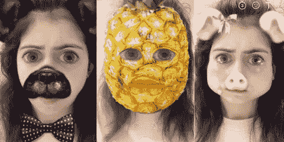
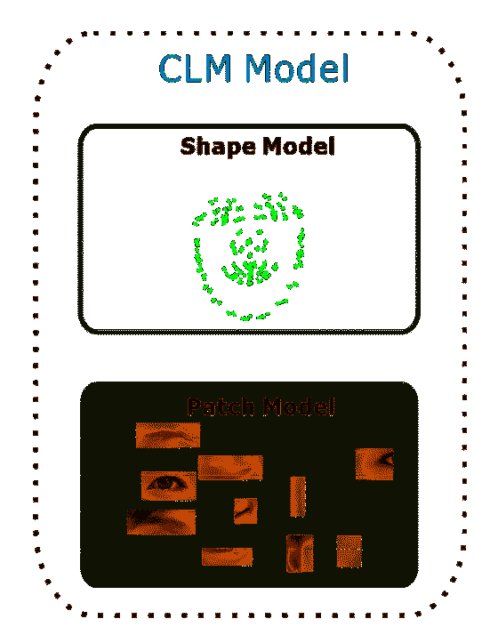
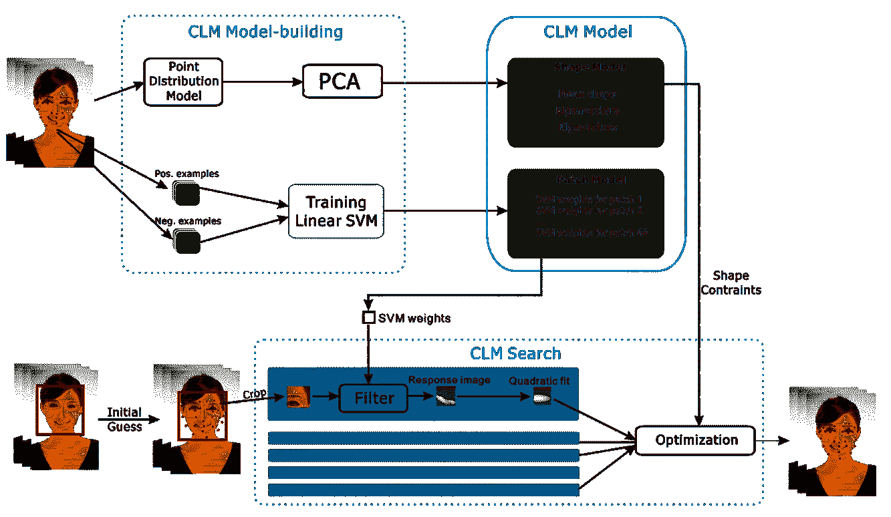
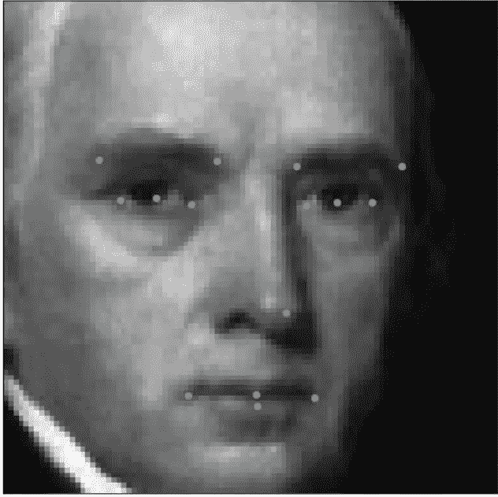
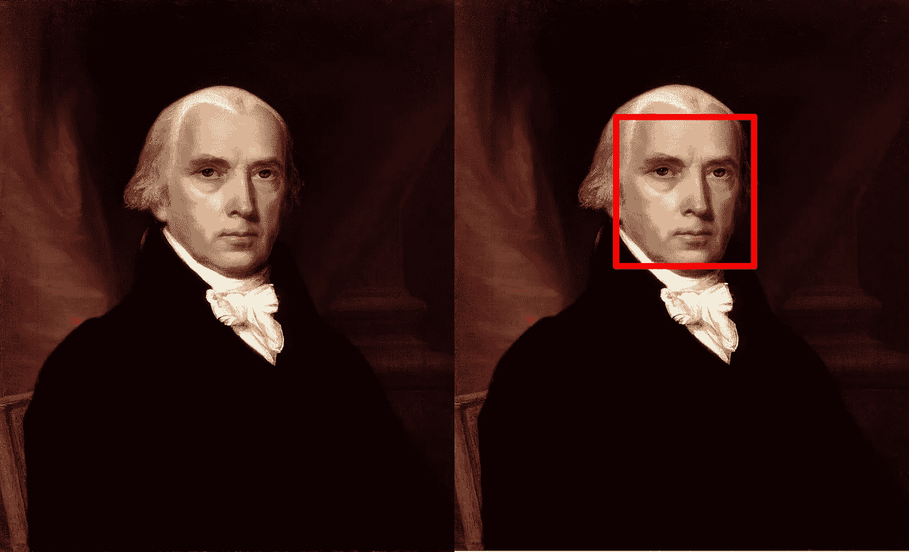
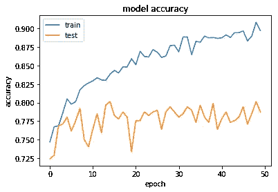
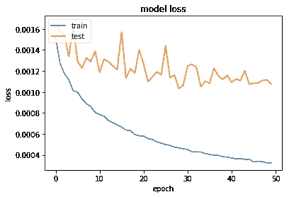
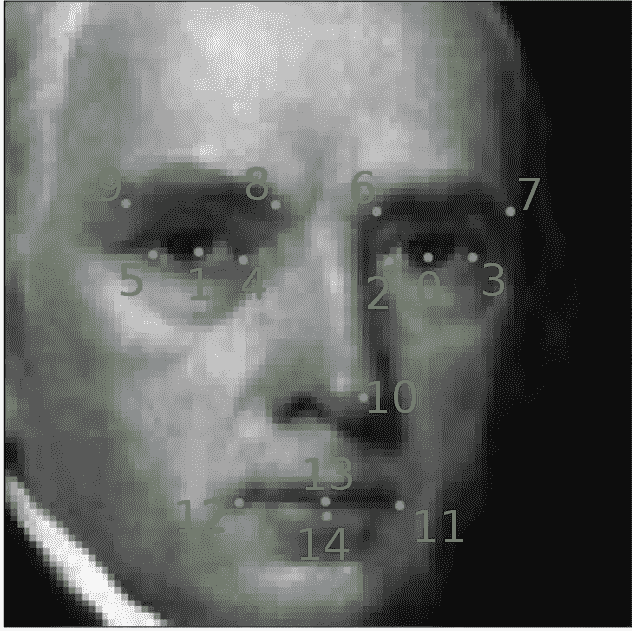

# 使用深度学习检测面部特征

> 原文：<https://towardsdatascience.com/detecting-facial-features-using-deep-learning-2e23c8660a7a?source=collection_archive---------7----------------------->

也许你想知道如何在实时视频聊天中在人脸上放置有趣的物体或检测情绪？在这里，我将向您展示一种利用深度学习的可能方法，并略读一种较老的方法。



在过去，一项具有挑战性的任务是检测人脸及其特征，如眼睛、鼻子、嘴巴，甚至从它们的形状中提取情感。这项任务现在可以通过深度学习“神奇地”解决，任何有天赋的青少年都可以在几个小时内完成。我将在这篇文章中向你展示这样一种方法。

# **【古典】法(CLM)**



如果你像我一样，需要执行面部跟踪(在我的情况下，将一个人的手势从网络摄像头转移到动画角色)，你可能会发现，最好的执行算法之一曾经是受约束的本地模型([【CLM】](https://sites.google.com/site/xgyanhome/home/projects/clm-implementation/ConstrainedLocalModel-tutorial%2Cv0.7.pdf?attredirects=0))，例如由[剑桥面部跟踪器](https://github.com/TadasBaltrusaitis/CLM-framework)或其更新的 [OpenFace](https://github.com/TadasBaltrusaitis/OpenFace) 化身实现。这是基于将检测任务分成检测形状向量特征( [ASM](http://slidegur.com/doc/3183242/face-and-facial-feature-tracking-asm--aam--clm) )和小块图像模板( [AAM](http://slidegur.com/doc/3183242/face-and-facial-feature-tracking-asm--aam--clm) )，并使用预训练的线性 SVM 来改进检测。

它的工作原理是首先粗略估计关键点的位置，然后对包含面部部分的预训练图像应用 SVM，并调整关键点的位置。重复这一过程，直到误差对于我们的目的来说足够低。此外，值得一提的是，它假设图像上的人脸位置已经被估计，例如通过使用 [Viola-Jones 检测器](https://en.wikipedia.org/wiki/Viola%E2%80%93Jones_object_detection_framework) ( [Haar cascades](https://en.wikipedia.org/wiki/Haar-like_feature) )。然而，CLM 过程是相当复杂和重要的，肯定不会由一个高中巫师来实现。您可以在这里看到整体架构:



Well, fairly complicated, right?

# **深度学习**

相反，我们可以使用一个非常简单的卷积神经网络( [CNN](https://en.wikipedia.org/wiki/Convolutional_neural_network) )并在我们预期包含人脸的图像部分上执行关键点检测。为此，我们需要一个训练数据集；我们可以使用由 [Kaggle](https://www.kaggle.com/) 为他们的[面部关键点检测挑战](https://www.kaggle.com/c/facial-keypoints-detection/data)提供的一个，包含 15 个关键点，或者一个更复杂的 [MUCT 数据集](http://www.milbo.org/muct/)包含 76 个关键点(耶！).

显然，拥有高质量的训练数据集在这里是必不可少的，我们都应该纪念那些不得不牺牲他们的时间和精力来注释一堆人脸以获准毕业的贫困本科生，这样我们就可以轻松地表演这些神奇的把戏。

下面是一张巴洛克风格的脸和它在 Kaggle 数据集中的关键点的样子:



James Madison Jr.

数据集包含分辨率为 96x96 的灰度图像和 15 个关键点，每只眼睛 5 个，嘴/鼻子位置 5 个。

对于任意图像，我们首先需要检测图像中人脸的位置；可以使用前面提到的基于哈尔级联的 Viola-Jones 检测器(如果你看看它是如何工作的，它有点像 CNN)。或者，如果你更有冒险精神，你也可以使用全卷积网络( [FCN](https://people.eecs.berkeley.edu/%7Ejonlong/long_shelhamer_fcn.pdf) )和深度估计来执行图像分割。



OpenCV does the trick

无论如何，使用 OpenCV 是小菜一碟:

```
Grayscale_image = cv2.cvtColor(image, cv2.COLOR_RGB2GRAY)face_cascade = cv2.CascadeClassifier(‘haarcascade_frontalface_default.xml’)bounding_boxes = face_cascade.detectMultiScale(grayscale_image, 1.25, 6)
```

这段代码返回图像上所有可能的人脸包围盒。

接下来，对于 Viola-Jones 返回的每个边界框，我们提取相应的子图像，将其转换为灰度，并将其大小调整为 96x96。它们将成为我们最终的 CNN 的输入，用于推理。

CNN 架构超级猥琐；一堆 5×5 卷积层(实际上是 3 层，每层有 24、36 和 48 个滤波器)，然后是另外 2 层 3×3 卷积层(每层 64 个滤波器)，最后是 3 个全连接层(有 500、90 和 30 个节点)。一些防止过度拟合的最大池和减少展平参数数量的全局平均池。输出将是 30 个浮点数，表示 15 个关键点的 x，y 坐标序列。

下面是在 [Keras](https://keras.io/) 中的实现:

```
model = Sequential()model.add(BatchNormalization(input_shape=(96, 96, 1)))model.add(Convolution2D(24, 5, 5, border_mode=”same”, init=’he_normal’, input_shape=(96, 96, 1), dim_ordering=”tf”))
model.add(Activation(“relu”))
model.add(MaxPooling2D(pool_size=(2, 2), strides=(2, 2), border_mode=”valid”))model.add(Convolution2D(36, 5, 5))
model.add(Activation(“relu”))
model.add(MaxPooling2D(pool_size=(2, 2), strides=(2, 2), border_mode=”valid”))model.add(Convolution2D(48, 5, 5))
model.add(Activation(“relu”))
model.add(MaxPooling2D(pool_size=(2, 2), strides=(2, 2), border_mode=”valid”))model.add(Convolution2D(64, 3, 3))
model.add(Activation(“relu”))
model.add(MaxPooling2D(pool_size=(2, 2), strides=(2, 2), border_mode=”valid”))model.add(Convolution2D(64, 3, 3))
model.add(Activation(“relu”))model.add(GlobalAveragePooling2D());model.add(Dense(500, activation=”relu”))
model.add(Dense(90, activation=”relu”))
model.add(Dense(30))
```

您可能希望选择[均方根传播](http://Root Mean Square Propagation) (rmsprop)优化器和[均方误差](https://en.wikipedia.org/wiki/Mean_squared_error) (MSE)作为您的损失函数和精度指标。

仅仅通过一些琐碎的技巧，如对输入图像的[批量归一化](https://arxiv.org/abs/1502.03167)，全局平均池以及[正常](https://www.tensorflow.org/api_docs/python/tf/contrib/keras/initializers/he_normal)权重初始化，你可以在大约 30 个训练时期获得 80-90%的验证准确率和损失< 0.001:

```
model.compile(optimizer=’rmsprop’, loss=’mse’, metrics=[‘accuracy’])checkpointer = ModelCheckpoint(filepath=’face_model.h5', verbose=1, save_best_only=True)epochs = 30hist = model.fit(X_train, y_train, validation_split=0.2, shuffle=True, epochs=epochs, batch_size=20, callbacks=[checkpointer], verbose=1)
```



然后，要预测关键点的位置，只需运行:

```
features = model.predict(region, batch_size=1)
```

就这样。你现在已经掌握了检测面部关键点的艺术！

请注意，预测的结果将是每个关键点的 15 对 x，y 坐标，顺序如下图所示:



Saving you some time…

如果你想做得更好，你可能需要做一些额外的功课:

*   尝试如何减少卷积层数和滤波器尺寸，同时保持准确性并提高推断速度
*   用迁移学习代替卷积部分([例外](https://arxiv.org/abs/1610.02357)是我的最爱)
*   使用更详细的数据集
*   做一些先进的图像增强，以提高鲁棒性

你可能会发现这一切都太容易了；如果你想要一个挑战，那就转向 3D，看看[脸书](https://research.fb.com/wp-content/uploads/2016/11/deepface-closing-the-gap-to-human-level-performance-in-face-verification.pdf)和[英伟达](http://research.nvidia.com/sites/default/files/publications/laine2017sca_paper_0.pdf)是如何追踪人脸的。

显然，你可以使用这种新学到的魔法来完成一些你一直想做但不知道如何做的重要事情:

*   在视频聊天时，在脸上放置令人讨厌的物体，如太阳镜、怪异的帽子、胡子等。
*   在朋友、敌人、动物和物品之间交换面孔
*   通过允许在自拍实时视频上测试新发型、珠宝或化妆品，增加了人们的虚荣心
*   检测您的员工是否喝得太醉(或不够醉)而无法执行分配的任务
*   如果出于某种奇怪的原因，你想自动处理情绪，就要识别视频中人们的主要情绪
*   使用 [GANs](https://en.wikipedia.org/wiki/Generative_adversarial_networks) 进行实时面部到卡通的转换，并根据网络摄像头上你自己的面部弯曲卡通面部，以模仿你的动作、说话和情绪

现在你知道如何制作自己的视频聊天过滤器了吧！现在就写一个怎么样？

