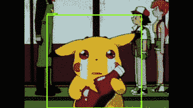
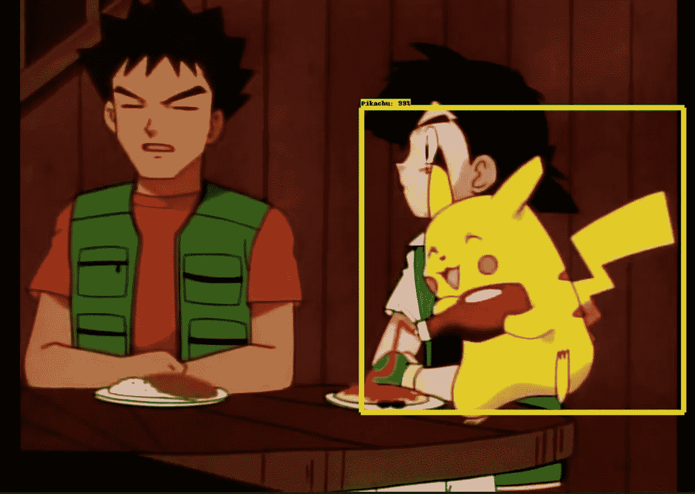
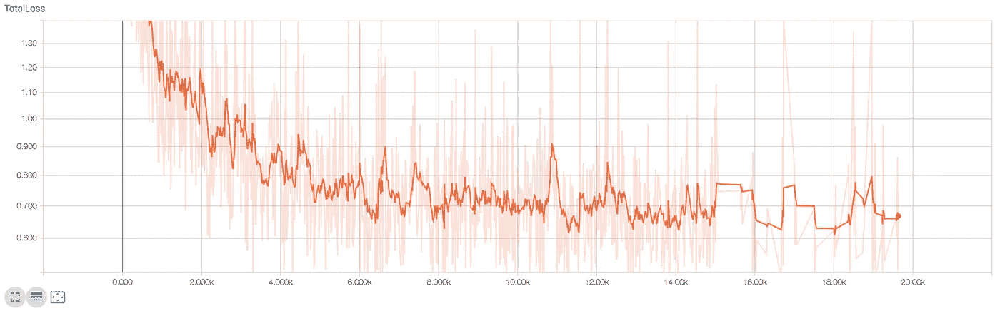
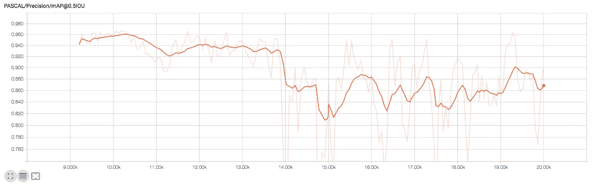

# 使用张量流对象检测检测视频中的皮卡丘

> 原文：<https://towardsdatascience.com/detecting-pikachu-in-videos-using-tensorflow-object-detection-cd872ac42c1d?source=collection_archive---------4----------------------->

在 TensorFlow 的众多功能和工具中，有一个名为 [**TensorFlow 对象检测 API**](https://github.com/tensorflow/models/tree/master/research/object_detection) 的组件。顾名思义，这个库的目的是训练一个能够识别帧中对象(例如图像)的神经网络。

在我以前的工作中，在这里找到了，我解释并完成了使用 TensorFlow 包在 Android 设备上检测**皮卡丘**的过程。此外，我还介绍了该库，讨论了它提供的不同架构和功能，并演示了如何使用 [**TensorBoard**](https://www.tensorflow.org/programmers_guide/summaries_and_tensorboard) 评估培训过程。

 [## 使用 Tensorflow 对象检测在 Android 上检测皮卡丘

### 本指南解释了如何训练一个对象检测模型，使用皮卡丘作为目标对象，目的是…

towardsdatascience.com](/detecting-pikachu-on-android-using-tensorflow-object-detection-15464c7a60cd) 

继续向前，几个月后，我承担了改进我之前训练的皮卡丘检测模型的任务，目的是使用 Python、 [OpenCV](https://docs.opencv.org/3.0-beta/doc/py_tutorials/py_tutorials.html) ，当然还有 TensorFlow 对象检测，直接从视频中检测它们。代码可以在我的 GitHub 上找到:[https://github.com/juandes/pikachu-detection](https://github.com/juandes/pikachu-detection)

Pikachu

这篇文章讲述了我实现这一目标的步骤。首先，我将陈述我在最初的模型中注意到的问题，以及我做了什么来改进它们。然后，我将继续描述如何通过使用这个新的和改进的模型，我建立了一个视频检测系统。最后，您将能够看到两个视频，其中有几个皮卡丘检测。

但在我们开始之前，这里有一个简短的 gif 展示了一些快速检测。

Pikachu being detected

That’s Pikachu

# 模型的改进

如前所述，在之前的工作中，我做了皮卡丘检测模型的原始训练，目标是在 Android 设备和 Python 笔记本上使用它。然而，我对模型的表现并不完全满意，这一事实激励并驱使我改进这个系统，因此，我写了这篇文章。

我主要关心的是我用来构建系统的皮卡丘图像的数量，有 230 个。其中，约 70%用于培训，其余 30%用于测试，因此用于培训的不多。虽然这在技术上不是问题(因为模特正在表演“okayish”)，但我向训练集添加了 70 多张照片(不是很多，但总比没有好)。

结果，因为现在我有了更多的图像，我不得不扩展模型的训练。我没有从头开始重新训练，而是使用我早期模型的训练检查点，并从那里继续；前者在 15000 个历元训练，新的在 20000 个历元训练。接下来的两幅图显示了总损耗和精度(取自 tensor board)；很容易注意到，从公元 15000 年到公元 20000 年没有太大的变化(特别是在损失方面)。

Plot of loss

Plot of precision

我做的最后一个(也是很小的)修正是修改 Android 应用程序的检测阈值。默认值为 0.6，增加到 0.85。

这些改进改变了什么吗？即使抛开我的确认偏见，我也会说，是的。我注意到一个微小的改善。我注意到的最大变化是，由于物体看起来像一个黄色斑点，Android 应用程序中的误报数量减少了；当然，这可能是因为门槛提高了。

现在，有了一个最新的(希望是)改进的模型，我准备用它来检测视频中的皮卡丘。在继续之前，我想提一下，我将跳过冻结和导入模型的整个过程，因为这在我早期的工作中已经解决了。

# 视频检测

从视频中执行对象检测并不像听起来那么困难或复杂。通俗地说，我们可以说视频是遵循一个序列的图像的集合，因此检测过程相当类似于从正常图像中检测。为什么相当相似？由于视频的性质，在将视频输入检测模型之前，需要解决几个预处理和帧准备的步骤。在接下来的几行中，我将解释这一点，加上我执行检测所遵循的过程，以及我如何创建一个新的视频来显示它们。

我的大部分代码都是基于 TensorFlow 对象检测 repo 中提供的一个 Python [笔记本](https://github.com/tensorflow/models/blob/master/research/object_detection/object_detection_tutorial.ipynb)；这段代码完成了大部分艰苦的工作，因为它包含了许多简化检测过程的函数。另外，我建议你看看我的[剧本](https://github.com/juandes/pikachu-detection/blob/master/detection_video.py)，并以此作为你阅读以下段落的指南。

从高层次的角度来看，我编写的代码有三个主要任务:

## 加载资源

首先，必须加载冻结的模型、数据标签和视频。出于简单的原因，我推荐一个短的中等大小的视频，因为它可能需要一点时间来处理整个电影。

## 迭代视频

该脚本的主要功能基于一个循环，该循环遍历视频的每一帧。在每次迭代中，读取一帧并改变其颜色空间。接下来，进行实际的检测过程，以找到所有这些漂亮的黄色鼠兔。因此，将返回皮卡丘所在的边界框的坐标(如果找到的话)和检测的置信度值。随后，将创建该帧的副本，其中包含只要置信度得分高于给定阈值，皮卡丘就应该所在的边界框。对于这个项目，我将置信度阈值设置为非常低的 20%，因为我注意到视频中被检测到的假阳性数量非常少，所以我决定“冒险”一下它的性能，以便有更多的皮卡丘检测。

## 创建新视频

前一步骤中讨论的携带检测框的帧的所有新创建的副本被用于构建新的视频。为了构建这个视频，需要一个`VideoWriter`对象，在前面讨论的循环的每次迭代中，帧的副本将被写入这个对象(没有任何声音)。

# 结果和讨论

这两个视频展示了模型的表现。

第一段视频的检测结果相当不错。即使皮卡丘在整个视频中一直拿着一个番茄酱瓶子，但模型在大多数场景中都能够检测到它。另一方面，在 0:22 有一个实例没有被检测到，此外，Scyther(绿色螳螂状的东西)打破番茄酱瓶的镜头(0:40 到 0:44)是一个假阳性。

第二个视频中模型的性能不如第一个，主要问题是在帧中有两只鼠兔的场景中。在这种情况下，模型似乎将他们两个检测为皮卡丘，而不是对每个人进行一次检测——一个明显的例子是在 0:13，两只皮卡丘正在互相拍打(悲伤的场景:(，我知道)。

# 结论和概述

在这篇文章中，我谈到了我们如何使用 TensorFlow 对象检测包来检测视频中的皮卡丘。在开始，我讨论了一些我以前的工作，其中我使用了一个早期版本的模型在 Android 设备上进行检测。这个模型，尽管它在做它的工作，但是有一些问题我想去解决。这些改进让我做了这个项目，并为视频建立了一个检测模型。

新模型按预期工作。当然，这里和那里有一些小问题——这与假阳性有关，皮卡丘没有被检测到——但它做了它必须做的事情。作为未来的工作，我想在我的训练集中添加更多不同角度的皮卡丘图像，例如，侧视图和后视图，以使数据更加多样化，从而获得更好的结果。

感谢阅读。我真的希望这个指南对你们有些人有所帮助。如果你有任何问题，评论，疑问，或者只是想聊天，留下评论，我将很乐意帮助你。