# 使用 Tensorflow 对象检测在 Android 上检测皮卡丘

> 原文：<https://towardsdatascience.com/detecting-pikachu-on-android-using-tensorflow-object-detection-15464c7a60cd?source=collection_archive---------2----------------------->

在 **TensorFlow** 的众多功能和工具的深处，隐藏着一个名为 [**TensorFlow 对象检测 API**](https://github.com/tensorflow/models/tree/master/research/object_detection) 的组件。顾名思义，这个库的目的是训练一个能够识别帧中对象(例如图像)的神经网络。

这个库的用例和可能性几乎是无限的。它可以被训练来检测图像中的人、猫、汽车、[浣熊](/how-to-train-your-own-object-detector-with-tensorflows-object-detector-api-bec72ecfe1d9)等等。由于这个原因，我开始有兴趣用自己训练的定制模型自己尝试一下。我的用例是什么？检测**皮卡丘**。

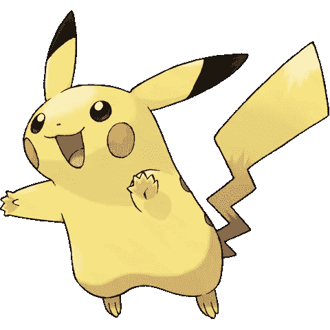

Pikachu

本文的目的是描述我训练自己的自定义对象检测模型所遵循的步骤，并展示我的皮卡丘检测技能，以便您可以自己尝试。首先，我将通过总结原始文件中解释的一些细节来介绍这个包。其次，我将继续讲述如何将我的皮卡丘图片转换成正确的格式并创建数据集。之后我会用 Tensorflow 的 web UI， [**TensorBoard**](https://www.tensorflow.org/get_started/summaries_and_tensorboard) ，尽可能详细的写训练过程，以及如何评价，以及最终的模型。最后，我将演示如何在 Python 笔记本中使用该模型，以及将其导出到 **Android** 的过程。

我用于这个项目的代码可以在我的 Github([**juandes/pikachu-detection**](https://github.com/juandes/pikachu-detection))上获得。本文档中提到的每个脚本都应该在那里可用。

在我开始之前，我确信你们大多数人都很好奇，这是皮卡丘检测的一个例子。

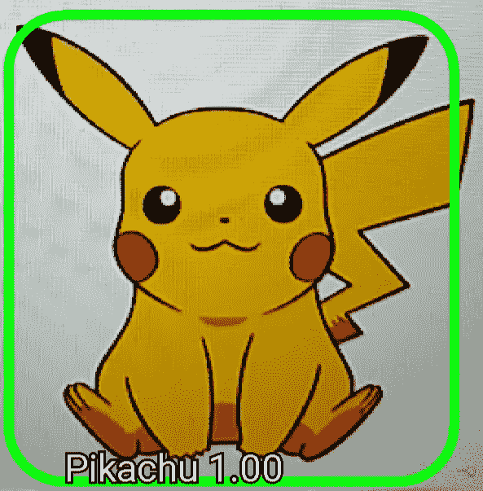

Yep, that’s a Pikachu (screenshot of the detection made on the app)

# Tensorflow 对象检测 API

这个包是 TensorFlow 对对象检测问题的回应——即在一帧中检测真实世界对象(或皮卡丘)的过程。根据文档和介绍该库的[论文](https://arxiv.org/pdf/1611.10012.pdf)，它的独特之处在于它能够以准确性换取速度和内存使用(反之亦然)，因此你可以调整模型以适应你的需求和你选择的平台，如手机。该库包括许多开箱即用的对象检测架构，如 **SSD** (单次检测器)**更快的 R-CNN** (更快的基于区域的卷积神经网络) **R-FCN** (基于区域的完全卷积网络)，以及几个特征提取器，如 **MobileNet** 、 **Inception** 、**Resnet**；这些提取器非常重要，因为它们在系统的速度/性能权衡中起着重要作用。

此外，该库还提供了几个已经训练好的模型，准备用于检测，在 **Google Cloud** 中训练的选项，加上 TensorBoard 的支持，以监控训练。

现在我们已经对这个实验所使用的系统有了一些了解，我将继续解释如何构建您自己的定制模型。

# 构建您自己的定制模型

## 装置

在我们开始之前，请确保您的计算机上安装了 TensorFlow。否则，请参见此处的说明[了解如何安装。接下来，克隆包含对象检测 API 的 repo。这是链接:](https://www.tensorflow.org/install/)[https://github.com/tensorflow/models](https://github.com/tensorflow/models)。

一旦您克隆了回购，导航到“*研究*”目录并执行:

```
# From tensorflow/models/research/
protoc object_detection/protos/*.proto --python_out=.
```

这将编译 **Protobuf** 库。如果你没有安装 Protobuf，可以从这里下载:[https://developers . Google . com/protocol-buffers/docs/downloads](https://developers.google.com/protocol-buffers/docs/downloads)

最后，您需要将库添加到`PYTHONPATH`中。这可以通过执行以下命令来实现:

```
# From tensorflow/models/research/
export PYTHONPATH=$PYTHONPATH:`pwd`:`pwd`/slim
```

有关所需的所有依赖项的更多详细信息，请参见官方文档，可从以下位置获得:[https://github . com/tensor flow/models/blob/master/research/object _ detection/g3doc/installation . MD](https://github.com/tensorflow/models/blob/master/research/object_detection/g3doc/installation.md)

现在，让我们看看我是如何从拥有许多皮卡丘图像变成 TensorFlow 可读的漂亮整洁的数据集的。

## 创建数据集和处理图像

创建数据集是成功定型模型所需的许多步骤中的第一步，在本节中，我将介绍完成此任务所需的所有步骤。

为了这个项目，我将 230 张中型皮卡丘的图片下载到一个名为 *images* 的目录中。为了获得更好的效果，我试图获得不同角度和形状的皮卡丘，但老实说，皮卡丘是一种不存在的黄色长耳朵老鼠，所以要找到它的大量图像有点困难。

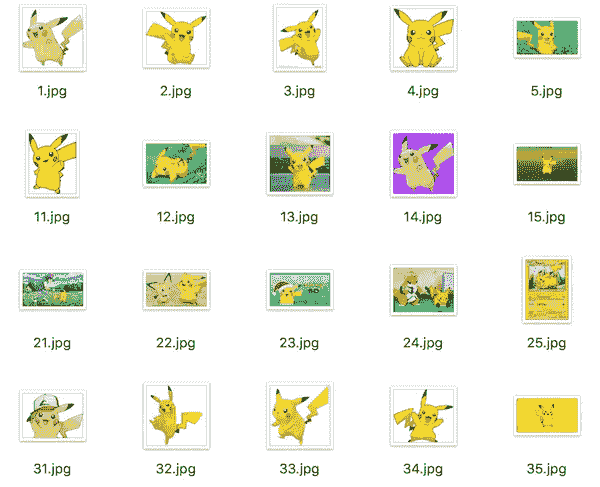

Some of the images used

一旦你获得了所有的图像，下一步就是给它们贴标签。这是什么意思？因为我们在做物体检测，我们需要一个物体到底是什么的基本事实。为此，我们需要在对象周围绘制一个边界框，让系统知道框内的这个“东西”就是我们想要学习的实际对象。我做这个任务用的软件是一个叫 [**RectLabel**](https://rectlabel.com/) **的 Mac app。**

这是带有边框的图像的外观:

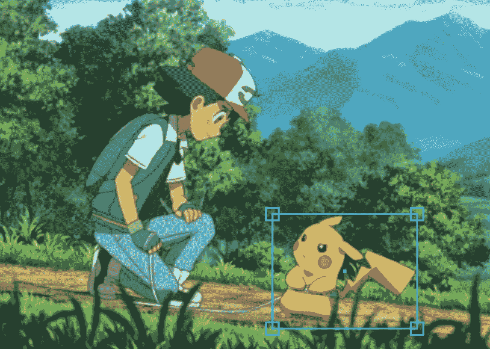

Image of an angry Pikachu surrounded by a bounding box

在 RectLabel 中，您需要为图像的每个边界框设置一个标签，在我的例子中，标签是“Pikachu”。一旦您标记了所有的图像，您会注意到您有一个名为“ *annotations* ”的目录，其中有许多描述每个图像的边界框的 XML 文件。

## 分成训练和测试数据集

一旦所有的图像都被标记，我的下一步就是将数据集分成训练和测试数据集。在图像所在的同一个目录中，我创建了一个名为" *train* 和" *test* "的目录，并将大约 70%的图像及其各自的 XML 添加到训练目录中，剩余的 30%添加到测试目录中。

## 生成 TFRECORD

分离数据集之后，唯一缺少的就是将我们的图像及其 XML 转换成 TensorFlow 可读的格式。所述格式被称为“ *tfrecord* ”，为了从我们的图像中生成它，需要两个步骤。首先，为了简单起见，使用 [datitran 的](https://github.com/datitran)GitHub([https://github.com/datitran/raccoon_dataset](https://github.com/datitran/raccoon_dataset))上提供的`xml_to_csv.py`代码的修改版本，将来自两组 XML 的数据(训练和测试)转换成两个 CSV 文件(同样，训练和测试)。然后，使用 CSV 文件，使用脚本`generate_tfrecord.py`(也来自 datitran)创建 tfrecord 数据集。请记住，在运行脚本之前，您必须在函数`class_text_to_int`中指定对象的类别。

*** EDIT**(23 . 01 . 17):[Will Brickner](https://medium.com/u/eb5bab74a2ec?source=post_page-----15464c7a60cd--------------------------------)报告称`xml_to_csv.py`在最新版本的 RectLabel 上无法正常工作，他编写了一个更加健壮的新脚本。这里有:[https://gist . github . com/wbrickner/efed F8 ab 0 ce 1705 de 1372 C1 e2f 49 DD 98](https://gist.github.com/wbrickner/efedf8ab0ce1705de1372c1e2f49dd98)多谢:)

## 创建标签映射

需要一张“*标签*图，标明标签及其索引。这是它们的样子。

```
item {
  id: 1
  name: 'Pikachu'
}
```

把“皮卡丘”标签换成你的，重要的是，总是从索引`1`开始，因为`0`是保留的。我把这个文件作为`object-detection.pbtxt`保存在一个名为*培训*的新目录下。

# 训练模型

## 管道

完整的训练过程由一个名为“ [*管道*](https://github.com/tensorflow/models/blob/master/research/object_detection/g3doc/configuring_jobs.md) ”的配置文件处理。所述管道被分成五个主要结构，它们负责定义模型、训练和评估过程参数以及训练和评估数据集输入。管道的骨架看起来像这样:

```
model {
(... Add model config here...)
}

train_config : {
(... Add train_config here...)
}

train_input_reader: {
(... Add train_input configuration here...)
}

eval_config: {
}

eval_input_reader: {
(... Add eval_input configuration here...)
}
```

但是！您不必从头开始编写整个管道。事实上，TensorFlow 开发人员建议培训应该使用他们自己已经培训过的模型作为起点。这背后的原因是从头开始训练一个全新的模型可能需要相当长的时间。因此，TensorFlow 为[提供了几个配置文件](https://github.com/tensorflow/models/tree/master/research/object_detection/samples/configs)，这些文件只需要很少的修改就可以在新的训练环境中工作。我用的型号是`ssd_mobilenet_v1_coco_11_06_2017`发现[这里](http://download.tensorflow.org/models/object_detection/ssd_mobilenet_v1_coco_11_06_2017.tar.gz)。

在我的训练中，我使用配置文件`[ssd_mobilenet_v1_pets.config](https://github.com/tensorflow/models/blob/master/research/object_detection/samples/configs/ssd_mobilenet_v1_pets.config)`作为起点。我对变量`num_classes`做了更改，因为我的类数只有一个，`num_steps`用于提前停止训练，`fine_tune_checkpoint`指向模型下载的位置，`train_input_reader`和`eval_input_reader`的`input_path`和`label_map_path`变量指向训练和测试数据集以及标签映射。

我不会仔细检查配置文件的每一个细节，因为老实说，我不理解它的某些部分，因为它太大了。不过，我想解释一下 **SSD** 和 **MobileNet** 是什么意思，这样你就可以对幕后发生的事情有一点了解。

**SSD** ，代表**单发探测器**，是一种神经网络架构，基于单前馈卷积神经网络。它被称为“*单次拍摄*”，因为它预测了图像的类别和在同一步骤中代表检测(称为锚点)的方框的位置。与此相反的是一种架构，它需要称为“提议生成器”的第二个组件来预测盒子的确切位置。

**MobileNet** 是一个卷积特征提取器，设计用于移动设备，用于获取图像的高层特征。

准备好管道后，将其添加到“*培训*目录中。然后，使用以下命令开始训练:

```
python object_detection/train.py --logtostderr 
--train_dir=path/to/training/ 
--pipeline_config_path=path/to/training/ssd_mobilenet_v1_pets.config
```

## 培训期间和培训后评估模型

这个库提供了在训练期间和之后评估模型所需的代码。每次训练产生一个新的检查点时，评估工具将使用给定目录中可用的图像执行预测(在我的例子中，我使用了来自测试集的图像)。

要运行评估工具，请执行以下命令:

```
python object_detection/eval.py --logtostderr 
--train_dir=path/to/training/ 
--pipeline_config_path=path/to/training/ssd_mobilenet_v1_pets.config 
--checkpoint_dir=path/to/training/ --eval_dir=path/to/training/
```

## 张量板

使用 TensorFlow 的可视化平台 TensorBoard 可以看到培训和评估阶段的结果。在这里，我们可以监控几个指标，如训练时间、总损耗、步数等等。真正酷的是 TensorBoard 还可以在模型被训练时工作，这使它成为一个确保训练朝着正确方向前进的伟大工具。

要执行 TensorBoard，请运行以下命令:

`tensorboard --logdir=path/to/training/`

# 导出模型

训练完成后，下一步是导出模型以便使用。这个库提供了执行这个步骤所需的脚本，名为`export_inference_graph.py`。

在导出之前，请确保培训目录中有以下文件:

```
model.ckpt-${CHECKPOINT_NUMBER}.data-00000-of-00001,
model.ckpt-${CHECKPOINT_NUMBER}.index
model.ckpt-${CHECKPOINT_NUMBER}.meta
```

您可能有几个格式相同但检查点编号不同的文件。因此，只需选择所需的检查点，并执行以下命令:

```
python object_detection/export_inference_graph.py                   --input_type image_tensor                                           --pipeline_config_path=path/to/training/ssd_mobilenet_v1_pets.config --trained_checkpoint_prefix=path/to/training/model.ckpt-xxxxx       --output_directory path/to/output/directory
```

输出将是一个文件，其中保存了名为`frozen_inference_graph.pb`的模型的“冻结”版本。

# 结果

训练阶段结束时，模型的精度为 **87%** ，总损耗为 **0.67** 。但是在训练过程中，模型达到了最大精度 **95%** 。尽管如此，精度最高的模型并没有我预期的那么好。比如它把很多黄色物体(甚至有些人)归为皮卡丘。另一方面，我注意到精度为 87%的模型产生了更少的误报，代价是错过了一些皮卡丘。下图是 TensorBoard 制作的总损耗和精度图。

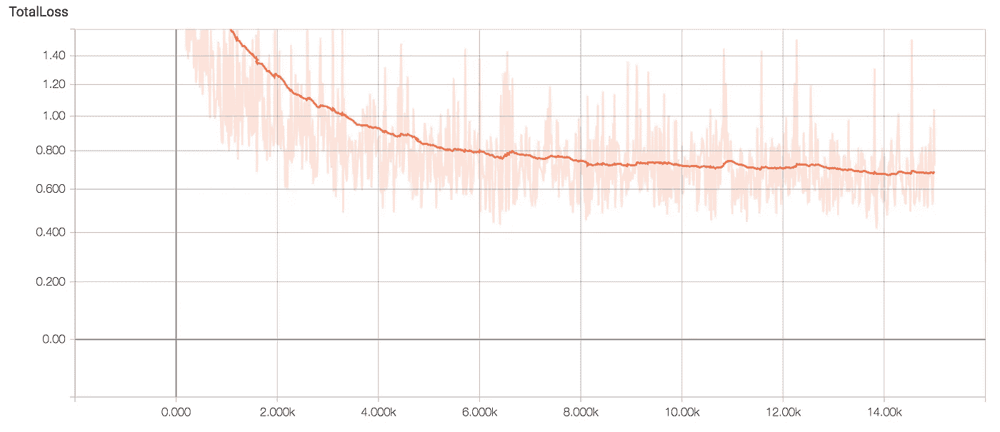

Total loss. The light orange line are the actual values; the dark one is a smoothed version

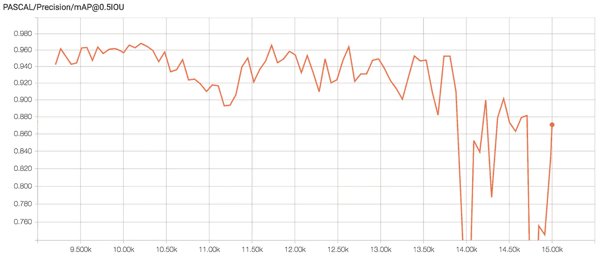

Precision metric

TensorBoard 还会自动评估评估集的一些图像。真正好的是，通过使用滑块，您可以看到预测的可信度如何根据模型的哪个检查点而变化。

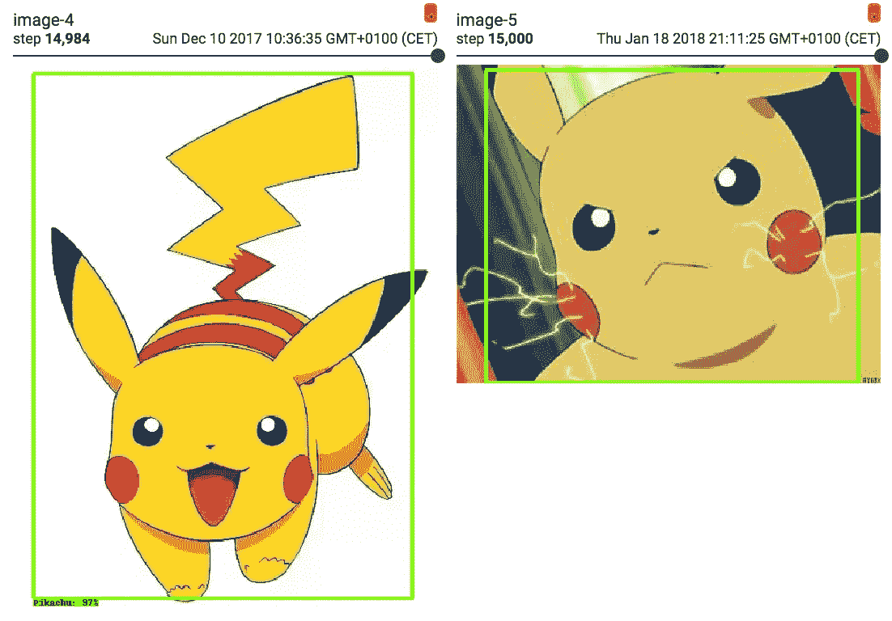

More Pikachu. This detection was performed in TensorBoard

图像检测包包括一个笔记本，用于测试 TensorFlow 提供的预训练模型之一。然而，这个[笔记本](https://github.com/tensorflow/models/blob/master/research/object_detection/object_detection_tutorial.ipynb)可以被改变以与定制训练模型的冻结版本(我们输出的那个)一起工作，我就是这样做的。下面你可以在笔记本上看到一些检测结果。

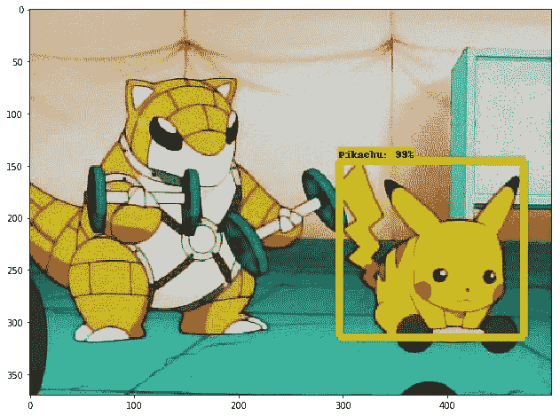

Pikachu hitting those weights

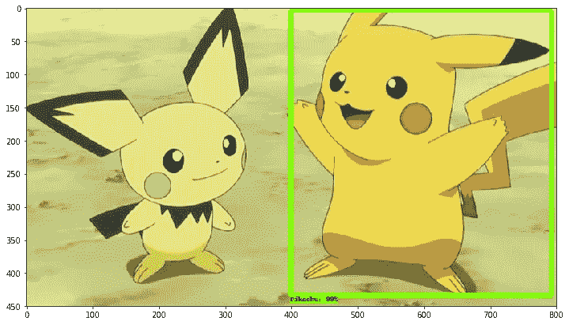

Pikachu and lil bro

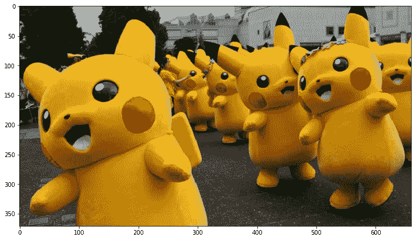

Humans dressed as Pikachu. Not detected.

# 检测 Android 中的皮卡丘

到目前为止，我们已经训练、导出了模型，并对其进行了评估。现在是时候将它导入 Android 了，这样我们就可以用它来通过手机的摄像头检测皮卡丘了。现在，这部分有点复杂，让我很头疼，所以我会尽可能详细地解释主要步骤。然而，我真的确信你们中的一些复制这个实验的人会有一些问题，所以如果我的向导不支持你，我想事先道歉。

让我们继续讨论 TensorFlow 的 Android 部分。首先，你需要下载 [Android Studio](https://developer.android.com/studio/index.html) 。一旦你有了它，克隆 TensorFlow repo(你可能已经有了)，在 Android Studio 中使用刚刚克隆的 TensorFlow repo 的目录导入一个新项目，名为“ [*Android*](https://github.com/tensorflow/tensorflow/tree/master/tensorflow/examples/android) ”。作为补充说明，我还建议通读 README 来熟悉一下这个库。

自述文件建议保持最简单的构建，并建议将 Gradle 构建的`nativeBuildSystem`变量改为`none`，然而，我将其改为`cmake`来构建它(其他构建替代方案如 Bazel 和 Makefile 都不适合我)。

当构建完成时，下一步是将冻结的模型添加到资产目录中。然后，同样在那个文件夹中，创建一个名为“ *labels* ”的文件，在第一行写`???`(还记得我说过第一类是保留的吗？)，并在第二行写下你的对象的标签(在我的例子中我写了`Pikachu`)。

然后，打开位于“ *java* 目录下名为“*DetectionActitivity.java*的文件；这是应用程序用来执行检测的代码。查找变量`TF_OD_API_MODEL_FILE`和`TF_OD_API_LABELS_FILE`，在第一个变量中，将其值更改为位于 assets 文件夹中的冻结模型的路径，在第二个变量中，写入带有标签的文件的路径。你应该知道的另一个有用的变量是`MINIMUM_CONFIDENCE_TF_OD_API`,它是跟踪检测所需的最小置信度。试着玩玩吧！

现在我们准备好了！点击**运行**按钮，选择您的 Android 设备，等待几秒钟，直到应用程序安装到手机上。重要的细节，不是一个，而是四个应用程序，将被安装在手机上，然而，我们包含检测模型的是 **TF Detect** 。如果一切顺利，应用程序启动，找到一些你的对象的照片，看看模型是否能够检测到它们。

就是这样！快乐检测:)

以下是我在手机里做的一些检测。

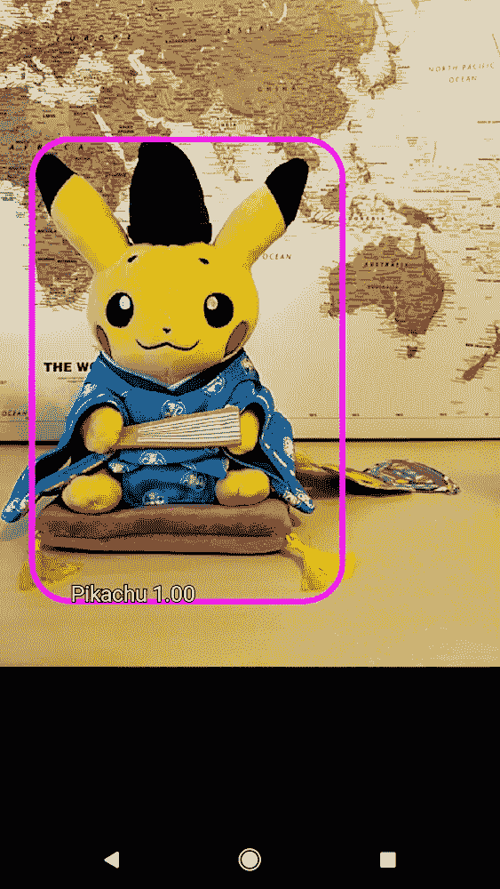

My Kimono Pikachu. Straight from Kyoto

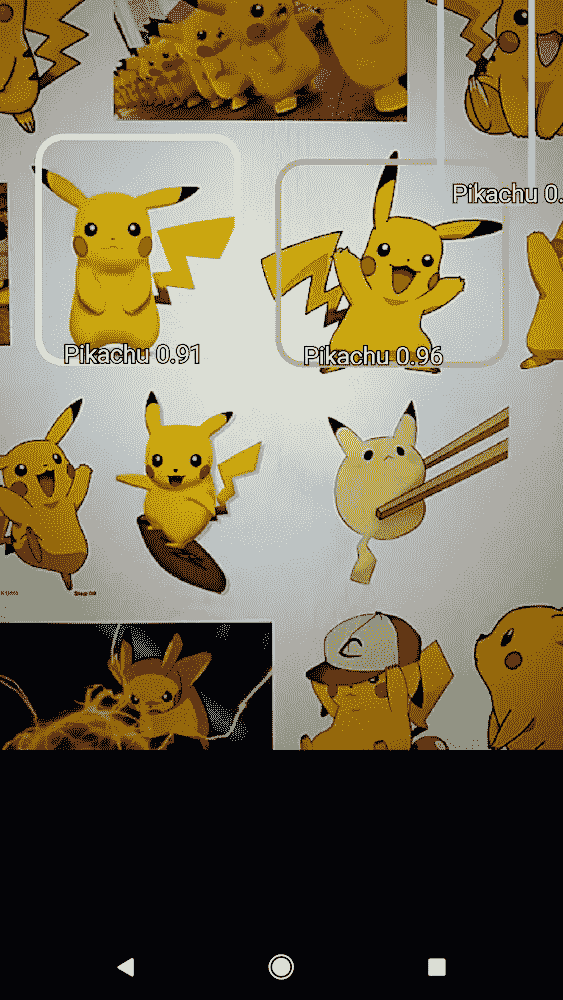

Several Pikachu. Noticed how most of them were not detected.

**编辑** (05.06.2018):这项工作的延续，检测视频中的皮卡丘，可在此处获得:

[](/detecting-pikachu-in-videos-using-tensorflow-object-detection-cd872ac42c1d) [## 使用张量流对象检测检测视频中的皮卡丘

### 本指南解释了如何使用 TensorFlow 对象检测模型来查找视频中皮卡丘

towardsdatascience.com](/detecting-pikachu-in-videos-using-tensorflow-object-detection-cd872ac42c1d) 

# 结论和概述

在本文中，我解释了使用 TensorFlow 对象检测库训练自定义模型的所有必要步骤。在开始时，我给出了一些关于这个库的背景信息和它是如何工作的，然后是一个关于如何标记和处理图像以生成数据集的指南。之后，我专注于如何进行训练。在这一节中，我谈到了培训管道，如何使用 TensorBoard 评估模型。然后，一旦训练完成，我就在 Python 笔记本和 Android 中经历了导出模型和导入的过程。

这个项目最困难的部分是让模型在 Android 上运行。毫不夸张地说，这花了我大约一个月的时间，因为我得到了大量的错误，(我甚至在 Github 上开了一期)，我几乎要放弃了。对我来说，解决问题的方法是在`export.py`文件(由`export_inference_graph.py`调用)中，将参数`optimize_graph`修改为`False`。显然，据我所知，通过优化模型，我的模型创建了一些 Android 库无法识别的节点，因此，它崩溃了。我不是说这是一个解决方案，但它可能是你可以尝试的东西，以防它对你不起作用。我的建议是不要放弃，继续尝试，这样你就可以用自己定制的检测系统打动你的朋友。

感谢您的阅读，我真的希望这篇指南能帮助到你们中的一些人。如果你有任何问题，评论，疑问，或者只是想聊天，留下评论，我将很乐意帮助你。