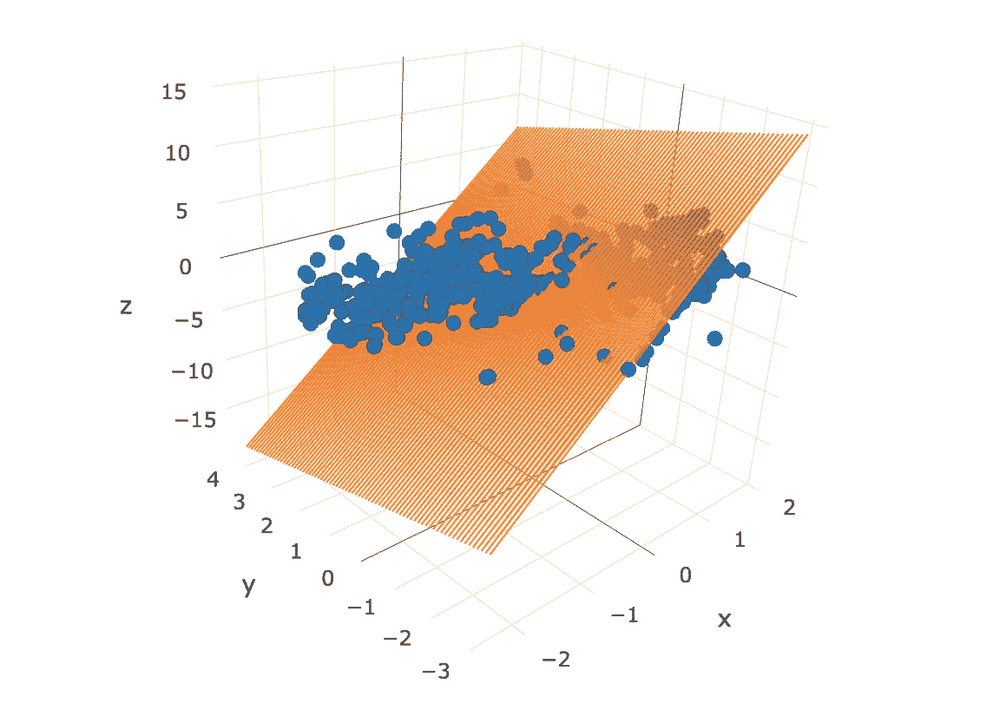
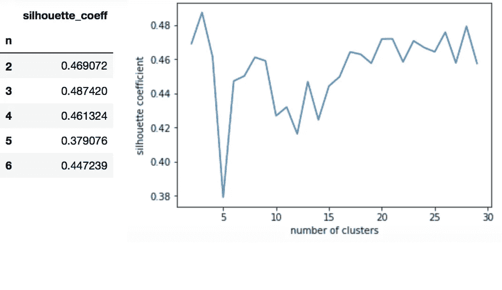
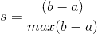
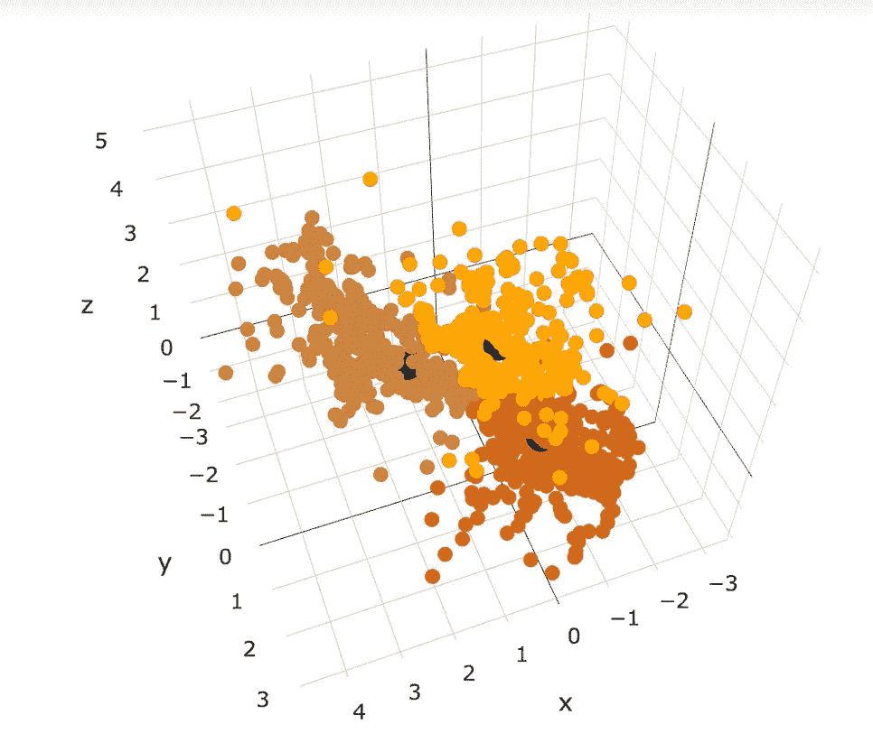
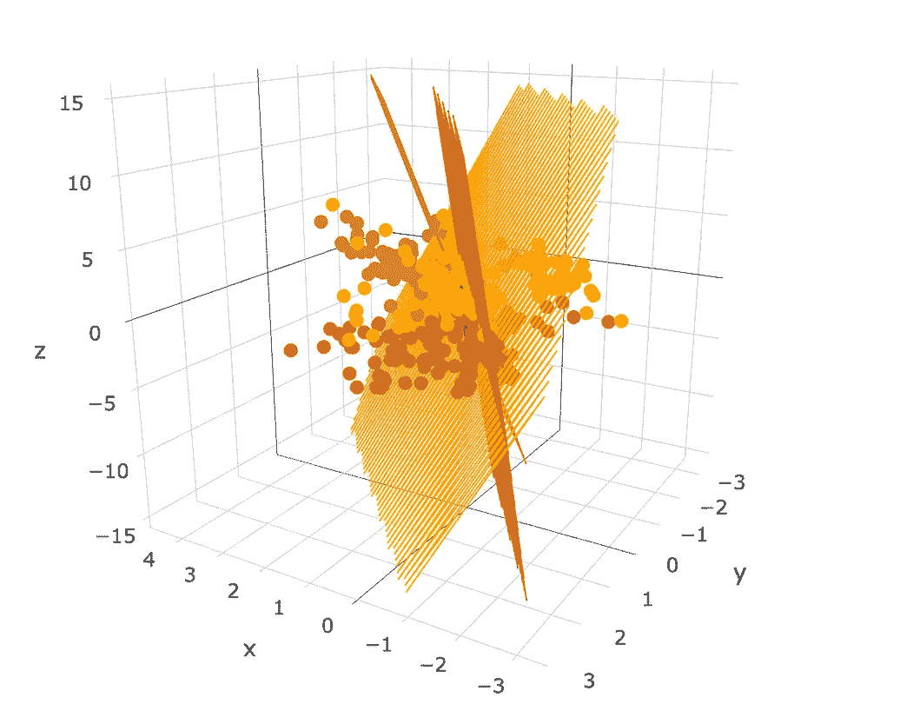
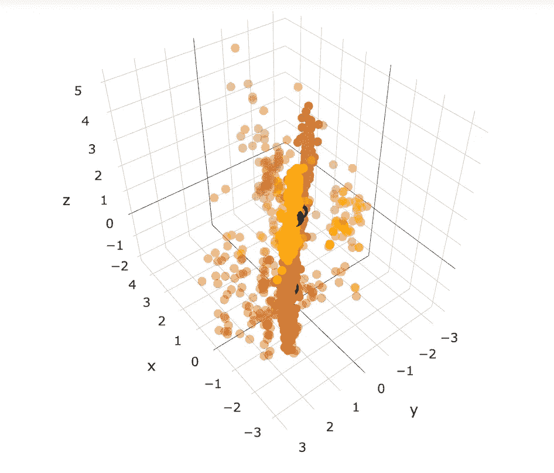
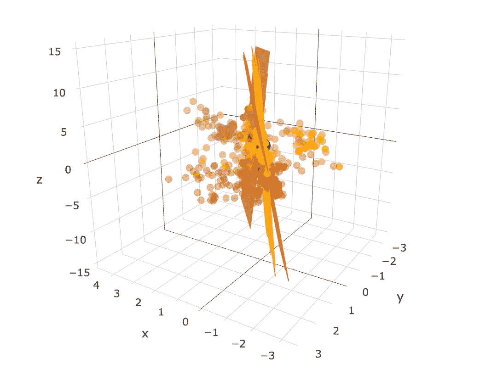

# 利用 k-均值聚类和 RANSAC 检测故障线路

> 原文：<https://towardsdatascience.com/detecting-the-fault-line-using-k-mean-clustering-and-ransac-9a74cb61bb96?source=collection_archive---------11----------------------->

## k 均值聚类和**随机样本一致性**



Fig. 1- fitted plane from the last blog

在我的[上一篇博文](https://medium.com/@ns2586/detecting-the-fault-line-using-principal-component-analysis-pca-7d5d265336a3)中，我使用主成分分析法(PCA)探测了帕克菲尔德附近圣安地列斯断层沿线的断层线。虽然已知断层线在该区域几乎是垂直的，但拟合的平面却相当水平(图 1)。这大概是因为 PCA 对“异常值”非常敏感，因为它是基于相关/协方差矩阵的方法。也可以假定，由于所有点的权重相同，一些远离主断层线的数据点可能使平面发生了倾斜。为了改善结果，采取了几种不同的方法，我将在这篇博客中详细介绍这些步骤。

**K 均值聚类**

由于断层结构非常复杂，所以在上一篇博客中，从整个数据集中随机选择一部分来拟合一个平面，而不是将一个平面拟合到整个数据集中。然而，这可能会潜在地导致一个问题，因为我们不知道所选择的点是否属于同一断层结构。因此，不是随机选择一个子集，而是应用 k 均值聚类将数据点分成更多“相似”点的聚类。

k 均值聚类是一种聚类算法，它将数据点分成 n 个聚类。通过 1)将数据点分配到最近的质心，2)将质心位置更新到所分配的数据点的中心，以及 3)将数据点重新分配到最近的质心，来确定每个聚类的最佳质心。这个过程重复进行，直到它稳定下来，一旦完成，分配给质心的数据点就形成一个簇。

**轮廓系数**



Fig. 2 silhouette coefficient

轮廓系数用于确定最佳聚类数(图 2)。轮廓系数，取值在-1 到 1 之间，表示每个点分配给其分类的情况。测量从一个点到它自己的聚类以及到它的相邻聚类的距离(可以使用任何种类的距离度量，在这种情况下使用欧几里德距离),并且比较这些距离。下面是推导轮廓系数 s 的公式:



其中 *a* 是从一个数据点到同一聚类中所有数据点的平均距离，而 *b* 是从该点到最近聚类中所有数据点的平均距离。

高值表示它被很好地分配给自己的簇，低/负值表示它分配得不好。如图 2 所示，3 是该研究的最佳集群数。下图左侧显示了 3 组数据点，右侧显示了拟合的平面(像上次一样使用 PCA 来拟合平面)。



Fig. 3 * black dots are the centroids of the clusters

使用 k-means，拟合的平面看起来更好。但为了进一步改善结果，使用了异常值检测方法来消除一些可能会使平面倾斜的异常值。

**随机样本一致性(RANSAC)**

随机样本一致性是一种检测异常值的迭代方法。迭代方法使用初始猜测来生成一系列改进的近似。它广泛应用于图像处理领域，用于去除数据集中的噪声。因为它去除了异常值，所以您需要小心它的应用— RANSAC 只有在异常值对您预测的值没有影响时才是可行的。RANSAC 算法查找异常值的方式如下:

1.  随机选择一个数据子集(*假设内联者*)
2.  使用该子集，计算模型参数
3.  将整个数据集与步骤 2 中建立的模型进行比较，所有与估计模型(基于损失函数)吻合的点将组成*共识集* (=内联集)

RANSAC 有一个 [sklearn 库](http://scikit-learn.org/stable/modules/generated/sklearn.linear_model.RANSACRegressor.html)，它有一个属性 inlier_mask_，告诉您哪些数据点被视为 inlier:

```
ransac = linear_model.RANSACRegressor()
ransac.fit(X, y)
inlier_mask = ransac.inlier_mask_
outlier_mask = np.logical_not(inlier_mask)
```

对于 3 个集群的导出的内层，拟合平面。图 4 中左图上的透明点是异常值，右图显示了拟合的平面。



Fig. 4 transparent data points are the ‘outliers’

**结论**

使用 k-均值聚类、RANSAC 和 PCA，拟合的断层线变得更加接近现实(而不是垂直平面)。由于 PCA 对远离其他观测值的点非常敏感，RANSAC 非常有助于防止这些点扭曲拟合平面。尽管在绘制主要断层线时忽略了这些异常值，但它们可能是某些潜在断层结构的一部分。将进一步研究这些异常值，以了解断层的复杂结构。