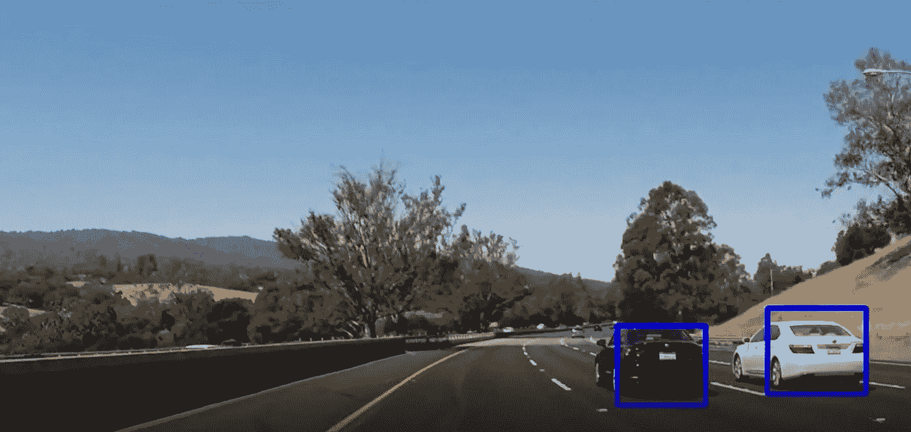
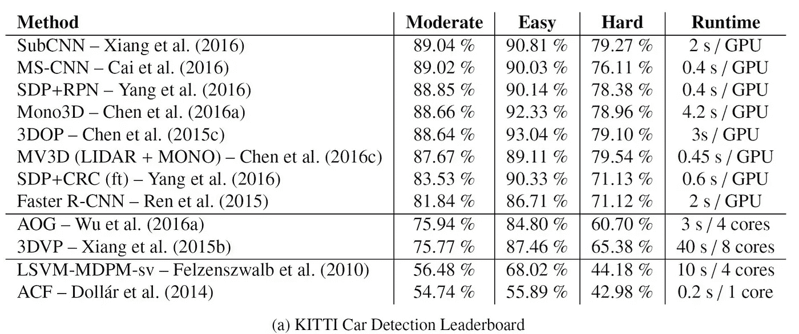
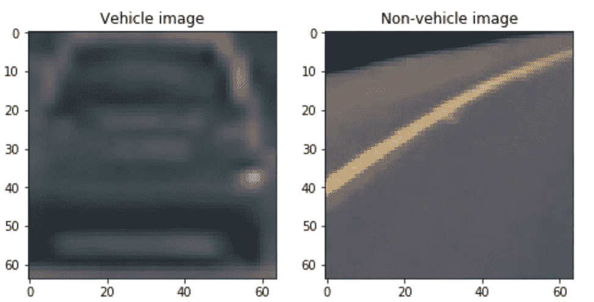
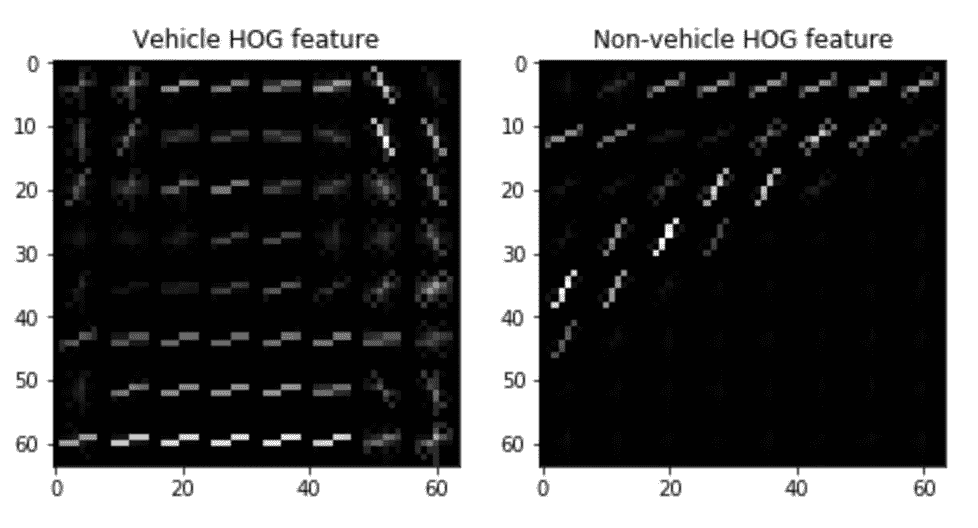
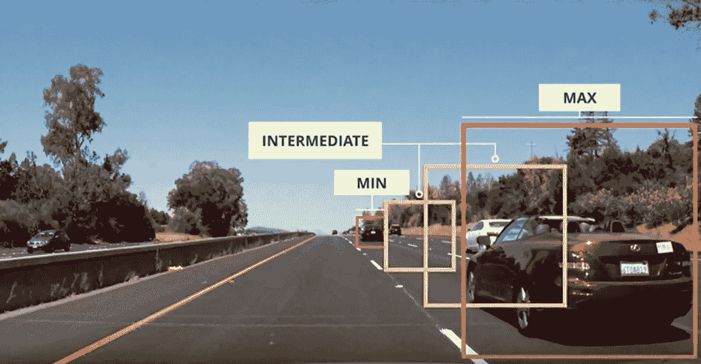
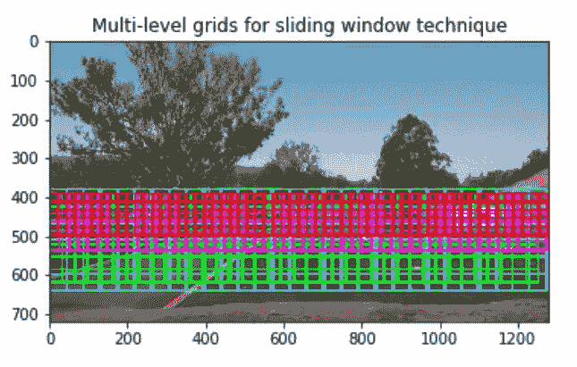
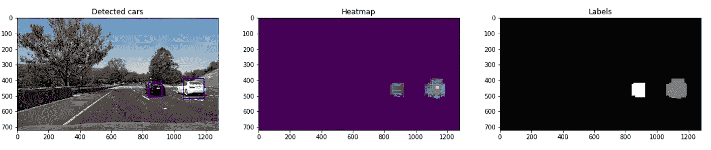

# 使用机器学习和计算机视觉检测车辆

> 原文：<https://towardsdatascience.com/detecting-vehicles-using-machine-learning-and-computer-vision-e319ee149e10?source=collection_archive---------2----------------------->

来自 [Udacity 自动驾驶汽车课程](http://udacity.com/drive)的最后一个项目是创建一个软件管道，它能够从汽车上的前置摄像头识别视频中的汽车。

A snapshot from the final output of the project

课程材料建议使用有点过时的方法来检测车辆，这是我在项目中途通过阅读这篇关于自动驾驶汽车的最先进的计算机视觉的[伟大论文](https://t.co/VFxlrhQ70C)而发现的。报纸上一小段:

> 在 Dalal & Triggs (2005)的工作中，线性支持
> 向量机(SVMs)与
> 方向直方图(HOG)特征相结合，最大化来自线性决策边界的所有
> 样本的余量，已经成为流行的
> 分类工具。然而，所有以前的方法都依赖于难以设计的手工制作的特征。**随着深度学习的复兴
> ，卷积神经网络已经
> 自动化了这项任务，同时显著提升了性能**。

事实证明，深度神经网络优于我使用的方法(线性支持向量机结合梯度方向直方图)。我一定会回到这个项目中，在这个问题上尝试这个列表中的一些最佳表现者:

Table taken from [https://arxiv.org/pdf/1704.05519.pdf](https://arxiv.org/pdf/1704.05519.pdf)

检测道路上的车辆的过程可以总结为以下步骤:

# 训练数据分析

训练数据由 Udacity 提供，由不同角度的[汽车](https://s3.amazonaws.com/udacity-sdc/Vehicle_Tracking/vehicles.zip)(8792)和[非汽车](https://s3.amazonaws.com/udacity-sdc/Vehicle_Tracking/non-vehicles.zip) (8968)物体图像组成。这里有两个例子:

Examples from the training data set

# 特征抽出

为了检测图像上的汽车，我们需要识别唯一代表汽车的**特征**。我们可以尝试使用简单的模板匹配或依赖颜色特征，但这些方法在改变物体的视角和形状时不够健壮。

为了拥有一个健壮的特征集并提高我们的准确率，我们将使用[梯度方向直方图](https://en.wikipedia.org/wiki/Histogram_of_oriented_gradients) (HOG)。该特征描述符对流量的动态变化更有弹性。本质上，你应该**把特征想象成你感兴趣的物体的指纹**。

[Scikit-image](http://scikit-image.org/docs/dev/api/skimage.feature.html#skimage.feature.hog) python 库为我们提供了计算 HOG 特征所必需的 API。我已经使用 [YCrCb](https://en.wikipedia.org/wiki/YCbCr) 颜色空间及其所有通道作为猪特征提取的输入。我尝试过其他颜色空间，但 YCrCb 在训练我的预测模型时给了我最好的准确性。这里有一个车辆和非车辆图像的样本，具有与上述图像相同的 HOG 特征:

Extracted HOG features from sample training data

HOG 特征提取基于 9 个方向，每个单元 8 个像素，每个块 2 个单元。增加方向和每个像元的像素参数确实可以缩短预测时间，但模型的准确率会下降。

# 模特培训

为了根据我们的特征集检测汽车，我们需要一个预测模型。对于这种特殊情况，我们将使用[线性支持向量机](https://en.wikipedia.org/wiki/Support_vector_machine)(线性支持向量机)。这是一个监督学习模型，在我们训练它之后，它将能够分类某物是否是一辆汽车。

使用[标准缩放器](http://scikit-learn.org/stable/modules/generated/sklearn.preprocessing.StandardScaler.html)将 HOG 特征缩放至零均值和单位方差。

我将提供的数据集分为训练集(80%)和测试集(20%)。在训练开始之前，图片也进行了洗牌。最终提取的 HOG 特征在 YCrCb 颜色空间上的线性支持向量机模型达到了 98.06%的准确率。

# 推拉窗

一旦我们有了预测模型，就该在测试图像上使用它了。预测模型将应用于一种称为滑动窗口的特殊技术。使用这种技术，我们将在图像的子区域上运行预测模型，该子区域被划分为一个网格。

为了提高这种方法的稳健性，我们将添加多个网格，预测模型将遍历这些网格。我们这样做是因为汽车可以根据其在道路上的位置以各种大小出现在图像上。

Multi-window appraoch for sliding window technique

这是这个概念应用于我们的测试图像时的样子:

我使用了不同的窗口尺寸(从 128x128 的靠近汽车的区域到 64x64 的远离汽车的区域)。窗口重叠设置为 65%。

# 消除误报

为了提高最终输出的准确性，我们将尝试在相似区域找到感兴趣对象的多个匹配项。这种方法相当于创建一个热图。

下一步是引入阈值，为了将热图中的特定命中计数接受为检测到的汽车，需要满足该阈值。在我们的例子中，阈值的值为 2。

这是一个应用热图并将其阈值设定为特定值的示例。

# 最后结局

最终结果并不完美，但管道本身显示出良好的潜力。

# 结论

如果我有机会重新做这个项目，我可能会选择深度神经网络方法。我花了相当多的时间寻找正确的色彩空间、HOG 参数和窗口幻灯片的大小。

管道的性能不是很大，可以改进。深度神经网络方法将具有更好的性能数字。

由于这种汽车检测方法是基于摄像头的，这种传感器很容易遇到常见的挑战(能见度低、反光等)。).

项目可以在我的 [Github](https://github.com/bdjukic/CarND-Vehicle-Detection) 个人资料中找到:

 [## bdjukic/CarND-车辆检测

### CarND-Vehicle-Detection -车辆检测项目

github.com](https://github.com/bdjukic/CarND-Vehicle-Detection)