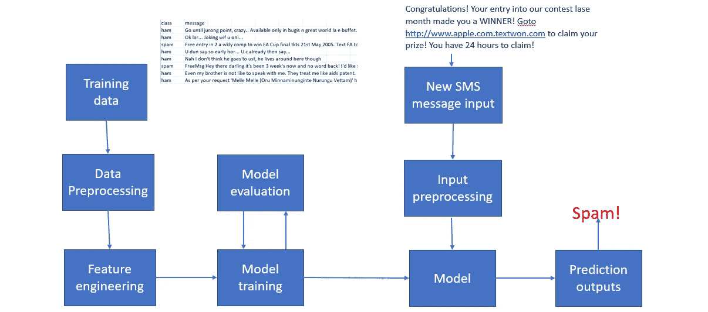
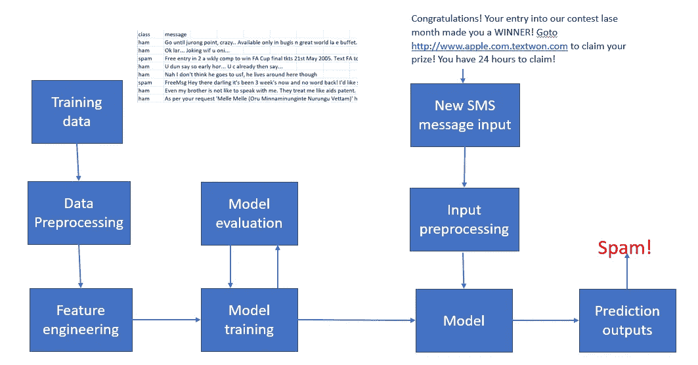
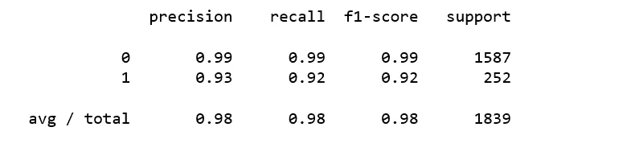
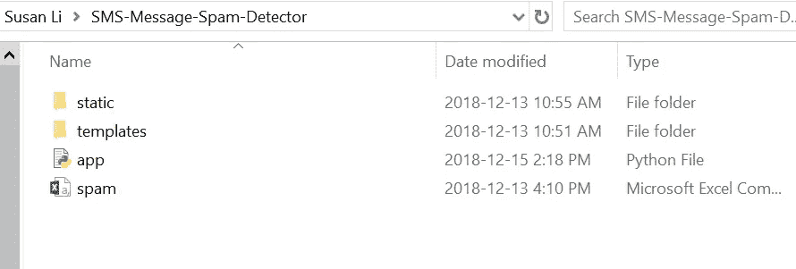
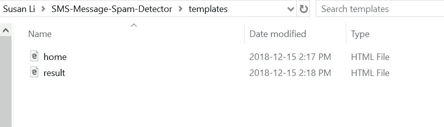
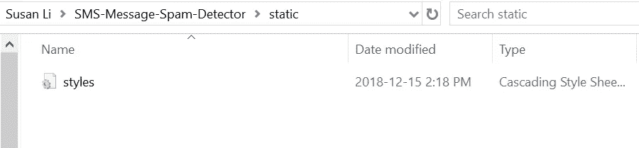
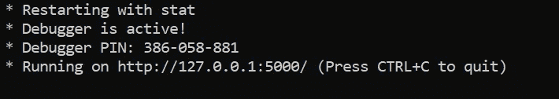
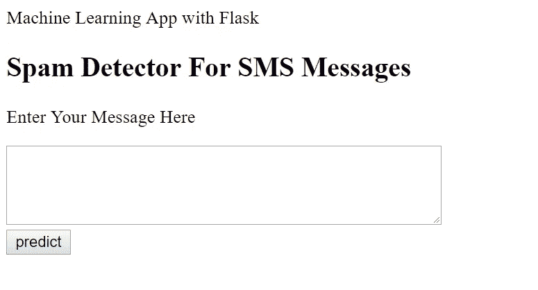

# 用 Python 开发一个 NLP 模型&用 Flask 逐步部署它

> 原文：<https://towardsdatascience.com/develop-a-nlp-model-in-python-deploy-it-with-flask-step-by-step-744f3bdd7776?source=collection_archive---------1----------------------->



## Flask API，文档分类，垃圾邮件过滤器

到目前为止，我们已经开发了许多机器学习模型，根据测试数据生成数值预测，并测试结果。我们在网下做所有的事情。实际上，生成预测只是机器学习项目的一部分，尽管在我看来这是最重要的一部分。

考虑使用机器学习来检测垃圾 SMS 文本消息的系统。我们的 ML 系统工作流程是这样的:离线训练->将模型作为服务提供->在线预测。

*   用垃圾邮件和非垃圾邮件消息离线训练分类器。
*   经过训练的模型被部署为服务用户的服务。



Figure 1

当我们开发一个机器学习模型时，我们需要考虑如何部署它，也就是如何让这个模型可供其他用户使用。

[Kaggle](https://www.kaggle.com/) 和[数据科学训练营](https://www.cio.com/article/3051124/careers-staffing/10-boot-camps-to-kick-start-your-data-science-career.html)非常适合学习如何构建和优化模型，但它们不会教工程师如何将他们带到下一步，在这一步，构建模型和实际准备好让人们在他们的产品和服务中使用模型之间存在重大差异。

在本文中，我们将关注这两个方面:为垃圾短信分类建立一个机器学习模型，然后使用用于构建 web 应用程序的 Python 微框架 [Flask](http://flask.pocoo.org/) 为该模型创建一个 API。这个 API 允许我们通过 HTTP 请求利用预测能力。我们开始吧！

# ML 模型构建

这些数据是一组被标记为垃圾短信的短信，可以在这里找到。首先，我们将使用这个数据集来建立一个预测模型，该模型将准确地分类哪些文本是垃圾邮件。

[朴素贝叶斯分类器是一种流行的电子邮件过滤统计技术。他们通常使用单词包功能来识别垃圾邮件](https://en.wikipedia.org/wiki/Naive_Bayes_spam_filtering)。因此，我们将使用朴素贝叶斯定理构建一个简单的消息分类器。

NB_spam.py



Figure 2

朴素贝叶斯分类器不仅易于实现，而且能提供非常好的结果。

在对模型进行训练之后，需要有一种方法来保存模型以供将来使用，而不必重新训练。为了实现这一点，我们添加了下面几行代码，将我们的模型保存为一个. pkl 文件，供以后使用。

```
from sklearn.externals import joblib
joblib.dump(clf, 'NB_spam_model.pkl')
```

我们可以像这样在以后加载和使用保存的模型:

```
NB_spam_model = open('NB_spam_model.pkl','rb')
clf = joblib.load(NB_spam_model)
```

上述过程称为“以标准格式持久化模型”，即模型以特定于开发中语言的某种格式持久化。

并且该模型将在微服务中提供服务，该微服务公开端点以接收来自客户端的请求。这是下一步。

# 将垃圾邮件分类器转变为 Web 应用程序

在前面的部分中已经准备好了对 SMS 消息进行分类的代码，我们将开发一个 web 应用程序，它由一个简单的 web 页面组成，该页面带有一个表单字段，可以让我们输入消息。在将消息提交给 web 应用程序后，它将在一个新页面上呈现它，这给我们一个垃圾邮件或非垃圾邮件的结果。

首先，我们为这个项目创建一个名为`SMS-Message-Spam-Detector`的文件夹，这是文件夹中的目录树。我们将解释每个文件。

```
spam.csv
app.py
templates/
        home.html
        result.html
static/
        style.css
```



SMS-Message-Spam-Detector folder



templates folder



static folder

SMS Message Spam Detector folder

子目录`templates`是 Flask 在 web 浏览器中查找静态 html 文件的目录，在我们的例子中，我们有两个 HTML 文件:`home.html`和`result.html`。

## app.py

`app.py`文件包含了 Python 解释器运行 Flask web 应用程序所要执行的主要代码，它包含了对 SMS 消息进行分类的 ML 代码:

app.py

*   我们将应用程序作为一个单独的模块运行；因此，我们用参数`__name__`初始化了一个新的 Flask 实例，让 Flask 知道它可以在它所在的同一个目录中找到 HTML 模板文件夹(`templates`)。
*   接下来，我们使用 route decorator ( `@app.route('/')`)来指定应该触发`home` 函数执行的 URL。
*   我们的`home` 函数只是呈现了位于`templates`文件夹中的`home.html` HTML 文件。
*   在`predict`函数中，我们访问垃圾邮件数据集，预处理文本，进行预测，然后存储模型。我们访问用户输入的新消息，并使用我们的模型对其标签进行预测。
*   我们使用`POST`方法在消息体中将表单数据传输到服务器。最后，通过在`app.run`方法中设置`debug=True`参数，我们进一步激活了 Flask 的调试器。
*   最后，我们使用了`run`函数，仅在 Python 解释器直接执行该脚本时在服务器上运行应用程序，这是通过使用带有 `__name__ == '__main__'`的`if`语句来确保的。

## home.html

以下是`home.html`文件的内容，该文件将呈现一个文本表单，用户可以在其中输入消息:

home.html

## style.css

在`home.html`的头段，我们加载了`styles.css`文件。CSS 决定了 HTML 文档的外观和感觉。`styles.css`必须保存在一个名为`static`的子目录中，这是默认目录，Flask 会在这个目录中查找 CSS 等静态文件。

style.css

## result.html

我们创建一个`result.html`文件，该文件将通过`predict`函数中的`render_template('result.html', prediction=my_prediction)`行返回来呈现，我们在`app.py`脚本中定义该函数来显示用户通过文本字段提交的文本。`result.html`文件包含以下内容:

result.html

从`result.htm`我们可以看到一些代码使用了 HTML 文件中通常没有的语法:`,,`这是 [jinja](http://jinja.pocoo.org/docs/2.10/templates/) 语法，它用于在 HTML 文件中访问从我们的 HTTP 请求返回的预测。

我们快到了！

完成上述所有操作后，您可以通过双击`appy.py`或从终端执行命令来开始运行 API:

```
cd SMS-Message-Spam-Detector
python app.py
```

您应该得到以下输出:



Figure 3

现在，您可以打开 web 浏览器并导航到 [http://127.0.0.1:5000/](http://127.0.0.1:5000/) ，我们应该会看到一个简单的网站，内容如下:



Figure 4

让我们测试我们的工作！

spam_detector_app

恭喜你！我们现在已经以零成本创建了一个端到端的机器学习(NLP)应用。回过头来看，整体流程一点都不复杂。只要有一点耐心和学习的欲望，任何人都可以做到。所有的开源工具让一切成为可能。

更重要的是，我们能够将我们的机器学习理论知识扩展到一个有用和实用的 web 应用程序，并让我们能够向外界提供我们的垃圾短信分类器！

完整的工作源代码可以在这个[库](https://github.com/susanli2016/SMS-Message-Spam-Detector)获得。祝你一周愉快！

参考:

本书: [Python 机器学习](https://www.amazon.ca/Python-Machine-Learning-Sebastian-Raschka/dp/1787125939/ref=dp_ob_title_bk)