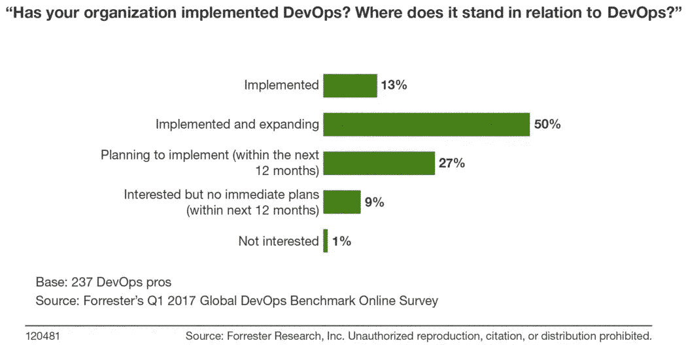
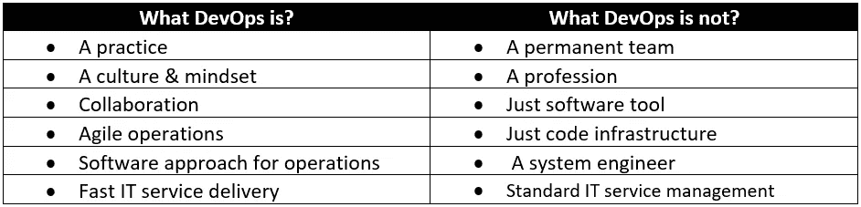
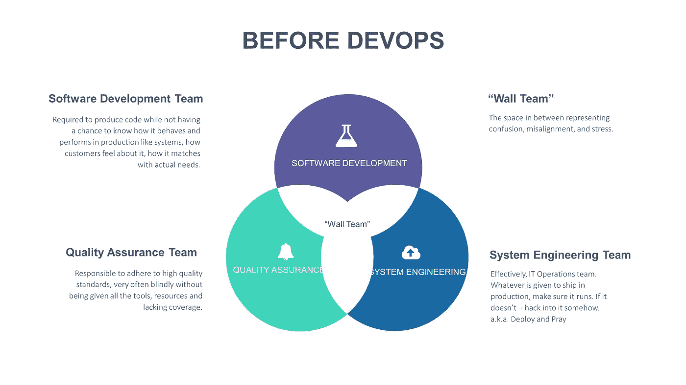
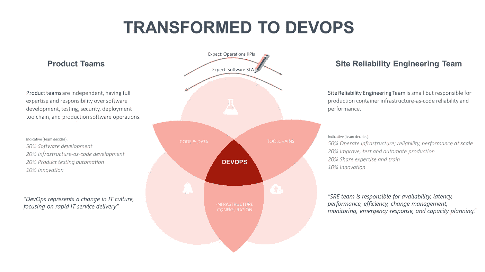
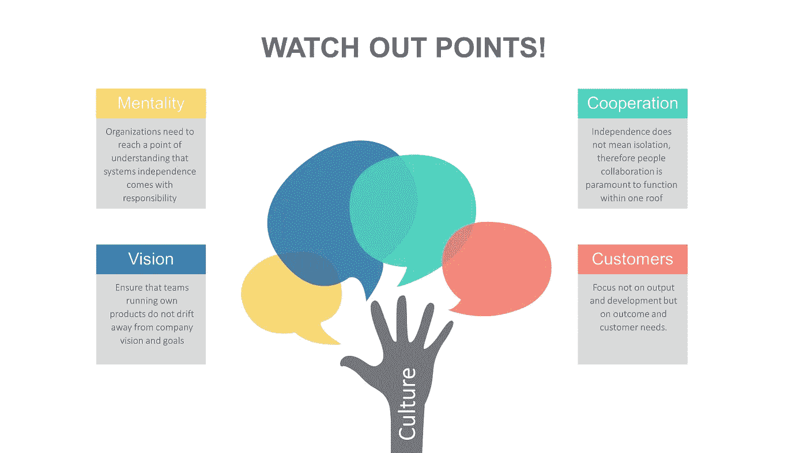

# DevOps:做还是不做？

> 原文：<https://towardsdatascience.com/devops-to-do-or-not-to-do-focus-on-culture-first-f82319ed346a?source=collection_archive---------14----------------------->

unsplash.com

## *总结*

*DevOps 是相对最新的“流行语”之一，它会一直存在下去——即使名字不同。DevOps 转型已被证明可以加快软件交付和运营的速度、质量和效率，并提高员工的目的性。受影响最大的将是质量保证团队——因为他们的工作将通过更好的编程工具、自动化和机器学习来解决。在整个企业范围内采用文化转型可以让您通过流程效率、员工福祉和客户幸福来提升交付能力，而这些正是现代组织的最终目标。*

在过去几十年中，各组织实施了四项重大变革举措:战略规划、重新设计、全面质量管理和缩编。这些计划的目的是实现经济效益，但是大约 75%的计划失败了或者产生了严重到威胁组织生存的问题 [(1)](https://www.gartner.com/newsroom/id/3233217) 。人们发现，忽视组织文化是这次失败的最主要原因。当观察在团队层面上采用 Scrum 而没有开发支持这种变化的环境的等级和官僚组织时，这被一次又一次地证明是正确的。在这些公司里，敏捷教练教导人们专注、勇气、尊重、开放和承诺。然而，该系统经常促进指责游戏、政治和升级途径。文化可能促进也可能阻碍公司的战略计划。DevOps 转型是发展高绩效业务的新战略，理想情况下采用自下而上的管理方法。

## DevOps 转换—它是什么？

根据最近的调查，大约 50%的企业已经开始实施 DevOps。这些转变的真正成功还有待观察。

DevOps 是关于文化、人员、技术和流程的。DevOps 转型是一项巨大的工作，扩展到组织的所有级别——除了众所周知的 DevOps 承诺为软件交付带来魔力之外，所有的目标都是将组织转变为高绩效的组织思维。

从技术上来说，DevOps 定义了一种状态，在这种状态下，组织在可伸缩环境中使用最新的软件，在具有服务发现和多阶段历史支持的反馈系统的弹性容器中始终准备就绪、自动化、统一和独立的版本。拆开上面的句子，意思是:

*   **始终就绪**:开发、集成&工具链流程的改进
*   **自动化**:利用与工具链结合的配置管理工具
*   **统一**:除数据外，内部&生产环境完全相同。
*   **独立**:产品独立工作，彼此风险最小；众所周知的概念:高度一致、松散耦合
*   **发布**:无论何时何地需要；只要有商业意义。
*   **可扩展的环境**:不需要固定的资源/硬件，因为每个服务都是虚拟化的、可扩展的，而且是不可变的。
*   **最新软件**:不依赖遗留软件，版本独立。
*   **弹性容器**:失败被拥抱而不是被避免；不变性、弹性
*   **服务发现**:用于管理服务和资源的弹性软件
*   **多阶段**:所有开发阶段的自动化测试
*   **历史启用**:所有阶段的可靠日志的可用性
*   **反馈系统**:基于机器学习和动态阈值的推理，同时在任何有意义的时候利用度量标准。

## 为什么是 DevOps？—好处

组织的 DevOps 转换已经被证明可以加速软件交付的速度、质量和效率，提高员工的积极性和士气。它消除了筒仓(团队之间的沟通障碍)以及软件开发对单个人或团队的依赖。通过使用自动化软件来消除令人厌烦的、单调的任务，工作质量得到了进一步提高。通过建立自动化服务，与人工服务相比，现有的运营成本大大降低。随着手动工作的消除，员工可以专注于提高工作满意度的工作，目的是为组织及其客户增加真正的价值。更快的自动化过程提高了发布过程的质量，因为流水线中的步骤是标准化的，导致可预测的结果、减少的周期时间和更高的部署率。

## DevOps 在企业中的实施

DevOps 诞生于敏捷软件开发运动，专注于沟通、协作、集成、自动化、反馈和学习，同时衡量 IT 运营和软件开发人员以及企业中其他 IT 专业人员之间的合作。

## DevOps 之前的场景

*   孤立的强大团队导致孤立的孤岛和操作知识块。
*   团队中过度紧张和孤立的高能力专家意味着更多的责任，总体效果是达到最佳绩效，同时也成为瓶颈。
*   团队成员对于哪些能力由谁负责难以忍受的困惑？
*   软件开发团队在不知道特性如何表现的情况下编写代码？客户感觉如何，功能如何满足实际需求？
*   质量保证团队必须确保高质量标准，但不具备所需的所有工具和资源。
*   系统工程团队必须将软件投入生产，并确保其运行。如果它不能黑进去。又名部署和祈祷。

## 开发运维后的场景

*   由产品经理、UX/UI 专家、软件工程师和其他人组成的产品团队一起工作(质量保证不像以前那么重要了——都是流水线化和自动化的)
*   随着高效工具和技术的到位，现场可靠性团队变得更小 [(2)](https://landing.google.com/sre/interview/ben-treynor.html) 。

## 期待什么？

DevOps 已经成为为企业执行运输和运营活动的流行和标准方式，主要是那些涉及某种软件开发的企业。DevOps 转换的采用正在迅速传播，最近，DevOps 一直在沿着这些方向发展。很明显，It 文化正在发生变化，管理产品发布的传统方法变得低效、适得其反且成本高昂。DevOps 正在革新组织，提高性能，构建更多功能软件，并通过减少故障来降低成本。这是所有组织都希望实现的目标。

DevOps 是最新的“流行语”之一，它会一直存在下去(也许没有一个特别的名字——但服务于相同的目的)。DevOps 将会深深扎根于软件生产工具链和交付中，以至于它将不会被单独命名——它将被视为理所当然，它就在那里，它将成为一种商品。然而，DevOps 的文化方面将通过以员工为中心的现代组织变革来采用，而不是等级模式。当员工处于中心时，他们会与共同的动机保持一致；这与员工自身的工作目的 [(3)](https://www.theguardian.com/sustainable-business/2016/sep/14/millennials-work-purpose-linkedin-survey) 、组织的利益和顾客的利益直接相关。

在这种组织演变和采用中，受影响最大的将是质量保证团队——因为他们的工作将通过更好的编程工具、自动化和机器学习来解决。因此，质量保证团队成员可以更容易地为未来做准备，并提高软件生产和运输领域中的某种自动化技能。

通过以文化为重点的正确的 DevOps 转型方法，这不仅仅是可以实现的，而且一定会成功。

DevOps 转型帮助您将速度、质量和可靠性融入软件生产业务。通过在企业范围内采用文化转型来采用整体方法，使您能够通过流程效率、员工福祉和客户幸福来提高交付能力，这是现代组织的最终目标。