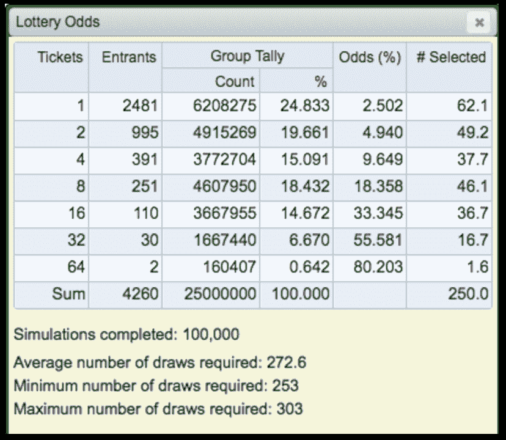
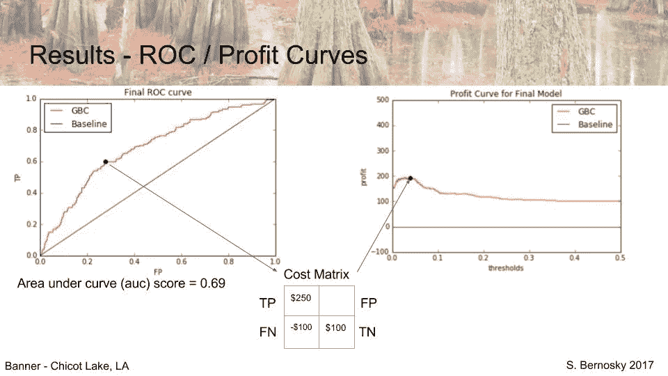
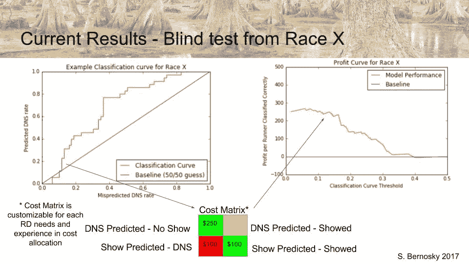
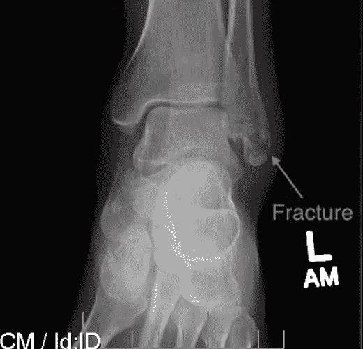
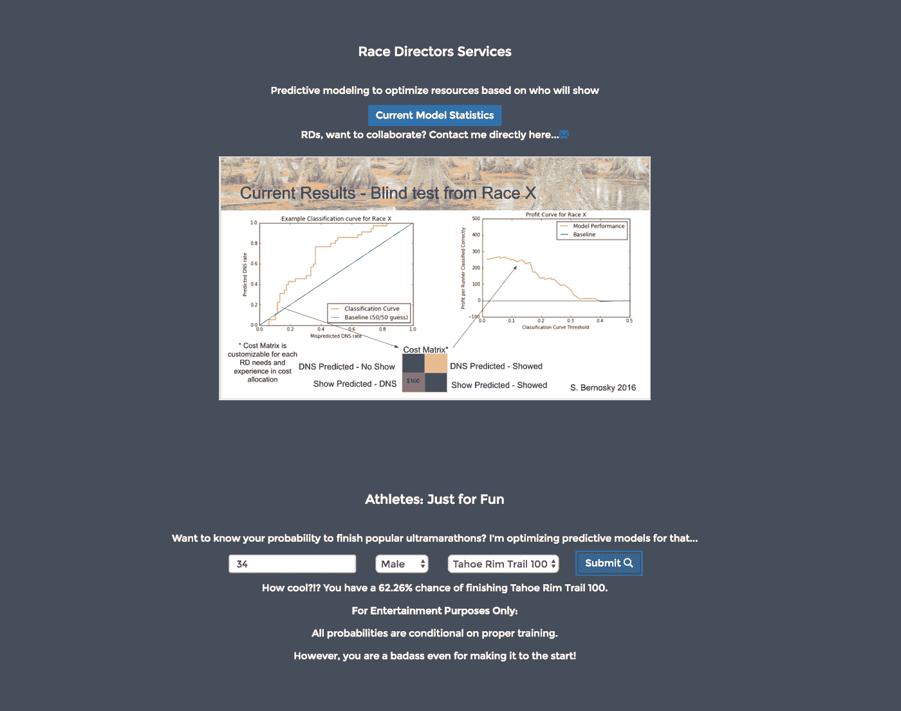

# DFL > DNF > DNS？

> 原文：<https://towardsdatascience.com/dfl-dnf-dns-60969b9e995d?source=collection_archive---------1----------------------->

去年，我按下了人生的暂停键，搬到了西雅图，当时是暂时的。我参加了 enlight 数据科学沉浸式项目，并在接下来的 3 个月里努力工作，尽情玩耍。

我对“玩”有一种扭曲的看法。我喜欢跑步。你可能会说，这不奇怪…

嗯，我喜欢在小径上跑步…在小径上跑很远，一口气跑 100 英里远(在那个距离上，我是 8 投 5 中)。我渴望有一天能一口气跑 200 英里。它让我能够测试可能的界限，探索自我的深度。

Mile 60 of 2016 Rocky Raccoon 100 Miler. Joy displayed may be related to the fauxhawk?

很自然地，当它来到我的顶点项目时，我想要融入我对(愚蠢的)长距离越野跑和数据科学的热爱。我只是需要正确的“业务问题”…

围绕着极端分子有一个共同的咒语:

> DFL > DNF > DNS

> "死在最后，总比没有完成好，总比没有开始好."

# 这对赛事总监来说意味着什么？

Monte Carlo Simulation for 2017 Western States Endurance Run Lottery, I had 9.6% odds of entry.

好吧，信不信由你，很多比赛很快就卖光了！知名度较高的已经上了彩票系统。三年多来，我一直试图参加西部各州的耐力赛。

了解有多少人不会出现，对于赛事总监来说是很重要的，以判断需要多长时间做一份等待名单，或者一般情况下允许多少人参加比赛。

我可以讲述一个神奇的故事，我是如何根据人们以前的表现对他们进行分类，以映射他们开始 100 英里的倾向。

人类行为是最难建模的主题之一。

见鬼，我们还没有掌握股票市场的建模。

试图确定一个特定的超跑者是否会出现在刘李 120 的起跑线上几乎是不可能的，比如一个 35 岁的男性，他的表现略高于平均水平，已经参加了 15 场比赛。

我相信这可以归结为:

1.  如果有办法，超跑者将开始一场比赛。相对而言，很少有人在大型 100 英里比赛中使用域名系统。 ***即使训练不足或者受伤，他们也会首发，但是 DNF 到时候*** 。(同样，DFL > DNF > DNS)
2.  根据有限的人口统计数据，预测生活环境极其困难。我不知道每个人靠什么谋生，也不知道他们的家庭结构是什么样子。 ***未开始的最常见原因是由于最后一分钟的工作或家庭义务，这在我的模型中没有考虑。***

但并不意味着我没有尝试过。在这个项目中，我非常努力地对个人跑步者进行分类，并取得了一些成功。我还想模拟对赛事总监的财务影响，将结果放入可操作的环境中。

# 方法:

如果你不是一个数据人员，如果你愿意，请继续阅读，但这是我要花几分钟时间进行技术分析的地方。对于数据爱好者，这里有一些细节…

**技术栈** — Python (pandas，scikitlearn，matplotlib，Flask)，AWS，Javascript/Ajax，Django

**Webscraping** —从 ultrasignup.com 收集 39 场比赛和> 10，000 名运动员成绩的 Python 脚本。结果是 json 格式的文件，我将其解析成 pandas 数据帧。

**数据清理/特征工程**——有一次在 Python 中，我清理了数据，做了一些特征工程。其中一些功能有效(以前的域名数)，一些功能相关性很小(年龄组)。总的来说，我的模型有 12 个特征，包括比赛特征(季节，它卖完了吗，等等。)和个人特征(ultrasignup 运动员排名、性别、年龄等。).

**建模** —在这种状态下，我实现了三个不同的模型，一个简单的逻辑回归、一个随机森林和一个来自 Python 的 scikitlearn 包的梯度增强分类器。我试图使用网格搜索方法优化每个参数。

**结果** —正如预测的那样，梯度增强分类器产生了本研究的最佳预测。根据我的测试/训练划分，我使用 10 倍交叉验证获得了大约 0.67-0.70 的 AUC 分数。

Results from test data split

然而，由于 DNS 类别的高度不均衡性，AUC 分数具有误导性。在任何给定的种族域名系统中只有约 5%。由于比赛只有 100-250 名参赛者，这就造成了一种情况，你可以得到很好的分数(很难不去猜测 95%的参赛者中的大多数)，但仍然会错误地分类那些实际上是 DNS 的参赛者。

It performed pretty well, but still only modeled a profit equivalent to a single race entry.

我用这个模型来看看它在我用来训练模型的比赛之外是否有预测能力。再一次，由于职业的平衡，我看起来有很好的结果，通过使用这个模型，我可以节省大约 250 美元。这相当于平均 100 英里比赛的一次报名费。

> 因此，如果我不能可靠地预测某人是否会出现在起跑线上，并且对赛事总监来说成本节约是最小的， ***我能预测运动员是否会完成比赛吗？***

# 预测 DNF 氏症

I DNF’d this race…wonder why? Not shown, second fracture in tibia.

大多数(如果不是全部的话)超跑者想知道他们完成比赛的实际机会。在确定我们的现实机会时，我们会查看 DNF 每年关于我们感兴趣的比赛的统计数据。许多 100 英里赛跑只有不到 50%的参与者跑完全程。

# **DNFs 的原因多种多样，包括:**

1.  受伤——无论是在比赛中还是在比赛过程中，我左边的受伤发生在比赛的第 5 英里
2.  训练不足——很多时候人们不得不提前一年报名参加比赛。你永远不知道在比赛日之前的几个月里你的时间表会是怎样的，所以这导致生活妨碍了训练。
3.  分界点——一些比赛有激进的中间分界点。由于各种各样的情况(天气、营养等)。)跑步者可能错过这些中间的一个终点，并被迫退出比赛。

我发现社区对预测他们是否能完成一场比赛的兴趣比赛事总监优化他们的赛事后勤更大。

因此，我做了任何好奇的超跑者都会做的事情，我使用我已经准备好的数据，创建了一个预测模型，用于完成模型中训练的一场比赛！

同样，梯度增强分类器在我运行的模型中表现最好。

我的 DNF 模型的 AUC 得分为 0.64，低于我的 DNS 模型的 0.67–0.70。然而，我认为这是一个很好的结果，原因有二:

1.  它的表现好于 50/50，这是人们所希望的(我没有屏住呼吸)
2.  与 DNS 模型相比，它在预测谁能完成 ***和*** 方面做得更好

另外，它给了我一个很好的借口来制作一个有趣的 webapp！

对于我用来训练模型的比赛，我能够将模型集成到 webapp 中，以计算完成比赛的条件概率，只要训练得当。除了种族特有的特征之外，我使用每个年龄和性别的平均表现来输入模型。

为此，我需要学习一点 Javascript/Ajax(使用 Django)来将 webapp 集成到我的 AWS 托管模型中。

总之，这是一个有趣的 2 周激情项目，圆满结束了我在镀锌的时间。我展示了我从业务问题开始，构建我的建模方法并在终端产品中部署结果的能力。

现在掷骰子看看我是否能在 11 月完成我的下一个 100 英里跑，里约德尔拉戈…

如果我有先见之明，用我的 DNF 模型训练这场比赛…

也许是时候做更多的网络搜集了！

阅读我在 Galvanize 的经历:[https://medium . com/forward-data-science/galvanizing-my-skills-a4b4d 1175 cb4](https://medium.com/towards-data-science/galvanizing-my-skills-a4b4d1175cb4)

关于我的项目的更多细节，请访问我的 Github 回购:[https://github.com/ophiolite/ultrasignup](https://github.com/ophiolite/ultrasignup)

要使用 webapp，请访问:[http://endurostew.com/](http://endurostew.com/)