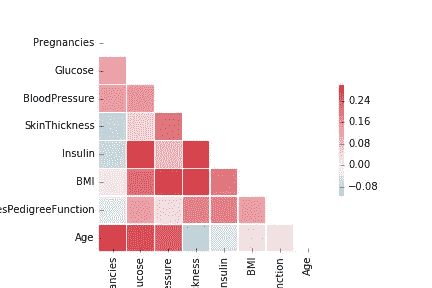
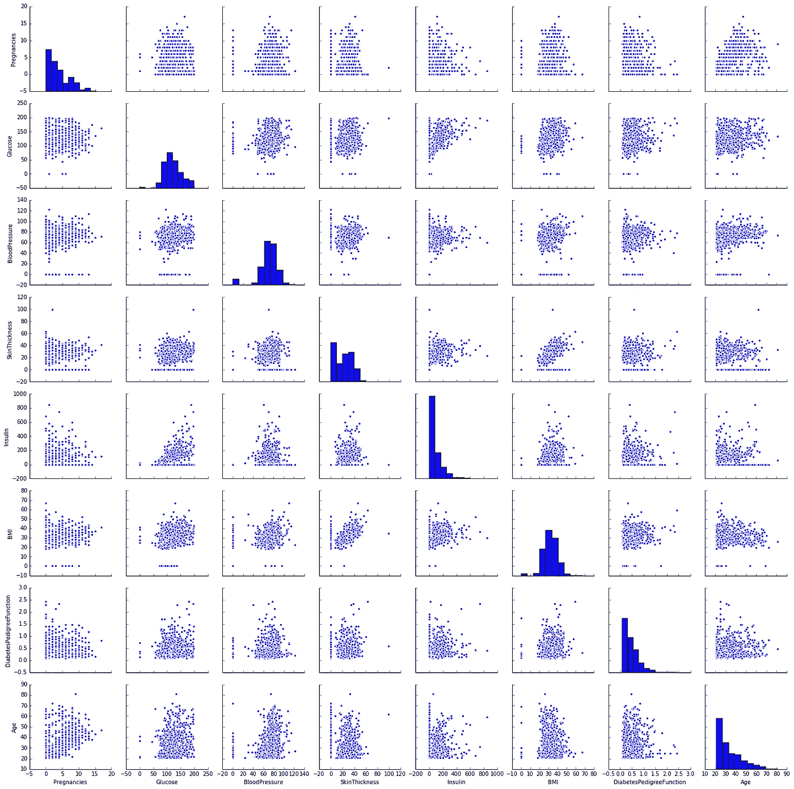
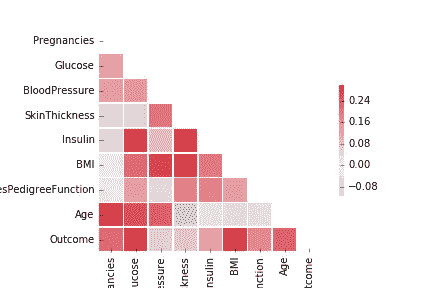
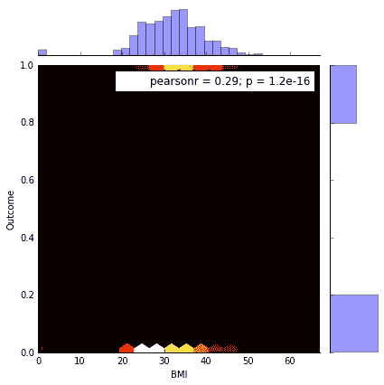
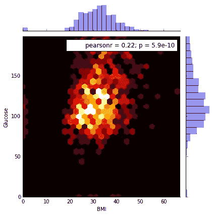
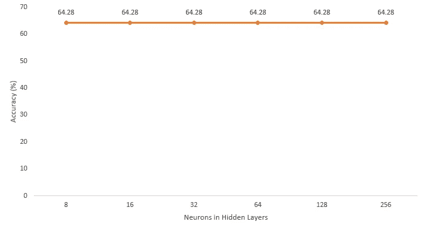
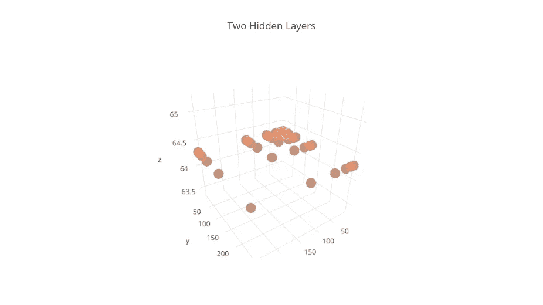
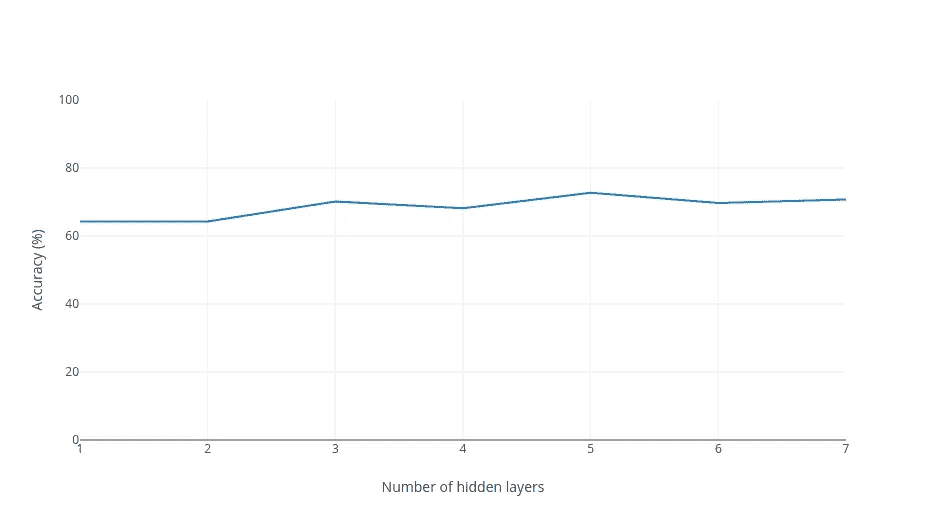
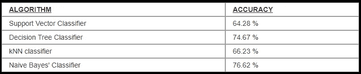

# 糖尿病预测——人工神经网络实验

> 原文：<https://towardsdatascience.com/diabetes-prediction-artificial-neural-network-experimentation-f4267796443d?source=collection_archive---------5----------------------->

作为一名数据科学专业人员，我们倾向于学习所有可用的技术来处理我们的数据，并从中推导出有意义的见解。在本文中，我描述了我用神经网络架构对数据进行探索性分析的实验。


Source : [http://legacymedsearch.com/medicine-going-digital-fda-racing-catch/](http://legacymedsearch.com/medicine-going-digital-fda-racing-catch/)

这里是到我的代码库的 [github 链接](https://github.com/bmonikraj/neural-network-sklearn)，我已经用它进行了探索性的数据分析，所有的架构设计都在本文中提到。我使用过 Python 3.6 以及 Pandas、Numpy 和 Keras(tensor flow 上的后端)模块。

[](https://github.com/bmonikraj/neural-network-sklearn) [## bmonikraj/神经网络-sklearn

### 神经网络-sklearn -神经网络在 pima 印度糖尿病数据集上的实现

github.com](https://github.com/bmonikraj/neural-network-sklearn) 

这是我用于探索性数据分析的数据集的链接，来自 [Kaggle 网站](https://www.kaggle.com/uciml/pima-indians-diabetes-database/data)。链接中提到了列的数据描述和元数据。

```
Number of Observations : 768
Number of Features : 8
Input Neurons : 8
Output Neurons : 2 (Diabetic and Non-diabetic)
Test Data size : 20%
Train Data size : 80%
```

[](https://www.kaggle.com/uciml/pima-indians-diabetes-database/data) [## 皮马印第安人糖尿病数据库

### 基于诊断方法预测糖尿病的发病

www.kaggle.com](https://www.kaggle.com/uciml/pima-indians-diabetes-database/data) 

首先，我创建了 [**关联矩阵**](http://www.statisticssolutions.com/correlation-pearson-kendall-spearman/) ，并使用 *Seaborn* 模块绘制了热图和 pairs 图(数据集的每两个特征之间的图),用于数据可视化。通过相互比较，关联图给出了关于特性依赖性的概念。相关性是任何数据集的[双变量分析](https://en.wikipedia.org/wiki/Bivariate_analysis)的一部分。



Correlation Matrix

下面是描述每个特征之间的二元图的配对图，也显示了每个特征的[直方图](http://asq.org/learn-about-quality/data-collection-analysis-tools/overview/histogram.html)。*单元格[i，i]显示直方图，其中 I 是第 I 行/列。*



Pair Plot and Histogram of the dataset (Only X)

从上面的直方图可以得出一个推论，很少有**特征遵循标准或已知的分布，如高斯、瑞利等，这从图**的形状可以明显看出。如果需要，这种假设在建立预测模型时会很方便，因为我们已经知道(或至少假设)了数据的分布及其数学公式。



Correlation Matrix including the target (Outcome) value

从上面的情节可以得出*(因为相关分数高)**【结果-葡萄糖】*对和*【结果-身体质量指数】*对是最相互依赖的。所以密谋与[培生**联合密谋**培生](https://en.wikipedia.org/wiki/Pearson_correlation_coefficient)会关注他们的行为。从下面可以看出，Outcome (Target)只有两种可能的结果。


Outcome — Glucose (Pearson Correlation)



Outcome — BMI (Pearson Correlation)



Glucose — BMI (Pearson Correlation)

根据第一个皮尔逊相关图，显然*‘葡萄糖’*与结果高度相关，这使得*‘葡萄糖’*成为最重要的特征。

现在这是最有趣的部分，实验神经网络的各种可能的架构。在深入这个问题之前，我想指出关于架构决策的几个关键点。

1.  输入神经元数量=*中的特征数量 X*
2.  输出神经元数量=目标中的类别数量
3.  #隐藏层> 0
4.  隐藏层中的神经元数 1 ~ #隐藏层中的神经元数 2 ~ #隐藏层中的神经元数 3 …隐藏层中的神经元数量*(如果架构有 N 个隐藏层)*
5.  隐藏层中的神经元数量~ #输入神经元| #隐藏层中的神经元数量~ 2 X #输入神经元
6.  权重必须随机初始化

[人工神经网络](https://www.tutorialspoint.com/artificial_intelligence/artificial_intelligence_neural_networks.htm)是最流行的机器学习算法之一，广泛应用于预测建模和构建分类器。目前，许多先进的神经网络模型，如卷积神经网络、深度学习模型，在计算机视觉、网络安全、人工智能、机器人应用、医疗保健和许多更先进的技术领域中很受欢迎。

驱使数据科学家使用人工神经网络的几个令人兴奋的事实是

*   适应并训练自己处理复杂的非线性问题。
*   灵活应对各种问题集。
*   从根本上兼容实时学习(在线学习)。
*   在大多数情况下，构建人工神经网络需要大量的数据和快速的 GPU 来进行计算

> 在这个程序中，在使用的每个架构中，输出层都由' [softmax](https://en.wikipedia.org/wiki/Softmax_function) '激活函数激活。中间层由' [relu](https://en.wikipedia.org/wiki/Rectifier_(neural_networks)) 激活功能激活。
> 
> 由于这是一个探索性的数据分析，所以所有的指标和图表都受制于这个特定的问题集。

## 单一隐藏层架构



Single Layer Architecture — Accuracy vs Neurons in Hidden Layer

在我们的问题中，对于隐藏层中任意数量的神经元(基于上图的强假设),应用单层架构产生了 64.28% 的饱和精度。

## 两个隐藏层架构



Two hidden layer architecture — X-axis : Neurons in first hidden layer, Y-axis: Nuerons in second hidden layer, Z-axis: Accuracy

在两个隐藏层架构的情况下，观察到类似的行为，其中准确度总是饱和到 **64.28%。**

## 多重隐藏层架构



Performance of classifier based on increasing hidden layers

既然我们正在讨论用神经网络进行探索性数据分析，我想提出几个需要记住的要点

*   激活函数的选择在很大程度上影响性能。基于实验、目标类型和我们正在处理的数据选择激活函数的明智决定很重要。
*   隐藏层中神经元的数量应该与输入神经元的数量相似。如果神经元的数量足够多，这可能会提高性能，但也可能会增加复杂性。为此要保持一种折衷。
*   使用带有反向传播的动量可以帮助收敛解，并实现全局最优。
*   在决定隐藏层的架构时，尝试不同的架构会有所帮助，因为每个数据集在不同的架构下可能会有不同的表现。
*   数据的大小很重要，所以尽量相应地选择数据大小。越大越好！
*   当网络从零开始构建时，网络权重的随机初始化是强制性的(没有像初始模型那样预先训练的权重)。

在神经网络之后，我应用了一些其他算法来测试数据集和性能。结果是这样的



# 关键要点

在每一个现实世界的问题中，构建以解决方案为中心的模型的第一步是执行探索性的数据分析。这将为问题建立合适的模型，该模型可进一步用于调整性能和有效地解决问题。

人工神经网络的探索性数据分析处理隐藏层和激活函数。先进的大数据问题、基于图像的问题和许多其他复杂问题现在都可以用卷积神经网络来解决 **(CNN)** 。深度学习已经被广泛用于许多复杂的研究问题，因为它能够从大数据中获得洞察力，在许多情况下跳过数据特征提取的过程 *(CNN 可以直接对图像进行处理，无需任何特征提取)。计算机视觉应用中的 CNN 的另一个好处是保持图像的空间属性完整，这对于许多基于几何的计算和推理非常有用。*

# 参考

1.  探索性数据分析—[https://www . ka ggle . com/etakla/exploring-the-dataset-bivariable-Analysis](https://www.kaggle.com/etakla/exploring-the-dataset-bivariate-analysis)
2.  https://keras.io/
3.  熊猫—【https://pandas.pydata.org/ 
4.  https://seaborn.pydata.org/
5.  皮尔逊相关性—[https://en . Wikipedia . org/wiki/Pearson _ Correlation _ coefficient](https://en.wikipedia.org/wiki/Pearson_correlation_coefficient)
6.  人工神经网络—[https://www . tutorialspoint . com/artificial _ intelligence/artificial _ intelligence _ Neural _ networks . htm](https://www.tutorialspoint.com/artificial_intelligence/artificial_intelligence_neural_networks.htm)