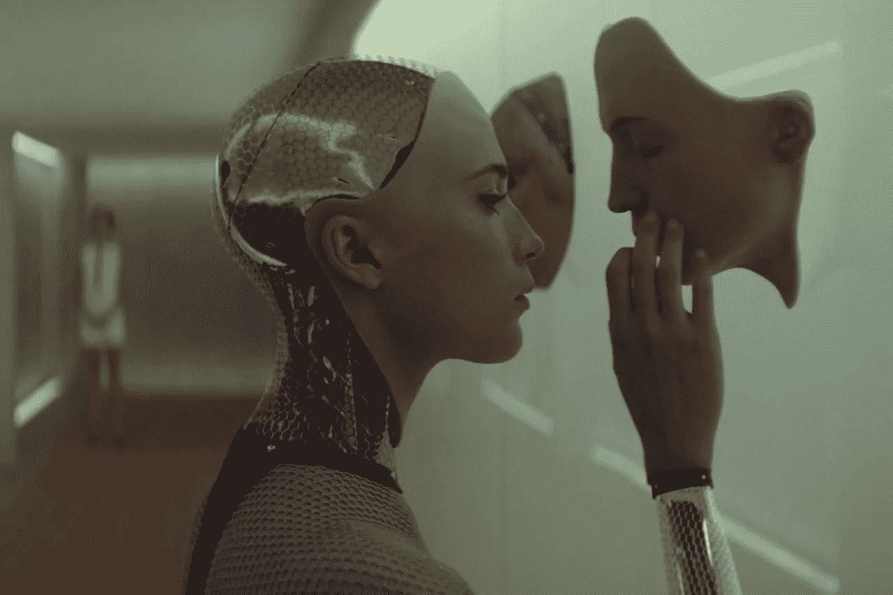
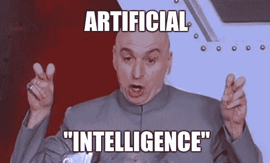

# Google Duplex 打败图灵测试了吗？是也不是。

> 原文：<https://towardsdatascience.com/did-google-duplex-beat-the-turing-test-yes-and-no-a2b87d1c9f58?source=collection_archive---------2----------------------->

## 谷歌推出了一种可以通过电话预订的人工智能。图灵测试最终通过了吗？

尽管谷歌在语音人工智能领域取得了突破性的成就，但谷歌人工智能没有通过图灵测试有两个原因(在我看来)。然而，仍然有好消息。

## 如果你喜欢这篇文章，想分享你的想法，问问题或保持联系，请随时通过 [LinkedIn](https://www.linkedin.com/in/artem-oppermann-929154199/?locale=en_US) 与我联系。

# 什么是 Google Duplex？

上周在 I/O 期间，科技巨头谷歌首席执行官在年度开发者大会上公布了他们最新的语音技术，这是一种听起来像人类一样的人工智能。人工智能与谷歌助手一起使用，谷歌助手是亚马逊 Alexa 的竞争对手。在 7000 名与会者面前，人工智能给一名发型师打电话预约。人工智能的声音和人类的声音是无法区分的。人工智能有时会在回应前停顿一下，拉长某些单词，就好像它在为事情争取时间。它甚至使用人类的口头标记，如“嗯”和“呃”。

被叫去的理发师没有意识到她不是在对一个人说话，而是在对一个复杂的神经网络的输出说话。最终，在惊讶的观众面前，人工智能成功地完成了任命。目前，人工智能将主要用于通过电话代表你预约和预订。

# 什么是图灵测试？

图灵测试是评估机器智能的一种方式——要通过测试，人工智能必须以人类无法区分的方式表现。这项测试是由艾伦·图灵在 1950 年发明的。图灵提出，人类评估员将判断人工智能和人类之间的自然语言对话。人类将意识到两个对话参与者之一实际上是机器的事实。但是他不知道机器是参与者中的谁。

在谈话过程中，所有的参与者都会被分开。最后，如果评估者不能可靠地区分人和人工智能，人工智能将通过测试。应该注意的是，该测试并不检查对问题给出正确答案的能力。只是答案与人类给出的答案有多相似。

# 谷歌通过图灵测试了吗？不，但是…

首先让我说说为什么在我看来图灵测试没有通过。

## 进行测试的错误条件

如果你逐字逐句地理解测试的定义，首先我们不具备进行图灵测试的合适条件。为什么？因为观众(测试的评估者)确切地知道机器是两个对话参与者中的哪一个。根据图灵测试，评估者不应该知道这个事实。

诚然，这是一个无力的论点。一开始没有被告知这两个参与者身份的人可能看不出区别。因此，让我提出另一个相反的论点。

## **缩小谈话话题**

人工智能和人类之间的对话被缩小到一个特定的话题——预约。人工智能可以对与预约相关的问题给出任何答案。一旦人类将对话引向完全不同的方向，人工智能就会失败。原因是人工智能只在与约会相关的真实世界对话中接受训练。AI 可以回答 AIs 用户希望约会在哪个日期和时间没有问题地进行。然而，人工智能会被一个问题淹没，比如“为什么你更喜欢我们做你的发型设计师？”。真实世界的对话可以在任何时候向任何方向转换。只要人工智能不能参与关于任何话题的普通对话，图灵测试就不会通过。

## 然而，…

在预约领域，我认为人工智能通过了图灵测试。考虑到人工智能所基于的神经网络仅在六年前首次实际实现，这是人工智能领域的一项巨大成就。

在未来的 10 年里，我们不可能没有一个通用的对话式人工智能，它可以用任何语言和任何人谈论任何可能的话题。