# 梅拉尼娅真的发微博了吗？

> 原文：<https://towardsdatascience.com/did-melania-really-tweet-that-d8038e91e67f?source=collection_archive---------13----------------------->

## 我的模特说。

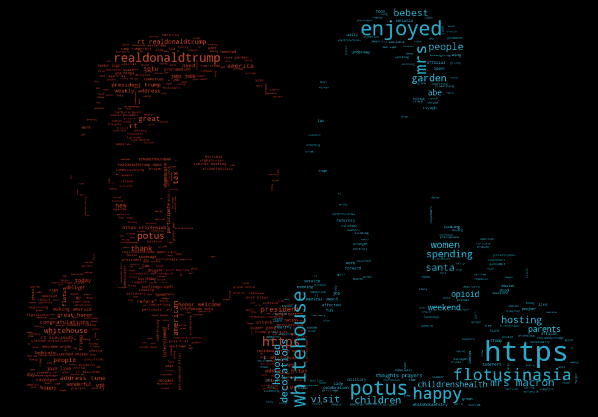

You are what you tweet. Wordclouds formed from the most significant words in the POTUS (orange) and FLOTUS (cyan) tweet corpora. (Want to make wordclouds like these? Use [this code example](https://amueller.github.io/word_cloud/auto_examples/a_new_hope.html) that shows how to do masking and custom colorization.)

M 埃拉尼亚回来了！在离开公众视线 24 天后，她于本周早些时候出席了白宫的一个仪式，[或者至少她的替身出席了](https://www.rt.com/usa/428833-melania-trump-body-double/)。；)

她的缺席引起了媒体的诸多猜测，她在 5 月 30 日的推特上对此进行了回应。

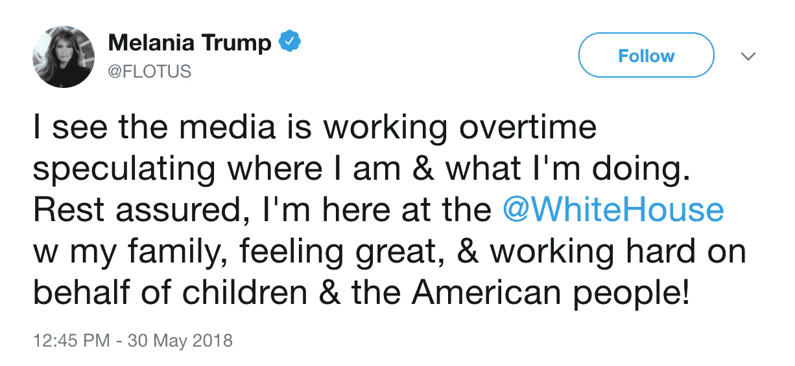

The mystery tweet.

问题是这条推文并没有平息对她行踪的猜测，因为[听起来不像她的](http://www.newsweek.com/melania-trump-silence-tweet-first-lady-950210)。语气异常愤怒，听起来更像特朗普。(或者至少听起来更像特朗普的人，而不是她的人。)

这让我想起了上世纪 90 年代围绕谁写了《原色》( Primary Colors)这本书的谜团，这是一部几乎不加掩饰的小说——对一些人来说太单薄了——背景设在克林顿白宫。一位自称为“法医语言学家”和“词形学专家”的瓦萨文学教授声称是专栏作家乔·克莱因写了这本书。后来克莱恩承认了。

这位教授对他推断作者身份的精确方法持谨慎态度(他的错误和正确一样多)，但这与计算词频有关。(想起什么了吗？)

这一切启发我进行了一个快速的 Python 实验，试图回答到底是谁写了上面这条愤怒的推文。

# 第一步:获取数据

Twlets.com 让这一步变得非常容易。你安装一个 Chrome 应用程序，访问你想要的 Twitter 用户页面，点击工具栏图标下载。

在你遇到付费墙之前，你可以下载的推文数量是最大的，但它足够高，我可以下载所有官方的波多黎各和 FLOTUS 推文。

## 一个障碍:数据不平衡

截至几天前，梅拉尼娅在她的 FLOTUS 官方账户上只有 307 条推文，而特朗普在他的波多黎各账户上有 3259 条推文。

从图形上看(只是为了好玩)，这种不平衡看起来像这样。

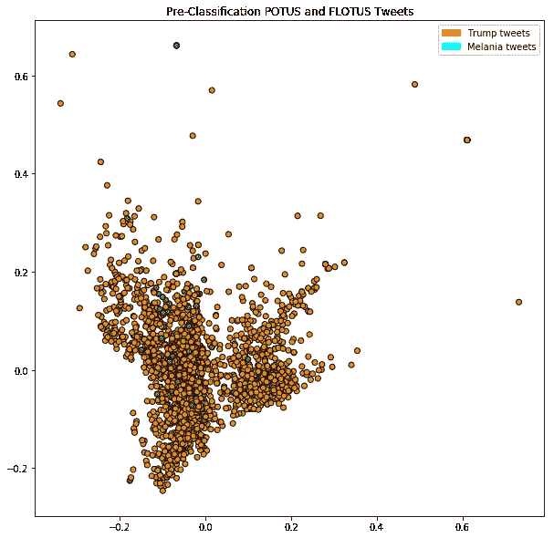

All POTUS/FLOTUS tweets plotted after TF-IDF vectorization and PCA dimension reduction (we’ll get to all that below).

唐纳德的橙色弹珠太多了，而梅拉尼亚的青色弹珠太少了。超过 10 比 1 的不平衡。

像这样的不平衡很难衡量开发中的模型的准确性。考虑到这种不平衡，最简单的模型是，在默认情况下，将所有输入分类为属于特朗普阶级，即多数阶级。

> 梅拉尼娅的所有推文都会被这个简单的模型错误分类，但你仍然会有比 **91%** 更好的准确率。

然后我们需要制作一个比 91%更精确的模型。我不确定我们能否完成这个小实验，但这将是我们的目标。

(更好的办法是平衡数据。如果我再次这样做，如果我没有通过 Twlets 浏览我的免费推文下载，我会将一些[梅拉尼娅的个人推文](https://twitter.com/melaniatrump?lang=en)与她的官方推文混合在一起，以便我们有多少梅拉尼娅样本就有多少川普样本。我将把这项工作留给未来的研究人员。)

# 步骤 2:清理并分割数据

在矢量化之前，我们需要从 tweets 中删除特殊字符和大写字母。我只是使用了在许多 Github NLP repos 中找到的名为 *clean_str* 的简单函数，例如[这个](https://github.com/AcademiaSinicaNLPLab/sentiment_dataset/blob/master/preprocess.py)。

我将 85%的数据用于训练，剩下的 15%用于测试(在这个小实验中，我没有使用开发套件)。这给了我一个包含 2769 个样本的训练集和一个包含 489 个样本的测试集，每个样本都是特朗普和梅拉尼娅推文的随机组合。

我们将从训练集和测试集中保留谁是作者的问题。在这个练习的最后，我们会要求对它进行预测。

# 第三步:向量化数据

我们需要将这些推文中的单词转换成数字，这样我们就可以输入某种分类器。

我尝试了两种矢量化技术，一种旧的，一种新的。

## 术语频率-逆文档频率(TF-IDF)

这项技术始于 20 世纪 50 年代。那位 90 年代追随乔·克莱因的瓦萨大学教授可能已经掌握了这种技术，而且几乎肯定利用了这种技术。

TF-IDF 的维基百科定义很容易理解:

> tf-idf 值与单词在文档中出现的次数成比例地增加,并被该单词在语料库中的频率所抵消，这有助于调整某些单词通常出现得更频繁的事实。

因此，一个单词在文档中出现的次数越多，它的得分就越高。但是如果同一个单词在所有文档(语料库)中也是常见的，则我们从该分数中减去。这剔除了非常常见的单词(冠词、介词、动词变化等)。)，让我们在给定文档中的重要单词方面得到高分。

这是在介绍中用来制作漂亮的文字云的技术。每个单词都代表特朗普或梅拉尼娅的一条完整的推文。选择这个词是因为它在推文中的所有词中具有最高的 TF-IDF 得分。

Python 中的 sklearn 库使 TF-IDF 矢量化变得非常简单。在几行代码中，我们可以将训练集变成一个大的稀疏数组，其维数等于样本数 X 特征数。这些特征中的每一个都代表出现在语料库中某处的一个单词，用 TF-IDF 分数表示。

对于大多数文档，大多数特征将具有空值，因为相关联的单词在文档中没有出现。非空特征表示出现在文档中某处的单词，根据它们在给定文档中相对于较大语料库出现的次数进行加权。

这些数组是任何模型都可以咀嚼的谷物。该模型可以是老式的支持向量机(SVM)或新式的神经网络、卷积神经网络(ConvNet)或递归神经网络(RNN)。

## 单词嵌入矢量化

TF-IDF 基本上是单词计数。它没有抓住意义。单词嵌入试图捕捉意思。

解释起来很复杂，但是[这个帖子](https://www.analyticsvidhya.com/blog/2017/06/word-embeddings-count-word2veec/)做得很好。要点是深度学习技术可以用于将整个单词语料库消化到低维嵌入矩阵中。这个矩阵将和语料库中的单词数一样宽，但是高度减少到 100 或 300。如果有足够多的单词，它几乎会神奇地保留单词使用的上下文。

如果我们用一个单词查询保存这个矩阵的模型，我们将得到它的 100 或 300 高的列向量。这些是模型为这个特定单词学习的嵌入。

在文档的情况下，比如我们的 tweet，我们可以查询 tweet 中每个单词的模型，然后做一些简单的事情，比如平均向量，以创建最终的输入。

## 警告:我们需要大量的单词来正确地学习嵌入

Gensim 库使得学习 Python 中的嵌入变得很容易。

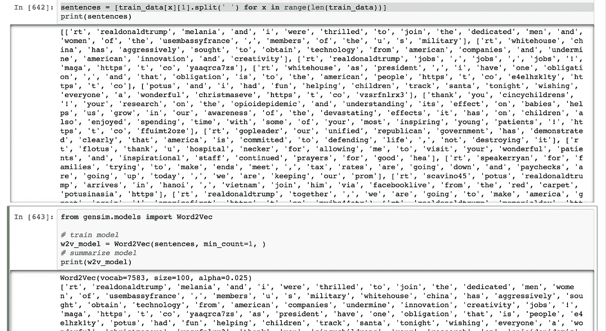

问题是我们的训练语料库很小(7583 个单词)。这意味着它在语义上是非常愚蠢的。

如果我们问模型类似的词，比如说，“媒体”(是的，你可以用这种模型来做！)，它返回给我们一些语义上不太相关的结果。

不过，最酷的事情是，我们可以加载已经输入了非常大的语料库(比如维基百科页面)的预训练模型。如果我们这样做，我们会得到语义相关的结果

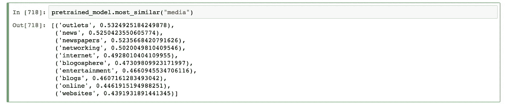

# 步骤 5:训练几个分类模型

我们已经把单词变成了数字特征。我们可以使用这些特征来训练任何我们喜欢的分类模型。我使用 sklearn 的随机梯度下降(SGD)分类器，因为我想做一些超快速的训练，但是，同样，你也可以使用更高级的东西(比如说 ConvNet)。

让我们在 TF-IDF 稀疏矩阵和预训练的单词嵌入向量上训练 SGD 分类器。

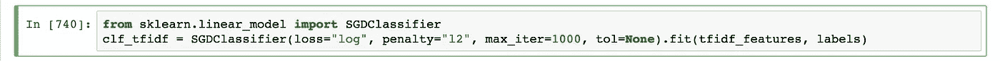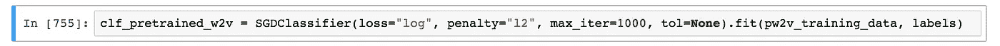

# 步骤 5:测试分类模型

我们现在已经有了几个训练好的分类模型。让我们把测试样本扔给他们，看看他们表现如何。请记住，我们想要比我们的基线 91%更好的准确性。

## 基于 TF-IDF 的分类

我们对测试样本进行 TF-IDF 矢量化处理，将它们提供给 SGD 分类器，然后对照真实标签评估预测结果。

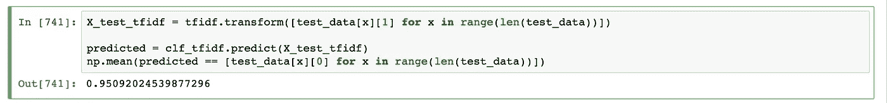

95.09%!不惊人，但比我们的基线要好。这是用旧的技术。

## 基于单词嵌入的分类

使用语义更智能的输入功能的新技术怎么样？

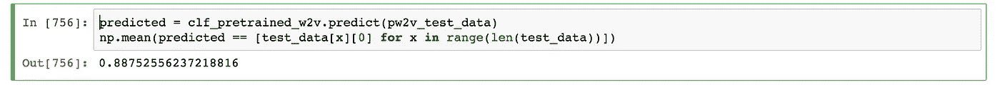

只有 88.75%。事实上比我们的基线还要差。特征的语义上下文对我们的分类挑战没有太大帮助。而且，如果你浏览一下互联网，你会看到相当多的帖子(比如这个[这里](http://nadbordrozd.github.io/blog/2016/05/20/text-classification-with-word2vec/))在这些帖子中，老式的 TF-IDF 击败了新的技术。

# 第六步:回答我们的研究问题:梅拉尼娅到底有没有写那条推文？

我们有一个超过基线精度的分类模型，另一个没有。让我们问问他们俩，他们认为是谁写了这条推文。

第一，TF-IDF 美联储模式。。。

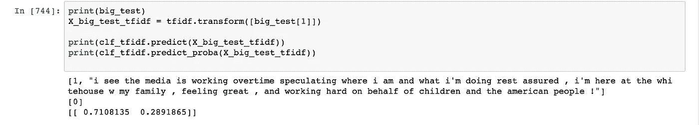

我们对有问题的单个 tweet 进行矢量化，并得到预测。

> 注意，从输入推文的打印输出来看，它被标记为“1”，所有 Melania 推文也是如此。
> 
> 但分类器预测它的标签为“0”，这意味着它认为是特朗普写的。
> 
> 从打印的对数概率中，我们可以看到它说有 71.08%的可能性他做到了。

性能较低的网络呢？我们并不真正信任它，因为它的准确性低于基线，但不管怎样，我们还是要问一下。

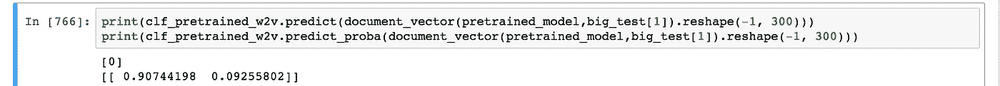

又是特朗普，这次有 90.74%的把握。

# 结论

对这一切有很多警告。

*   我们的数据是不平衡的，这也许使我们的模型更有可能预测特朗普，即使是梅拉尼娅的输入。(现在是混乱矩阵的时候了，但这已经够长了。)
*   根据训练集的随机化和为分类模型选择的超参数，我偶尔可以得到预测，即梅拉尼娅，而不是特朗普，是这条推文的作者。
*   我们正试图根据一个很小的单词样本(42 个左右)来确定作者。

简而言之，这些在法庭上都站不住脚。这对数据爱好者来说意味着乐趣。

我们可以肯定的是，许多人(包括我在内)的直觉认为这条推文听起来不像梅拉尼娅的推文，一个相当准确的模型产生了支持这些直觉的数据点。