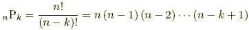
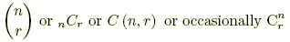
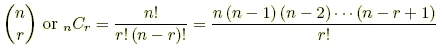
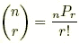

# 排列和组合的区别

> 原文：<https://towardsdatascience.com/difference-between-permutation-and-combination-9e12b6763ee1?source=collection_archive---------0----------------------->

**长话短说**

排列和组合的区别在于:

密码锁应该叫排列锁；)

**说来话长**

在学习机器学习的同时，在 edx.org 的[上，导师用高斯分布来解释有监督和无监督的学习(如果你纯粹是想知道其中的区别，请移至前面的讨论)。当事件的发生率非常大时，高斯分布近似于二项式分布，这正是我实际上想要理解差异的地方，因为二项式分布的公式包含事件发生率的多个**组合**。](https://www.edx.org/course/machine-learning-columbiax-csmm-102x-0)

让我们从排列和组合的基本定义开始，并举例说明:

**排列:**

对象的选择，其中对象的顺序很重要。

例如:集合{a，b，c}中字母的排列是:

abc acb
bac bca
cab cba

由 n 个对象组成的集合中 k 个对象的可能排列数的公式。通常写成 nPk。

公式:

**组合**

n 个对象集合中 r 个对象的可能组合数。

大声朗读— n 选 r。

公式:

注意:

其中 nPr 是一次取 r 的 n 个对象的排列公式。

了解基本定义和公式后，我们可以用下面的简单方法记住它们的区别:

排列听起来很复杂——因此要记住，每个细节都很重要。吉米，开心果和元帅不同于开心果，元帅和吉米。另一方面，组合很容易相处——吉米、乔利和元帅与乔利、元帅和吉米相同。

因此，排列用于列表(顺序问题)，组合用于组(顺序无关紧要)。

一个著名的笑话是:一个“密码锁”应该被称为“排列锁”。你给锁编号的顺序很重要。例如，一个真正的“密码锁”会将 17–01–24 和 24–17–01 都视为正确。

**结论**

组合表达式是一个排列(得到所选事件的 x 次出现的方式的数量)关系除以 x！(可以选择 x 事件的不同顺序的数量，假设所有顺序都是可区分的)。我希望这能让你明白排列和组合的区别。

在 LinkedIn 这里打个招呼—[https://www.linkedin.com/in/softxide/](https://www.linkedin.com/in/softxide/)