# 张量流概率分布的可微卷积

> 原文：<https://towardsdatascience.com/differentiable-convolution-of-probability-distributions-with-tensorflow-79c1dd769b46?source=collection_archive---------7----------------------->

## Tensorflow 中的卷积运算是为张量设计的，但也可用于卷积可微分函数

在本文中，我描述了一个均匀和高斯概率分布的卷积的例子，将它们与数据进行比较，并适合高斯的宽度参数。如果我们的数据采用基础模型(本例中为均匀分布),但每个数据点都被高斯模型随机“涂抹”了一定量(例如测量不确定性),则在实践中会出现这种情况。我们假设我们不知道分辨率，并想从观测数据中确定它。这里[有一个 Jupyter 笔记本，上面有本文讨论的例子的 Tensorflow 实现](https://gist.github.com/andreh7/bd76330507675e6010bddea5005a7a37)。

我们首先在函数参数上定义一个网格，我们将在整篇文章中使用它。尽管对于这里给出的这个简单例子，我们可以得到卷积积分的封闭形式的表达式，但在实际应用中往往不是这样。因此，我们在这个网格上离散我们的函数，有效地使它们分段常数。然而，我们可以选择非常大的箱数，使得分段近似对于我们的目的来说足够好:

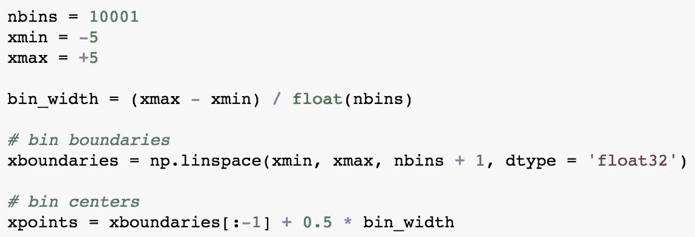

然后我们在这个网格上定义一个[均匀分布](https://www.tensorflow.org/api_docs/python/tf/distributions/Uniform):

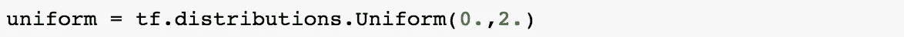

如下所示:

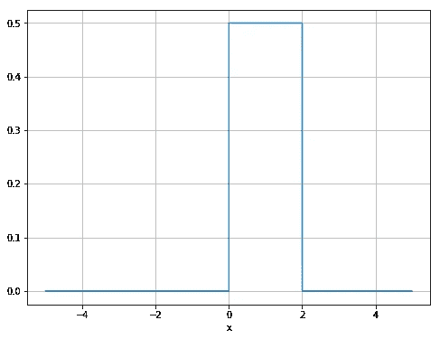

我们现在可以从均匀分布中抽取一个随机数样本:

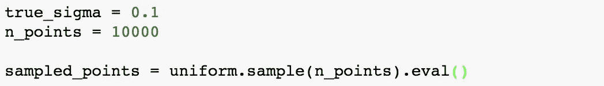

并且用从已知宽度的高斯分布中提取的随机数“涂抹”每个点:

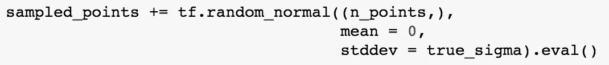

这给了我们以下分布:

现在我们定义高斯分布。请注意，我们将宽度参数 sigma 设为`tf.Variable`而不是张量或占位符，因为我们希望稍后使用最大似然拟合来确定它，并因此对其进行求导:

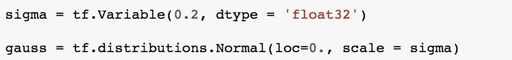

必须考虑如何获得正确的卷积输出范围。在这个例子中，我们使用`padding='SAME'`进行卷积运算，第二张量具有奇数个面元。如果我们选择第二个张量在其中间为 1，在其他地方为零(一个“居中的狄拉克脉冲”)，那么卷积输出将等于第一个张量。因此，我们将高斯核置于第二张量中间面元的中心。卷积乘积的定义域与投影到第一张量的函数的定义域相同。

还发现 Tensorflow 的 1D 卷积实际上是一个[互相关](https://en.wikipedia.org/wiki/Cross-correlation)而不是一个[卷积](https://en.wikipedia.org/wiki/Convolution#Discrete_convolution)。这些本质上不同于第二个函数被“遍历”的方向。通过将第二个输入镜像到围绕垂直轴的卷积运算，或者等效地，翻转函数参数的符号，我们可以得到真正的卷积。

作为卷积运算的快速检查，我们将均匀分布与其本身进行卷积:

获得:

其(忽略归一化)对应于从完全解析计算中获得的结果。

回到我们最初的问题，我们定义均匀分布和高斯分布之间的卷积:

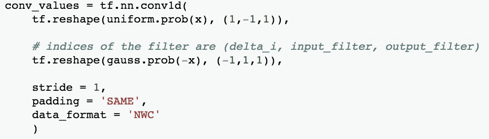

(对于 sigma 参数的原始值)如下所示:

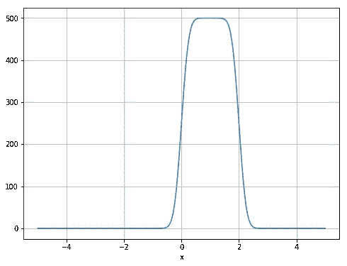

让我们根据卷积乘积定义上面生成的样本数据的负对数似然性。由于我们必须对卷积运算进行离散化，因此我们还需要用相同的宁滨对数据进行分类:

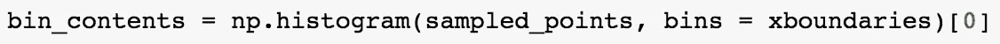

负对数似然函数的定义是:

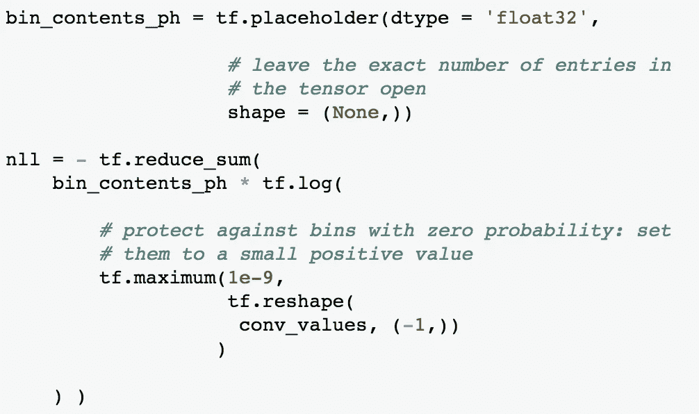

在下一步中，我们绘制负对数似然函数，我们期望在 sigma 的“真实”值处看到最小值，该值以前用于抽取样本。Tensorflow 可以计算负对数似然函数相对于 sigma 的导数(如下图中的箭头所示):

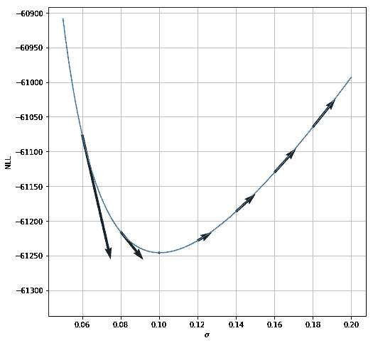

现在我们有了负对数似然函数及其导数，我们可以使用它的最小值。因为我们只有一个参数要优化，所以我们使用 [BFGS 方法](https://en.wikipedia.org/wiki/Broyden%E2%80%93Fletcher%E2%80%93Goldfarb%E2%80%93Shanno_algorithm)而不是随机梯度下降法。Tensorflow 有一个到 [scipy 的最小化工具箱](https://docs.scipy.org/doc/scipy/reference/generated/scipy.optimize.minimize.html#scipy.optimize.minimize)的接口:

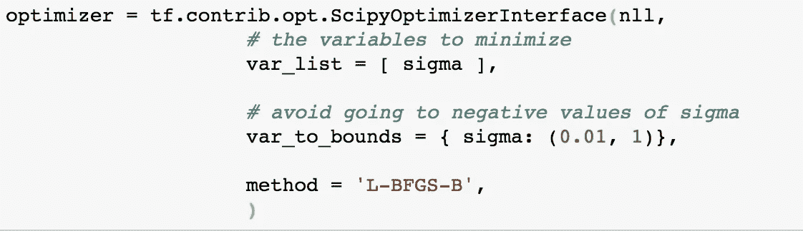

为了监控进度，我们定义了一个回调函数:

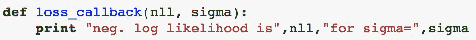

开始最小化:

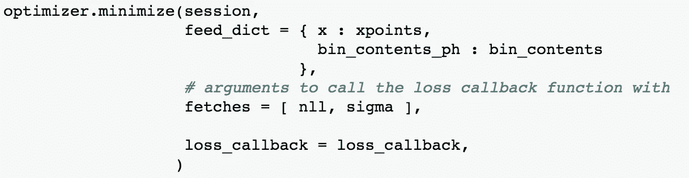

这通常在大约 23 次迭代之后收敛，并且应该给出接近原始值 0.1 的 sigma 值，该原始值 0.1 用于涂抹从均匀分布中提取的点。

我们在本文中已经表明，在 Tensorflow 这样的框架中，我们可以对概率分布的参数求导，即使我们在卷积运算的(离散版本)中使用这样的分布。

顺便提一下，当使用大量面元时，使用[快速卷积算法](https://en.wikipedia.org/wiki/Convolution#Fast_convolution_algorithms)在计算上可能更有效。事实上，Tensorflow 依赖于 cuDNN，它支持用于执行[卷积](https://docs.nvidia.com/deeplearning/sdk/cudnn-developer-guide/index.html#cudnnConvolutionForward)的[几种不同算法](https://docs.nvidia.com/deeplearning/sdk/cudnn-developer-guide/index.html#cudnnConvolutionFwdAlgo_t)，包括基于离散傅立叶变换的方法。