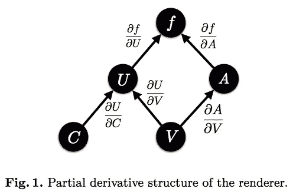
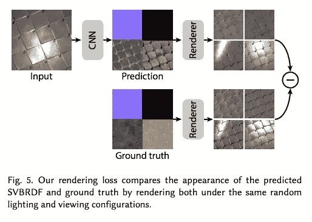
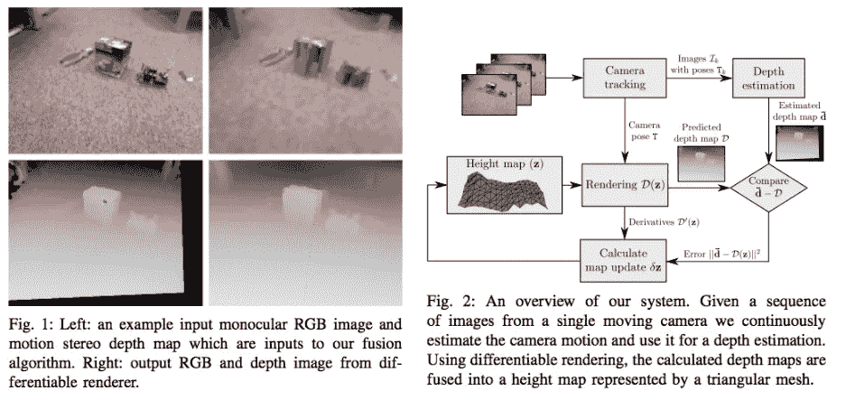

# 可区分渲染

> 原文：<https://towardsdatascience.com/differentiable-rendering-d00a4b0f14be?source=collection_archive---------9----------------------->

## 听起来很酷，但是…是什么？

随着我开始更多地关注机器学习，可微分渲染是引起我注意的一个话题，并且以一定的频率出现。我的第一个想法是，“cooooool 这是一个生成像素的新系统，可以利用机器学习吗？”深究题目之后，这立刻是失望，但失望最终被对实际实际应用的现实兴奋所取代。那么，什么是可微分渲染呢？

> 反向图形试图获取传感器数据并推断 3D 几何图形、照明、材质和运动，以便图形渲染器可以逼真地再现观察到的场景。然而，渲染器被设计成解决图像合成的正向过程。在另一个方向，我们提出了一种近似可微分渲染器(DR ),它显式地模拟模型参数和图像观察之间的关系。
> -OpenDR:一个近似可微分的渲染器([论文](http://files.is.tue.mpg.de/black/papers/OpenDR.pdf)，[技术谈](https://www.youtube.com/watch?v=4B06sKUt5dY))

OpenDR 可以将颜色和顶点作为输入来产生图像中的像素，并从这些像素中保留导数，以便可以准确地确定哪些输入影响了最终的像素颜色。通过这种方式，它可以将图像“反渲染”回颜色和顶点。

OpenDR: An Approximate Differentiable Renderer

OpenDR 是“近似的”,因为光栅化中存在不连续性，例如由于遮挡。这只是一种不同形式的渲染引擎(光栅化引擎)，但也存在其他形式的 DR，包括光线行进，基于点的技术，甚至是单一的着色表面。单一阴影表面的情况(想象一个全屏四边形)可能是最容易理解的，因为它只需要通过照明和 BRDF 传播就可以回到输入端。那么这有什么用呢？

[Single-Image SVBRDF Capture with a Rendering-Aware Deep Network](https://hal.inria.fr/hal-01793826/document)

可区分渲染的一个用例是在训练机器学习模型时计算损失。例如，在 SVBRDF 重建论文的[中，网络产生四个输出纹理图(漫反射率、镜面反射率、粗糙度、法线)，但是单独计算这四个空间中的损失是不够的。问题是，目标法线(例如)和推断法线之间的比较没有捕捉到当纹理实际渲染为光照表面时可见的感知损失。使用可微分渲染器来计算渲染图像空间中的损失；然后将损失传播回四个纹理输入，并从那里应用反向传播来训练网络。](https://hal.inria.fr/hal-01793826/document)

[Real-Time Height Map Fusion using Differentiable Rendering](https://www.imperial.ac.uk/media/imperial-college/research-centres-and-groups/dyson-robotics-lab/jzienkiewicz_etal_iros2016.pdf)

DR 在使用微分渲染的实时高度图融合中具有类似的应用。目标是从单个单目摄像机鲁棒地重建高度图。使用三角形网格和 DR，效率和鲁棒性都得到了提高。

> 我们的方法的一个重要元素是在标准 OpenGL 计算机图形流水线中实现的可微分渲染器，该元素能够实现高效的操作。给定当前的表面模型和相机姿态，它可以在几乎没有额外计算成本的情况下，为每个像素渲染预测的图像和深度，以及这些量相对于模型参数的导数。

初始深度估计被转换成高度图，然后被渲染成具有顶点位移的三角形网格，以产生新的深度图，该深度图然后可用于计算损失。整个过程是可微分的，这意味着可以通过深度图、通过三角形网格、通过高度图、通过原始深度估计以及通过用于训练的网络追溯损失。

## 结论和补充阅读

这是对可区分渲染的快速概述，如果您和我一样，对 DR 的定义和用途感到疑惑，我希望这是有用的。我没有对这些论文的质量做任何声明，这些只是我写这篇文章时发现的相关作品。

*   RenderNet:一个深度卷积网络，用于 3D 形状的可区分渲染
*   [使用对抗性想象先验的计算机视觉中的逆问题](https://openreview.net/pdf?id=H13F3Pqll)
*   [可微分图像参数化](https://distill.pub/2018/differentiable-parameterizations/)
*   [神经场景去渲染](http://nsd.csail.mit.edu/)