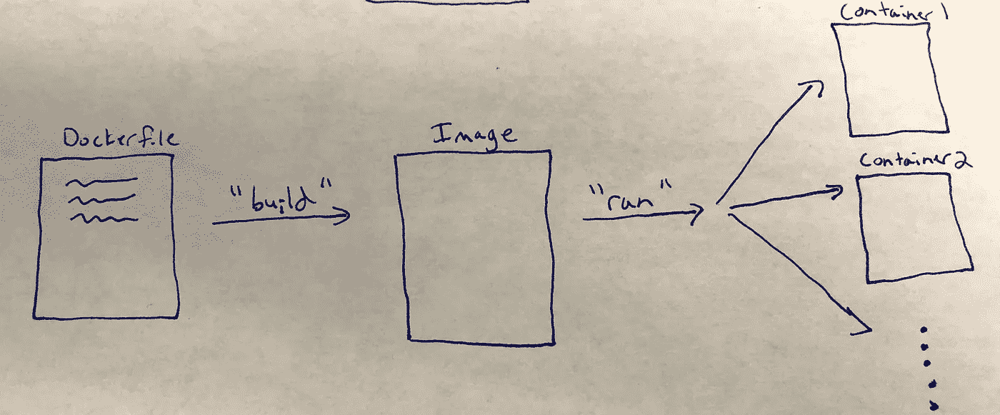

# 挖掘数据科学工具:Docker

> 原文：<https://towardsdatascience.com/digging-into-data-science-tools-docker-bbb9f3579c87?source=collection_archive---------17----------------------->


Photo by [Kyle Ryan](https://unsplash.com/photos/pSyfecRCBQA?utm_source=unsplash&utm_medium=referral&utm_content=creditCopyText) on [Unsplash](https://unsplash.com/search/photos/container?utm_source=unsplash&utm_medium=referral&utm_content=creditCopyText)

Docker 是一个创建和管理“容器”的工具，容器就像一个小虚拟机，你可以在里面运行你的代码。Docker 容器就像一个小型的 Linux 操作系统，预装了运行 web 应用程序、机器学习模型、脚本或您编写的任何其他代码所需的一切。

Docker 容器就像是一个真正的轻量级版本的虚拟机。它们使用的计算机资源比虚拟机少得多，并且可以在几秒钟而不是几分钟内启动。(性能提高的原因是 Docker 容器共享主机的内核，而虚拟机运行单独的操作系统，每个虚拟机都有单独的内核。)

Aly Sivji 对码头集装箱和海运集装箱进行了很好的比较。海运集装箱通过标准化设计提高了物流效率:它们都以相同的方式运作，我们有标准化的基础设施来处理它们，因此无论运输类型(卡车、火车或船只)和物流公司如何(所有人都知道海运集装箱并根据其标准制作模具)，您都可以运输它们。以类似的方式，Docker 提供了一个标准化的软件容器，您可以将它传递到不同的环境中，并相信它们会像您期望的那样运行。

# Docker 如何工作的简要概述

为了让您对 Docker 的工作原理有一个真正高层次的了解，首先让我们定义三个与 Docker 相关的术语——“Docker file”、“Image”和“Container”:

*   ***Dockerfile*** :你写的一个文本文件，用来构建你需要的 Docker“映像”(见下面映像的定义)。您可以将 docker 文件想象成 Linux 命令行的包装器:在命令行上用来设置 Linux 系统的命令都可以放在 docker 文件中。“构建”Dockerfile 文件会产生一个映像，该映像表示处于您所需要的确切状态的 Linux 机器。你可以在 [Dockerfile 参考页面](https://docs.docker.com/engine/reference/builder/)了解语法和命令的所有细节。为了了解 docker 文件的样子，这里有一个 docker 文件，您可以使用它来创建一个包含 Ubuntu 15.04 Linux 发行版的映像，将所有文件从您的应用程序复制到。映像中的/app，在映像的 Linux 命令行中运行/app 上的 make 命令，最后运行/app/app.py 中定义的 python 文件:

```
FROM ubuntu:15.04 
COPY . /app 
RUN make /app 
CMD python /app/app.py
```

*   ***图像*** :您希望容器运行的环境的“快照”。这些映像包括运行代码所需的所有内容，例如代码依赖项(例如 python venv 或 conda 环境)和系统依赖项(例如服务器、数据库)。您从 docker 文件“构建”图像，docker 文件定义了图像应该包含的所有内容。然后使用这些图像创建容器。
*   ***容器*** :图像的“实例”，类似于面向对象编程中对象是类的实例。您从图像创建(或使用 Docker 语言“运行”)容器。您可以将容器视为运行由您的映像定义的“虚拟机”。

总结这三个主要概念:您编写一个 Dockerfile 来“构建”您需要的映像，它代表您的系统在某个时间点的快照。从这个映像中，您可以使用该映像“运行”一个或多个容器。



下面是一些需要了解的其他有用术语:

*   ***卷*** :“共享文件夹”让 docker 容器看到你主机上的文件夹(对开发非常有用，所以你的容器会随着你的代码变化自动更新)。卷还允许一个 docker 容器看到另一个容器中的数据。卷可以是“持久的”(容器停止后卷继续存在)或“短暂的”(容器一停止，卷就消失)。
*   ***容器编排*** :当你第一次开始使用 Docker 时，你可能一次只能运行一个容器。但是，您很快就会发现您想要多个容器，每个容器使用不同的映像和不同的配置运行。例如，Docker 的一个常见用途是将应用程序部署为“微服务”，其中每个 Docker 容器代表一个单独的微服务，它与您的其他微服务交互以交付您的应用程序。由于手动管理多个容器会变得非常笨拙，因此有一些“容器编排”工具可以自动执行一些任务，例如启动所有容器、自动重启出现故障的容器、将容器连接在一起以便它们可以互相看到，以及在多台计算机上分发容器。这方面的工具示例包括 [docker-compose](https://docs.docker.com/compose/) 和 [Kubernetes](https://kubernetes.io/) 。
*   ***Docker 守护进程/ Docker 客户端***:Docker 守护进程必须运行在您想要运行容器的机器上(可能在您的本地或远程机器上)。Docker 客户端是与 Docker 交互的前端命令行接口，连接到 Docker 守护进程，并告诉它做什么。通过 Docker 客户机，您可以运行命令从 Docker 文件构建映像，从映像创建容器，以及执行其他与 Docker 相关的任务。

# 为什么 Docker 对数据科学家有用？

你可能会想"*哦，天哪，这是我在数百万我必须掌握的其他事情之外的又一个学习工具吗？值得我花时间去学吗？这项技术几年后会存在吗？*

我认为答案是，是的，这绝对是一个值得您添加到您的数据科学工具箱中的工具。

为了帮助说明，这里列出了使用 Docker 作为数据科学家的原因，其中许多原因在 [Michael D'agostino 的“Docker for Data Scientists”讲座](https://www.youtube.com/watch?v=GOW6yQpxOIg)以及来自 Arthur Ulfeldt 的【Lynda 课程中进行了讨论:

*   ***创建 100%可再现的数据分析*** :由于方法和法律原因，再现性越来越被认为是至关重要的。当你在做分析时，你希望别人能够验证你的工作。Jupyter 笔记本和 Python 虚拟环境是一个很大的帮助，但是如果你有关键的系统依赖，你就没那么幸运了。Docker 确保您每次都以完全相同的方式运行代码，使用相同的操作系统和系统库。
*   ***文档*** :如上所述，构建 docker 容器的基础是一个“Dockerfile”，它是对需要存在于您的映像/容器中的所有东西的逐行描述。阅读这个文件可以让您(以及任何需要部署您的代码的人)更好地理解容器上到底在运行什么。
*   ***隔离*** :使用 Docker 有助于确保您的工具不会相互冲突。通过在单独的容器中运行它们，您将知道您可以运行 Python 2、Python 3 和 R，并且这些软件不会相互干扰。
*   ***获得 DevOps 能力*** :用米开朗基罗·达戈斯蒂诺的话说，“Docker 使 DevOps 民主化”，因为它为过去只有系统/ DevOps 专家才能获得的人提供了机会:
*   如果你不感兴趣，Docker 可以让你更容易地“回避”DevOps /系统管理，因为有人可以为你创建一个容器，你所要做的就是运行它。类似地，如果您喜欢使用 Docker，您可以创建一个容器，让不太懂技术的同事在他们需要的环境中轻松运行。
*   Docker 提供了从现有容器开始构建 docker 容器的能力。你可以在 [DockerHub](https://hub.docker.com/) 上找到许多这样的文件，它拥有数千个预先构建的 DockerHub 文件和图像。因此，如果您正在运行一个众所周知的应用程序(或者甚至是模糊的应用程序)，通常已经有一个 docker 文件可以让您快速部署您的项目。这包括许多工具的“官方”Docker 库，例如 [ubuntu](https://hub.docker.com/_/ubuntu/) 、 [postgres](https://hub.docker.com/_/postgres/) 、 [nginx](https://hub.docker.com/_/nginx/) 、 [wordpress](https://hub.docker.com/_/wordpress/) 、 [python](https://hub.docker.com/_/python/) 等等。
*   使用 Docker 有助于您与 IT / DevOps 同事合作，因为您可以在一个容器中完成数据科学工作，并简单地将其作为一个黑盒传递给 DevOps，他们无需了解您模型的所有信息即可运行。

以下是一些与数据科学相关的应用示例，您可以尝试使用 Docker:

*   ***创建超便携、定制的开发工作流:*** 在 Docker 文件中构建个人开发环境，这样你就可以在任何安装了 Docker 的机器上立即访问你的工作流。无论你在哪里，无论你在什么机器上，只需加载图像，你的整个工作环境就在那里:你工作所需的一切，以及你想如何工作。
*   ***创建开发、测试、试运行和生产环境*** :请放心，您的代码将按您的预期运行，并能够创建与生产环境相同的试运行环境，这样您就知道当您进入生产环境时，一切都会好的。
*   ***在任何机器上复制你的 Jupyter 笔记本*** :创建一个容器，运行你的 Jupyter 笔记本数据分析所需的一切，这样你就可以把它传给其他研究人员/同事，知道它会在他们的机器上运行。尽管 Jupyter 笔记本在进行分析方面很棒，但它们往往会受到“它在我的机器上工作”问题的困扰，Docker 可以解决这个问题。

要获得更多灵感，请查看 Civis Analytics 米开朗基罗·达戈斯蒂诺描述他们使用的 Docker 容器(从 [18:08](https://youtu.be/GOW6yQpxOIg?t=1087) 标记开始)。这包括专门用于调查处理的容器、R shiny 应用程序和其他仪表板、贝叶斯时间序列建模和投票聚合，以及通用 R/Python 包，其中包含员工所需的所有通用包。

# 更多资源

如果你真的想开始使用 Docker，我强烈推荐由 Arthur Ulfeldt 教授的 Lynda 课程[学习 Docker](https://www.lynda.com/Docker-tutorials/Learning-Docker-REVISION-Q3-2018/721901-2.html) 作为起点。解释得很好，也很简洁(总共只有 3 个小时左右的视频)。我从这个课程中创建了一套 Anki 抽认卡，你可以在这里访问。我还推荐奈杰尔·波尔顿的《Docker Deep Dive》这本书。我还根据这本书制作了 Anki 抽认卡，你可以在这里访问。

这里有一些其他有用的资源，你可能想看看:

*   [数据科学家 Docker，Strata 2016，米开朗基罗·达戈斯蒂诺](https://www.youtube.com/watch?v=GOW6yQpxOIg) (YouTube 视频)
*   [使用容器的数据科学工作流，作者 Aly Sivji](https://www.youtube.com/watch?v=oO8n3y23b6M) (YouTube 视频)
*   [为期 3 小时的数据科学家研讨会](https://www.youtube.com/watch?v=jbb1dbFaovg) (YouTube 视频)

*原载于 2018 年 10 月 1 日*[*www.marknagelberg.com*](http://www.marknagelberg.com/digging-into-data-science-tools-docker/)T22。要访问我共享的 Anki deck 和 Roam Research notes 知识库，以及关于间隔重复和提高学习效率的技巧和想法的定期更新， [*加入“下载马克的大脑”。*](http://downloadmarksbrain.marknagelberg.com/auth)