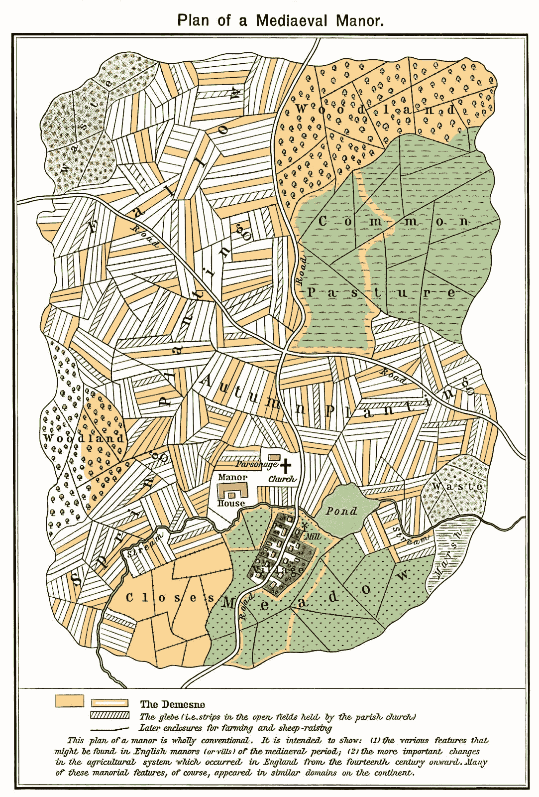
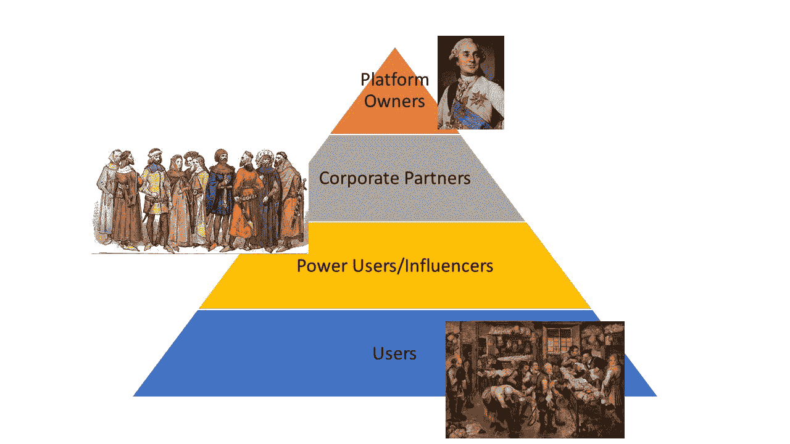

# 数字封建主义

> 原文：<https://towardsdatascience.com/digital-feudalism-b9858f7f9be5?source=collection_archive---------2----------------------->

数据生态系统如何变得中世纪化

Queen Mary’s Psalter (Ms. Royal 2\. B. VII), fol. 78v. Downloaded from [Wikipedia](https://commons.wikimedia.org/wiki/File:Reeve_and_Serfs.jpg).

不幸的是，我们的现代数字生态系统正在迅速组织成一个与我们现有的权力结构和自由并行的封建权力结构。在封建主义的普遍观念中，相对较小的食利阶级(领主)利用各种微妙和公开的政治和经济制度从生产阶级(农民)的日常生活中榨取价值，而生产阶级通常对这一制度没有什么选择或影响。用户参与平台，通常对他们提交的数据只有最起码的了解，然后这些数据被用来专门为平台所有者创造价值。但是，我们当前的数字生态系统和封建社会之间的相似之处远比粗略描述的要多得多，共同点如此惊人，以至于可以说数字生态系统，特别是社交媒体生态系统，构成了事实上的封建社会。

**中世纪时期**

在我们开始之前，重要的是简要讨论一下实际的历史封建主义的本质。还没完，[“骑士、领主和女士们，万岁！”](https://en.wikipedia.org/wiki/Chivalry)正如我们从大众媒体中可能想到的。这就是广义的骑士精神。更准确地说，肯定有骑士、领主和贵妇(或者任何一个特定社会用来称呼武士和贵族阶级的术语)，但他们是人口中非常小的一部分，其中大部分是农奴(或者地主用来描述[【乌合之众】](https://en.wikipedia.org/wiki/Hoi_polloi)的任何术语)。为了澄清定义，骑士精神主要包括我们喜欢在电影和书籍中看到的封建主义的所有“有趣”部分。封建主义的另一半(强迫劳动和欠贵族的农民群众)通常被称为庄园制。

正如人们对中世纪政治制度的预期，大多数封建社会主要以农业为中心。用来管理农业生产和农村生活的封建制度一般被称为庄园制。在庄园制中，领主控制着一定面积的土地，这些土地通常由更有权势的领主或国王授予他。农民居住在这片土地上，他们通常在政治上和经济上受制于领主和他的各种家庭成员和家臣的集合。更一般地说，农民可以细分为自由民，他们通常要么拥有自己的土地，要么支付某种货币租金；农奴，作为一种不自由的劳动，他们有义务为他们的主人工作土地；和奴隶，他们被视为财产，几乎没有法律权利。尽管关于从奴隶制到农奴制的转变是欧洲不自由劳动的主要形式仍有争议，但人们普遍认为，随着奴隶制在欧洲变得不那么普遍，农奴制取而代之。

在许多情况下，农奴确实拥有基本的权利，如牲畜的共同牧场和个人使用的小花园，所以他们在技术上不是奴隶。然而，农奴也被要求耕种地主的大片土地，作为一种强迫劳动，或者在更资本主义的封建制度下，支付(通常是过高的)税收。为了生活和生产足够的食物来养活自己，农奴们不得不向领主的生产要求低头。同样，由于农奴的义务与他们占有的土地直接相关，任何土地交换都意味着农奴的义务也随之转移。在许多情况下，农奴仅仅被视为土地本身的生产要素，就像一棵果树或一群鹿。

普通庄园的布局。芥末色的区域归领主所有(领地)，阴影部分归教会所有(土地)。威廉·r·谢泼德，《历史地图集》，纽约，亨利·霍尔特公司，1923 年。来自[维基百科](https://commons.wikimedia.org/wiki/File:Plan_mediaeval_manor.jpg)。

农民，无论是农奴还是其他人，也经常被要求使用领主庄园提供的收费服务。例如，许多庄园都有谷物碾磨机，农民可以用这些碾磨机把他们的谷物产品磨成面粉，但是这些碾磨机通常也需要付费或者交出部分生产的面粉。在某种程度上，这些磨坊代表了一种地方垄断，农民的唯一选择是使用领主的磨坊并支付费用，或者根本不使用磨坊。后一种“选择”虽然在某些情况下在理论上是可能的，但在功能上是不可能的，因为面粉是少数几种容易储存的卡路里来源之一。

从司法上来说，庄园主通常负责他所有的臣民。也有一些例外(正如人们可能会从庄园制这样一个多样而悠久的制度中预料到的)，中世纪封建主义的司法模式略有不同，但总的来说，领主创建并维持一个或一系列法院，裁决轻微犯罪和民事纠纷。这些封建法庭的存在也是为了执行强加给农民和领主土地的其他佃农的任何条款和条件。在领主的土地上，通常有不同的规则和条例来管理不同类型的占有者，法院通常管理这些不同的义务以及出现的任何纠纷。当然，也有更高一级的法院负责更严重的罪行，它们通常由更高层次的贵族控制。

与大多数强迫劳动制度一样，宣誓义务并成为农奴比逃离农民要容易得多。一般来说，大多数农奴被锁定在他们的社会阶层。摆脱农奴制的方法有一些，但它们因社会甚至个体领主而异。相反，不幸贫穷或遭受灾难的人往往不得不服从封建义务以求生存。这通常包括某种仪式，将个人与领主和他的庄园捆绑在一起，并可能收取某种费用来获得住所。正如所料，农奴通常缺乏机制或资源来履行他们对庄园主的义务，因此他们的家人永远被束缚在土地和庄园中，成为不自由的劳动力。

大多数庄园还居住着一定数量的自由民，他们没有义务通过强迫劳动来耕种土地，但却缴纳税款、租金和其他费用。这些自由民可以被认为是今天所谓的“下层中产阶级”的早期版本，但中世纪社会的各个阶层是如此的不稳定和复杂，以至于很难进行任何直接的比较。认为自由民的一个简单方法是，他们足够富裕，可以租赁或购买土地，但又没有富裕到让农奴为他们工作。因此，就他们从事的业务而言，他们有更多的自由，但他们仍然必须做自己的工作。这是一种过于简单化的说法，关于每个封建社会中自由和自由民的本质，已经有整本书问世，但它给出了一个关于被认为是自由民的人的体面概念。

一些读者可能已经对这场讨论的走向有了一些想法，但明确地将当前的数字生态系统与庄园制进行对比是很重要的。这场讨论将主要围绕社交媒体公司展开，这些公司是现代经济中最大、最成熟的数据技术公司。此外，更传统的技术公司经常试图在他们的许多数据实践中模仿社交媒体公司，所以这些也将受到审查。

**Classes of Digital Feudalism.** *Lords of the manor:* companies who own and manage platforms. Major gentry: companies with business models based on the manor platforms. Minor gentry: “influencers” who drive users to spend more time on the site. Serfs: people who submit to data collection for the right to exist in digital space

**农奴——用户**

现代社交媒体的权力结构和周围的数据科学生态系统很容易让人联想到封建社会和经济结构。除了不生产作物和牲畜，这个系统的农奴在日常生活中生产和交出数据，这个系统的主人是科技公司的高管，他们的整个基础设施都建立在收集和利用用户数据的基础上。

在我们更进一步之前，有必要解决社交媒体的“自愿参与”或同意论点。任何讨论数据科学和社交媒体生态系统公平性的人几乎不可避免地会遇到这样的论点，即参与社交媒体是自愿的。虽然这看起来像是一个很好的标准，但作为现代数字数据的范例，[同意被打破并且通常无效。同意的现代方法(例如，“我们跟踪您，点击此处向我们提交您的数据，我们将对其做任何我们想做的事情，直到时间结束。”)可以看作是类似于中世纪农民“心甘情愿”地强迫自己成为农奴的方式。虽然现代社会的情况没有中世纪社会那么残酷，但在中世纪社会，几乎所有的个人和职业交流都是数字化的，不参与就是自愿排斥。在当代社会，不参与也几乎是不可能的，因为实体商店让位于在线订单，国际电话之间的任何互动都需要高昂的价格或免费的数字替代品，派对是有计划的，邀请是通过电子邮件和脸书活动发出的，在线求职申请成为唯一的求职申请。](https://hbr.org/2018/09/stop-thinking-about-consent-it-isnt-possible-and-it-isnt-right)

这种表述甚至没有提到这样一个事实，即对于许多残疾人和不同能力的人来说，数字选项是唯一的选择，这使其更接近于“屈服或死亡”的境地。互联网给了许多以前孤立或依赖照顾者的人前所未有的自由。但是有了现代互联网，警告总是你点的任何东西或说的任何话都会被某人跟踪，不管它对你的生活有多必要。

如果我们接受不参与是错误的，或者至少是极其沉重的选择，那么参与这个系统就是存在的主要状态。在参与方面，中世纪庄园制和数字封建制之间的一个关键区别是，没有人必须只参与一个平台。相反，每个人都对不同的数字庄园负有义务，每一个都需要不同的数据来交换使用。对于那些关心隐私的人来说，问题就变成了他们愿意向多少个领主交出多少数据，以及他们的个人和职业生活是否能适应这些决定。

随着 Office 365 等基于云的服务大举入侵企业，这一决定变得毫无意义。传统上，你在工作中的时间不是你自己的，你的雇主一直知道你的大致时间表、产出能力和工作风格。但现在另一家第三方公司也知道所有这些事情，他们可以很容易地将它们与从其他公司收集的数据进行匹配。你的时间和工作成果可能属于你的雇主，但现在他们也为第二家公司工作，第二家公司利用他们做不属于你雇主的事情。基于云的服务对商业环境的入侵是数字空间的企业[中介](https://en.wikipedia.org/wiki/Mediatisation)，因为以前的主权数字环境，如本地企业服务器，将数据存储和使用的义务和权利让给了第三方。在许多情况下，你的雇主在选择放弃他们的数据方面可能和你的情况完全一样。对于企业“云服务”客户来说，一个有用的概念框架是作为骑士或小领主，由平台的领主授予空间和访问权，并负责他们自己的农奴领地。

参与数字封建主义的社会群体之间的一个关键差异是坚持认为个人数据在功能上毫无价值，但总数据足以推动全球最大公司的估值。这种差异(或者，如果你觉得慈善的话，“规模效应”)是数字封建主义的核心，这是传统农奴不必解决的问题。农奴很容易意识到交给庄园主的谷物或其他作物的价值，而任何领主都很难合理地辩称食物毫无价值，尤其是在饥荒时期。许多革命是由干旱、价格控制和其他限制粮食供应的事件引发的，这是有原因的。饥饿是一种强大的动力，而隐私却不是。

数据收集公司利用了这些盲点，坚持认为一个人的数据除了汇总之外没有任何有意义的价值。你也可以说，在脸书 6000 多亿美元的估值中，一块钱与总体价值相比毫无价值，那么为什么不指望他们将这些“毫无价值”的钱交给创造其价值的人呢？当然，这个问题是故意有点迟钝，但它说明了数字庄园的领主和他们的用户之间的根本权力不平衡。他们决定你的数据的价值，但他们也坚持认为他们为你提供的任何好处都是同等价值的(减去他们提取的任何利润)。在数字庄园制中，平台所有者非常不愿意估计单个人数据的价值，而他们却高兴地用天文数字来评估他们的总数据。

Polish Gentry 1333–1434, Jan Matejko. From [Wikimedia Commons](https://commons.wikimedia.org/wiki/File:Polish_gentry_1333-1434.PNG).

**贵族——企业合作伙伴和电力用户**

这些权力失衡进一步加剧的事实是，数字法律体系与中世纪的封建制度也有许多相似之处。数字庄园的“低级法院”是他们选择使用的任何报告系统和工作人员，他们在其平台上监督的犯罪已经有机增长。骚扰是一种严重的合法犯罪，但对数字骚扰事件的大部分调查和惩罚权力都被交给了平台所有者。你当然可以向警方报案，但如果有人骚扰来自另一个州或国家的人，受害者除了特定平台的领主建立的那些系统之外几乎没有任何追索权。版权投诉通常遵循类似的模式，增加了一层极其严格的法律结构，要求平台所有者实施如此激进的政策，以至于数字千年版权法的撤销请求本身可能成为骚扰的工具。

正如所料，这些系统通常完全不足以捍卫“农奴”的权利，并倾向于支持数字封建结构中“同盟阶级”的权利。媒体公司花大价钱在社交媒体平台上公开或秘密地做广告，所以如果他们抱怨有人在使用他们的知识产权，那么平台肯定会扑上去。但是如果一个公司未经同意窃取了你的艺术或音乐怎么办？好吧，你最好有自己的社交媒体渠道和一大群追随者，否则他们可能会在几周后找到时间，那时他们的大客户已经获得了丰厚的利润。

在使用社交媒体平台及其数据来实现自身战略的大公司之间，隐藏着一群奇怪的“小绅士”，或“影响者”。这些人从社交媒体中获得各种津贴或收入。他们很少是媒体平台的实际员工，但他们确实通过吸引更多用户进入平台而获得报酬(通常通过“合作伙伴计划”)，从而增强平台主的数据流。他们当然对托管他们的平台负有义务，但平台没有对等的义务。如果最具诱导性的内容能为他们赢得大量用户，许多平台会欣然托管这些内容，但一旦有人开始讨论抵制或广告商威胁要离开，他们就会放弃这些内容。

最成功的数字精英甚至有可能获得自己的子平台，围绕核心受众建立的网站网络，或者作为平台老板奖励的利润丰厚的全职工作。这些子平台通常用于提供一种自治感，而没有任何数据收集和利用的实际自由。通常，这涉及到额外的好处，如围绕一个“品牌”创建多个账户的能力，而大多数个人用户只能使用他们的真实身份，如果多个账户甚至是一种选择的话。许多平台明确禁止多个账户，当然，除非你在他们的平台上经营业务。当你有一个企业(或声称有一个企业)时，你对来自平台的数据的访问也增加了。但是你从来没有被给予对所有数据的完全访问权，甚至是你的子平台带来的数据，因为你的平台的主人当然“严重关注”他们用户的数据隐私。冷嘲热讽地翻译一下，这意味着亚平台所有者根本没有足够的权力或财富来保证完全的访问。

Portrait of Louis XVI, King of France and Navarre (1754–1793). Joseph Duplessis. From [Wikipedia](https://commons.wikimedia.org/wiki/File:Duplessis_-_Louis_XVI_of_France,_oval,_Versailles.jpg).

**领主和国王——平台所有者**

最后，我们来到了被广泛讨论的数字庄园主。这些人拥有并控制着巨大的平台和它们产生的所有数据。从公司实体或组织结构的角度来讨论所有权往往很有诱惑力，但这忽略了对这一群体的核心理解:他们是(大多数是白人，大多数是男性)人。他们决定自己平台的隐私和销售政策。他们从用户生成的数据中获得了惊人的收入。他们同意任何获取更多数据的新计划，或者更积极地维护自己作为数字领域主权统治者的权利。

理解数字庄园制所建立的权力结构的本质是很重要的，假设平台所有者普遍都是恶意或仁慈的是错误的。许多人试图成为好人，并可能认为自己是好人。但是他们领导公司，公司的唯一目标是创造收入。因为用户数据是他们提供的核心价值，数字领主永远被迫侵犯用户隐私并加强数据收集工作，以免他们的权力被更愿意最大限度地收集数据的人篡夺。平台所有者永远走在平衡提取数据的新方法与用户放弃其剥削性环境的风险的边缘。这与庄园主被期望向他们的赞助人或国王提供什一税、税收和征兵税，同时仍然确保他们自己的庄园繁荣昌盛是一样的。但在数字庄园制中，最终的权力不是一个国家的统治者，而是金融市场的经济力量。具有讽刺意味的是，从用户身上获取价值的组织反过来又受制于集体投资者群体，尽管它们的大多数用户永远不会富裕到拥有足够的所有权来捍卫自己的权利。

为了使这些权力失衡合法化，庄园制度几乎总是回归到某种契约忠诚机制。历史上，农奴服从或世世代代服从于由他们的领主制定的合同或协议。在现代社会，数字庄园契约是没完没了的用户协议，其中许多包含如此多的条款和剥削性条款，以至于在许多司法管辖区无法执行。用户协议很少(如果有的话)用简单的术语表述，它们通常很长，以至于需要多天的阅读，并且可能需要法律学位才能完全理解。因此，用户协议代表了另一种象征用户选择的手段。

数据共享设置是数据收集的另一个工具。表面上，这些设置允许用户手动控制他们与他人共享的数据。然而，这仅在某些情况下是正确的，并且这些设置的维护通常需要持续的警惕。在许多情况下，在更新或修改期间，用户被默认为最宽松的数据共享设置，他们必须在每次更新后手动重置他们的首选项。这些重置中最邪恶的假设是反向同意:如果您的首选项默认为共享某个特定的数据，那么平台会立即允许共享该数据的所有历史存档。这样，“隐私控制”不会阻止存储；他们只是限制这些信息的共享。

用户甚至不总是有这些虚假的同意选择。随着数据科学的发展，员工量化的新领域也在发展。不幸的是，量化工人运动只是简单的泰勒主义，表面上涂着薄薄的技术外衣，被一个过去没有劳工保护的社会所接受。但是，进行量化的服务提供商几乎总是寻找新合作伙伴的第三方数据平台，以使其数据收集策略具有强制性。制定这些政策的不再是单个雇主，而是多个有实力的雇主，甚至是政府机构，它们相互合作，最大限度地量化员工的表现。自然，这些数字企业的农奴总是被称为“用户”或“参与者”或其他一些暗示可以选择退出的术语，而他们实际上更像是主体，他们的选择是将数据交给第三方或失去工作。可以预见的是，受到这些强制性数据提取计划影响的工人可以分为[成功击退这些入侵的工会工人](https://www.wvgazettemail.com/news/health/peia-cancels-go-wellness-plan-contract/article_e70d8f32-6fe5-52a0-8e1a-d73582645dfe.html)和[非工会工人，他们看到自己的生活和工作质量急剧下降，因为他们拼命努力保住自己的工作，而业绩基准却在飙升](https://www.businessinsider.com/amazon-warehouse-workers-share-their-horror-stories-2018-4)。

因此，我们不禁要问，什么样的事件会促使对用户/消费者隐私进行更严格的监管。你可能会为大规模的安全漏洞或泄密这样的事情进行逻辑论证，但这已经是一个日常问题，似乎没有公司特别担心它们。他们只是在风险管理计算中加入调查成本，然后照常进行。你打算怎么做，因为你的身份在 Equifax 事件中被盗而停止使用银行吗？你可能认为数据的安全性极其重要，但对一家数据公司来说，成功销售和安全漏洞之间的唯一区别是他们从你的数据中获得多少报酬。

**前进的道路**

很明显，庄园制与平等主义和自由社会是不相容的。但是，数字庄园制的趋势还相对年轻，我们有机会在它变得根深蒂固之前逆转它。越是建立的庄园系统，它们就变得越破碎，如果它们继续下去，用户可能会发现自己成为数字旧制度的主体。在不直接攻击数据科学的重大创新和机遇的情况下，有许多选项可以解决数字庄园制的问题。如果用户正在为公司创造价值，那么他们应该考虑加入工会。传统工会的大多数障碍与就业状况有关，但平台所有者非常小心地确保用户不以任何方式被视为员工。虽然各种团体试图进行社交媒体抵制或封锁，但他们往往组织不力或临时行动。持续稳定的用户联盟将提供重要的杠杆作用，以打破最恶劣的数字庄园剥削，甚至在他们开始之前阻止他们。他们还可以为受到强制性第三方数据收集的员工提供杠杆作用，并可以有意义地游说政治系统进行监管。

平台所有者和用户之间的任何持续平等都需要强有力的隐私法律和政策，这些法律和政策只能由政治机构有效制定和执行。在某些情况下(比如中国)，[平台所有者和政治决策者紧密结盟，如果不是同一批人的话，这代表了一种极其危险的范式](http://www.bbc.co.uk/newsbeat/article/41398423/social-media-and-censorship-in-china-how-is-it-different-to-the-west)。但在许多其他情况下，数据庄园的主人不同于政治机器，数字庄园主义的历史是一部政治不作为的历史。许多政治系统，特别是美国的政治系统，在技术知识方面存在重大差距，正如 2016 年选举干预丑闻后[马克·扎克伯格在国会](https://www.youtube.com/watch?v=cyJosQBtzsw)的证词所证明的那样。这使得政客们更难有效地捍卫其选民的隐私和权利，即使他们很想这样做。欧盟最近在保护用户隐私方面取得了长足的进步，出台了《通用数据保护条例》。

这种以用户为中心的政治努力的好处是，它们对那些它们没有直接保护的用户产生了连锁反应。许多数据公司都是全球性的，他们不可能在每个地区制定不同的保护措施并遵守 GDPR 和其他法规，因此他们经常采用符合最严格法规的一揽子政策。[在欧盟](https://www.bankinfosecurity.com/gdpr-global-impact-on-privacy-a-11526)运营的平台中出现的新通知和隐私选项中已经可以看出这一点，即使用户和公司办公室不在该管辖区。随着这些法律和政策在全球范围内激增，公司最终可能会在全面实施各种规则时变得更具选择性，但就目前而言，这些都是出色的工具，不仅可以保护一个国家的公民，还可以保护数字共享空间的所有用户。

因为这是至关重要的。互联网作为全球知识共享资源的承诺已经被分割成多个领地，而居住在这些共享资源中的用户却没有提出任何意见。如果我们现在就能改变这种趋势，在它变得根深蒂固之前，我们不仅可以提高隐私，还可以提高与数字技术互动的每个人的生活质量。