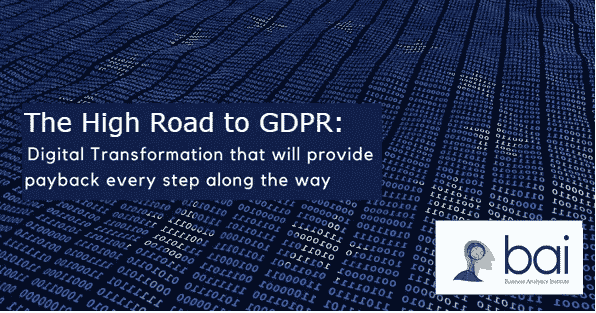
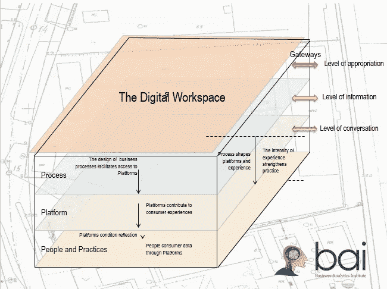
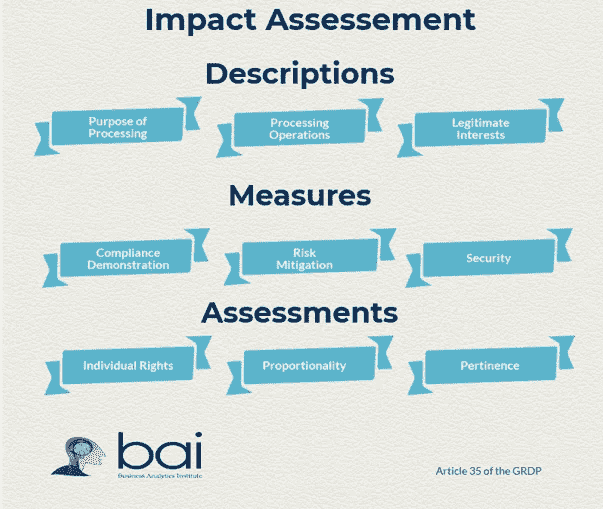
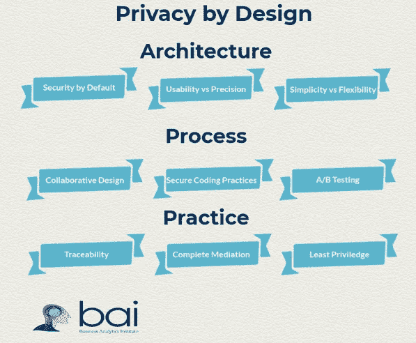
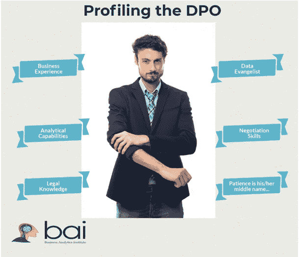

# 数字化转型开启通往 GDPR 的大道

> 原文：<https://towardsdatascience.com/digital-transformation-opens-up-the-high-road-to-gdpr-8a1b11788e19?source=collection_archive---------7----------------------->

参加我们上次关于“GDPR:将义务转化为机遇”的早餐会的小组提出了一个具体的挑战。总经理、首席信息官、营销总监和数据科学家可以一起讨论哪些主题？我们建议将这一新的欧洲数据保护指令作为一项设计挑战:*GDPR 如何为提高贵组织数字资产的价值提供机会？*让我在这里简单地展开这个论点。

在我们关于 GDPR 的大师班中，我们建议您将精力集中在 GDPR 合规性上，而不是放在法律保护上，而是放在组织流程、平台、人员和实践如何塑造组织数据的价值上。组织流程决定了您的组织如何使用数据为员工和客户服务。平台代表您的组织与其员工和客户一起工作的工具。人们指的是公司的利益相关者如何看待他们与组织的关系的心态。最后，实践唤起了不同的组织利益相关者消耗组织资源的方式。

*Processes, platforms, people, and practices — the 4Ps of Digital transformation*

您在 GDPR 合规方面的工作如何加强您的业务流程？业务流程利用数据来丰富涉众与组织合作的经验。数据的价值与其在建立组织与其不同的内部和外部利益相关者之间的信任和信心的场景中的使用密切相关。新 DPIA ( *数据保护影响评估*)的要求需要关注组织试图实现的目标。

物联网技术的发展正在产生大量关于人员、交易和流程的数据流。理想情况下，这些平台提供了多种机会，使您的组织与其内部和外部客户之间的互动货币化。它们不仅揭示了个人数据，还揭示了个人与其社会和物理环境的二次关系的质量。IOT 提出了个人隐私和安全的具体挑战:同意、可靠性和违反侵权的风险需要通过*设计隐私*和*默认安全*的概念来解决，以培养员工和客户的信任和参与。

GDPR 的最终目标是影响人们关于如何使用数据与员工和客户互动、提议新产品和服务以及监控绩效的心态。数字化转型不是以兆字节来衡量的，而是以塑造关于数据驱动决策的管理思维来衡量的。新法规的范围和义务超越了*数据保护官*的角色，涵盖了整个组织的信息工作者。未来对*数据保护机构*的检查将集中在管理层的意图和实践上。

最重要的是，与数据处理的总投资相比，可衡量的管理实践为组织的数字战略价值提供了更好的指标。组织数据的价值取决于数据如何转化为行动号召的使用场景。数据不仅仅是制造和/或服务过程的副产品，它还反映了人类决策过程中的步骤。设计客户(内部和外部)体验，而不是围绕数据的信息流程，是预测并最终影响利益相关者行为的关键。

组织如何将 GDPR 的“障碍”转化为改善其数字资产的新机遇？让我们总结一下我们的论点。您对 GDPR 的实施是一个绝佳的机会，可以将重点放在定义您的组织如何使用数据来倾听、构思、创新和评估其产品、服务和体验的流程和网络上。设计的隐私和默认的安全为您的组织提供了试验物联网部署的机会，并将资源集中在能够带来切实好处的地方。数据保护官的工作不是坐在办公桌后，而是站在他的同事和客户面前，宣传您组织的数字化转型将如何有助于信任和价值。实现 GDPR 合规的捷径是构建您的数字化转型愿景，回报不在路的尽头，而在沿途的每一次对话中。

*有兴趣掌握设计和实施有效的 GDPR 合规框架的方法吗？* [报名](http://baieurope.com/joingrdp)参加我们在*前往 GDPR* 的新一日大师班。商业分析实践是商业分析学院的核心和灵魂。我们对数字经济、数据驱动的决策、机器学习和视觉通信的关注将使分析为您和您的组织服务。

Lee Schlenker 是商业分析和数字化转型教授，也是 http://baieurope.com 商业分析研究所的负责人。他的 LinkedIn 个人资料可以在 www.linkedin.com/in/leeschlenker.[查看](http://www.linkedin.com/in/leeschlenker.)你可以在 https://twitter.com/DSign4Analytics[的 Twitter 上关注我们](https://twitter.com/DSign4Analytics)