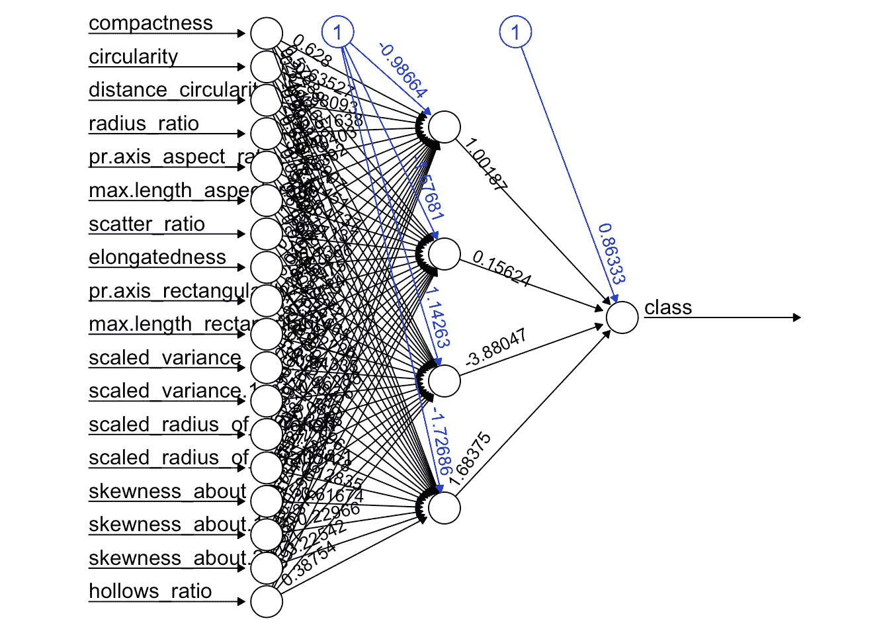
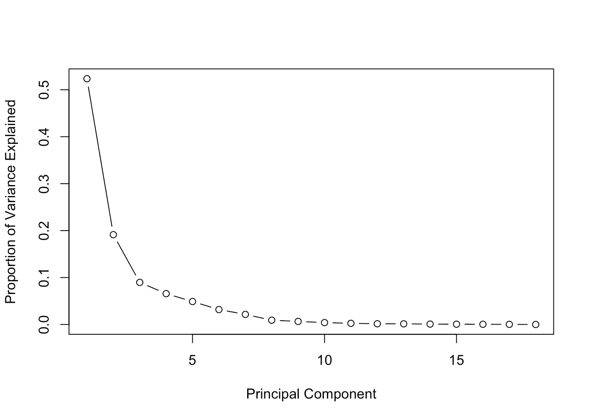
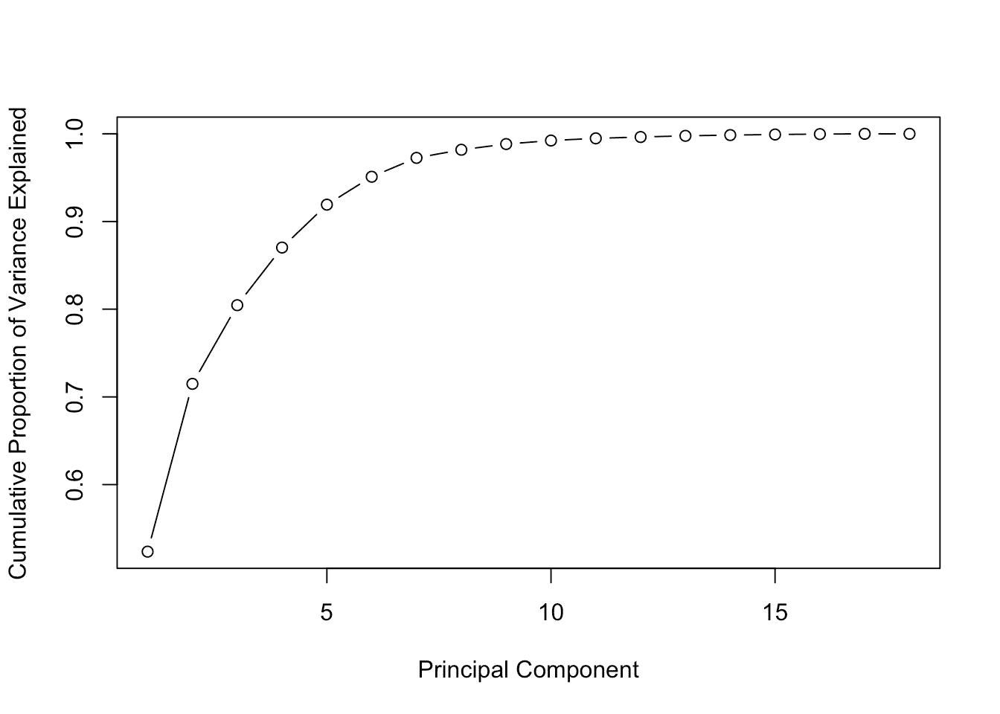
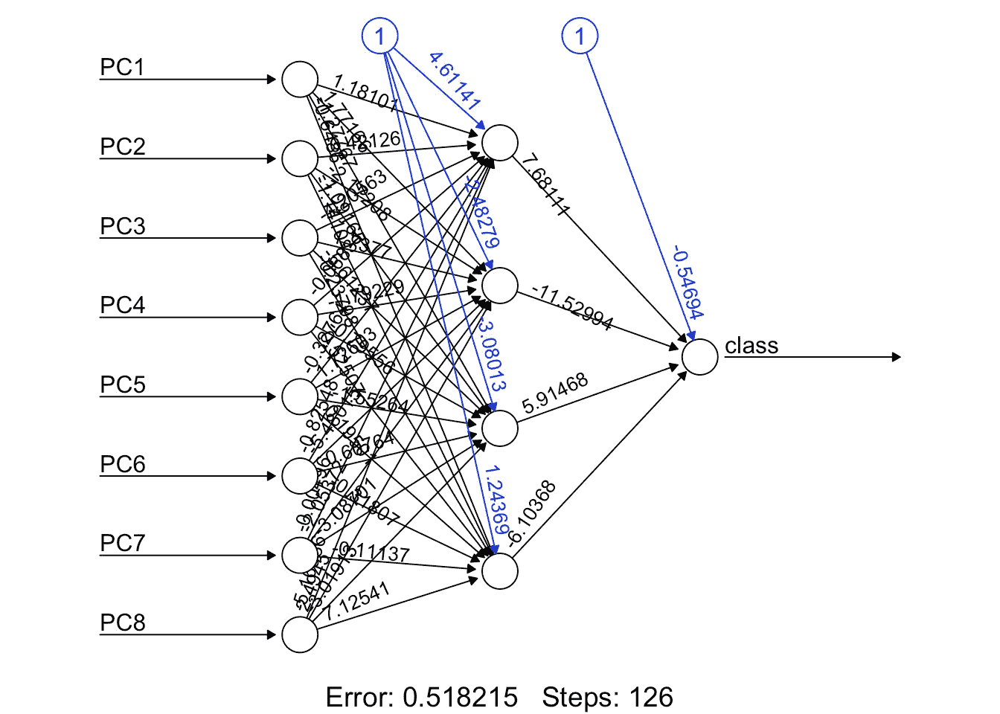

# 降维——主成分分析真的能改善分类结果吗？

> 原文：<https://towardsdatascience.com/dimensionality-reduction-does-pca-really-improve-classification-outcome-6e9ba21f0a32?source=collection_archive---------0----------------------->

# 介绍

我遇到了一些关于降维技术的资源。这个主题无疑是最有趣的主题之一，想到有算法能够通过选择仍然代表整个数据集的最重要的特征来减少特征的数量，真是太好了。作者指出这些算法的优点之一是可以改善分类任务的结果。

在这篇文章中，我将使用主成分分析(PCA)来验证这一说法，以尝试提高神经网络对数据集的分类性能。PCA 真的能改善分类结果吗？我们去看看。

# 降维算法

在开始编码之前，我们先来谈谈降维算法。有两种主要的降维算法:线性判别分析(LDA)和主成分分析(PCA)。这两者之间的基本区别是 LDA 使用类别信息来发现新特征，以便最大化其可分性，而 PCA 使用每个特征的方差来做同样的事情。在这种情况下，LDA 可以被认为是监督算法，而 PCA 是无监督算法。

# 谈论 PCA

PCA 背后的思想是简单地找到一组概括数据的低维轴。为什么我们需要汇总数据呢？让我们考虑一下这个例子:我们有一个由汽车的一组属性组成的数据集。这些属性通过大小、颜色、圆形度、紧凑度、半径、座位数、车门数、行李箱大小等来描述每辆车。然而，这些特征中的许多将测量相关的属性，因此是多余的。所以要去掉这些冗余，用较少的属性来描述每辆车。这正是 PCA 的目标。例如，将车轮数量视为轿车和公共汽车的一个特征，这两个类别中的几乎每个示例都有四个车轮，因此我们可以看出该特征具有较低的方差(在一些罕见的公共汽车中，从四个车轮到六个车轮或更多)，因此该特征将使公共汽车和轿车看起来相同，但它们实际上彼此非常不同。现在，考虑高度作为一个特征，汽车和公共汽车有不同的值，方差从最低的汽车到最高的公共汽车有很大的范围。显然，这些车辆的高度是区分它们的良好属性。回想一下，PCA 不考虑类的信息，它只查看每个特征的方差，因为合理的假设是呈现高方差的特征更可能在类之间具有良好的分割。

通常，人们最终会错误地认为 PCA 从数据集中选择了一些特征，而丢弃了其他特征。该算法实际上是基于旧属性的组合来构建新的属性集。从数学上来说，PCA 执行线性变换，将原始特征集移动到由主分量组成的新空间。这些新特征对我们来说没有任何实际意义，只有代数意义，因此不要认为线性地组合特征，你会发现你从未想过它可能存在的新特征。许多人仍然相信机器学习算法是神奇的，他们将成千上万的输入直接输入到算法中，并希望为他们的业务找到所有的见解和解决方案。别被骗了。数据科学家的工作是使用机器学习算法作为一套工具，而不是魔术棒，通过对数据进行良好的探索性分析来定位对业务的见解。牢记在心。

# 主成分空间是什么样子的？

在新的特征空间中，我们正在寻找一些在不同类别之间有很大差异的属性。正如我在前面的例子中所展示的，一些呈现低方差的属性是没有用的，它会使例子看起来一样。另一方面，主成分分析寻找尽可能跨类显示更多变化的属性来构建主成分空间。该算法使用方差矩阵、协方差矩阵、特征向量和特征值对的概念来执行 PCA，结果提供一组特征向量及其各自的特征值。PCA 的表现如何是下一篇文章的素材。

那么，特征值和特征向量应该怎么处理呢？很简单，特征向量代表主分量空间的新的一组轴，特征值携带每个特征向量的方差的信息。因此，为了降低数据集的维数，我们将选择那些方差较大的特征向量，丢弃那些方差较小的特征向量。通过下面的例子，我们会越来越清楚它到底是如何工作的。

# 让我们最终看到一些代码。

现在，我们到了这篇文章有趣的部分。让我们看看主成分分析是否真的改善了分类任务的结果。

为了解决这个问题，我的策略是在数据集上应用神经网络，并观察它的初始结果。然后，我将在分类之前执行 PCA，并对新数据集应用相同的神经网络，最后比较两个结果。

该数据集来源于 UCI 机器学习知识库，称为“Statlog(车辆轮廓)数据集”。该数据集存储了四种车辆轮廓的一些测量值，用于分类。它由 946 个示例和 18 个测量(属性)所有数值组成，您可以在此链接查看更多详细信息:[https://archive . ics . UCI . edu/ml/datasets/Statlog+(Vehicle+Silhouettes)](https://archive.ics.uci.edu/ml/datasets/Statlog+(Vehicle+Silhouettes))。神经网络将是一个多层感知器，具有四个隐藏节点和一个输出节点，所有节点都使用 sigmoid 函数作为激活函数，PCA 函数来自 R 包。

# 准备数据集

首先，我要为二元分类准备数据集。

我将只从两个类中选择例子，以便组成一个二元分类。这些例子将来自“公共汽车”和“北京汽车股份有限公司”类。“北京汽车股份有限公司”将被 0 级取代，“公共汽车”将被 1 级取代。下一步是将数据集分为训练数据集和测试数据集，分别占总类示例的 60%和 40%。

在之前的数据集准备之后，让我们一次使用所有特征来建模神经网络，然后应用测试数据集。

```
*# Load library*
**library**( dplyr )

*# Load dataset*
data = read.csv( "../dataset/vehicle.csv", stringsAsFactor = FALSE )

*# Transform dataset*
dataset = data %>% 
            filter( class == "bus" | class == "saab" ) %>%
            transform( class = ifelse( class == "saab", 0, 1 ) )
dataset = as.data.frame( sapply( dataset, as.numeric ) )

*# Spliting training and testing dataset*
index = sample( 1:nrow( dataset ), nrow( dataset ) * 0.6, replace = FALSE ) 

trainset = dataset[ index, ]
test = dataset[ -index, ]
testset = test %>% select( -class )

*# Building a neural network (NN)*
**library**( neuralnet )
n = names( trainset )
f = as.formula( paste( "class ~", paste( n[!n %in% "class"], collapse = "+" ) ) )
nn = neuralnet( f, trainset, hidden = 4, linear.output = FALSE, threshold = 0.01 )

plot( nn, rep = "best" )
```



Figure 1\. Neural Network MultiLayer-Perceptron

```
*# Testing the result output*
nn.results = compute( nn, testset )

results = data.frame( actual = test$class, prediction = round( nn.results$net.result ) )

*# Confusion matrix*
**library**( caret )
t = table( results )
print( confusionMatrix( t ) )## Confusion Matrix and Statistics
## 
##       prediction
## actual  0  1
##      0 79  0
##      1 79 16
##                                                 
##                Accuracy : 0.545977              
##                  95% CI : (0.4688867, 0.6214742)
##     No Information Rate : 0.908046              
##     P-Value [Acc > NIR] : 1                     
##                                                 
##                   Kappa : 0.1553398             
##  Mcnemar's Test P-Value : <0.0000000000000002   
##                                                 
##             Sensitivity : 0.5000000             
##             Specificity : 1.0000000             
##          Pos Pred Value : 1.0000000             
##          Neg Pred Value : 0.1684211             
##              Prevalence : 0.9080460             
##          Detection Rate : 0.4540230             
##    Detection Prevalence : 0.4540230             
##       Balanced Accuracy : 0.7500000             
##                                                 
##        'Positive' Class : 0                     
##
```

# 不含 PCA 的结果

似乎我们得到了一些结果。首先，看看混淆矩阵。基本上，混淆矩阵表示有多少例子被分类。主对角线显示正确分类的实例，次对角线显示错误分类。在第一个结果中，分类器显示自己非常困惑，因为它正确地分类了几乎所有来自“saab”类的示例，但它也将大多数“bus”类的示例分类为“saab”类。加强这一结果，我们可以看到，准确性的价值约为 50%，这是一个非常糟糕的分类任务的结果。该分类器基本上有 50%的概率将新实例分类为“汽车”类，50%的概率分类为“公共汽车”类。类似地，神经网络为每一个新的例子抛硬币来选择它应该分类到哪个类别。

# 让我们看看 PCA 是否能帮助我们

现在，让我们对数据集执行主成分分析，并获得特征值和特征向量。实际上，你会看到来自 R 包的 PCA 函数提供了一组已经按降序排序的特征值，这意味着第一个分量是方差最高的那个，第二个分量是方差第二高的特征向量，以此类推。下面的代码显示了如何根据特征值选择特征向量。

```
*# PCA*
pca_trainset = trainset %>% select( -class )
pca_testset = testset
pca = prcomp( pca_trainset, scale = T )

*# variance*
pr_var = ( pca$sdev )^2 

*# % of variance*
prop_varex = pr_var / sum( pr_var )

*# Plot*
plot( prop_varex, xlab = "Principal Component", 
                  ylab = "Proportion of Variance Explained", type = "b" )
```



Figura 02\. Percentage of Variance from each Principal Component

```
*# Scree Plot*
plot( cumsum( prop_varex ), xlab = "Principal Component", 
                            ylab = "Cumulative Proportion of Variance Explained", type = "b" )
```



Figure 03\. Cumulative sum of Variance

stats 默认包中的本地 R 函数“prcomp”执行 PCA，它返回所需的所有特征值和特征向量。第一个图显示了每个特征的方差百分比。可以看到，第一个分量的方差最大，约为 50%，而第八个分量的方差约为 0%。因此，这表明我们应该选择前八个组件。第二张图显示了方差的另一个角度，尽管所有方差的累积和，您可以看到前八个特征值对应于所有方差的大约 98%。事实上，这是一个相当不错的数字，这意味着只有 2%的信息丢失。最大的好处是，我们从一个有 18 个特征的空间转移到另一个只有 8 个特征的空间，只损失 2%的信息。毫无疑问，这就是降维的力量。

既然我们已经知道了将构成新空间的要素的数量，让我们创建新的数据集，然后再次对神经网络建模，并检查我们是否获得了新的更好的结果。

```
*# Creating a new dataset*
train = data.frame( class = trainset$class, pca$x )
t = as.data.frame( predict( pca, newdata = pca_testset ) )

new_trainset = train[, 1:9]
new_testset =  t[, 1:8]

*# Build the neural network (NN)*
**library**( neuralnet )
n = names( new_trainset )
f = as.formula( paste( "class ~", paste( n[!n %in% "class" ], collapse = "+" ) ) )
nn = neuralnet( f, new_trainset, hidden = 4, linear.output = FALSE, threshold=0.01 )

*# Plot the NN*
plot( nn, rep = "best" )
```



Figure 04\. Neural Network with new dataset

```
*# Test the resulting output*
nn.results = compute( nn, new_testset )

*# Results*
results = data.frame( actual = test$class, 
                      prediction = round( nn.results$net.result ) )

*# Confusion Matrix*
**library**( caret )
t = table( results ) 
print( confusionMatrix( t ) )## Confusion Matrix and Statistics
## 
##       prediction
## actual  0  1
##      0 76  3
##      1  1 94
##                                                 
##                Accuracy : 0.9770115             
##                  95% CI : (0.9421888, 0.9937017)
##     No Information Rate : 0.5574713             
##     P-Value [Acc > NIR] : < 0.00000000000000022 
##                                                 
##                   Kappa : 0.9535318             
##  Mcnemar's Test P-Value : 0.6170751             
##                                                 
##             Sensitivity : 0.9870130             
##             Specificity : 0.9690722             
##          Pos Pred Value : 0.9620253             
##          Neg Pred Value : 0.9894737             
##              Prevalence : 0.4425287             
##          Detection Rate : 0.4367816             
##    Detection Prevalence : 0.4540230             
##       Balanced Accuracy : 0.9780426             
##                                                 
##        'Positive' Class : 0                     
##
```

嗯，我想我们现在有更好的结果了。让我们仔细检查一下。

混淆矩阵这次显示了非常好的结果，神经网络在两个类中都犯了较少的错误分类，这可以通过主对角线的值以及准确度值约为 95%看出。这意味着分类器有 95%的机会正确地分类一个新的看不见的例子。对于分类问题来说，这是一个完全不差的结果。

# 结论

降维在机器学习中起着非常重要的作用，尤其是当你处理成千上万的特征时。主成分分析是顶级的降维算法之一，在实际工程中不难理解和使用。正如我们在这篇文章中看到的，这种技术，除了使特征操作的工作变得更容易之外，还有助于改善分类器的结果。

最后，第一个问题的答案是肯定的，事实上主成分分析有助于改善分类器的结果。

# 下一步是什么？

正如我之前提到的，还有其他可用的降维技术，如线性判别分析、因子分析、Isomap 及其变体。ideia 正在探索每种方法的优点和缺点，并检查其单独和组合的结果。LDA 结合 PCA 会改善分类器的结果吗？好吧，让我们在接下来的帖子里研究一下。

完整的代码可以在我的 git hub 仓库和数据集上找到。([https://github.com/Meigarom/machine_learning](https://github.com/Meigarom/machine_learning)

感谢你花时间阅读这篇文章。我真的很感激，随时欢迎反馈。

一会儿见。