# 假人的降维第 2 部分:砌砖

> 原文：<https://towardsdatascience.com/dimensionality-reduction-for-dummies-part-2-3b1e3490bdc9?source=collection_archive---------10----------------------->

你知道吗，我们通常取笑那些出现在电视上或其他场合的人，他们自信地谈论他们实际上一无所知的事情，却忘记了**我们在头脑中做着完全相同的事情**:我们处理我们无法明确定义的问题，我们试图用我们确实不知道它们如何工作的工具来解决它们，我们认为知道一个概念的名称就等于理解了它。

你不能指望在没有首先确保下面所有九层的刚性的情况下建造第十层。你不能指望在没有掌握所有基本概念的情况下就能理解一个概念。为此，我们将在本文中为我们的理解建立必要的基础。

从零开始重新发明轮子是徒劳的——那会填满厚厚的书。但我至少假设你对线性代数和统计学有基本的了解。同样，在你读完《T4》第一部之前不要继续。

你卷起袖子了吗？

# 楼层#1 —内部(点)产品

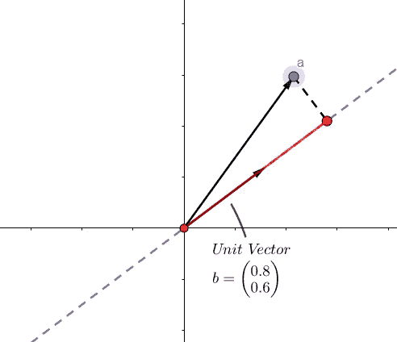

点积就是那条红色线段的长度。就这样。

但是最简单的事情通常有最大的影响。当我告诉你之后我们所做的一切都可以用点积来解释时，你可能会感到惊讶。这样做的一个原因是，点积可以用多种方式来看:

*   是矢量(或点) ***a*** *，*在定义的**线上的投影长度**单位矢量 ***b*** 。
*   沿*定义的直线到 ***a*** 的距离最近。*
*   *它是矢量 ***a*** 包含在 ***b*** 方向中的‘量’或分量。*
*   *它衡量的是 ***a*** 与 ***b*** 的接近程度(就角度而言)。*

*甚至它的计算看似简单:如果 ***a*** =(1，2)， ***b*** =(0.8，0.6)，那么这个运算可以用矩阵乘法来完成:*

*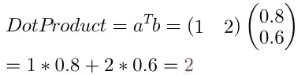*

*If you don’t know where this came from, [watch this](https://www.youtube.com/watch?v=LyGKycYT2v0).*

# *类固醇上的点积*

*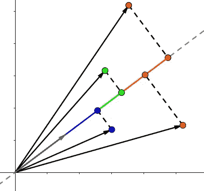*

*现在我们唯一的向量又多了三个朋友，我们需要组织一个聚会，把他们都投射到线上。如果我们用下式表示我们的矢量和单位矢量:*

*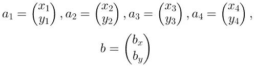*

*然后我们可以再次利用矩阵乘法**的简洁来得到每个向量对应的在单位向量*b*上的每个投影长度:***

*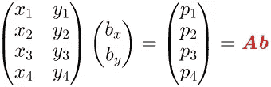*

*其中 ***p*** 是每个点(向量)的投影长度。*

# *地板# 2——外部产品*

*这一切都很好，直到你意识到**点积给出的只是线段的长度，而不是表示它的向量。***

**

*为了求出矢量，***单位矢量*乘******b***)的点积:********

******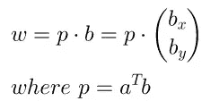******

# ******类固醇的外部产物******

******现在看看当我们注射类固醇时会发生什么，就像我们注射点积一样，也就是说，当我们有多个向量时:******

******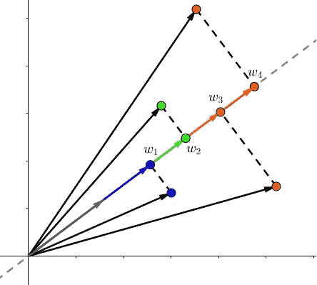******

******我们要找到 *w* 1、 *w* 2、 *w* 3、 *w* 4。记住，它们是代表每个点在单位向量 ***b*** 上的投影长度的向量:******

******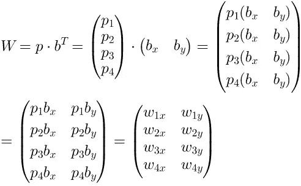******

******虽然看起来很复杂，**所做的只是用每个投影长度** ( *p* 1， *p* 2， *p* 3， *p* 4)，**依次缩放单位向量 *b* ，并将这些缩放后的向量按行存储在矩阵 *W*** 中。******

******现在，我们可以将代表投影长度的矢量 ***p*** 和矢量 ***b*** (我们投影的单位矢量)之间的外积定义为:******

******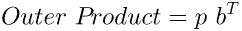******

******这给了我们**“投影向量”，每行一个。********

# ******第三层——翻转垫子，变成一只猫******

************

******当你遇到困难时，问问你的猫。如果它像上图那样侧着头，那么它想告诉你一些事情:******

> ******"换个角度看问题，你会发现许多有趣的事情."******

******或者“喵”。无论如何，让我们看看我们能做什么。假设我们有以下由 3 个示例(天)和 2 个要素(城市)组成的微小天气温度数据集，以及它的矩阵表示和 2D 散点图:******

******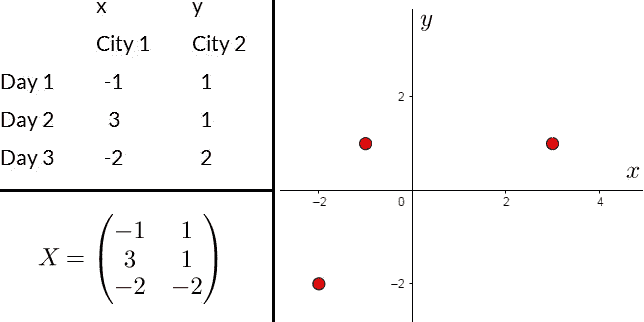******

******这并不特别鼓舞人心。但是如果我们像猫一样歪着头看矩阵:******

******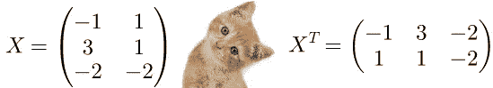******

******我们对数据集有了完全不同的解释。现在我们的矩阵有 2 个点和 3 个维度。看起来是这样的:******

******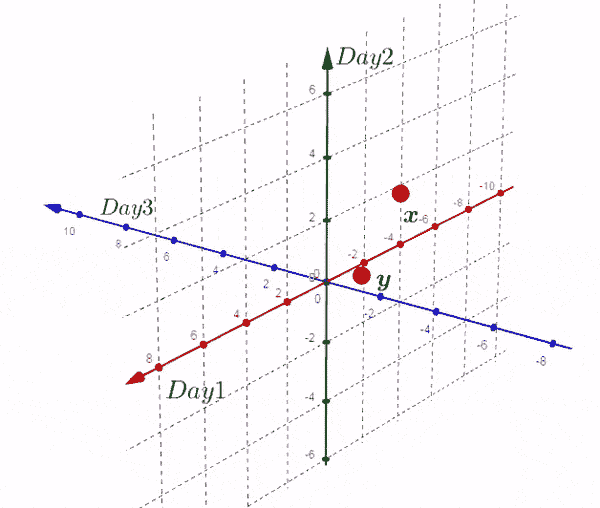******

******完全理解这意味着什么至关重要:******

*   ******新矩阵将日期(示例)作为**轴**，将城市(特征)作为**点**。旧的是反过来的。******
*   ******新矩阵中的每一行都是三维空间中的一个点。******
*   ******第一行包含每个示例(天)的 *x* 坐标，每列一个。**这意味着第一个点的 *x* 、 *y* 和 *z* 坐标分别是旧矩阵中第 1 天、第 2 天和第 3 天的 *x* 坐标的值。**同样，第二行有 y。******
*   ******如果我们有超过三天的时间(示例)，新矩阵将需要一个 4+维的图。**然而，仍然只有两个点，代表它们的向量将定义一个平面，我们可以很容易地在纸上画出来:********

******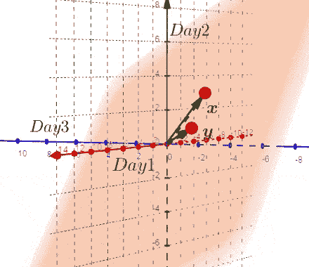******

******Three points define a plane: The **origin**, point **x** and point **y**.******

******所以从现在开始，我们只画那个平面。如果我们并排绘制平面和原始散点图的**图，我们就得到了所谓的**双标图:**********

****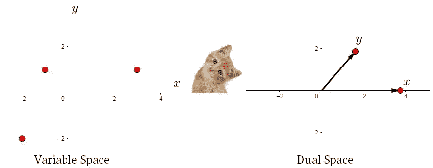****

****The scatter plot is called the variable space. The plane mentioned above is in the dual space.****

# ****4 楼——一个广阔的新世界****

****现在我们可以探索双重空间的广阔新世界。为了更好地理解它，我们必须看到两个世界之间的联系:****

****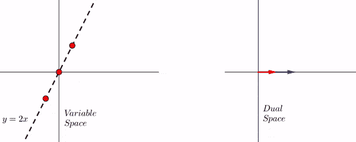****

****Red vector x represents the x-coordinates of the examples. Blue vector, y.****

******权利要求#1:** 数据集在*x*-方向的 ***方差*** 是矢量 *x* 与自身的点积。同样适用于 *y* 。****

****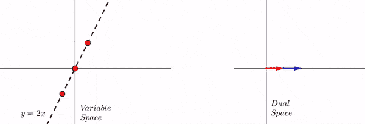****

******索赔#2** :数据集的 ***协方差*** 是两个向量的点积。****

****哇哦。****

****这些说法需要严肃的理由。****

# ****五楼——焕然一新****

****让我们达成共识，让我们的生活变得更轻松:**我们将要处理的所有数据集都是以均值为中心的。**这意味着我们从每个点减去每个特征的平均值，这样数据集将在原点居中。这根本没有改变我们数据的结构，但是简化了计算。****

## ****1.差异****

****在对偶空间中，矢量 *x* 的分量是每个例子的 *x* 坐标，即 *Vx* =( *x1，x2，x3* )。同样， *Vy* =( *y1，y2，y3)。*记住**沿 *x* 的方差是 *x* 坐标与其平均值的均方差。但是因为平均值是零，它将是:******

****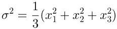****

******但那正是矢量 *x* 与自身**的点积，或者，等价地，**它的平方长度:******

****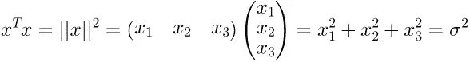****

****为了使事情变得简单，我故意忽略了因子 1/3，因为我们现在只对量的关系感兴趣。****

## ****2.协方差****

****还记得在第一部分中，我们将协方差解释为**一种从一个变量预测另一个变量的精确度的度量。**把这个用数量术语来说，我们假设最简单的一种关系: ***y*** **是** ***x*** 的某个倍数，或者 *y=mx* (一条穿过原点的线)。**我们的变量越忠实地展现这种关系，协方差就越大，**反之亦然。****

****如果你仔细观察权利要求#2 上面的动画，你会发现**数据偏离直线**，**越多，两个向量**之间的角度就越大，因此**的点积就越小。因此，点积是协方差的一个非常自然的度量。******

****一个小小的观察会让你意识到这完全有道理。记住 *Vx* =( *x1，x2，x3)* 和 *Vy* =( *y1，y2，y3* )。如果数据遵循线性关系( *y=2x* ，那么 *Vy* =(2* *x* 1，2* *x* 2，2* *x* 3)=2* *Vx* 。也就是说，**向量是彼此的标量倍数，它们共线，点积最大。******

****我们现在可以通过定义以下内容来正式表述这一主张:****

****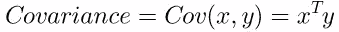****

## ****3.协方差矩阵****

****方差和协方差都只是点积，可以用一个矩阵来概括:****

****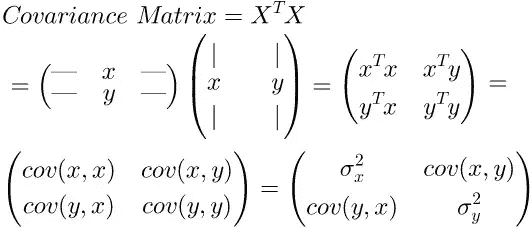****

****Obviously, cov(x, y) = cov(y, x). So the matrix is symmetric.****

## ****4.一般化****

****将这个想法扩展到数据集中的 3 个以上的点是简单的。我们将需要 4+维绘图来表示示例，**但是对于两个特征**、 *x* 和 *y* 仍然只有两个向量，并且它们将定义一个可以容易绘制的 2D 平面，并且执行点积。同样的想法仍然成立。****

# ****砖房****

****在这一点上，我们的地板是砖做的。你不能住在砖房里，对吗？不。我们要结束了。我们需要一个屋顶来观察我们如何将这些想法结合到一个框架中来解决 PCA 问题。****

****这正是我们在[第 3 部分](/dimensionality-reduction-for-dummies-part-3-f25729f74c0a)中要做的。****