# 虚拟模型的降维第 3 部分:连接点

> 原文：<https://towardsdatascience.com/dimensionality-reduction-for-dummies-part-3-f25729f74c0a?source=collection_archive---------4----------------------->

这是一切都到位的地方。

回到[第 1 部分](/https-medium-com-abdullatif-h-dimensionality-reduction-for-dummies-part-1-a8c9ec7b7e79) & [第 2 部分](/dimensionality-reduction-for-dummies-part-2-3b1e3490bdc9)，我们看到我们的最终目标是**找到这些定义最大方差方向的向量**。鉴于我们目前所了解的情况，这个过程现在才有意义。

我假设你知道线性变换，特征向量和特征值的基础知识，因为没有必要重复已经完全建立的东西。但是如果你需要一些洞察力，请看这个很棒的教程。

让我们开始吧。

# 你想要什么?

你不能解决一个你没有明确定义的问题，这就是为什么我们应该考虑**我们通过寻找最大方差的方向到底意味着什么。开始问自己什么是方差是很自然的。**

正如我们之前看到的，沿 *x* 轴的方差是该轴表示的特征的方差，即数据集的 *x* 坐标的方差。为了将这个概念推广到空间中的任何线，一个简单的观察是适当的:

> 数据点的 x 坐标仅仅是它们在 x 轴上的投影。

利用这一事实，我们可以通过**将我们的点投影到代表直线的单位向量上，然后计算这些投影的方差，从而很容易地找到沿着任何直线的方差。**

如果 ***A*** 是我们的( *n* x *d* ) **均值居中的**数据矩阵，其中 ***n*** 是实例(点数) ***d*** 是维数(特征)，而 ***v*** 是我们线的单位向量，那么

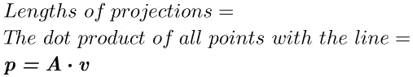

其中 *p* 是一个( *n* x 1)列向量，其中每个元素是每个点的投影长度。

现在我们有了列向量中的长度，我们可以使用 Floor #5 来求它们的方差:

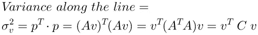

突然，弹出了我们数据的协方差矩阵， ***C*** ！这个非常奇怪的外观将为我们提供很大的帮助。给定我们对沿任意直线的方差的定义，我们可以通过说**我们想要找到向量 *v* 使得 *σ* 是最大值来重新表述我们的问题。从上面的定义可以明显看出，这个向量仅仅依赖于 ***C*** 的值，这迫使我们仔细研究这个奇怪的矩阵。**

# 奇怪的协方差

在上一部分中，我们了解到一个( *n* x *d* )数据矩阵有一个( *d* x *d* )协方差矩阵，即一个 2D 数据集有一个 2x2 协方差矩阵。你应该知道，**一个矩阵可以看做是一个线性变换，通过剪切或者旋转将向量映射到其他向量。对于我们的协方差矩阵来说，这没有什么不同。**

**了解线性变换矩阵的最佳方法是查看其特征向量**——这些向量不会被矩阵旋转或剪切，而只会缩放与其特征值相等的量。如果 *v* 是特征向量，λ是其特征值，则:

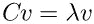

然而，协方差矩阵的特征向量具有特殊的性质。协方差矩阵是对称的，具有**正交特征向量**——单位长度且相互正交的向量[证明](https://yutsumura.com/orthogonality-of-eigenvectors-of-a-symmetric-matrix-corresponding-to-distinct-eigenvalues/)。这产生了以下恒等式:

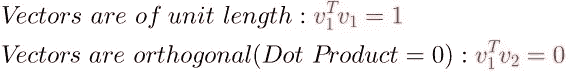

特征向量的优雅来自一个简单的事实:**空间中的任何向量都可以表示为一个矩阵的特征向量的线性组合。**这种优雅背后的原因是，我们现在可以**根据特征向量和特征值，计算由矩阵 *C、*表示的线性变换对任何向量 *u* 的影响。**这将复杂的矩阵乘法程序 ***C.u*** 转化为简单的矢量缩放*。*要了解这是如何做到的，请注意,( 2 x 2)协方差矩阵有两个对应于每个维度的正交本征向量。**任何向量 *u* 都可以用两个特征向量 *v* 1 和 *v* 2 表示为:**

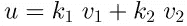

Where k1and k2 are scalars.

所以要找出协方差矩阵对任何向量的影响*:*

*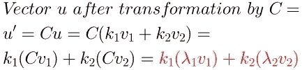*

*我们现在可以把我们想要最大化的量， ***(u^T)Cu*** )写成:*

*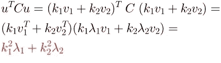*

*在最后一步中我们使用了标准正交恒等式。*

# *大惊喜*

*找到最大化***【σ】*=*(u^t)cu***)的 ***u*** 就是找到 ***k* 1** 和***k*2**——定义 ***u*** 的特征向量的系数。但是由于我们只关心定义最大方差线的*单位向量*， ***k1 +k2 =* 1** 。你现在能猜出如何最大化 ***σ* 吗？***

*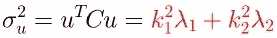*

*关键是要注意，如果 **λ1 > λ2** ，那么最大化**σ的唯一方法，给定约束 *k1* + *k2 =* 1，**就是将 1 赋给 *k* 1，0 赋给 *k* 2，这样最大的特征值λ1 支配总和。*****

*这让我们大吃一惊:*

> *最大方差的方向是具有最大绝对特征值的协方差矩阵的特征向量。*

*因为如果 *k* 1=1 并且 *k* 2=0，那么**u变成:***

*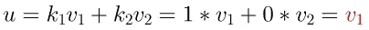*

***即 *u，*方差最大的方向，是具有最大特征值的特征向量 *v* 1 本身。**对此的一个直接结论是，*第二大的*方差方向对应于具有*第二大的*特征值的特征向量，以此类推。*

# *另一个大惊喜*

*更有趣的是，如果你看我们的问题陈述:*

*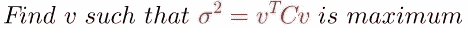*

*并结合 ***v*** 为特征向量的事实，则:*

*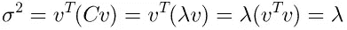*

*即*

> *特征向量方向上的方差是它们的特征值。*

# *现在怎么办？*

*好吧。我们终于找到了我们都想要的向量。现在怎么办？*

*如果您还记得第 1 部分中的内容，我们通过将点投影到方差最大的线上，将 2D 数据集简化为一条 1D 线。现在我们已经有了我们需要的所有量，即数据矩阵 ***A*** 、协方差矩阵 ***C*** 及其定义我们的线的特征向量 ***v* 1** 、 ***v* 2** ，我们可以执行投影:*

*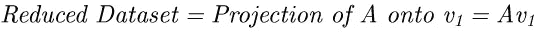**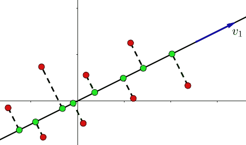*

*推广到更大的维度只是用额外的组件来扩充我们的矩阵。如果我们在 3D 中，协方差矩阵有 3 个特征向量， ***v* 1， *v* 2， *v* 3** ，从最大到最小 **λ** 排序。但是为了更灵活地组织我们的问题，我们使用矩阵乘法的性质。我们的问题现在可以表述为:*

*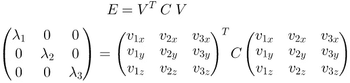*

*其中 ***E*** 是方差(特征值)的对角矩阵，而 ***V*** 是特征向量的标准正交矩阵，按列排列。取任意数量的具有最大特征值的**主成分**(特征向量),并将我们的数据投射到它们上面以降低维数。如果我们选择 *v* 1 和 *v* 2，最大方差的平面现在由它们定义，将这些点投影到平面上相当于投影到 *v* 1 和 *v* 2 上，然后组合这些分量:*

*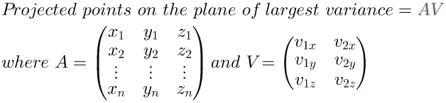*

*This is just an extension to projection on a line (p = Av), where v is now a matrix V of column-wise vectors.*

*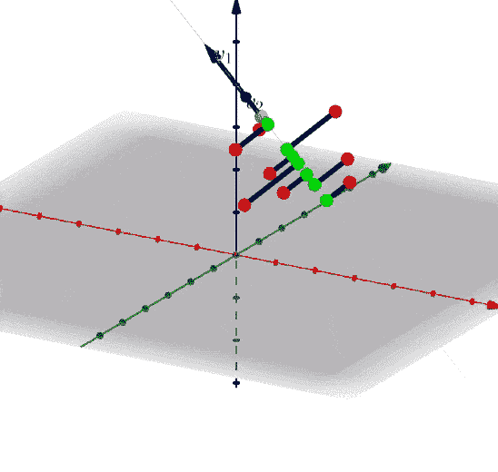*

# *一般程序*

*求协方差矩阵的特征向量的过程称为协方差矩阵的**特征分解**，是求解 PCA 的方法之一。这个名字来源于这样一个事实，如果我们把我们的问题陈述重新组织成:*

*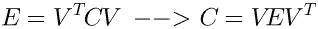*

*Using the identity V^T = V^-1 for orthonormal matrices*

*然后矩阵 C 被分解成它的特征向量 V 和特征值 e。*

*我们应该选择多少个特征向量来投影我们的数据？经验法则是选择第一个 *n 个*特征向量，使得它们的方差(特征值)之和大于总数的 95%。*

*我们现在可以总结使用 PCA 降低维数的过程:*

1.  *平均值-通过从平均值中减去每个要素来确定数据的中心。*
2.  *求中心数据 C =(A^T)A.的协方差矩阵*
3.  *对 c 应用特征分解。*
4.  *按照特征值降序排列特征向量。*
5.  *选择解释总方差 95%的第一个 *n 个*特征向量。*
6.  *创建一个矩阵 *V* ，其中每一列都是 *n* 个选择向量中的一个。*
7.  *将数据投影到由 *V* 定义的子空间上:*

*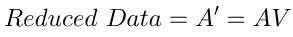*

# *下一步是什么*

*另一个非常有趣的解决 PCA 的方法是**奇异值分解(SVD)。**它类似于特征分解，但在实践中更通用、更广泛。但是这已经足够了，所以我把它留给[下一部分](/svd-8c2f72e264f)。*