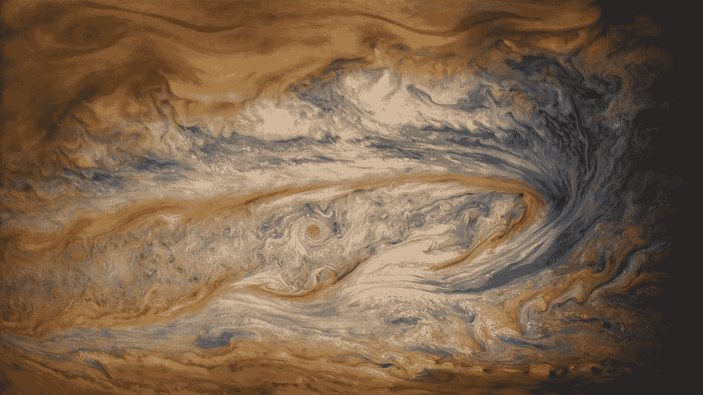
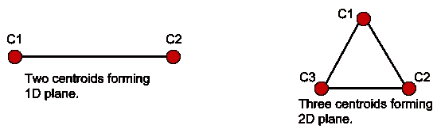
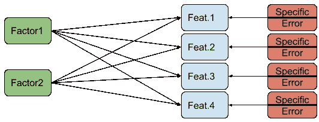

# 降维:方法和直觉

> 原文：<https://towardsdatascience.com/dimensionality-reduction-ways-and-intuitions-1b5e97592d8e?source=collection_archive---------8----------------------->



Photo of Jupiter by NASA 360 on [Facebook](https://www.facebook.com/FollowNASA360/)

在大数据应用变得无处不在后，维数灾难变得比预期的更严重。因此，对于这种高维空间，可视化和分析变得更加困难。此外，我们来自 2D 和 3D 世界的洞察力和直觉(例如，距离)不再适用。另一个问题是，当预测器的数量很高时，预测模型更有可能具有高方差，这使得模型易于过度拟合。
ّThis 的文章是关于降维技术的，这是我作为数据科学硕士生第一学期学到的。对于每一种技术，我将尝试提供直觉、标准和用例，并支持 Python 中的插图。为了简单起见，我不会深入这些技术的底层数学，但我会回顾一下我第一次研究它们时想到的问题。

# 主成分分析法:

主成分分析是降维技术中最流行和最广泛使用的方法之一。PCA 是一种无监督的方法，这意味着它不需要对您的数据执行任何标记。首先，您应该知道数据集中的每个要素都有一些可变性(即方差)，这表明您的数据围绕平均值分布了多少。PCA 是做什么的？它得到一些线性独立的分量(即，每个分量之间的相关性为零)，而每个分量是原始特征的线性组合，同时尽可能多地保留数据的总方差。因此，如果您的目标是在执行降维的同时保持数据的方差，那么 PCA 是一个不错的选择。

```
import numpy as np
from sklearn.decomposition import PCA

*# Generate random Data of size (n x 5).* X = np.random.uniform(size=(20, 5))

*# Number of component wanted. X after reduction will be (n x 3).* pca = PCA(n_components=3)
X_reduced = pca.fit_transform(X)

*# Portion preserved from the total variance. 
# If 1, means we didn't lose any variance.* print("Portion preserved from the total variance", np.sum(pca.explained_variance_ratio_))
```

你也可以指定想要的最小变化量，它会为你决定组件的数量。

```
pca = PCA(n_components=0.90)
X_reduced = pca.fit_transform(X)print("Number of components =", pca.components_)
```

# 线性判别分析— LDA:

LDA 是一种受监督的方法，这意味着您的数据需要在降维优化函数中进行标记。为什么使用标签？LDA 旨在找到最佳方向，即投影，以减少类内可变性并增加类间可变性。换句话说，LDA 最大化了类别之间的可分性。所以在高维分类问题中，可以先对数据进行 LDA，在保持可分性的同时降低维数，然后在降维后的数据上安全地建立预测模型。需要注意的是，如果你的类的数量是 C，那么你不能把维数减少到超过 C-1 维。为什么？在优化过程中，我们处理 C 个质心点，这些质心点最多位于 C-1 维空间中，因此我们可以得到的最大投影是 C-1。



```
**import** numpy **as** np
**from** sklearn.discriminant_analysis **import** LinearDiscriminantAnalysis

*# Generate random Data of size (n x 5), with labels (n x 1).* X = np.random.uniform(size=(200, 5))
y = np.random.randint(low=0, high=5, size=(200, ))

*# Number of component wanted. X after reduction will be (n x 3). 
# Number of classes C = 5, so max number of n_components = 4.* lda = LinearDiscriminantAnalysis(n_components=3)
X_reduced = lda.fit_transform(X, y)
```

# 因子分析— FA:

在 FA 中，有带假设的建模，有建立这个模型的标准。FA 认为在我们观察到的特征背后有隐藏的因素。每个因素都会在一定程度上影响这些特征。这种假设从一个角度来看待特性，即每个特性都有自己的可变性，可以表示为一组三种类型；普通方差、特定方差和误差方差。公共方差是几个特征之间共享的方差(即同一组因素的结果)。当特征高度相关时，这种普通方差很高。特定方差是只对特定特征有贡献的因素的影响。误差方差是在观察期间由误差源产生的方差(例如，人为误差、测量误差)。)



Factor 1&2 are the source of the common variance between features. While the others are the source of the unique variance for each feature which is divided into specific variance and error variance.

FA job 是什么？找出最大化原始特征之间已解释的公共方差的因素。

```
**import** numpy **as** np
**from** sklearn.decomposition **import** FactorAnalysis

*# Generate random Data of size (n x 5).* X = np.random.uniform(low=0, high=100, size=(20, 5))*# Number of factors wanted. The resulted factors are (n x 3).* fa = FactorAnalysis(n_components=3)
factors = fa.fit_transform(X)
```

# 独立分量分析— ICA:

对 ICA 最好的描述不是降维技术。最好将其描述为卷积/混合信号的分离/解混技术。ICA 的一个典型用例是“鸡尾酒会问题”，其中有独立的声源(例如扬声器)和几个用于录音的麦克风。使用麦克风的录音，可以通过 ICA 单独获得对原始声音的估计。
ICA 假设源是非高斯独立的，并且依赖于 CLT，独立随机变量之和的分布趋于高斯。在每一步，ICA 改变基向量-投影方向-并测量所获得的源的非高斯性，并且在每一步，它使基向量更接近非高斯性(主要使用梯度下降)。在一些停止准则之后，它达到原始独立源的估计。

```
**import** numpy **as** np
**from** sklearn.decomposition **import** FastICA

*# Generate random Data of size (n x 5).* X = np.random.uniform(low=0, high=100, size=(20, 5))

*# Number of sources wanted. The resulted sources are (n x 3).* ica = FastICA(n_components=3)
sources = ica.fit_transform(X)
```

# 多维标度— MDS:

如果您想在缩减后保留数据点之间的距离，那么 MDS 应该是您的选择。如果两个数据点在原始数据集中很接近，它们在缩减的数据集中也会很接近，反之亦然。这种方法只需要物体(点)的成对距离矩阵。所以，如果你只有这个距离矩阵，MDS 可以用来恢复你想要的维数的原始物体。

MDS 可用于在 2D 或 3D 空间中可视化您的对象，以尽可能保留原始对象之间在更高维度中的距离。

```
import numpy as np
**from** sklearn.manifold **import** MDS

*# Generate random Data of size (n x 5).* X = np.random.uniform(size=(20, 5))

*# Number of component wanted = 3\. X after reduction will be (n x 3).* mds = MDS(n_components=3)
X_reduced = mds.fit_transform(X)
```

要恢复数据的 2D 表示，请执行以下操作:

```
*# The recovered X will be of size (n x 2).* mds = MDS(n_components=2, dissimilarity=**'precomputed'**)# D is the pair-wise distance matrix.
X_recovered = mds.fit_transform(D)
```

# 总结:

PCA 不是唯一的降维方法，还有其他的。每一种都有其用途和目标。选择哪一个取决于应用程序。

# 资源:

*   英格·科赫。*多元高维数据分析。*澳洲阿德莱德大学。
*   走向数据科学:[*LDA 是降维技术还是分类器算法？*](/is-lda-a-dimensionality-reduction-technique-or-a-classifier-algorithm-eeed4de9953a)
*   stack exchange:[线性判别分析如何降维？](https://stats.stackexchange.com/questions/22884/how-does-linear-discriminant-analysis-reduce-the-dimensions)
*   [*因子分析实用入门*。](https://stats.idre.ucla.edu/spss/seminars/introduction-to-factor-analysis/a-practical-introduction-to-factor-analysis/)数字研究与教育研究所。
*   Aapo Hyvä rinen 和 Erkki Oja。 [*独立成分分析:算法与应用*](http://mlsp.cs.cmu.edu/courses/fall2012/lectures/ICA_Hyvarinen.pdf) *。*赫尔辛基理工大学。