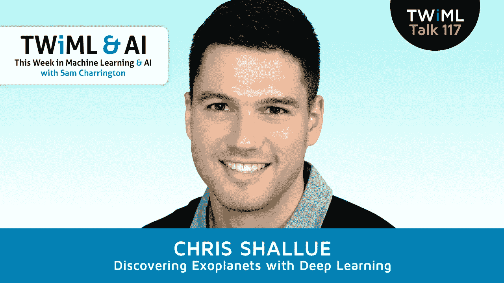

# 用深度学习发现系外行星

> 原文：<https://towardsdatascience.com/discovering-exoplanets-with-deep-learning-fcf8873391c9?source=collection_archive---------1----------------------->

## TWiML Talk 117

本周早些时候，我有机会与谷歌大脑团队的高级软件工程师 Chris Shallue 谈论他的项目和论文“用深度学习探索系外行星”。

## 订阅:[iTunes](https://itunes.apple.com/us/podcast/this-week-in-machine-learning/id1116303051?mt=2)/[SoundCloud](https://soundcloud.com/twiml)/[Google Play](https://goo.gl/app/playmusic?ibi=com.google.PlayMusic&isi=691797987&ius=googleplaymusic&link=https://play.google.com/music/m/Ihs3mamzsef2akrfycfkq3sspti?t%3DThis_Week_in_Machine_Learning_%2526_AI_Podcast)/[Stitcher](http://www.stitcher.com/s?fid=92079&refid=stpr)/[RSS](https://twimlai.com/feed)

这是一个伟大的故事。克里斯受到他正在读的一本书的启发，一时兴起联系了哈佛天体物理学研究员，开始了一项合作和附带项目，最终导致了太阳系外两个新行星的发现。在我们的对话中，我们讲述了克里斯寻找这两颗系外行星的整个过程，包括他如何作为局外人研究该领域，他如何获取和处理他的数据集，以及他如何构建和发展他的模型。最后，我们讨论了他的项目的结果和他在这一领域未来工作的计划。

这个播客与谷歌发布 Chris 开发和使用的源代码和数据同时发布，我们将在下面链接，所以如果你听到的东西激励你深入这个领域，你已经有了一个很好的开端。这是一次非常有趣的谈话，我很高兴能与你分享！

# TWiML 在线会议

查看我们的 youtube 页面，youtube.com/twimlai,，在线聚会三月版的回顾！肖恩·德夫林(Sean Devlin)对强化学习和谷歌 DeepMind 论文进行了深入的回顾，[用深度强化学习玩雅达利](https://www.cs.toronto.edu/~vmnih/docs/dqn.pdf)。前往 twimlai.com/meetup[了解更多信息或注册参加下个月的活动。](https://twimlai.com/meetup)

# 关于克里斯

*   [克里斯在 LinkedIn 上](https://www.linkedin.com/in/cshallue)
*   [克里斯的 Github](https://github.com/cshallue)

# 采访中提到

*   [开源寻找系外行星](https://research.googleblog.com/2018/03/open-sourcing-hunt-for-exoplanets.html)
*   [开源寻找系外行星——代码](https://github.com/tensorflow/models/tree/master/research/astronet)
*   【Loon 项目
*   [图像字幕神经网络](https://research.googleblog.com/2014/11/a-picture-is-worth-thousand-coherent.html)
*   [机器人](https://software.nasa.gov/software/ARC-17981-1)
*   [美国宇航局开普勒望远镜数据集](https://exoplanetarchive.ipac.caltech.edu/)
*   [约书亚·布鲁姆——面向明星的机器学习&产品化 AI](https://twimlai.com/talk/5)
*   [在这里报名参加人工智能大会！](https://twimlai.com/ainy2018)
*   [看看@ShirinGlander 的伟大 TWiML 速写！](https://www.shirin-glander.de/)
*   [TWiML 呈现:系列页面](https://twimlai.com/series)
*   [TWiML 事件页面](https://twimlai.com/events)
*   [TWiML Meetup](https://twimlai.com/meetup)
*   [TWiML 简讯](https://twimlai.com/newsletter)

Lee Rosevere 的“稍后再谈”由 4.0 版 CC 授权

*原载于 2018 年 3 月 8 日 twimlai.com***。**