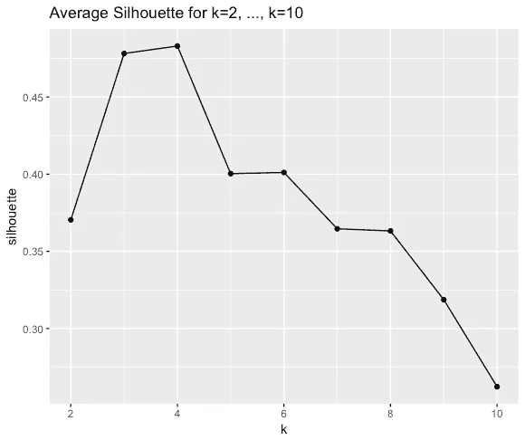
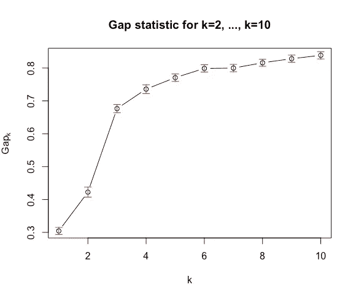
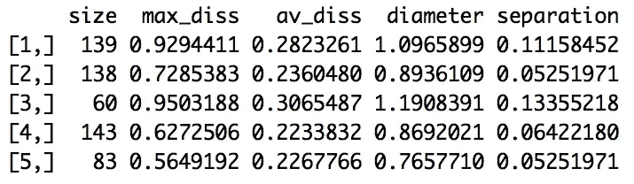
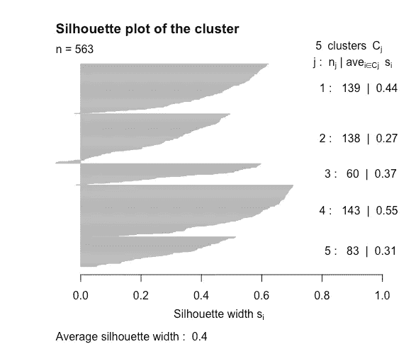
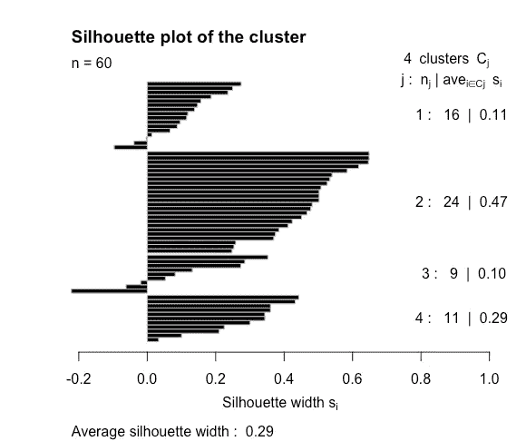
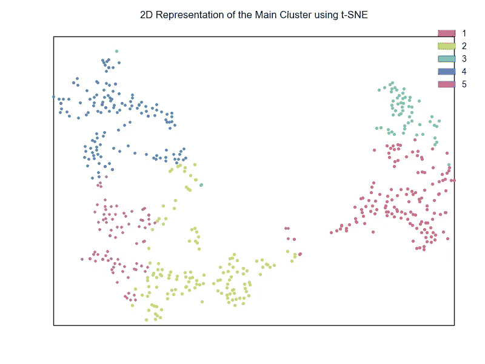
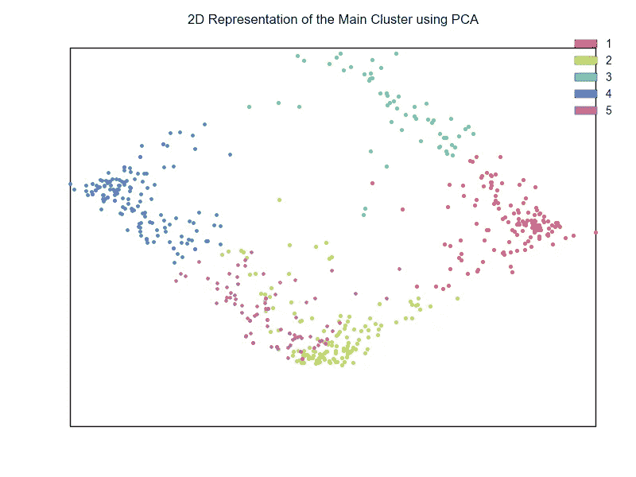
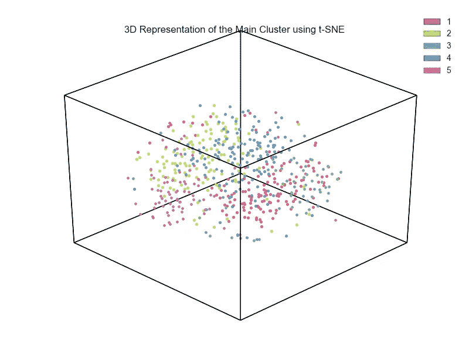
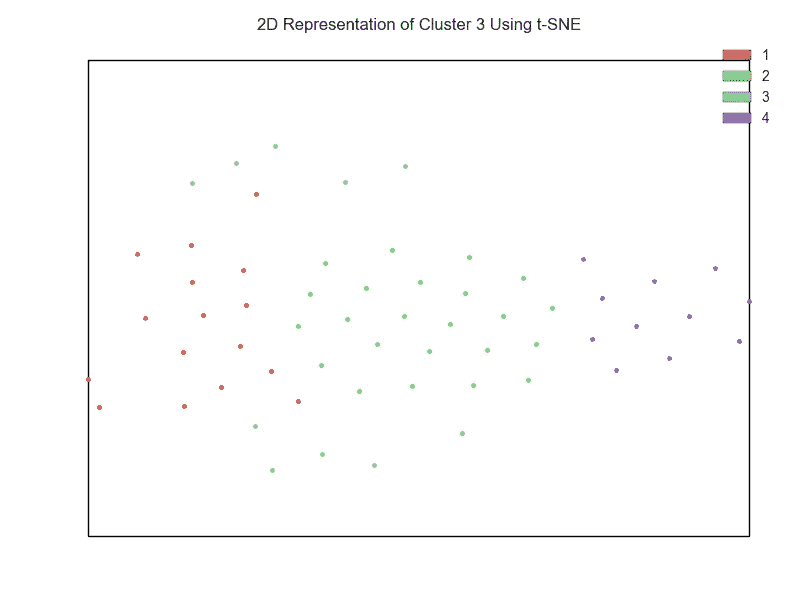

# 使用数据、聚类和可视化发现我的 Spotify 音乐的相似之处

> 原文：<https://towardsdatascience.com/discovering-similarities-across-my-spotify-music-using-data-clustering-and-visualization-52b58e6f547b?source=collection_archive---------2----------------------->

音乐品味是一个人非常独特、奇特和有特色的品质。在现存的数以百万计的歌曲和声音中，我认为许多人决定发展对一种特定风格、流派或音乐“子集”的喜爱并非偶然。我们喜欢的歌曲背后是什么？他们有什么相似之处吗？它们之间有什么相似之处？更重要的是，有没有一种方法可以根据它们的发音把它们收集起来？

这篇文章描述了我第二次尝试回答这些问题。

相当一段时间以来，我一直对我在 Spotify 中收藏的歌曲感到好奇。此外，我有兴趣通过数据研究我的播放列表对我的音乐品味有何影响。幸运的是，Spotify 的 API 提供了一种叫做*音频特征*的东西，顾名思义，就是一首歌的特征或特点，比如声音有多大或多大声，通过它们，我探索、研究、了解了我的音乐。

在我之前的作品《T2》中，我的 Spotify 音乐很无聊吗？*，我重点回答以下三个问题:*

*   *我的 Spotify 保存的歌曲有多多样？*
*   *他们有多大作用？*
*   *他们有多无聊？*

*而且我得出的结论是，我的歌确实种类繁多，很多都是器乐化的，很枯燥(基于我推导出的一个公式)。在同一个项目中，我还训练了一个监督学习模型，目的是预测一首歌是属于我的播放列表还是朋友的播放列表，准确率达到 82%。*

*作为这项工作的后续，我将继续探索我的播放列表的可变性概念。使用聚类算法 **k-medoids** 、聚类分析和我的数据集的低维表示作为工具，我使用我的 Spotify 保存的所有歌曲来研究其聚类趋势，并确定是否有可能根据音频特征将类似的歌曲分组在一起。*

*这个实验分为四个部分，也代表了我要研究的主要课题。*

*   *我应该使用的最合适的集群数量是多少？*
*   *数据的聚类和查看几个聚类统计的值，例如轮廓系数和聚类之间的差异。*
*   *聚类有多好？每个聚类中的歌曲有多相似？聚类有意义吗？*
*   *聚集的数据看起来怎么样？*

*我们开始吧！*

## *工具*

*这项工作是使用 R 和 Python 完成的。聚类部分是使用 R 和包 [caret](http://topepo.github.io/caret/index.html) 和 [cluster](https://cran.r-project.org/web/packages/cluster/index.html) 完成的。Python 用于通过库 [Spotipy](https://github.com/plamere/spotipy) 获取数据，并通过 [Hypertools](http://hypertools.readthedocs.io/en/latest/) 可视化数据。报告末尾提供了代码的链接。*

## *数据*

*音乐数据是使用我编写的 Python 脚本获取的，该脚本获取特定播放列表中的所有歌曲及其音频特征。在清理数据集并删除不必要的东西后，我留下了一个由 563 行(每行代表一首歌)和 5 列组成的数据集，这是音频特征。这些音频功能包括:*

***乐器性**:该值代表歌曲中人声的量度。越接近 1.0，歌曲的器乐性越强。*

***声音度**:这个值描述了一首歌曲的声音度。1.0 分意味着这首歌最有可能是一首原声歌曲。*

***Liveness** :这个值描述了歌曲被现场观众录制的概率。根据官方文档，“高于 0.8 的值提供了该轨道是实况的很大可能性”。*

***语速**:“语速检测音轨中是否存在口语单词”。如果一首歌曲的语音度高于 0.66，它可能是由口语词组成的，0.33 到 0.66 之间的分数是一首可能同时包含音乐和词的歌曲，而低于 0.33 的分数意味着这首歌曲没有任何语音。*

***可跳舞性**:“可跳舞性描述了一首曲目在音乐元素组合的基础上适合跳舞的程度，包括速度、节奏稳定性、节拍强度和整体规律性。值 0.0 最不适合跳舞，1.0 最适合跳舞”。*

***该描述是从官方* [*文档*](https://developer.spotify.com/web-api/get-audio-features/) *中复制/粘贴而来。**

## *确定聚类的数量*

*当使用基于划分的聚类算法(如 k-medoids)时，找到正确的聚类数，也称为“ *k* ”，不知何故，是一个模糊且关键的步骤。一方面，低的 *k* ，例如 *k=2* ，意味着数据集的所有观察值将被聚类成 2 个簇，导致大量的误差，并且很可能是难以解释的聚类结果。第二个选择，一个更大的*k*将会减少误差，代价是将所有的观察结果分成许多组。因此，需要一种平衡，引用[维基百科](https://en.wikipedia.org/wiki/Determining_the_number_of_clusters_in_a_data_set)“最佳选择 *k* 将在使用单个聚类的最大数据压缩和通过将每个数据点分配到其自己的聚类的最大准确性之间取得平衡”。*

*在所有已知的检测集群数量的技术中，我使用了 [*轮廓系数*](https://en.wikipedia.org/wiki/Silhouette_(clustering)) 和 [*间隙统计*](https://web.stanford.edu/~hastie/Papers/gap.pdf) 。*

*剪影系数衡量的是数据观测值与其自身聚类(内聚力)的相似程度，以及与其他聚类(分离)的观测值的相似程度。剪影的值范围从-1 到 1，其中 1 表示良好的内聚性，而-1 表示对象可能位于错误的簇中。使用这种方法，我所做的是使用不同的 *k* 对我的数据集进行几次聚类，然后计算并平均所有观察结果的轮廓，并选择我发现最合适的 *k* 。*

*下图显示了使用 *k=2* 到 *k=10* 对数据进行聚类时的平均轮廓。*

**

*Average silhouette coefficient for different k’s*

*虽然图中显示 4 的 k 值产生了最好的轮廓，但是我决定选择 k=5 的轮廓，因为我有兴趣分析更多的聚类。*

*对于使用的第二种方法，gap statistic，使用不同的 *k* 对数据集进行不同次数的聚类，每次都从所谓的预期类内平方和中减去围绕类中心的类内平方和(如果您发现术语“预期”令人困惑或含糊不清，不要担心，这个词背后涉及大量的数学知识，其解释超出了本文的范围)。这种减法的结果是差距统计，一旦我们对每一个 *k* 都有了差距统计，并对它们进行绘图，代表绘图的“ [*【肘点】*](https://en.wikipedia.org/wiki/Elbow_method_(clustering)) ”的那个就对应于最佳的 *k* 。*

*下图显示了从 *k=2* 到 *k =10* 的所有间隙统计数据。喜欢剪影评分，根据差距， *k=3 或者 k=4，*是最好的 *k* ，然而我再一次决定选择 *k=5* 。*

**

*Gap statistic for different k’s.*

*因此，我的问题"*的答案是，我应该使用多少个集群最合适？*是 **5** 。*

*现在我们已经选择了一个 *k* ，下一步就是对数据进行聚类。*

## *聚类及其分析*

*用于聚类数据的算法是 [k-medoids](https://en.wikipedia.org/wiki/K-medoids) 。对于那些以前使用过 *k-means* 并且以前没有听说过或使用过 k-medoids 的人来说，我认为它们之间的主要区别在于前者可以用于任何相似性度量，而不是像 *k-means* 那样最小化平方距离。除此之外，在 k-medoids 中，数据集的实际数据点被用作聚类的最中心项，这与 k-means 不同，k-means 使用特征空间中的一个点来表示聚类的中心，从而使前者对异常值更加鲁棒。*

*下图是聚类结果的直接输出。每一行代表一个分类，每一列是关于它的一条信息。从左边开始，第一列“*大小*”是每个聚类的观测值数量，“ *max_diss* ”是最大相异度，即距离聚类的 medoid 最远的数据点之间的距离，“ *av_diss* ”是平均相异度，然后我们有“*直径*，这是同一聚类的两个点之间的最大相异度，最后，“*分离*”，即*

**

*Several scores about the cluster*

*就大小而言，簇 4 是最大的，总共有 143 首歌曲，而由 60 首歌曲组成的第三个是最小的。该聚类也是显示最高最大相异度和平均相异度的聚类。这说明，如果与其他星团相比，这个星团的内容与它的中间体或中心是完全分离的；该集群还显示了最大的分离值，这意味着它离其他集群最远，直径也最大，使其成为距离上“最大”的集群。相反，聚类 4 是具有最低最大和平均相异度、直径和分离值的聚类。*

*之前，我引入了轮廓系数来使用它作为一种找到好的 *k* 的方法。现在，我将使用它作为一种方法来检查集群的良好性。下图显示了按分类分组的每个数据点的轮廓。*

**

*Silhouette score of each cluster*

*图像右侧的数字是每个集群的平均轮廓。聚类 2 具有较低的轮廓(0.27)，而聚类 4 具有最好的轮廓(0.55)。分类 2 也是轮廓小于 0 的观测值最多的分类，理论上，这意味着这些案例可能属于另一个分类。*

*根据本节介绍的所有指标，聚类 4 似乎是最好的一个，因为它具有最好的平均聚类内距离和直径，以及最高的轮廓。因此，这是我将在下一节中使用和剖析的集群之一，以实际验证该集群是否确实是好的*

## *聚类有多好？*

*了解群集是否良好的最佳方式是深入其中并查看内容，看它是否相关以及是否有某种模式，例如，属于同一张专辑、同一位艺术家、相似声音或相同风格的歌曲。在这一节中，我将呈现聚类 3 和聚类 4 中的一些歌曲，此外，我将使用聚类 4 的内容进行新的聚类，以尝试找到进一步的相似性。*

*在上一节中，我提到了集群 4 由 143 个观察值组成，是最大的一个。在下面的列表中，我会显示属于这个集群的一些专辑，歌曲的数量，在某些情况下，我会做一个关于专辑的说明。*

*   **魔戒—王者归来—完整录音(限量版)* : **38 首**歌曲*
*   **星际:电影原声带(豪华版)* : **12 首**歌曲*
*   **光明之子* : **10 首**歌曲；这是一个电子游戏的配乐。*
*   **星际:电影原声*(是的，我有这张专辑的普通版和豪华版，所以有一些重复): **10** 首歌*
*   **《疯狂的麦克斯:狂暴之路》——电影原声带* : **9 首**歌曲*
*   **遥远世界 II:更多来自最终幻想的音乐* : **7** 首歌曲；另一个电子游戏。*
*   **质量效果 3* : **7** 歌曲；电子游戏。*
*   **while(1 < 2)* ，by*dead mau 5*:**7**歌曲；电子音乐。*
*   **血源性*:5；受血源视频游戏启发的音乐。*
*   **晶体管* : **5** 歌曲；电子游戏。*

*其余的歌曲包括*坎耶西*、*星球大战*、一首*星际*歌曲的翻唱、一首来自*机器人先生*(一部电视剧)*火星人*(一部电影)*缪斯*、*霍比特人*等等。*

*这组歌曲的主要音调和风格是器乐；几乎没有任何人声的歌曲。你可能注意到了，很多都是来自电影(*星际*、*指环王*)和电子游戏(*最终幻想*、*质量效果*)的原声配乐；即使是坎耶·韦斯特的那首歌，也是没有人声的器乐插曲。*

*让我们看看最小的集群 3。同样，我会列出专辑和歌曲数量。*

*   **声*，由*以上&超越* : **12** 歌曲组成*
*   *音响二、由*以上&超越* : **11** 的歌曲*
*   **巴勃罗的一生*，由*坎耶西* : **6** 歌曲组成*
*   **堡垒* : 4 首歌；一个电子游戏。*
*   **星际:电影原声带(豪华版)* : **3** 歌曲*
*   **魔戒—王者归来—完整录音(限量版)* : **3** 歌曲*
*   **星际:电影原声带* : **2** 歌曲*
*   **晶体管* : **2** 歌曲*

*乍一看，这个集群似乎比前一个更加多样化(这可能是为什么它是最不相似的一个)，它有一些视频游戏音乐，更多的*星际，指环王*，以及一些嘻哈和说唱。但亮点在于它包含了*以上&Beyond**原声*专辑中的 23 首歌曲。给一点背景，这两张专辑是 Above and Beyond 的一些最著名歌曲的原声版本，我觉得奇怪的是，尽管它们是两张不同的专辑，在不同的年份发行，但根据音频功能和集群，它们遵循相同的风格。值得一提的是，第一张专辑包含 12 首歌曲，第二张专辑包含 13 首歌曲，因此集群能够捕获几乎所有的歌曲(25 首中的 23 首)。*

*由于集群 3 有一点多样性，我在一个新的模型中对其内容进行了聚类，以验证该算法是否可以检测到这种多样性。我特别感兴趣的是，看看声学专辑中的歌曲，嘻哈和说唱歌曲，以及电影和视频游戏中的歌曲，是否被分配到不同的集群中。和上次一样，用的是 k-medoids，这次用的是 *k=4* 。*

**

*前面的图形是新簇的轮廓图。平均轮廓宽度是 0.29，比上一次的 0.40 更低更差。而且，这次还有一个得分 0.10 的真的很差的集群。下面是集群的摘要。*

*   *集群 1:
    — *以上&超越*声学专辑: **6** 歌曲
    —说唱: **2** 歌曲
    —器乐: **3** 歌曲
    —流行音乐、电子音乐、西班牙民谣: **1** 歌曲各一首
    —弗兰克·辛纳特拉(爵士): **1** 歌曲*
*   *集群 2:
    — *以上&超越*声学专辑: **15** 歌曲( **16** ，如果算上一张从另一张专辑复制过来的)
    — *魔戒*带人声的歌曲:1
    — *堡垒*带人声的配乐歌曲:2
    — *晶体管*带人声的配乐歌曲:1*
*   *第三组:
    —说唱: **6 首**歌曲
    —电音: **2 首**歌曲*
*   *集群 4:
    — *星际* : **5** 歌曲
    — *魔戒* : **2** 歌曲*

*我对第二组取得的结果非常满意。首先，超过一半的歌曲来自原声专辑，其他的有一些相似之处(相信我)。例如， *Bastion* 和 *Transistor* 中的歌曲是轻松的歌曲，声音柔和，带有吉他的音响效果(两张专辑也出自同一位艺术家)。《指环王》*中的这首歌比前几首更欢快一些，但我认为它符合主题。**

*总的来说，我对聚类模型的结果感到满意。虽然聚类有时看起来很复杂，令人困惑，但我相信它能够抓住我音乐多样性的本质。在所讨论的集群中，我能够识别出几种模式，例如在一个集群中有高度器乐和管弦乐(来自视频游戏和电影),而在其他集群中有声学感觉的歌曲(吉他、一些管乐器)。关于我没有写的三个集群(来自第一个模型)，其中一个显示了对说唱、嘻哈和电子音乐的关注，其余的都是垃圾(他们有所有流派和艺术家的音乐)。*

## *形象化*

*当使用聚类(以及一般的数据)时，我总是想知道数据看起来是什么样的。在最后几段中，我已经谈了很多关于星团、直径、分离和一堆其他的东西，这些东西有些模糊，很难在一个人的头脑中想象出来。因此，本实验的最后一部分致力于可视化数据集和聚类。*

*这个项目的数据集由 5 个特征组成，如果我想制作一个所有特征的图表，我需要考虑这样一个事实，即对于我们人类来说，不可能(据我所知)体验超越三维领域的事物。一种选择是只选择 2 或 3 个特征并绘制它们，但是，我们会丢失大量信息，因为我们会丢失其他特征。老实说，在这种情况下，这并不是一个糟糕的想法，因为数据集只有 5 个维度，但是，有由数千个要素组成的数据集，在这种情况下，绘制 2 或 3 个要素不会给你一个良好的数据可视化表示。那么，我们如何解决这个问题呢？*

*幸运的是，有一种叫做降维的算法，它的目的是将高维数据投影到低维数据中，让我们可以做一些事情，比如将其可视化。在这些算法中，我选择使用 t-分布随机邻居嵌入(t-SNE)和主成分分析(PCA)。遗憾的是，由于它们的复杂性，我不会深入细节，老实说，我并不完全理解它们(特别是 SNE 霸王龙)，所以我肯定我的解释会有所欠缺(如果有人有关于这方面的好资源，请在评论中添加它们)。*

*前两个图像是主聚类的 t-SNE 和 PCA 表示。*

****

*这两个图像显示了聚类的定义有多好，以及它们之间的重叠有多少，除了聚类 5 的一些内容似乎在聚类 2 中。在前面的章节中，提到了星团 3 的直径较大，这可以在图像中观察到，特别是在 t-SNE 星团中。如果你看一下图像的最右边部分，聚类 3 中有一个点显然在聚类 1 中，还有一个点在聚类 4 的顶部，另一个点在聚类 2 中，因此聚类 3 实际上是分散的。作为奖励，我将添加第二个 t-SNE 表示，但这次是 3D 的，虽然在 2D 有点难以理解，但它可能有助于增加对集群的额外了解。*

**

*关于对聚类 3 的数据进行的聚类，这是 SNE 霸王龙的样子。*

**

*该图的主要注释是聚类 3 的数据是如何分散的；其中 4 首歌曲在聚类 2 之上，其余的在聚类 2 之下，您可能会从讨论中回忆起，聚类 3 有 4 首来自*指环王*的歌曲。这 4 个点会是那些歌吗？也许吧。此外，该聚类的平均轮廓分数(0.10)是该模型中最低的一个(它具有几个负分数)，因此在某种程度上期望观察到这种稀疏性。*

*总结这一部分，我想说的是，尽管这些图表是通过将数据从五维空间转换到二维空间(而不是用于聚类的原始数据)而创建的，但它足以产生前面部分中讨论的一些结果，并帮助我更好地理解模型中发生的事情。*

## *结论*

*在这篇文章的开始，我介绍了一个好奇心，或者说是一个关于我的音乐的问题。这个问题是:“*有没有可能根据音乐的音频特征在集群中找到相似的音乐？”为了回答这个问题，我把这个问题分成了 4 个不同的步骤。首先，使用轮廓系数和间隙统计，我能够确定一个合适的值 *k* 。随后，使用 k-medoids 对数据进行聚类，并对聚类的结果(例如，每个聚类的直径、分离度和相异度)进行解释。然后，在所有集群中，选择其中的两个来手动验证其内容。其中一个主要是由视频游戏和电影配乐组成的。第二个更多样化；它有说唱歌曲、原声歌曲、器乐歌曲和更多来自电子游戏的音乐。使用第二个聚类中的所有音乐，创建了一个新的模型来研究是否有可能将上面提到的每种音乐风格放在单独的聚类中。结果是积极的。大多数原声歌曲属于同一类，而说唱音乐则属于另一类。最后，聚类被可视化，让我们清楚地了解它们的样子，除此之外，我还能够指出在聚类分析部分观察到的一些模式。**

*我对这个项目取得的成果感到满意。首先，这是一件有趣的事情。我能够更多地了解我的音乐模式，回答我脑海中的一些问题，并重新发现一些我很久没有听过的歌曲。我相信集群本身是一个好的集群(我从来没有期待一个完美的集群)，从某种意义上来说，它不是那么混乱，而且每个集群的内容之间似乎有一些相关性。这种观点可能有点偏颇，因为我是确定这些歌曲肯定相似的人，但这是基于我的音乐品味，我的耳朵，以及我想从中获得积极结果的愿望。如果我决定继续从事这项工作，我想尝试不同的算法，特别是基于网格的聚类算法，如*团*或基于密度的算法，如 *DBSCAN。**

*这个项目使用的代码，包括数据集，可以在我的 Github 上找到:[https://Github . com/juandes/audio-features-unsupervised-learning](https://github.com/juandes/audio-features-unsupervised-learning)*

*我希望你喜欢这个，并学到一些新的东西。如果您有任何问题，澄清，或发现任何不一致的地方，请留下评论。*

*感谢阅读:)*