# 利用面板数据发现创新和技术对经济增长的影响

> 原文：<https://towardsdatascience.com/discovering-the-impact-of-innovation-and-technology-on-economic-growth-using-panel-data-de47568edfbf?source=collection_archive---------18----------------------->


在当前快速变化的世界中，创新和技术推动经济增长的观点是不可否认的。众所周知，创新是通过引入新的东西来创造价值。在不同的环境和行业中，创新的定义可能会略有不同。例如，业务创新可能是寻找一种新的流程来提高绩效和增加产出；医学和药学的创新可能会发明新的疫苗，拯救百万人的生命；技术创新可以是设计新的机器来提高生产率。有大量的研究关注创新和技术对特定行业或领域的影响。在这篇文章中，我将利用 10 年间 84 个国家的数据来评估创新、技术和经济增长之间的关系。数据和 Rcode 可以在 [my github](https://github.com/bostonchopsticks/Predicting-Disease-Spread) 上找到！

这是游戏计划:

*   创建面板数据
*   描述性分析和数据可视化
*   诊断学
*   回归

# 创建面板数据

对于那些不知道的人来说，面板数据是时间序列和横截面的组合(例如:10 年内不同国家的数据)。所有数据均取自 2007 年至 2016 年[词库](https://data.worldbank.org/indicator)公开数据集。原始数据集包含超过 195 个国家。然而，由于一些国家缺少数据，这项研究将只关注有可用数据的 84 个国家。在实践中，人们通过仔细调查这些国家在缺失年份发生的事情来填补缺失值，甚至根据可用数据建立模型(例如:时间序列)来预测缺失值。

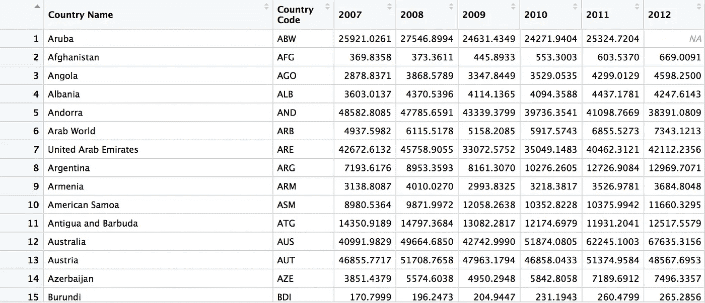

GDP per capita

选择了三个变量来表示创新和技术水平，即专利申请(居民)、专利申请(非居民)和固定宽带用户。

**专利申请**是指居民或非居民在本国申请的专利数量。

**固定宽带订阅数**是互联网订阅数(包括高速和固定电话)。

自变量是**人均 GDP 增长**，即国内生产总值除以年中人口。

为了在 R 中创建面板数据，我使用了 **reshape** 包来融合 4 个宽数据集(4 个变量)并将它们合并在一起。

```
# use reshape package
install.packages("reshape")
library(reshape)# melt data from wide format to long format
melt.data <- melt(raw.GDP, id.vars = c("country.code", "country.name"), value.name = "GDP")
```

最终数据集如下所示:

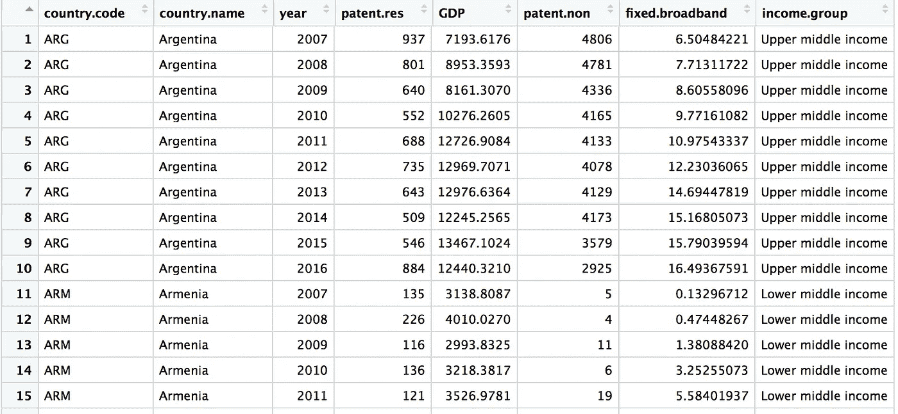

# 描述性分析和数据可视化

这是 10 年间 84 个国家的面板数据。专利申请和固定宽带都有一些缺失的价值。因此，面板是不平衡的。

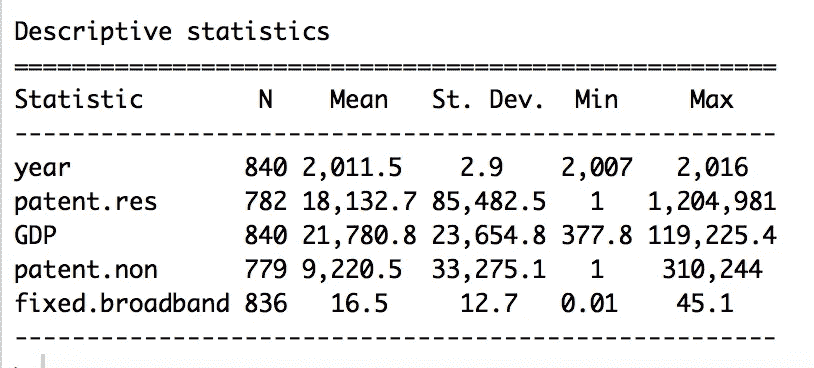

Figure 1: Descriptive Statistics

然而，如果没有问题的话，也就是说，在这个时期的中期，我不会忽略遗漏的观察。大部分缺失的数据要么是前两年(2007 年和 2009 年)，要么是最后一年(2017 年)。在专利申请(居民)方面，中国在 2017 年申请的专利数量最多(1，204，981 项专利)，而其他一些低收入群体国家每年仅申请一项专利。

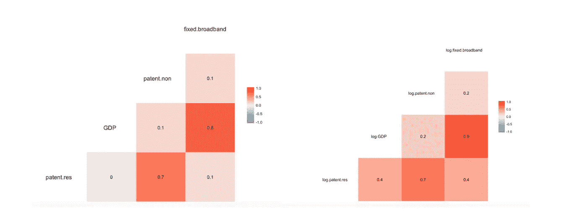

Figure 2: *Correlation plot on raw data and Correlation plot on data after a log transformation*

根据图 2(左)，固定宽带用户和人均 GDP(0.8)之间明显存在强正相关关系。然而，专利申请(居民和非居民)之间的相关性几乎为零。由于人均 GDP 通常呈指数增长，所以记录人均 GDP 可能有助于平滑数据。此外，其他变量的对数变换也有助于模型解释，因为系数基本上是弹性的。图 2(右)还显示，人均国内生产总值和其他独立变量之间存在正相关关系(见取对数后相关性如何变化)

# 诊断学

有几种计量经济学模型可能适用于面板数据集，如**普通最小二乘法、混合模型(OLS)、带有虚拟变量的 OLS、组内固定效应(贬低)、**和**随机效应。**

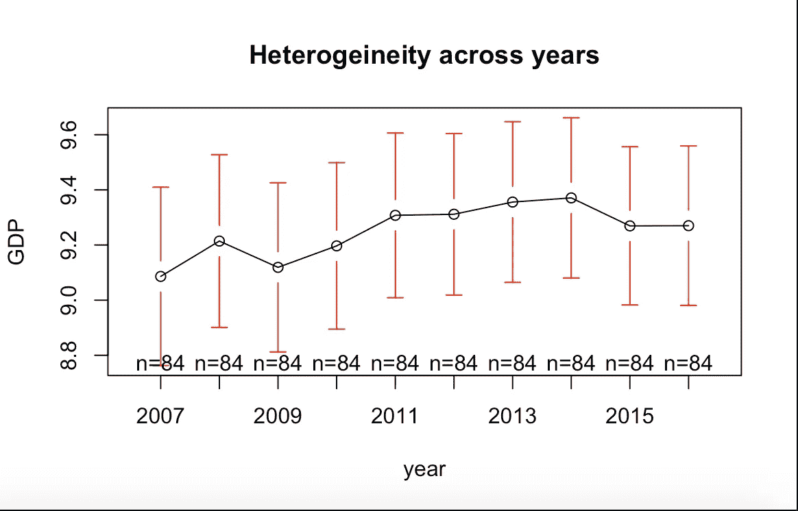

Figure 3: *Heterogeneity across years of GDP per capita*

请看图 3，在整个 10 年期间，人均国内生产总值有很大的波动和起伏，这表明数据集可能存在异质性。

**常规汇总 OLS** 回归不考虑国家组或多年时间段的异质性。通过将不同时期的不同国家混为一谈，Pool OLS 掩饰了上述国家间可能存在的异质性(个性或独特性)。所以这个模型不仅有偏差，而且不一致。

**OLS 假人**模型有几个缺点。首先，由于 OLS 虚拟引入了太多的虚拟变量，它失去了自由度。其次，由于模型中有许多虚拟变量，因此总是存在多重共线性的可能性。

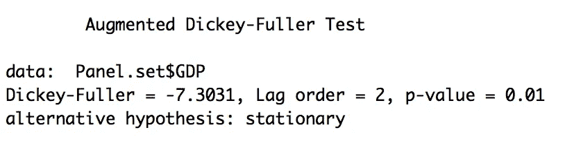

Figure 4: Stationary test on log transformed data

由于面板数据是横截面数据和时间序列数据的组合，在这种类型的数据上建立经济模型时有几个假设。Dickey-Fuller 检验检查数据是否平稳，该检验的 p 值为 0.01，因此我们可以拒绝数据不平稳的空值。

# 回归

所以这里我只报告固定的和随机的影响:

## 固定效果

日志[PC。gdp]𝑖𝑡=𝛽1*log[patent.res]𝑖𝑡+𝛽2*log[patent.non]𝑖𝑡+𝛽3*log[fixed.broadband]𝑖𝑡+𝜇𝑖𝑡

```
library(plm)
fixed <-plm(log.GDP  ~ log.patent.res + log.patent.non + log.fixed.broadband, data=data.final1, index=c("country.name", "year"), model="within")
summary(fixed)
```

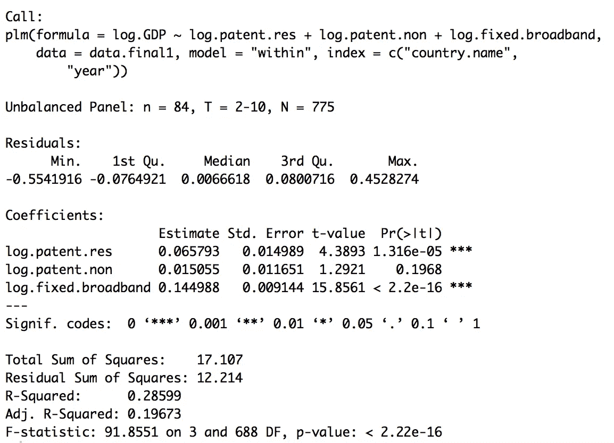

*Figure 5: Fixed Effects (demeaned) results*

**组内固定效应**模型考虑了 84 个国家之间的异质性，不是通过虚拟变量方法，而是通过对样本均值周围的样本观察值进行差分来消除异质性。这种方法的好处是它返回一致的斜率估计值。

根据回归结果，保持其他变量不变，平均而言，专利申请量(居民)每增加 1%，人均 GDP 增加 0.0657%。同样，固定宽带用户数每增加 1%，人均 GDP 增加 0.1449%。这两个系数都具有统计学意义。然而，专利申请变量(非居民)并不显著。R 平方为 0.28，相对较低。但是，对于面板数据，R 平方通常不高。

## 随机效应

日志(PC。gdp)𝑖𝑡= 𝛽0+𝛽1*log(patent.res)𝑖𝑡+𝛽2*log(patent.non)𝑖𝑡+𝛽3*log(fixed.broadband)𝑖𝑡+𝜔𝑖𝑡(𝜔𝑖𝑡=𝜇𝑖𝑡+贵阳)

```
random <-plm(log.GDP  ~ log.patent.res + log.patent.non + log.fixed.broadband, data=data.final1, index=c("country.name", "year"), model="random")
summary(random)
```

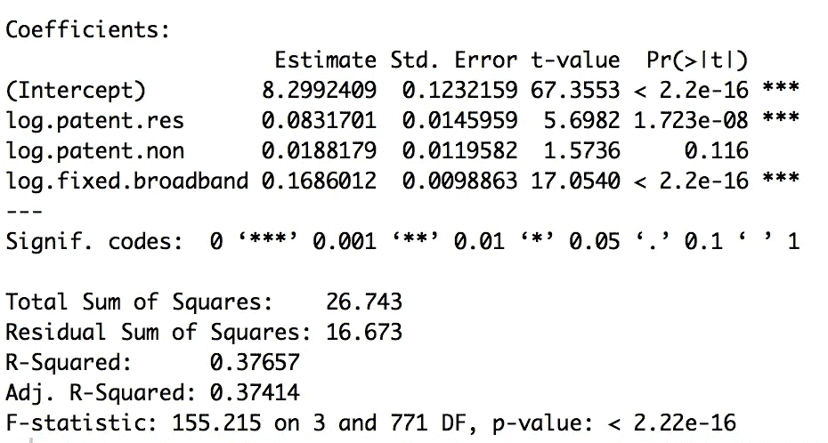

*Figure 6: Random Effects results*

如果附加误差项与模型中包含的任何解释变量都不相关，则随机效应可能是一个很好的模型。由于εi 是 wi t 的一个组成部分，因此误差项可能与解释变量相关。根据 Hausman 检验，如果随机效应中的附加误差项与解释变量相关，它将在给定的应用中告诉我们，随机效应模型是不一致的。因此，在这种情况下，固定效应是更好的模型。

```
# Hausman test
phtest(fixed, random)
```

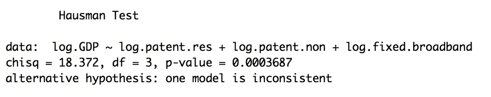

Figure 7: Hausman Test

现在，我们继续固定效应模型。还有一些假设我们需要验证。

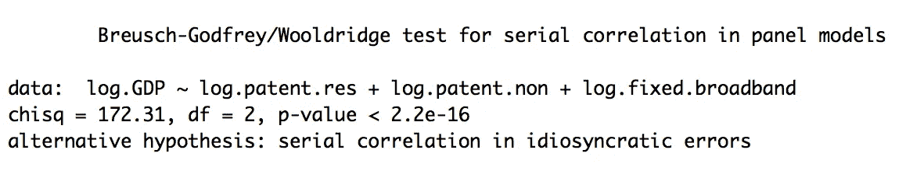

Figure 8: Breusch Godfrey/Wooldridge test

首先，Breusch Godfrey/Wooldridge 检验指出数据中实际上存在自相关或序列相关。

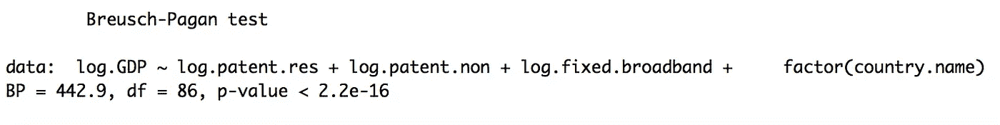

Figure 9: Breusch-Pagan test

此外，固定效应模型基本上是线性回归的扩展版本，因此确保数据的同质性是很重要的。我使用了 Breusch-Pagan 测试来检查同质性(线性模型假设)，结果数据是异方差的。如果我们继续使用固定效应模型(贬低)，自相关和异方差是需要注意的两件事。


*Figure 10: The result of Robust covariance matrix estimation (Sandwich estimator)*

我们仍然可以执行我们的回归分析来修正自相关和异方差的问题，以便我们的区间估计和假设检验是有效的。我们通过使用**鲁棒协方差矩阵估计(三明治估计器)**或简单的鲁棒标准误差来做到这一点。这里值得注意的是，系数在处理前后没有变化，但是标准误差和 p 值变化显著。

总之，固定效应(贬低)模型是这个面板数据集的适当模型。根据回归结果，经济增长(人均国内生产总值)与创新(居民专利申请)和技术(固定宽带用户)之间存在正相关关系。但是，模型本身和模型设置可以通过某些方式进行改进。首先，由于价值缺失和资源有限，这些数据并不完整。除了丢弃观察值之外，还有更好的方法来处理缺失值，例如输入中值或平均值。其次，自变量的选择也可以改进。R&D 支出和科学期刊数量等指标可纳入该模型。第三，不同收入群体的创新程度可能不同。创新可能有助于推动高收入国家的经济，但对低收入国家可能没有帮助。


Figure 11: *Magnitude of innovation among different income group countries*

图 11 表明，四个收入组的系数和截距实际上是不同的。最后，应该对专利申请制度进行更仔细的调查。一些国家实行“专利箱”政策，对专利或许可证等知识产权减税，因此高收入国家的大公司在“专利箱”国家申请大量专利。然而，这些公司实际上在本国比在申请专利的国家获益更多。