# 使用决策树的离散化

> 原文：<https://towardsdatascience.com/discretisation-using-decision-trees-21910483fa4b?source=collection_archive---------3----------------------->

## 从连续到离散


Photo by [Alua Magzumova](https://unsplash.com/@sherlockholmes26?utm_source=medium&utm_medium=referral) on [Unsplash](https://unsplash.com?utm_source=medium&utm_medium=referral)

# 1.介绍

离散化是通过创建一组跨越变量值范围的连续区间，将连续变量转化为离散变量的过程。

## 1.1 离散化有助于处理异常值和高度偏斜的变量

离散化有助于处理异常值，方法是将这些值与分布的剩余内层值一起放入较低或较高的区间。因此，这些异常值不再与分布尾部的其余值不同，因为它们现在都在同一区间/时段中。此外，通过创建适当的箱或区间，离散化可以帮助将偏斜变量的值分散到一组具有相同数量观察值的箱中。

## 1.2 离散化方法

有几种方法可以将连续变量转化为离散变量。这个过程也被称为**宁滨**，每个面元就是每个区间。离散化方法分为两类:**监督的和非监督的**。

***无监督方法*** *除了变量分布*之外，不使用任何信息来创建将放置值的连续箱。

***监督方法*** *通常使用目标信息来创建仓或区间。*

在本文中，我们将只讨论使用决策树的监督离散化方法

但是在进入下一步之前，让我们加载一个数据集，我们将在其上执行离散化。

# 决策树离散化

决策树离散化包括使用决策树来确定最佳分裂点，这些分裂点将决定仓或连续区间:

***第一步*** :首先它使用我们要离散化的变量训练一个有限深度(2、3 或 4)的决策树来预测目标。

***第二步:*** 原来的变量值然后被树返回的概率代替。对于单个仓内的所有观察值，概率是相同的，因此用概率替换等同于在由决策树决定的截止范围内对观察值进行分组。

**优点:**

*   决策树返回的概率预测与目标单调相关。
*   新的箱显示出降低的熵，这是因为每个桶/箱内的观察结果与其自身比与其他桶/箱的观察结果更相似。
*   该树会自动找到垃圾箱。

**缺点:**

*   这可能会导致过度拟合
*   更重要的是，可能需要对树参数进行一些调整，以获得最佳分割(例如，深度、一个分区中样本的最小数量、分区的最大数量以及最小信息增益)。这很费时间。

让我们看看如何*使用 [Titanic 数据集对决策树执行离散化](https://www.kaggle.com/francksylla/titanic-machine-learning-from-disaster)*。

1.  ***导入有用的库***

```
IN[1]:
import pandas as pd
import numpy as np
import matplotlib.pyplot as plt
from sklearn.model_selection import train_test_split
```

2. ***加载数据集***

```
IN[2]:
data = pd.read_csv('titanic.csv',usecols =['Age','Fare','Survived'])
data.head()
```

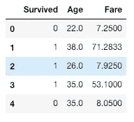

*3。* ***将数据分成训练集和测试集***

```
IN[3]:
X_train, X_test, y_train, y_test = train_test_split(data[['Age', 'Fare', 'Survived']],data.Survived , test_size = 0.3)
```

因此，假设我们在数据集中没有缺失值(或者即使我们在数据集中有缺失数据，我们也对它们进行了估算)。我离开这一部分是因为我的主要目标是展示离散化是如何工作的。

那么，现在让我们将数据可视化，以便从中获得一些见解并理解变量

***4。让我们使用*** `***age***` ***构建一个分类树来预测*** `***Survived***` ***，以便离散化*** `***age***` ***变量。***

```
IN[4]:
tree_model = DecisionTreeClassifier(max_depth=2)tree_model.fit(X_train.Age.to_frame(), X_train.Survived)X_train['Age_tree']=tree_model.predict_proba(X_train.Age.to_frame())[:,1] X_train.head(10)
```

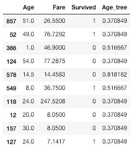

现在我们有了一个使用`age`变量预测`Survived`变量的分类模型。

新创建的变量`Age_tree`包含数据点属于相应类别的概率

***5。检查*** `***Age_tree***` ***变量*** 中唯一值的数量

```
IN[5]:
X_train.Age_tree.unique()
```

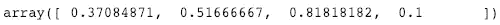

***为什么只有四种概率正确？***

*在上面的输入 4 中，我们提到了* `*max_depth = 2.*` *一个深度为 2 的树，进行了 2 次拆分，因此生成了 4 个桶，这就是为什么我们在上面的输出中看到 4 个不同的概率。*

**6*6。检查离散变量*** `***Age_tree***` ***和目标*** `***Survived***` ***之间的关系。***

```
IN[6]:
fig = plt.figure()
fig = X_train.groupby(['Age_tree'])['Survived'].mean().plot()
fig.set_title('Monotonic relationship between discretised Age and target')
fig.set_ylabel('Survived')
```

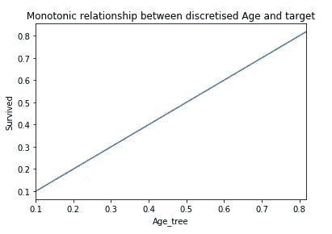

这里，我们可以看到离散变量`Age_tree`和目标变量`Survived`之间的单调关系。该图表明`Age_tree`似乎是目标变量`Survived`的一个良好预测器。

***7。检查每个概率桶/箱的乘客数量是否低于离散变量的分布。***

```
IN[7]:
X_train.groupby(['Age_tree'])['Survived'].count().plot.bar()
```

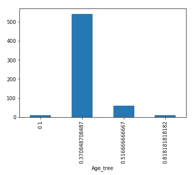

让我们通过捕获每个概率桶的最小和最大年龄来检查由树生成的年龄限制桶，以了解桶的界限。

***8。检查树*** 生成的年龄限制桶

```
IN[7]:
pd.concat( [X_train.groupby(['Age_tree'])['Age'].min(),
            X_train.groupby(['Age_tree'])['Age'].max()], axis=1)
```

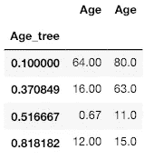

于是，决策树生成了桶:`0–11`、`12–15`、`16–63` 、
、`46–80`，生存概率分别为`0.51`、`0.81`、`0.37`和`0.10`。

***9。想象这棵树。***

```
IN[8]:
with open("tree_model.txt", "w") as f:
    f = export_graphviz(tree_model, out_file=f)from IPython.display import Image
from IPython.core.display import HTML 
PATH = "tree_visualisation.png"
Image(filename = PATH , width=1000, height=1000)
```

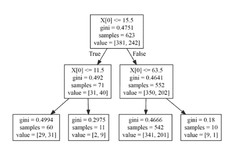

Tree Visualisation

从图中可以看出，我们为`max_depth=2`获得了 4 个箱。

正如我前面提到的，我们可以使用决策树优化许多参数，以获得最佳的 bin 分裂。下面我将为演示优化树的深度。但是请记住，您还可以优化决策树的其余参数。访问 [sklearn 网站](http://scikit-learn.org/stable/modules/generated/sklearn.tree.DecisionTreeClassifier.html#sklearn.tree.DecisionTreeClassifier)查看还有哪些参数可以优化。

***10。选择树的最佳深度***

我将构建不同深度的树，并将计算为每棵树的变量和目标确定的 *roc-auc* ，然后我将选择产生最佳 *roc-auc* 的深度

```
IN[9]:
score_ls = []     # here I will store the roc auc
score_std_ls = [] # here I will store the standard deviation of the roc_aucfor tree_depth in [1,2,3,4]:
    tree_model = DecisionTreeClassifier(max_depth=tree_depth)

    scores = cross_val_score(tree_model, X_train.Age.to_frame(),       
    y_train, cv=3, scoring='roc_auc')   

    score_ls.append(np.mean(scores))

    score_std_ls.append(np.std(scores))

temp = pd.concat([pd.Series([1,2,3,4]), pd.Series(score_ls), pd.Series(score_std_ls)], axis=1)temp.columns = ['depth', 'roc_auc_mean', 'roc_auc_std']print(temp)
```

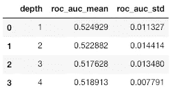

在这里，我们可以很容易地观察到，我们使用深度 1 或 2 获得了最佳的 roc-auc。我将选择 2 的*深度继续。*

***11。使用*** 树变换 `***Age***` ***变量***

```
IN[10]:
tree_model = DecisionTreeClassifier(max_depth=2)tree_model.fit(X_train.Age.to_frame(), X_train.Survived)X_train['Age_tree'] = tree_model.predict_proba(X_train.Age.to_frame())[:,1]X_test['Age_tree'] = tree_model.predict_proba(X_test.Age.to_frame())[:,1]
```

***12。检查火车集合*** 中转换后的 `***age***` ***变量***

```
IN[11]:
X_train.head()
```

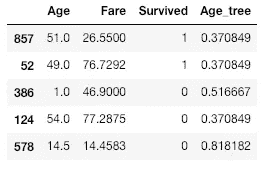

***13。检查列车组*** 中每个箱的唯一值

```
IN[12]:
X_train.Age_tree.unique()
```

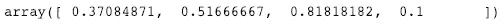

***14。检查测试集*** 中转换后的 `***age***` ***变量***

```
IN[13]:
X_test.head()
```

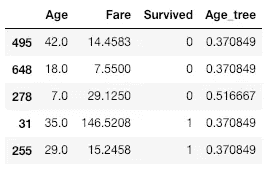

**15*。检查列车组*** 中每个箱的唯一值

```
IN[14]:
X_test.Age_tree.unique()
```


现在，我们已经成功地将`Age`变量离散为四个离散值，这可能有助于我们的模型做出更好的预测。

如果我们想要像`Fare`一样离散化剩余的变量，我们也可以执行相同的程序。