# 剖析 NBA 选秀

> 原文：<https://towardsdatascience.com/dissecting-the-nba-draft-ee175d7aec31?source=collection_archive---------3----------------------->

Photo by [JC Gellidon](https://unsplash.com/@jcgellidon?utm_source=medium&utm_medium=referral) on [Unsplash](https://unsplash.com?utm_source=medium&utm_medium=referral)

NBA 总决赛后，NBA 总经理和体育迷都期待着这个夏天唯一的篮球赛事——NBA 选秀。该草案是臭名昭著的，因为它创造了总经理的职业生涯，粉碎了球迷的希望，并创造了联盟的未来之星。

每个人都在挠头，波特兰是如何选中格雷德·奥登而不是凯文·杜兰特的，或者伊塞亚·托马斯，2017 年 NBA 季后赛的宠儿，是如何滑落到选秀的最后一个选秀权的。马后炮当然是 20–20；当时，除了第二轮，没有一个头脑正常的人会选一个 5 英尺 9 的控卫，也许开拓者真的需要一个中锋。

像奥登和托马斯的故事，典型的“破产”和“盗窃”草案，是 GMs 必须能够预测的。能够区分潜在的 NBA 成功和大学生涯对于建立一个稳固的 NBA 球队至关重要。对于挣扎着与 NBA 精英竞争的小市场球队来说，这种能力更为重要。

# NBA 选秀历史

在深入分析之前，我想看看选秀权是如何产生的。

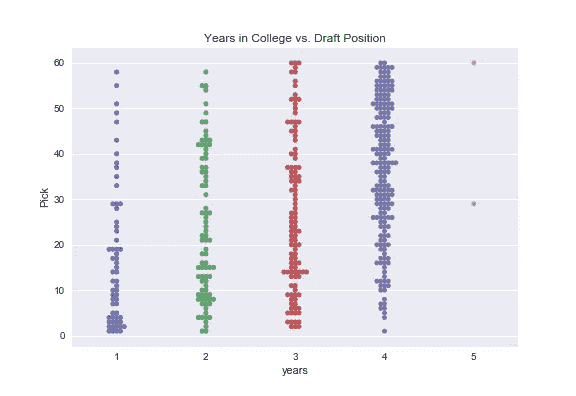

Figure 1

对于国内，在 2003 年到 2012 年之间被选中的球员，我们没有看到任何令人惊讶的事情。大多数第一年和第二年的选手都是在第一轮中被选中的。这些球员通常表现出很高的能力增长潜力，并被描述为有很高的上限。第三年的球员被分开，而大学老兵大多在第二轮。这些球员在大学里已经展示了他们的极限；他们通常会在每轮比赛的最后阶段落败，并被那些寻找角色球员而非明星的老牌球队拿下。

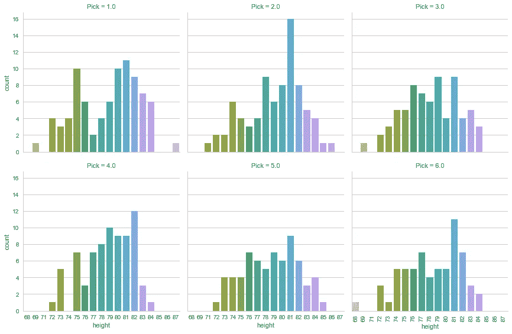

Figure 2

在这里，我把选秀分成了 6 个部分(也就是说，第 1-10 号选秀权是第 1 部分，依此类推)，并且查看了每个部分中被选中的球员的身高。

最有趣的细胞是第一个，我们看到了高度的双峰分布。似乎在前 10 个选秀权中，球队要么选择控卫，要么选择中锋。前十个选秀权通常是抽签中的球队；这些球队挣扎了相当一段时间，急需重要的位置球员。这些球队正在寻找能给他们的球队带来价值和得分的中锋和控卫。

# 检查草稿结果:查看 Win Share

教师通常很难单独给小组项目的成员打分。他们通常必须回答“每个学生对成绩贡献了多少？”。幸运的是，我们不是老师，而 NBA 已经提出了**胜利份额**，一种确定个人对团队成功贡献的方法。此处对赢得份额的定义更加明确[。](http://www.basketball-reference.com/about/ws.html)

让我们来看看大学经历和选秀位置是如何与 NBA 胜率相关联的。

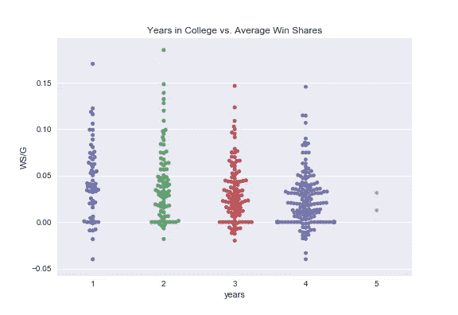

Figure 3

我们看到，一年球员在他们未来的 NBA 赢球份额中有更多的方差，而 4 年球员的方差较小。这一数据有力地表明，年龄较大的大学生球员确实比年轻球员有一个较低的上限，但不像年轻球员那样有风险。当总经理挑选第一年或第二年的球员来提升他们的特权时，他们是在正确的轨道上(尽管相关性并不意味着因果关系)

现在让我们来看看选秀位置与未来 NBA 胜率的关系。

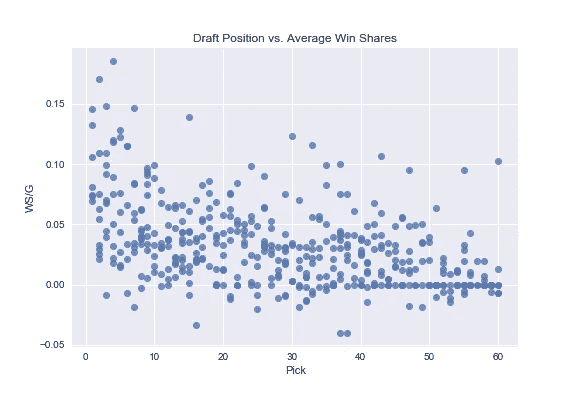

Figure 4

看起来好像在草稿位置和赢股之间有负相关。在大约第 30 次选秀权之后，未来的 NBA 赢球份额似乎没有变化。然而，这张图表还有很多需要解释的地方。事实上，未来 NBA 赢球份额的最大预测因素是什么？为了理解这一点，我绘制了每所大学的统计数据与未来 NBA 胜率的对比图。让我们来看看结果。

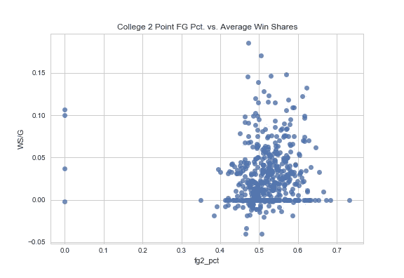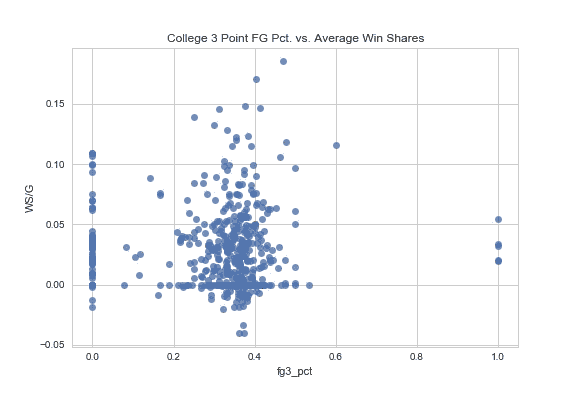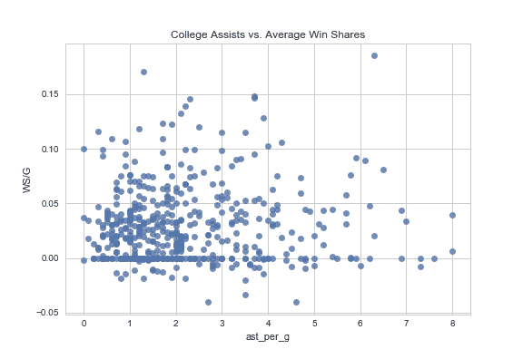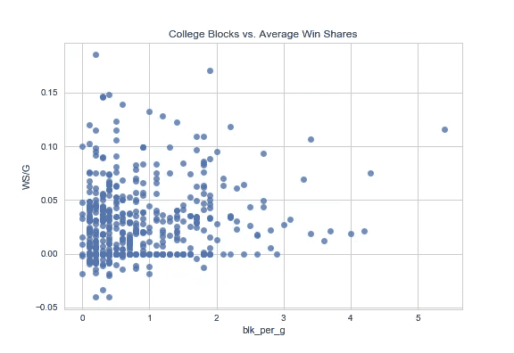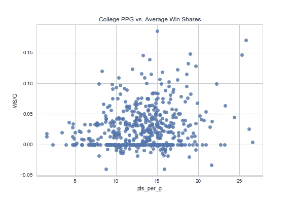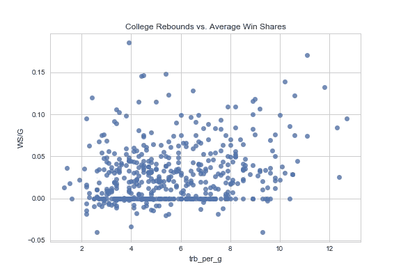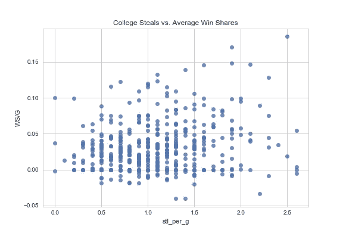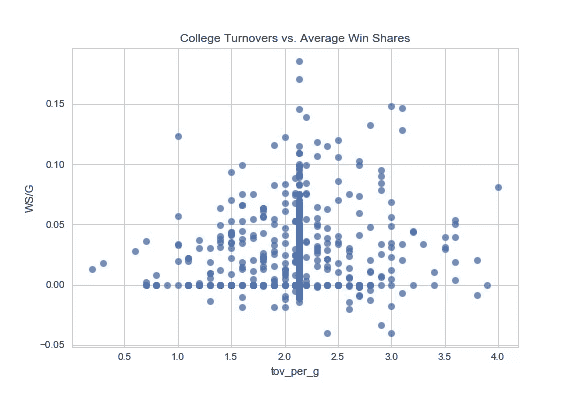

Figure 5

快速浏览一下，我们可以看到失误，抢断，3 分率和 2 分率并没有转化为 NBA 赢球份额。但是分，助攻，篮板，盖帽之间是正相关的。这确实表明这些统计数据可能会转化为 NBA 水平，这让我们深入了解某个球员将如何在 NBA 做出贡献。

# 预测成功份额:实现神经网络

对于 GMs 来说，获取一名大学生球员的数据，并预测该球员在 NBA 职业生涯中的贡献将是非常有用的。我已经建立并训练了一个神经网络来做到这一点。*以下是 2017 年 NBA 选秀参与成员的预计获胜份额结果，按降序排列。请注意，成功份额高度依赖于团队。这些预期的成功份额可以被认为是职业生涯的平均值。

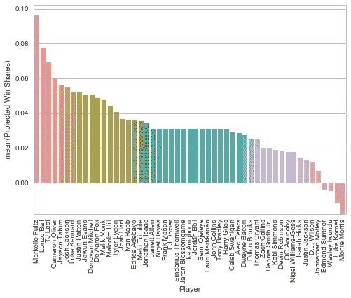

Figure 6

我们立即注意到，富尔茨、鲍尔、塔图姆和约什·杰克逊排在前 10 名，德阿龙·福克斯和马利克·蒙克排在前 15 名。我们确实有一些有趣的发现。T.J .利夫、卡梅隆·奥利弗和其他几位大人物也跻身前 20 名。这种方法并不意味着这些球员应该按照这个顺序被选中；这仅仅表明，这些球员在他们的 NBA 职业生涯中预计会有这些赢球份额。

# 识别盗窃和抢劫:SoftMax(多项式)回归

使用经过训练的神经网络*将选秀权分为第一轮、第二轮或介于两者之间的某个阶段，我们可以确定 2017 年选秀中的哪些球员属于哪一轮。结果如下:

Figure 7

我们可以很快识别出“偷东西”的人。这些玩家属于第 2 级或第 1.5 级玩家，但他们的获胜份额高于第 50 个百分点。这些球员包括弗兰克·梅森、奈杰尔·海耶斯、约什·哈特和马尔科姆·希尔。有趣的是，该算法将贾文·埃文斯和卡梅隆·奥利弗归类为一级球员，尽管许多选秀网站都预测他们将在第二轮比赛中进入球队。

我将半身像定义为被归类为 1 级玩家，但没有表现出高获胜份额潜力的玩家。使用这个定义，我可以确定奈杰尔威廉姆斯戈斯，贾斯廷·杰克逊，狄龙布鲁克斯，丹尼斯史密斯小几个。

值得注意的是，球员在选秀中的位置高度依赖于球队及其未来的具体需求。这个工具主要用于识别在大学篮球世界中可能被忽视的离群值。

# 方法

## 数据抓取

*使用 Python 的 [BeautifulSoup](http://web.stanford.edu/~zlotnick/TextAsData/Web_Scraping_with_Beautiful_Soup.html) 包，我能够从这个[网站](http://www.sports-reference.com/cbb/)抓取到 2003 年至 2012 年期间每个国内大学生球员的以下统计数据:

1.  名字
2.  在校时间
3.  上过的大学
4.  投篮命中率(2 分和 3 分投篮)
5.  助攻/比赛
6.  篮板/比赛
7.  积木/游戏
8.  点数/游戏
9.  抢断/比赛
10.  以英寸表示的高度
11.  以磅为单位的重量
12.  赢得股份/游戏(仅限 NBA 职业生涯)

## 回归神经网络

使用 Python 的 Keras 包，这里是具有以下结构的全连接深度网络:

*   具有 11 个节点的输入层
*   具有 8 个节点的隐藏层，重新激活
*   具有 16 个节点的隐藏层，ReLU 激活
*   丢失 0.5 的丢失层
*   具有 1 个节点的输出层，线性激活

模型参数

*   纪元:1000，提前停止
*   损失:均方误差
*   优化器:Adam

## 用于分类的神经网络

使用 Keras 库，所使用的网络具有以下结构:

*   输入层:11 个节点
*   隐藏层:1 个节点，重新激活
*   隐藏层:100 个节点，重新激活
*   输出层:2 个节点，SoftMax 激活

模型参数:

*   损失:二元交叉熵
*   优化器:Adam
*   纪元:40，提前停止
*   模型达到了 66%的准确率

****这篇文章的创意归功于我的好朋友 Brian Wahlig ****