# 剖析 NBA 选秀:第二部分

> 原文：<https://towardsdatascience.com/dissecting-the-nba-draft-part-2-79b6bd486a8d?source=collection_archive---------11----------------------->

Photo by [Ramiro Pianarosa](https://unsplash.com/@rapiana?utm_source=medium&utm_medium=referral) on [Unsplash](https://unsplash.com?utm_source=medium&utm_medium=referral)

NBA 总决赛后，NBA 总经理和体育迷都期待着这个夏天唯一的篮球赛事——NBA 选秀。该草案是臭名昭著的，因为它创造了总经理的职业生涯，粉碎了球迷的希望，并创造了联盟的未来之星。

每个人都在挠头，波特兰是如何选中格雷格·奥登而不是凯文·杜兰特的，或者 2017 年 NBA 季后赛的宠儿伊塞亚·托马斯是如何溜到最后一个选秀权的。马后炮当然是 20–20；当时，除了第二轮，没有一个头脑正常的人会选一个 5 英尺 9 的控卫，也许开拓者真的需要一个中锋。

像奥登和托马斯的故事，典型的“破产”和“盗窃”草案，是 GMs 必须能够预测的。能够区分潜在的 NBA 成功和大学生涯对于建立一个稳固的 NBA 球队至关重要。对于挣扎着与 NBA 精英竞争的小市场球队来说，这种能力更为重要。

# 动机

典型的选秀模式只会使用进入联盟的球员来决定被选中候选人的成功与否。这很好，但是这个模型假设这个球员会在 NBA 打球。这种类型的模型有助于确定可以成为可靠贡献者的玩家。此外，它可以量化当前大学球员的选秀“股票”

# NBA 选秀数据

NylonCalculus 的合著者[安德鲁·约翰逊](https://www.thestepien.com/2018/05/18/model-for-question-nba-or-not/)对[的](https://www.thestepien.com/2018/05/15/college-basketball-draft-model-starter-kit-database/)伟大的[威尔·施里弗](https://twitter.com/ReferSadness?lang=en)提供的数据做了最好的描述。简而言之，每个大学球员都有一个条目，包含该球员在校期间每年的年度总数、高级统计数据和每 40 分钟的数据。每个条目都与个人大学毕业后的最高水平相关联。标签包括以下:NBA，国际，夏季联赛，G 联赛。

为了这个分析的目的，根据安德鲁·约翰逊的建议，我用国际标签代替了夏季联赛和 G 联赛的标签，因为这些区别在决定 NBA 的潜力时并不太相关。因此，这个问题变成了一个不平衡的二分类任务。

我还选择了只使用每个球员大学生涯的最后一个条目。对我来说，这是最合理的，因为每个潜在客户都是根据他们的最终状态进行评估的。当一个高年级学生宣布参加选秀时，他在第一年的表现没有得到评估；相反，当他准备好宣布时，他是由谁来评价的。在我的下一篇文章中，我会改变这个假设，但是现在让我们继续下去。

最后，我按职位和年份对每个特征进行了百分位数排名。通过这种方式，人们可以知道与其他竞争者相比，一个人的表现如何。

# 数据探索和可视化

* * * TL 结果在底部***

在深入模型构建过程之前，让我们先看看所使用的特性集。

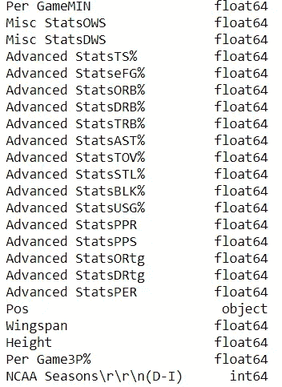

Features to consider for Classifier

这些统计数据的解释可以在[这里](https://basketball.realgm.com/info/glossary)找到。在这里，我们可以包括一个球员的翼展和三分球命中率，因为这些品质通常决定了防守潜力和得分能力(这两种品质对 NBA 前端办公室都有吸引力)。

在创建模型之前，我们可以看看是否可以通过降低维度来分离出我们感兴趣的类别。

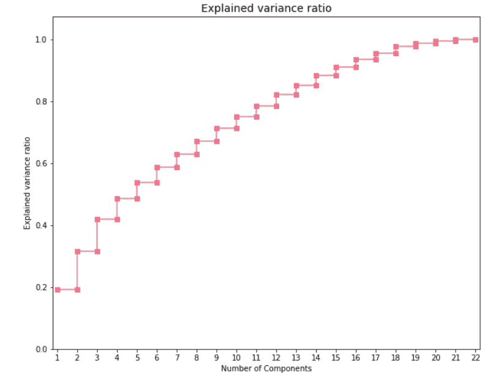

This graph shows how much variance in the data is explained by each principal component

为了做到这一点，我们采用了一种常见的方法叫做 [PCA](http://setosa.io/ev/principal-component-analysis/) 。我们可以从右侧的解释方差图中看到，约 12 个分量解释了数据中约 80%的方差。利用这些信息，我们可以将数据转换到低维空间。在二维和三维空间中，我们真的看不到任何阶级的分离。

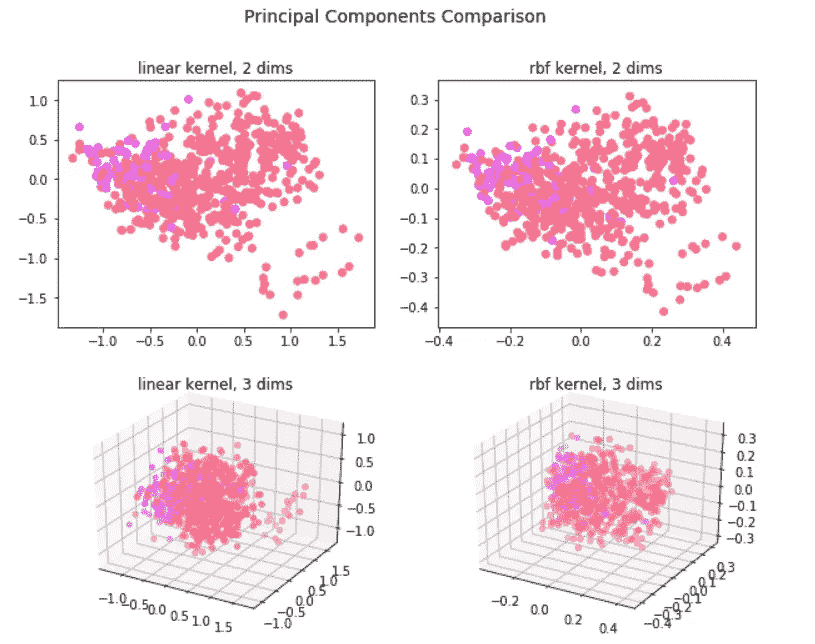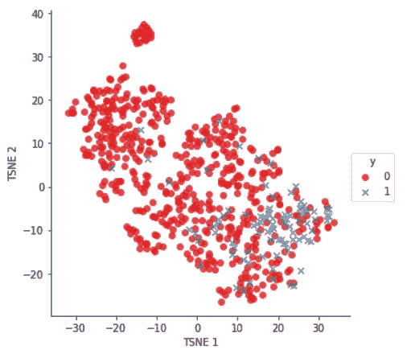

PCA/TSNE visualization of the Centers (pink and blue represent NBA players)

为了可能在另一个特征空间中得到分离，我们对数据的前 12 个 PCA 分量实施 [t-sne](https://medium.com/@luckylwk/visualising-high-dimensional-datasets-using-pca-and-t-sne-in-python-8ef87e7915b) 特征变换。然而，我们可以看到，在这种情况下，这些类也没有明显的区别。

# 模型构建方法

由于数据集中 NBA 实例的数量非常少，我无法使用精确度这样的指标来确定模型的有效性。在我们的情况下，我们不希望假阳性(将平庸的球员归类为 NBA 值得的球员)，我们也不希望假阴性(将 NBA 口径的球员误归类为国际球员)。在我们的例子中，两者都一样糟糕(尽管其中一个可以为另一个辩护)。为了评估模型性能，我将使用 F1 分数。

## 最近邻方法

由于我们有一个高维数据集，k-NN 方法并不真正有效。相反，我按位置将数据分段，并将数据转换成其前两个主成分，因为似乎有一点分离(如前所示)。我本可以对 2 种成分的 231 种可能的组合进行彻底的搜索，但是那太费时间和计算量了。在对几个 k 值、加权方法和核方法(用于 PCA)进行网格搜索后，对于每个位置，我绘制了 ROC/AUC 曲线。

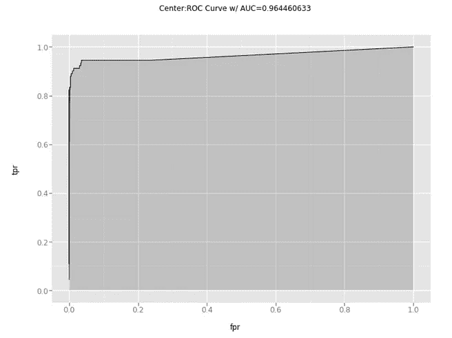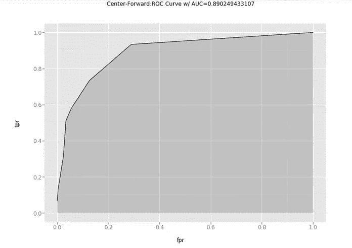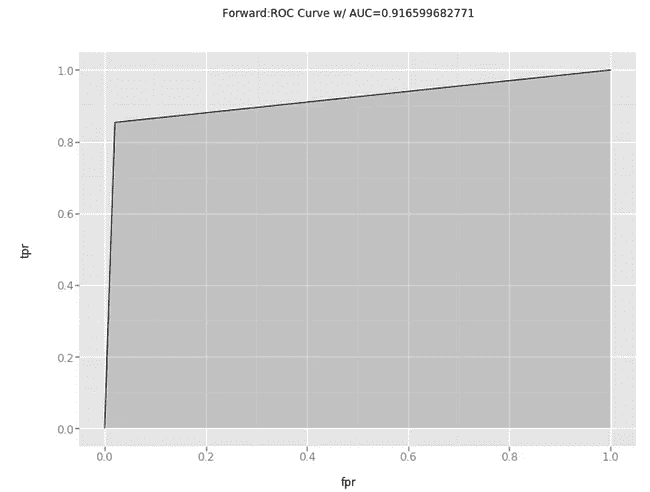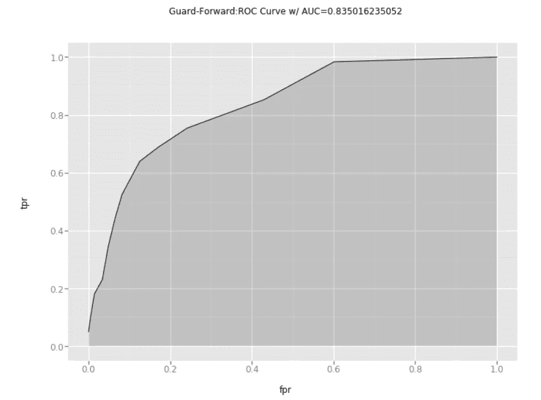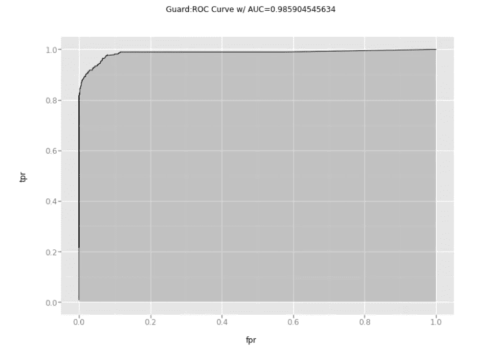

The area under the curve represents the model’s ability to discriminate between classes. The closer the area to 1, the better!

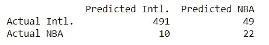

OOS Confusion Matrix for Guards

从上面来看，这个模型似乎有最成功的区分警卫。

尽管相当成功，这里的模型不是很好解释。我们想知道哪些特征与 NBA 潜力相关。

## 逻辑回归(按位置分段)方法

对于这种方法，我按照位置对数据进行分段，并利用前面描述的特征为每个位置创建一个单独的模型。我对损失函数进行加权，使其与类别频率的倒数成比例(即 NBA 标记的样本具有较高的权重，因为它们出现的频率较低)。

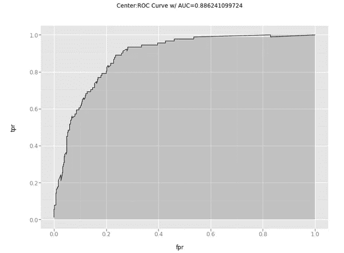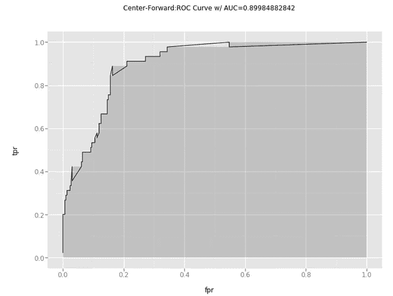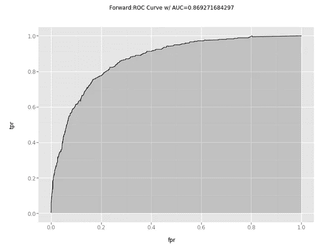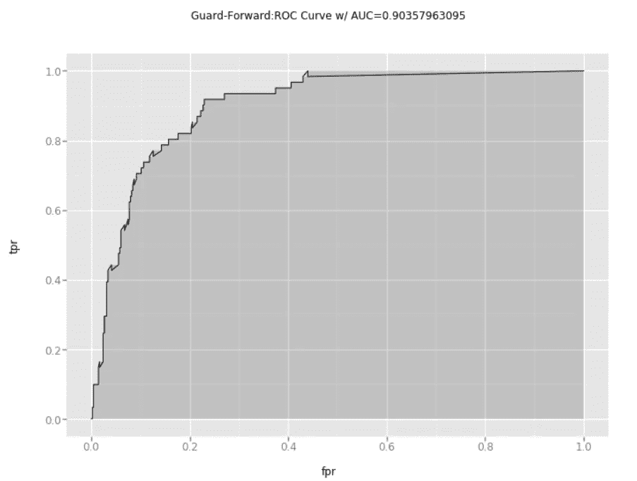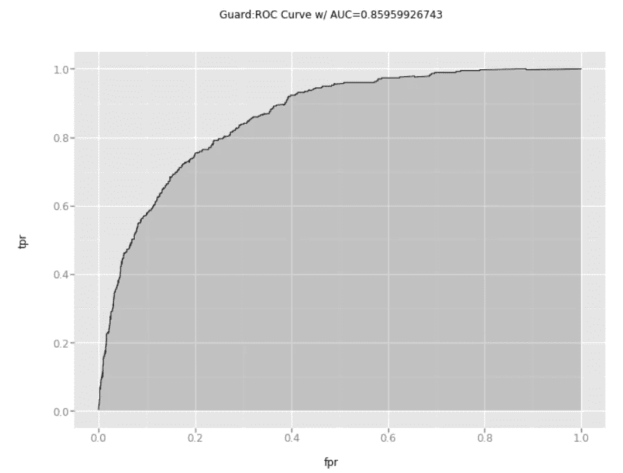

与 k-NN 方法相比，这里的模型稍差一些。看一看警卫的分类矩阵，我们可以看到一些有趣的东西。

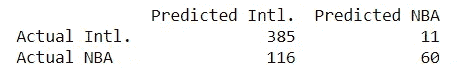

OOS Confusion Matrix for Guards

与 k-NN 方法相比，该模型倾向于低估 NBA 人才。这里假阳性率低，假阴性率高。

因为我们想要可解释的特征，我们可以查看每个位置的每个模型的系数。请记住，增加对应于正系数值的特征值会将赔率推向 1，而增加对应于负系数值的特征值会将赔率推向 0。

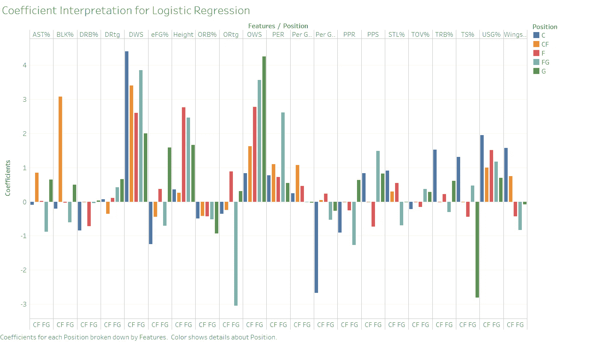

我们可以立即注意到一些趋势。毫不奇怪，进攻/防守赢球份额、PER、使用率%、每场比赛分钟数和身高是最大的影响因素。然而，在组内，我们可以看到 PPR(纯得分率)和 PPS(每次投篮得分)是 NBA 后卫潜力的预测。对于大个子来说，翼展和防守数据，比如 BLK%和 STL%是很重要的。

有些系数很奇怪(例如，更高的 TOV%对守卫有利)，但这是由于混杂效应。例如，高 TOV%可能意味着该球员经常拿球，并有望得分(即有价值的球员)。此外，高 TOV%预计来自新生的现象，因为他们正在适应大学比赛的严酷。在这种情况下，模型可能会收到一次性信号。

## 随机森林分类器方法

考虑到分类任务的难度，我认为利用非线性模型是有益的。在这个方法中，我没有按照位置进行分离，而是按照顺序对分类位置进行编码。该方法比一次热编码(减少的特征空间)执行得更好。我再次使用了同样的加权损失函数。

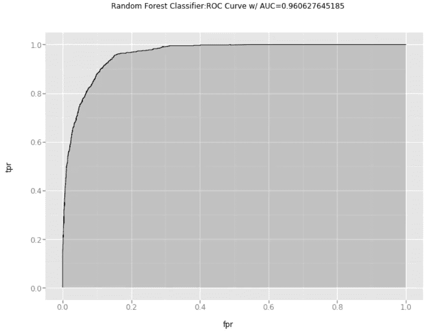

这里，曲线下的区域看起来很有希望。如果我们看一下混淆矩阵，我们会发现我们实际上做得很好。

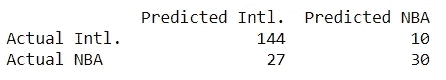

OOS RFC Conf. Matrix

我们可以在这里进行同样的系数分析。对于决策树来说，由于涉及到非线性，所以有些不同。在这里，特征重要性表明模型认为分割特定特征有多重要。

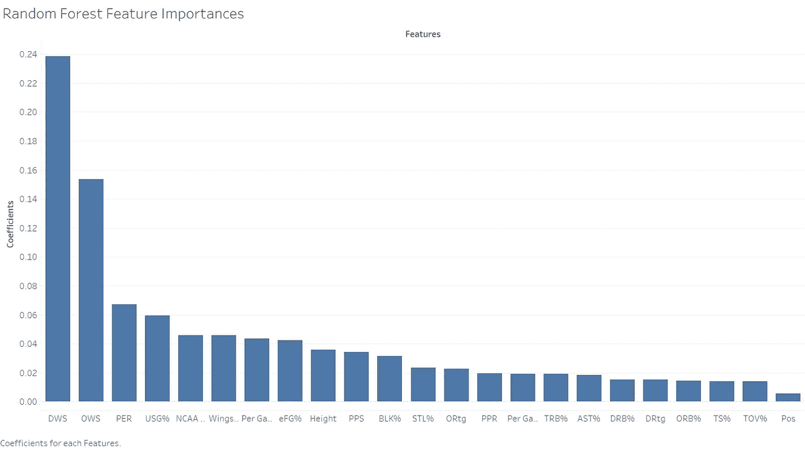

与我们在逻辑回归模型中看到的类似，DWS/OWS、PER 和使用百分比主导着决策过程。也像逻辑回归系数的解释一样，我们可能会看到共线性的影响。例如，TOV%可能被低估，因为它包含在 PPR。

## 逻辑回归(再次！)方法

这里，我实现了位置的一次性编码，而不是分割数据。使用了相同的加权损失函数。

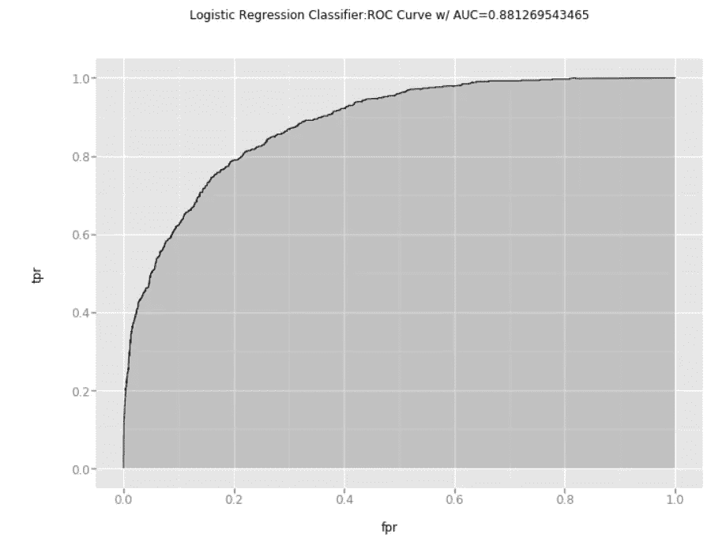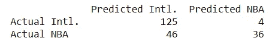

与 RandomForest 相比，这里的逻辑回归虽然不太成功，但也不错！再一次，这个模型很有可能会错过相当多的 NBA 天才球员。

## 讨论

对于这些 NBA 球员来说，很容易检测出正负方向的异常值。我认为困难在于对其余的人进行细微的区分。令我印象深刻的是，在只有二维数据的情况下，k-NN 分段分类器能够与逻辑(分段)分类器一样好，如果不是更好的话。我最初认为，按职位对数据进行细分可以更精确地对各组进行分类，因为职位之间的区别更容易界定。然而，这种分割方法并没有证明比简单的 RandomForestClassifier 更有效。

# 结果！

上述模型的应用是所有这些中最令人兴奋的部分。

## 识别过去的成功和失败

就像安德鲁在他的帖子里做的一样，我填充了给定的数据，并寻找最大的抢断(进入 NBA 的赔率非常低的家伙)和破产(没有进入联盟的赔率很高的家伙)。

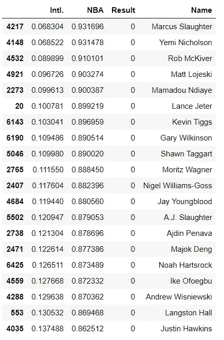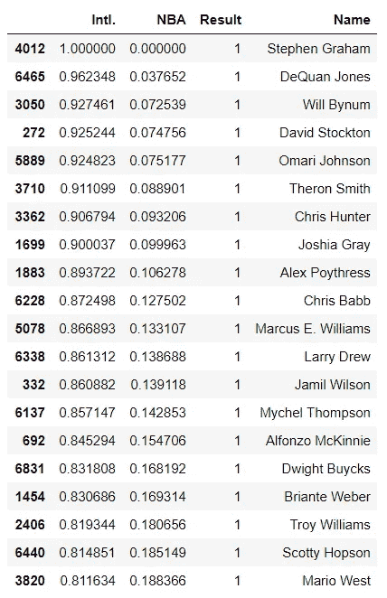

Biggests Busts (left) and Biggest Steals (Right)

其中有些是不公平的。比如奈杰尔-威廉姆斯·戈斯，大学毕业才一年，我们就真的给他贴上国际的标签是不公平的。未来的改进可能是只关注那些离开大学时代至少 3-4 年的球员。

值得注意的缺席者包括威尔·拜纳姆、布里安特·韦伯和特洛伊·威廉姆斯，他们都为 NBA 球队做出了不可忽视的贡献。此外，有趣的是，该模型对马库斯·斯劳特、诺亚·哈特索克和艾克·奥福格布这样的多面手过于乐观。

## 去年的班级

出于好奇，我想知道我们是否能预测到凯尔·库兹马、塔图姆或米切尔会像他们一样出现在新秀舞台上。

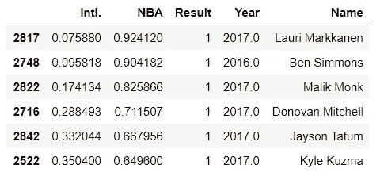

这一模式在塔图姆和库兹马的评分较低，而在扮演马里克·蒙克的评分较高。这个模型并没有预测 NBA 的成功，所以重要的是要有所保留。

## 分析草稿库存

有了这样的模型，看看今年选秀班的股票(进入 NBA 的概率)在他们的大学生涯中是如何上升和下降的会很有用。此外，该模型可以用来预测一个球员是否应该在他职业生涯的某个特定阶段参加选秀。

回顾今年的课程，一些非一蹴而就的前景:

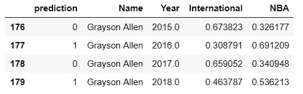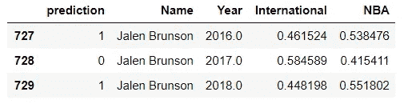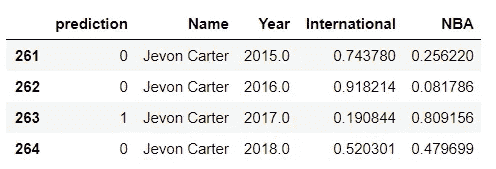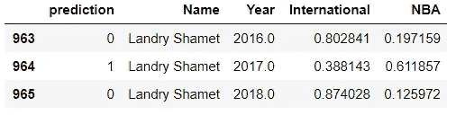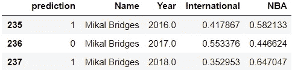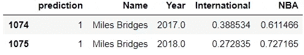

从左至右，我们有格雷森艾伦，彭江雨布伦森，杰冯卡特，兰德里沙梅特，米卡勒布里奇斯和迈尔斯·布里奇斯。

显而易见，一个玩家的股票可能会暴涨暴跌。以杰冯·卡特为例。大三是他最成功的一年，他有 80%的机会进入 NBA。然而，今年，他的表现使他降到了 50%以下。

格雷森·艾伦在 2017 年做出了正确的决定，回来参加高年级赛季，因为他的股票相当低。今年被大多数球探喜欢的沙梅特，预计在 NBA 的投篮命中率很低。然而，这可能是因为他的受伤限制了他的上场时间。

## 按职位排列今年的潜在客户

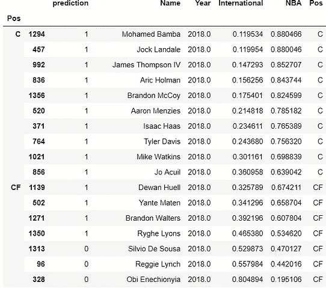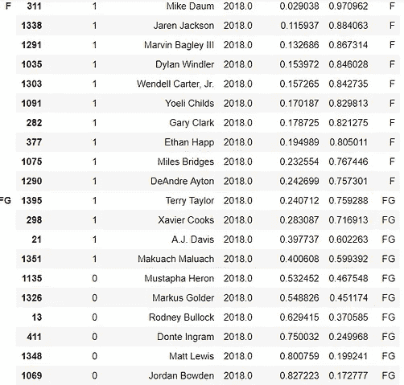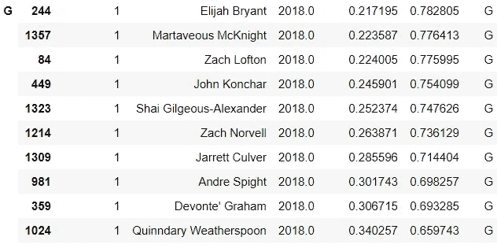

我们看到像迈尔斯·布里奇斯、艾顿、杰克森和巴格利这样的球员出现在顶级前锋中。当然，邦巴是中心班的佼佼者。有趣的是，被球探高度看好的特蕾·杨和科林·塞克斯顿并没有出现在顶级后卫中。两人都有望进入 NBA(分别为 58%和 54%)。

## 最近的发展

一些运动员从选秀中退出了他们的名字，而另一些则使他们自己有资格。退出选秀的几个著名的名字是 Tyus Battle(锡拉丘兹)、Jontay Porter(米佐)、Jaylen Hands(加州大学洛杉矶分校)和卢克马耶(北卡罗来纳大学)。让我们看看他们的决定是否正确。

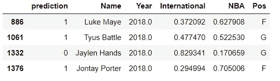

从模型来看，最值得质疑的退出决定似乎是 Jontay Porter 的。他的股票不太可能上涨更多(统计数据)。4 个决定中最聪明的是 Hands，他今年对布鲁因斯有点失望。

选秀中最有趣的是唐特·迪文森佐，一个新诞生的比利亚诺瓦英雄。该模型预测他在 NBA 的命中率约为 50.2 %。希望一切顺利。

# 未来的工作

由于我们本质上是在处理多维时间序列数据，我想使用[动态时间扭曲](http://tslearn.readthedocs.io/en/latest/gen_modules/tslearn.metrics.html)来对这些参与者进行分类。它将给出一个更全面的球员在大学时代的观点，希望它能够更好地预测 NBA 的机会。

# 承认

再次，我想对[安德鲁·约翰逊](https://twitter.com/countingbaskets?lang=en)和[威尔·施里弗](https://twitter.com/ReferSadness?lang=en)大声欢呼。

# 密码

代码可以在 [Github](https://github.com/codeabhious/DraftModelling) 上的一系列 IPython 笔记本中找到。