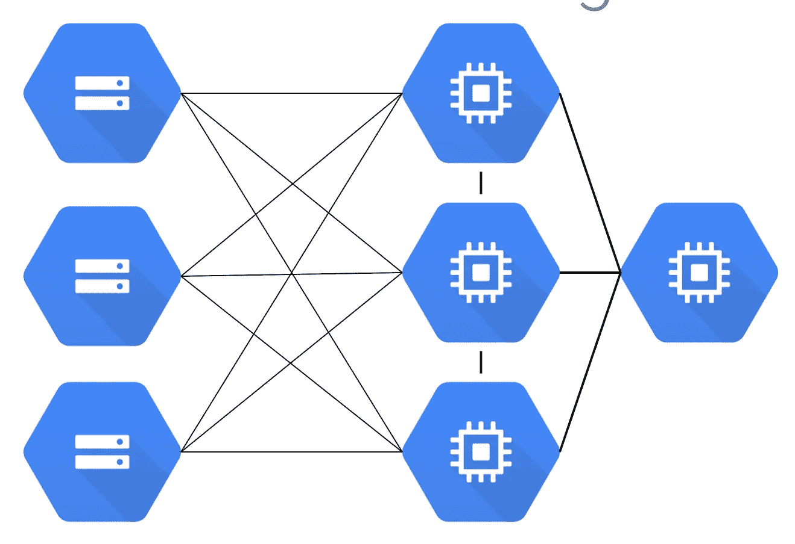
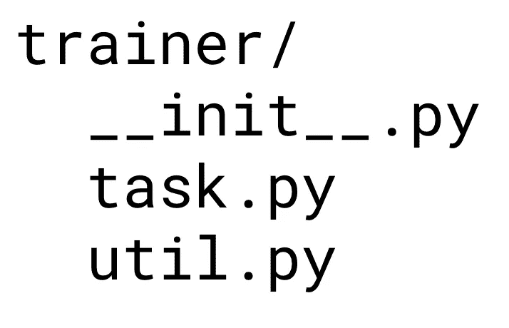
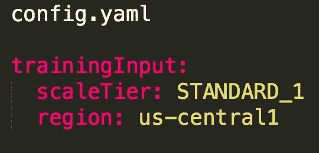
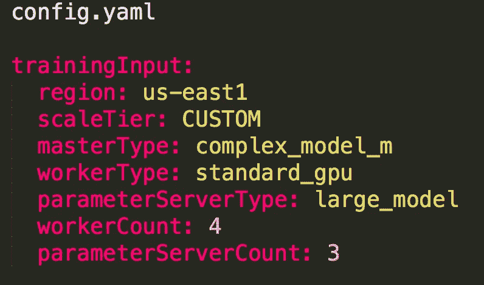
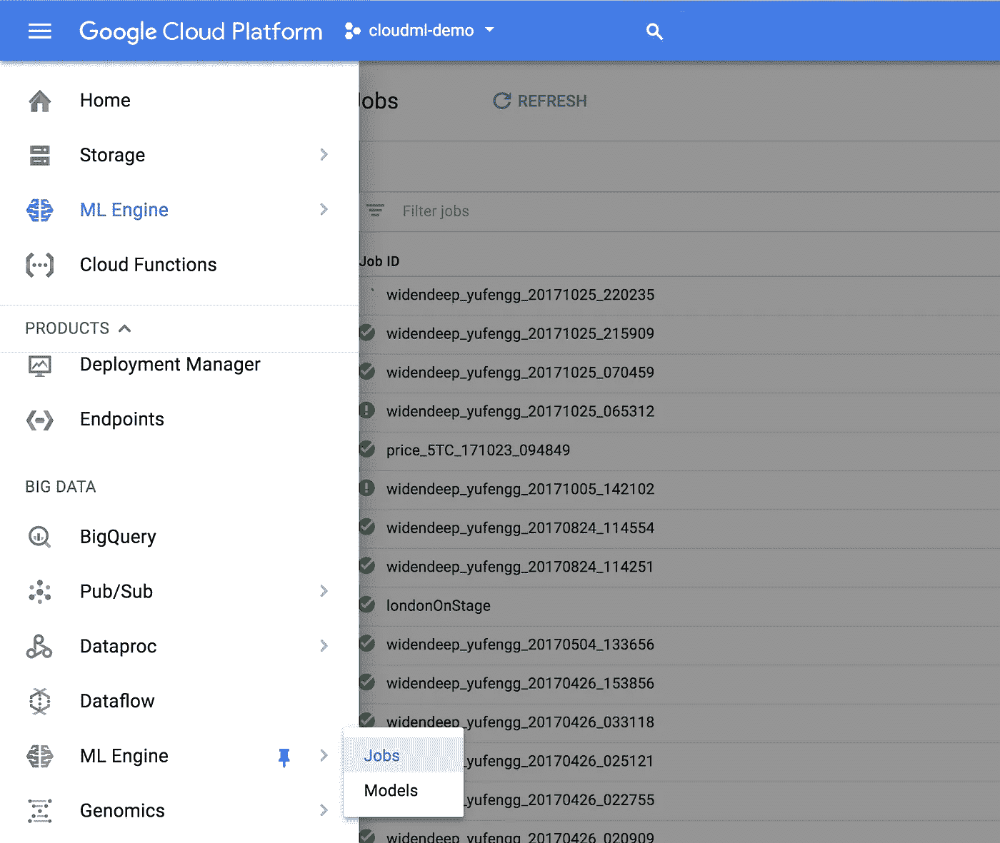
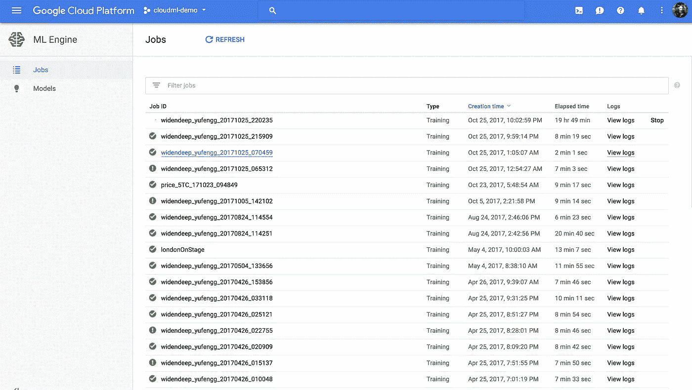

# 云中的分布式训练:云机器学习引擎

> 原文：<https://towardsdatascience.com/distributed-training-in-the-cloud-cloud-machine-learning-engine-9e264ddde27f?source=collection_archive---------0----------------------->

在我关于在云中训练大模型的[集](https://medium.com/towards-data-science/big-data-for-training-models-in-the-cloud-32e0df348196)的这个激动人心的结论中，我将向您展示如何为机器学习扩展您的计算能力，甚至召集一些 GPU！

我们的培训会有足够的资源吗？观看视频(或阅读下文)了解详情！

在[上一集](https://medium.com/towards-data-science/big-data-for-training-models-in-the-cloud-32e0df348196)中，我们讨论了当数据集太大而不适合本地机器时会遇到的问题，我们还讨论了如何通过可扩展的存储将数据转移到云中。

## 机器学习中的并行训练

今天，我们继续这个问题的第二部分——将这些计算资源放在一起。当训练更大的模型时，当前的方法包括并行进行训练*。我们的数据被分割并发送到许多工作机器，然后模型必须将从每台机器获得的信息和信号重新组合在一起，以创建完全训练的模型。*

**

## *你爱配置吗？*

*如果你愿意，你可以*启动一些虚拟机，安装必要的库，将它们联网，并配置它们运行分布式机器学习。当你完成后，你一定要把那些机器拿下来。**

*虽然对于一些人来说，这表面上看起来很容易，但如果你不熟悉安装 GPU 驱动程序、不同版本的底层库之间的兼容性问题，这可能是一个挑战。*

# *云机器学习引擎*

*幸运的是，我们将使用云机器学习引擎的训练功能，从 Python 代码到训练好的模型，不需要任何基础设施工作！该服务根据需要自动获取和配置资源，并在完成训练后关闭系统。*

*使用云 ML 引擎有 3 个主要步骤:*

> *1)打包您的 Python 代码
> 2)创建一个描述您想要的机器类型的配置文件
> 3)将您的培训作业提交到云*

*让我们看看如何设置我们的培训来利用这项服务。*

## *步骤 1:打包您的 Python 代码*

*我们已经将我们的 Python 代码从 Jupyter 笔记本中转移到一个独立的脚本中。让我们把那个文件叫做`task.py`。这将作为我们的 Python 模块，然后可以从其他文件中调用它。*

*现在我们将`task.py`包装在一个 Python 包中。Python 包的制作方法是将模块放在另一个文件夹中，姑且称之为“`trainer`”，并将一个空文件`__init__.py`放在`task.py`旁边。*

**

*我们最终的文件结构由一个名为 trainer 的文件夹组成，包含两个文件:`__init__.py`和`task.py`。我们的包叫做 *trainer* ，我们的模块路径是 *trainer.task* 。如果您想将代码分解成更多的组件，您也可以将这些组件包含在这个文件夹中。例如，您可能在`trainer`文件夹中有一个`util.py`。*

## *步骤 2:配置文件:config.yaml*

*一旦我们的代码被打包到一个 Python 包中，就该创建一个配置文件来指定您希望在什么机器上运行您的培训了。您可以选择在少量机器(少至一台)上运行培训，也可以在多台机器上运行，并附带 GPU。*

**

*Using a predefined scale tier is as simple as it gets*

*有几个[预定义的规范](https://cloud.google.com/ml-engine/docs/concepts/training-overview#scale_tier)使入门变得格外容易，一旦你不再需要这些规范，你就可以随心所欲地配置一个[定制架构](https://cloud.google.com/ml-engine/docs/training-overview#machine_type_table)。*

**

*For a custom cluster, all you need to do is specify the machine types you want*

*现在，我们已经打包好 python 代码，并写出了配置文件。让我们进入你们期待已久的一步，训练！*

## *步骤 3:提交您的培训工作*

*为了提交一个培训作业，我们将使用`gcloud`命令行工具并运行`gcloud ml-engine jobs submit training`。这个调用还有一个 REST API 等价物。*

*我们指定一个惟一的作业名、包路径和模块名、运行作业的区域以及存放培训输出的云存储目录。确保使用与存储数据相同的区域，以获得最佳性能。*

*`gcloud ml-engine jobs submit training \
job-id $JOB_ID \
package-path=trainer \
module-path=trainer.task \
region=us-central-1 \
job_dir=gs://cloudml-demo/widendeep`*

*一旦您运行这个命令，您的 python 包将被压缩并上传到我们刚刚指定的目录中。从那里，包将在云中运行，在我们在配置中指定的机器上运行。*

## *看着训练进行！*

*您可以在[云控制台](https://console.cloud.google.com/home/dashboard?project=serverless-ml)中通过进入 ML 引擎并选择作业来监控您的培训作业。*

**

*在那里，我们将看到我们曾经运行过的所有作业的列表，包括当前作业。右边是一个计时器，显示了作业所用的时间，还有一个链接指向来自模型的日志信息。*

**

*Some models take a bit longer to train than others ;-)*

## *预测呢？*

*我们的代码将训练好的模型导出到我们在作业目录中提供的云存储路径，因此从这里我们可以轻松地将预测服务直接指向输出，并创建一个预测服务，正如我们在第 4 集[中讨论的无服务器大规模预测](https://medium.com/@yufengg/serverless-predictions-at-scale-28ab77203a42)。*

## *后续步骤*

*使用云机器学习引擎，我们可以实现分布式训练，而不用自己处理基础设施。因此，我们可以花更多时间处理数据！只需打包代码，添加一个配置文件，然后提交培训作业。如果你想看更完整的例子，你可以查看云机器学习[入门指南](https://cloud.google.com/ml-engine/docs/getting-started-training-prediction)。*

*如果你想知道 TensorFlow 的分布式培训模式是如何工作的，请查看来自 TensorFlow 发展峰会的深度演讲:【https://youtu.be/la_M6bCV91M*

*感谢阅读本集[云 AI 冒险](https://goo.gl/UC5usG)。如果你喜欢这个系列，请为这篇文章鼓掌让我知道。如果你想要更多的机器学习动作，一定要关注 Medium 上的[me](https://medium.com/@yufengg)或[订阅 YouTube 频道](https://goo.gl/S0AS51)以捕捉未来的剧集。更多剧集即将推出！*