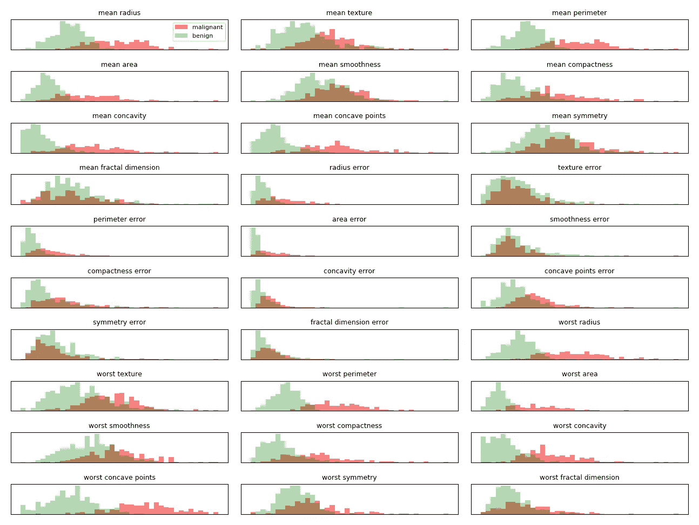
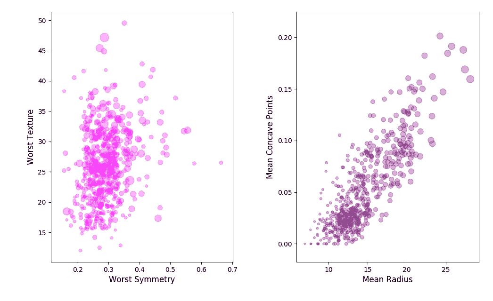
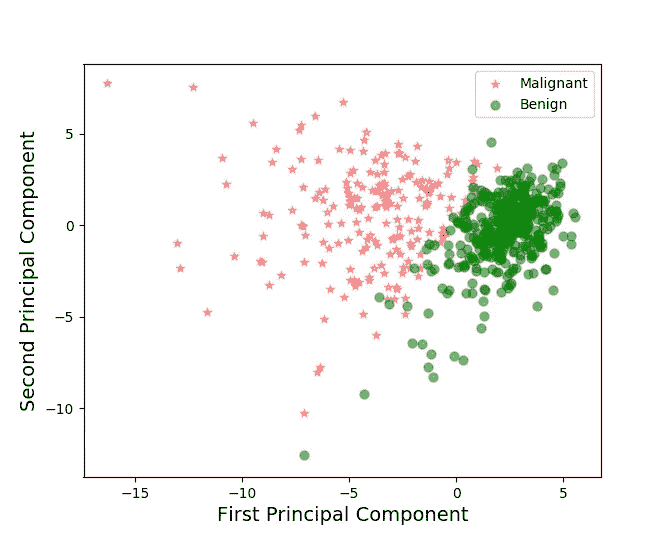
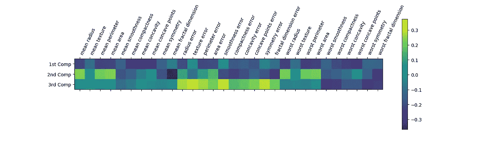
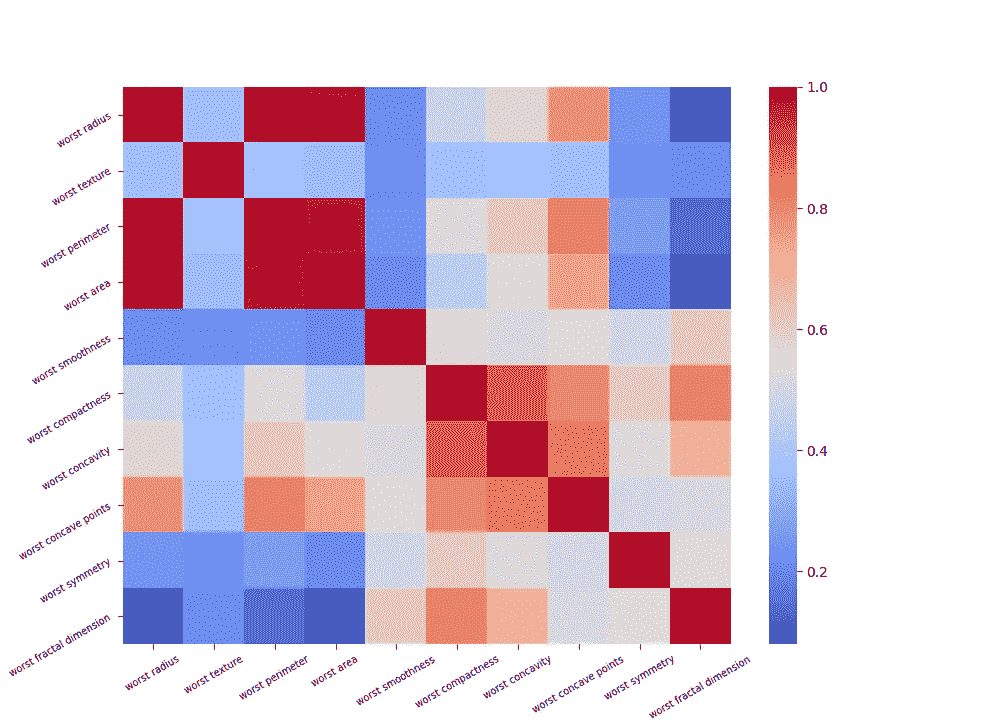

# 用 Python 理解 PCA(主成分分析)

> 原文：<https://towardsdatascience.com/dive-into-pca-principal-component-analysis-with-python-43ded13ead21?source=collection_archive---------1----------------------->

陷入变量的海洋来分析你的数据？感觉迷失在决定选择哪些功能，使您的模型是安全的，从过度拟合？有什么方法可以降低特征空间的维数？

嗯，PCA 肯定能帮到你。

在这个冥想中，我们将对癌症数据集的主成分分析进行简单的解释，并看到特征空间降维到数据可视化的例子。

不再拖延，让我们开始导入癌症数据集。

```
from sklearn.datasets import load_breast_cancer
cancer = load_breast_cancer()
```

有时候，了解你正在使用的数据会更好，我们可以使用`DESCR`来了解数据集的基本描述。

```
print cancer.DESCR
```

由此你现在知道这个数据集有 30 个特征，如平滑度、半径等。病例数为 569 例，其中 212 例为恶性，其余为良性。目标变量列为 0 和 1，只是为了确保 0 代表恶性肿瘤，反之亦然，可以检查-

```
print len(cancer.data[cancer.target==1])>> 357 
```

为了更多地了解特征如何影响目标，我们可以绘制恶性和良性类别的直方图。如果这两个直方图是基于特征分开的，那么我们可以说该特征对于辨别实例是重要的。

```
import numpy as np
import matplotlib.pyplot as plt 
# from matplotlib.pyplot import matplotlibfig,axes =plt.subplots(10,3, figsize=(12, 9)) # 3 columns each containing 10 figures, total 30 featuresmalignant=cancer.data[cancer.target==0] # define malignant
benign=cancer.data[cancer.target==1] # define benignax=axes.ravel()# flat axes with numpy ravelfor i in range(30):
  _,bins=np.histogram(cancer.data[:,i],bins=40)
  ax[i].hist(malignant[:,i],bins=bins,color='r',alpha=.5)# red color for malignant class
  ax[i].hist(benign[:,i],bins=bins,color='g',alpha=0.3)# alpha is           for transparency in the overlapped region 
  ax[i].set_title(cancer.feature_names[i],fontsize=9)
  ax[i].axes.get_xaxis().set_visible(False) # the x-axis co-ordinates are not so useful, as we just want to look how well separated the histograms are
  ax[i].set_yticks(())ax[0].legend(['malignant','benign'],loc='best',fontsize=8)
plt.tight_layout()# let's make good plots
plt.show()
```

如下图所示



Histogram of malignant and benign classes based on the 30 features of cancer data-set

现在，从这些直方图中我们看到，像-平均分形维数这样的特征在区分恶性和良性方面所起的作用很小，但最差凹点或最差周长是有用的特征，可以给我们关于癌症数据集类别的强烈提示。直方图在我们的天体物理学研究中是必不可少的，因为它们经常被用来分离模型。我无法抗拒把它带到这里的诱惑。因此，如果您的数据只有一个特征，例如最差周长，则足以区分恶性和良性病例。

在对这些癌症数据集使用主成分分析之前，让我们简单地了解一下主成分分析实际上是做什么的。我们知道，在一个数据集中，一些特征很有可能是相关的。让我们看一些癌症数据集中的例子——



Scatter plots with few features of cancer data set

现在，希望您已经理解了哪个图显示了特征之间的强相关性。下面是我用来绘制这些图表的代码。

```
imoprt pandas as pd
cancer_df=pd.DataFrame(cancer.data,columns=cancer.feature_names)# just convert the scikit learn data-set to pandas data-frame.
plt.subplot(1,2,1)#fisrt plot
plt.scatter(cancer_df['worst symmetry'], cancer_df['worst texture'], s=cancer_df['worst area']*0.05, color='magenta', label='check', alpha=0.3)
plt.xlabel('Worst Symmetry',fontsize=12)
plt.ylabel('Worst Texture',fontsize=12)
plt.subplot(1,2,2)# 2nd plot
plt.scatter(cancer_df['mean radius'], cancer_df['mean concave points'], s=cancer_df['mean area']*0.05, color='purple', label='check', alpha=0.3)
plt.xlabel('Mean Radius',fontsize=12)
plt.ylabel('Mean Concave Points',fontsize=12)
plt.tight_layout()
plt.show()
```

**PCA 本质上是一种以新变量相互正交(即它们是独立的或不相关的)的方式降低特征空间的维度的方法。**我在这篇文章的末尾放了一些参考资料，这样感兴趣的人可以真正钻研 PCA 的数学。

无论如何，从癌症数据集我们看到它有 30 个特征，所以让我们将其减少到只有 3 个主要特征，然后我们可以可视化这些新的独立变量的散点图。

在应用 PCA 之前，我们对数据进行缩放，使得每个特征都有单位方差。这是必要的，因为拟合算法高度依赖于特征的缩放。这里我们使用`StandardScaler`模块来单独缩放特征。`StandardScaler`从每个特征中减去平均值，然后缩放到单位方差。

我们首先实例化模块，然后适应数据。

```
scaler=StandardScaler()#instantiate
scaler.fit(cancer.data) # compute the mean and standard which will be used in the next command
X_scaled=scaler.transform(cancer.data)# fit and transform can be applied together and I leave that for simple exercise
# we can check the minimum and maximum of the scaled features which we expect to be 0 and 1
print "after scaling minimum", X_scaled.min(axis=0) 
```

现在，我们准备对这个缩放数据集应用 PCA。我们像以前一样从`StandardScaler`开始，在那里我们实例化，然后拟合，最后转换缩放的数据。在应用主成分分析时，你可以提出你想保留多少个主成分。

```
pca=PCA(n_components=3) pca.fit(X_scaled) X_pca=pca.transform(X_scaled) #let's check the shape of X_pca arrayprint "shape of X_pca", X_pca.shape
```

现在我们已经看到数据只有 3 个特征。*PCA 的缺点是几乎不可能说出初始特征(这里是 30 个特征)是如何组合形成主成分的。*现在需要注意的重要一点是，我选择了 3 个组件，而不是 2 个，这可能会进一步降低数据集的维度。可以选择`n_components=2`吗？[考虑一段时间，作为一个迷你练习。你能想出一些方法来测试这个吗？]

可以通过测量主成分的方差比来检查。

```
ex_variance=np.var(X_pca,axis=0)
ex_variance_ratio = ex_variance/np.sum(ex_variance)
print ex_variance_ratio 
>> [0.60950217 0.2611802  0.12931763]
```

这里可以看到，前两个因素占总方差的 87%。所以只选择 2 个组件就足够了。好了，现在有了前两个组件，我们可以跳到 PCA 最重要的应用之一，即数据可视化。**现在，由于 PCA 成分彼此正交且不相关，我们可以预期恶性和良性类别是不同的。**让我们根据前两个主要成分来划分恶性和良性类别

```
Xax=X_pca[:,0]
Yax=X_pca[:,1]labels=cancer.targetcdict={0:'red',1:'green'}labl={0:'Malignant',1:'Benign'}marker={0:'*',1:'o'}alpha={0:.3, 1:.5}fig,ax=plt.subplots(figsize=(7,5))
fig.patch.set_facecolor('white')for l in np.unique(labels):
 ix=np.where(labels==l)
 ax.scatter(Xax[ix],Yax[ix],c=cdict[l],s=40,
           label=labl[l],marker=marker[l],alpha=alpha[l])# for loop endsplt.xlabel("First Principal Component",fontsize=14)
plt.ylabel("Second Principal Component",fontsize=14)
plt.legend()
plt.show()# please check the scatter plot of the remaining component and you will understand the difference
```

使用上面的代码，绘图如下所示



Plot of breast cancer classes based on the first 2 principal components of the cancer features.

看起来很棒，不是吗？这两个类别被很好地分开，前两个主成分作为新特征。尽管看起来很好，但即使是线性分类器也能很好地从测试集中识别出一个类。[在另一篇文章中，](/visualizing-support-vector-machine-decision-boundary-69e7591dacea)我已经讨论了如何应用由 PCA 和支持向量分类器组成的流水线，并为相同的数据集绘制决策函数。一个重要的特征是恶性类别与良性类别相比是如何分布的，并回顾那些直方图。你能找到一些相似之处吗？

**这些主成分仅根据特征计算，不考虑来自类别的信息。因此，主成分分析是一种无监督的方法，很难解释这两个轴，因为它们是原始特征的复杂混合物。**我们可以做一个热图，看看这些特性是如何混合在一起形成组件的。

```
plt.matshow(pca.components_,cmap='viridis')
plt.yticks([0,1,2],['1st Comp','2nd Comp','3rd Comp'],fontsize=10)
plt.colorbar()
plt.xticks(range(len(cancer.feature_names)),cancer.feature_names,rotation=65,ha='left')
plt.tight_layout()
plt.show()# 
```



3 PCs and dependencies on original features

实际上很难从该图中理解原始特征的相关性，但是我们总是可以使用`seaborn`热图来绘制特征的相关性。但是，检查之前的相关图，看看第一主成分是如何受到平均凹点和最差纹理的影响的。您能说出哪个特性对第一台电脑的贡献更大吗？

这里我展示了这些特性的“最差”值的相关图。

```
feature_worst=list(cancer_df.columns[20:31]) # select the 'worst' featuresimport seaborn as snss=sns.heatmap(cancer_df[feature_worst].corr(),cmap='coolwarm') 
s.set_yticklabels(s.get_yticklabels(),rotation=30,fontsize=7)
s.set_xticklabels(s.get_xticklabels(),rotation=30,fontsize=7)
plt.show()
```



Correlation plot of the ‘worst’ features of cancer data-set

所以，为了结束这次冥想，让我们总结一下我们所做的和所学的

1.  为什么是 PCA 而不仅仅是特征分析？(回答提示:大数据集，多特征，让我们降低特征空间的维度)
2.  我们从癌症数据集开始我们的例子，发现 30 个特征有 2 类。
3.  为了对该数据集应用 PCA，首先我们缩放所有特征，然后对缩放后的特征应用 PCA 的`fit_transform`方法(具有 3 个主成分)。
4.  我们表明，在这 3 个主成分中，有 2 个成分贡献了总方差的 87%。
5.  基于这两个主要成分，我们将数据可视化，并看到“恶性”和“良性”类别之间非常清晰的区分。

希望这将有助于你掌握一些概念，并指导你有效地应用主成分分析你的数据集。作为练习，您可以立即尝试波士顿房屋数据(13 个特征)并查看结果。再次仔细阅读并记住关于最初相关特征到最终独立主成分的基本概念。

这篇文章受穆勒的[书](https://www.oreilly.com/library/view/introduction-to-machine/9781449369880/)的影响，是我尝试用 CALET 探测器测量的宇宙射线来分离两种天体物理场景(脉冲星和暗物质)的垫脚石。你可以在我的 [github 简介](https://github.com/suvoooo/PythonandCALET)中找到所有细节。如果你对参数和详细描述感兴趣，请告诉我。使用 Akaike 标准对我们的工作进行的单独分析被选发表在[国际现代物理学杂志 D](https://inspirehep.net/record/1643785) 上。

关注即将到来的帖子，保持坚强，快乐！

***如果你对更深入的基础机器学习概念感兴趣，可以考虑加盟 Medium 使用*** [***我的链接***](https://saptashwa.medium.com/membership) ***。你不用额外付钱，但我会得到一点佣金。感谢大家！！***

进一步阅读的参考资料:

1.  对 PCA 工作方式的深入分析:[PCA 一站式商店](/a-one-stop-shop-for-principal-component-analysis-5582fb7e0a9c)
2.  机器学习在行动；彼得·哈灵顿:曼宁出版公司，第 270-278 页。
3.  [PCA 和图像重建](/pca-using-python-scikit-learn-e653f8989e60)