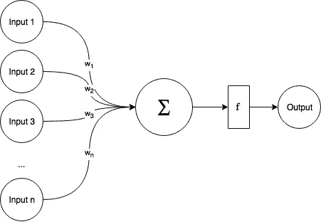
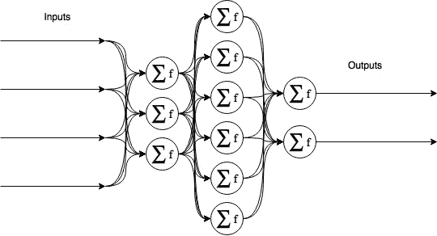
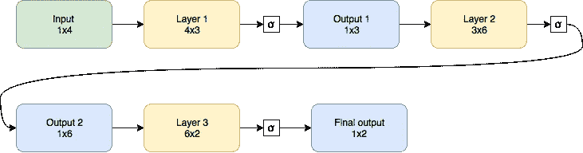
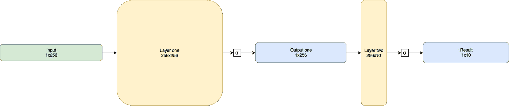
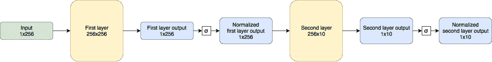
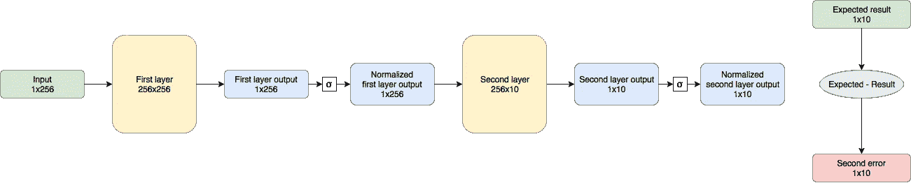
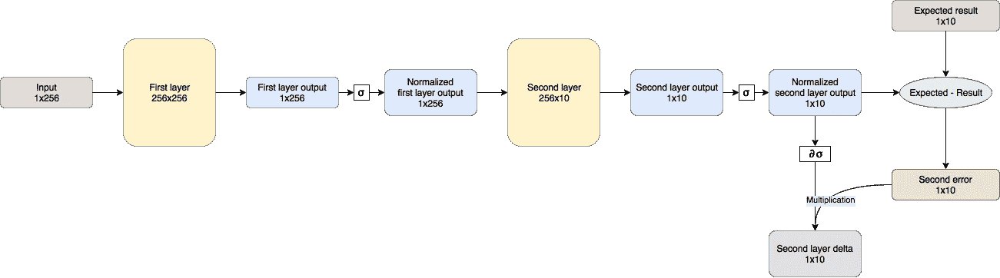
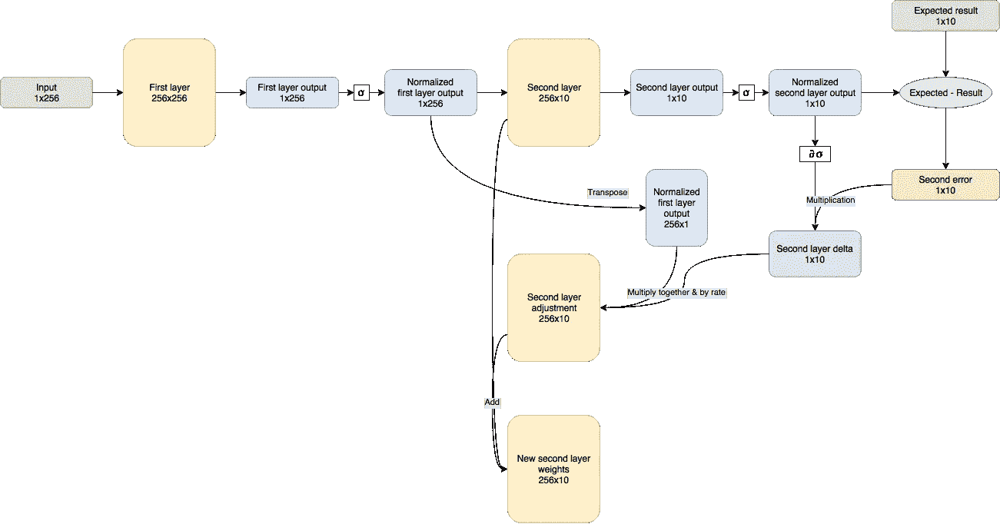
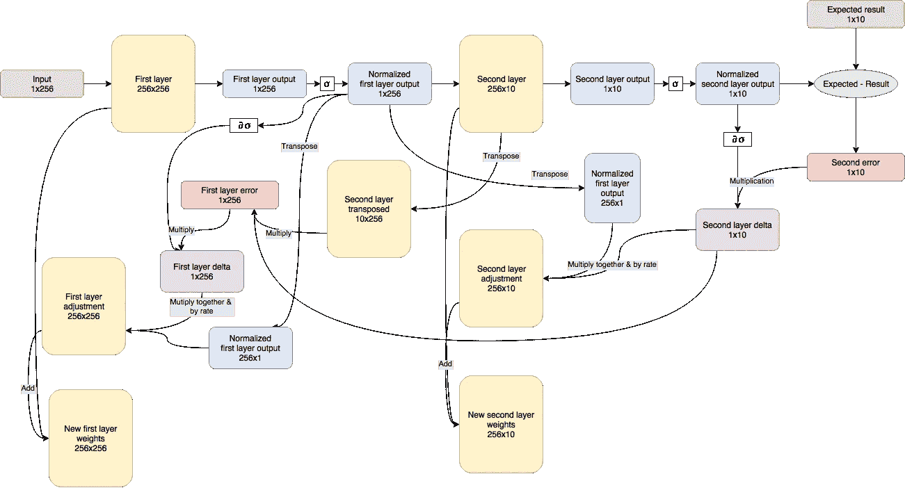

# DIY AI:一个老学校矩阵 NN

> 原文：<https://towardsdatascience.com/diy-ai-an-old-school-matrix-nn-401a00021a55?source=collection_archive---------1----------------------->

*NN 如何运作，如何像多年前一样创建和训练 NN。部分* [*DIY AI*](https://medium.com/@andrew.tchircoff/diy-ai-the-series-597e82131cb2) *系列。*

# 先决条件和代码

你需要 Python 和 Python IDE。如果你需要安装，请查阅 [DIY AI 安装手册](https://medium.com/@andrew.tchircoff/diy-ai-installation-manuals-587b65599c39)(这个故事你需要 **Python** 和**控制台**部件)。

你可以从 Github [这里](https://github.com/andrewtch/diy-ai-numpy-nn)下载完整的源代码。

此处可访问 draw.io 图[。](https://www.draw.io/?lightbox=1&highlight=0000ff&edit=_blank&layers=1&nav=1&title=diy_ai_neural_network.html#Uhttps%3A%2F%2Fdrive.google.com%2Fuc%3Fid%3D0B6X4Tb0TNQ0iNGpyZzc3M1N2cms%26export%3Ddownload)

# 那么，神经网络究竟是如何工作的呢？

正如我在[上一篇文章](https://becominghuman.ai/ai-the-history-of-a-problem-31770eb9ae2e)中提到的，自 50 年代初以来，我们就试图模仿人脑及其最小的部分——神经元——本身。

最接近神经元的是一个[感知器](https://en.wikipedia.org/wiki/Perceptron)——它由多个输入、求和引擎、单个输出和一个激活函数组成。像这样:



Fig. 1\. A perceptron

这东西是怎么工作的？它接受大量输入(输入实际上是一个*数字*，如 0.33，-13.7 等等)，将它们乘以它们的*权重*(图中的 w1…wn)并求和。总和然后被馈送到激活函数，并传递到输出。

为什么我们需要一个激活函数？大多数情况下，我们需要介于 0…1 之间的输出值，如“是”或“否”。很难调整权重，使其对任何带有 1 和 0 的输入做出响应，但是，幸运的是，我们有一个[逻辑函数](https://en.wikipedia.org/wiki/Logistic_function)，可以将任何数值映射到 0 和 1 之间的值(向该函数输入非常大的负数，如-10000，将返回接近于 0 的值，输入非常大的正数，将导致接近于 1 的值，如 0.99……)。

当然，我们可以将感知器连接成层，并形成网络，就像这样:



Fig. 2\. Simple, feed-forward, fully connected neural network

输入被馈送到第一层上每个感知器的每个输入，然后第一层的输出被馈送到下一层的所有输入，对所有后续层重复相同的过程。最后一层的输出实际上是神经网络的输出。这种网络被称为前馈网络，因为数据只向前流动，没有反馈回路，而且这种网络是完全连接的，因为每个神经元接收来自前一层的所有神经元的输出。

为了保持广泛使用的术语，输入和输出层之间的层称为*隐藏*层。

如果输入是特征向量(比如:它有翅膀吗？它生活在水里吗？它有毛吗？它吃肉吗？)并且输出是向量，表示例如“它”的可能类别(像:动物-0.87，鱼-0.12)，这种类型的网络可以用于动物园居民的*分类*。

那么，你可能会问，神奇的是什么？重量是。NN 的实际圣杯是调整和计算权重的方法，称为*训练*一个神经网络。我将在本文中介绍一种最简单的方法——反向传播。

# 我们如何编码神经网络？

每个开发人员都把神经网络想象成一组神经元，可以这样编码:

```
class Neuron
    array Neuron weights[]
    float output
    function compute_output()
```

…等等，但这是过度工程化，因为我们可以用一个简单的东西来抽象整个层:[矩阵](https://en.wikipedia.org/wiki/Matrix_(mathematics))。

在上面的例子中，第一层有 4 个输入，产生 3 个输出。输入是 4 个数字。

如果我们将输入表示为 1x4 矩阵，第一层为包含所有第一层权重的 4x3 矩阵，我们可以通过将输入矩阵(1x4)乘以第一层矩阵(4x3)得到第一层，从而创建 1x3 矩阵。这个矩阵乘以 3x6 层二矩阵，再乘以 6x2 层三矩阵，得到 1x2 结果矩阵。当然，在将结果矩阵传递给下一层之前，我们必须对结果矩阵的每个成员应用一个激活函数。

从视觉上讲，NN 来自图 2。是这样处理的:



Fig. 3\. Example NN from Fig. 2 represented as matrixes, sigma represents activation function

因此，基本上，在神经网络中，整个层被抽象为矩阵，并且模拟神经网络最常用的函数是矩阵乘法。这实际上解释了为什么神经网络系统很容易被 GPU 加速——3D 可视化也大量基于矩阵代数！

# 我们如何训练他们？

在多层神经网络中，我们基本上只有输入和输出矩阵。然而，我们可以计算预期结果和实际结果之间的差异，但是我们如何调整具有不同神经元数量的许多层上的权重呢？

这个想法很简单，我们可以回到输入层，逐层比较层输入和层误差。每一层，不管有多深，都会造成下一层的误差；因此，我们可以通过将前一层输出乘以输出误差再乘以当前层输出得到的值来调整权重。这被称为[反向传播](https://en.wikipedia.org/wiki/Backpropagation)，正式化时听起来非常糟糕和复杂，但是实现起来非常简单。

所以，让我们举一些经典的例子，比如手写数字识别。

# 首先，数据集

请看，我们的第一个数据集，著名的 Semeion 数据集:[http://archive . ics . UCI . edu/ml/datasets/Semeion+手写+数字](http://archive.ics.uci.edu/ml/datasets/semeion+handwritten+digit)

[数据集文件](http://archive.ics.uci.edu/ml/machine-learning-databases/semeion/semeion.data)包含 1593 位数字，手写，扫描，适合 256 像素(16x16 像素见方)的黑白盒子。

像素(一行 256 个)放在数据集文件的单独行中，并附加 10 位表示实际结果(例如，`0 0 0 1 0 0 0 0 0 0` 表示 3)。

我们可以举一个数据集行的例子，看起来像这样:

```
0.0000 0.0000 0.0000 1.0000 1.0000 1.0000 1.0000 1.0000 1.0000 1.0000 1.0000 1.0000 1.0000 0.0000 0.0000 0.0000 0.0000 1.0000 1.0000 1.0000 1.0000 1.0000 0.0000 0.0000 0.0000 0.0000 0.0000 1.0000 1.0000 1.0000 0.0000 0.0000 0.0000 1.0000 1.0000 1.0000 0.0000 0.0000 0.0000 0.0000 0.0000 0.0000 0.0000 0.0000 1.0000 1.0000 1.0000 0.0000 1.0000 1.0000 1.0000 0.0000 0.0000 0.0000 0.0000 0.0000 0.0000 0.0000 0.0000 0.0000 0.0000 1.0000 1.0000 1.0000 1.0000 1.0000 0.0000 0.0000 0.0000 0.0000 0.0000 0.0000 0.0000 0.0000 0.0000 0.0000 0.0000 0.0000 1.0000 1.0000 1.0000 1.0000 0.0000 1.0000 1.0000 1.0000 0.0000 0.0000 0.0000 0.0000 0.0000 0.0000 0.0000 0.0000 1.0000 1.0000 0.0000 1.0000 1.0000 1.0000 0.0000 0.0000 0.0000 0.0000 0.0000 0.0000 0.0000 0.0000 0.0000 0.0000 1.0000 1.0000 1.0000 1.0000 1.0000 0.0000 0.0000 0.0000 0.0000 0.0000 0.0000 0.0000 0.0000 0.0000 0.0000 0.0000 1.0000 1.0000 1.0000 1.0000 0.0000 0.0000 0.0000 0.0000 0.0000 0.0000 0.0000 0.0000 0.0000 0.0000 0.0000 1.0000 1.0000 0.0000 1.0000 1.0000 0.0000 0.0000 0.0000 0.0000 0.0000 0.0000 0.0000 0.0000 0.0000 0.0000 1.0000 1.0000 1.0000 0.0000 1.0000 1.0000 0.0000 0.0000 0.0000 0.0000 0.0000 0.0000 0.0000 0.0000 0.0000 1.0000 1.0000 1.0000 0.0000 0.0000 1.0000 1.0000 0.0000 0.0000 0.0000 0.0000 0.0000 0.0000 0.0000 0.0000 1.0000 1.0000 1.0000 0.0000 0.0000 0.0000 1.0000 1.0000 0.0000 0.0000 0.0000 0.0000 0.0000 1.0000 1.0000 1.0000 1.0000 1.0000 0.0000 0.0000 0.0000 0.0000 0.0000 1.0000 1.0000 1.0000 1.0000 1.0000 1.0000 1.0000 1.0000 0.0000 0.0000 0.0000 0.0000 0.0000 0.0000 0.0000 0.0000 1.0000 1.0000 1.0000 1.0000 1.0000 1.0000 1.0000 0.0000 0.0000 0.0000 0.0000 0.0000 0.0000 0.0000 0.0000 0.0000 0.0000 0.0000 1.0000 1.0000 1.0000 0.0000 0.0000 0.0000 0.0000 0.0000 0.0000 0.0000 0.0000 0.0000 0.0000 1 0 0 0 0 0 0 0 0 0
```

如果我们删除数字的`.0000`部分，并删除多余的空格，示例将如下所示:

```
000111111111100001111100000111000111000000001110111000000000011111000000000000111101110000000011011100000000001111100000000000111100000000000110110000000000111011000000000111001100000000111000110000011111000001111111100000000111111100000000000111000000000 1 0 0 0 0 0 0 0 0 0
```

如果我们将它分成 16 个字符行，我们将得到实际绘制的零:

```
0001111111111000
0111110000011100
0111000000001110
1110000000000111
1100000000000011
1101110000000011
0111000000000011
1110000000000011
1100000000000110
1100000000001110
1100000000011100
1100000000111000
1100000111110000
0111111110000000
0111111100000000
00011100000000001 0 0 0 0 0 0 0 0 0
```

理解数据集对于成功的训练至关重要。干净而精确的数据集是你的模型中最重要的部分。

好了，理论的时间结束了，我们来编点代码吧。首先，我们需要将数据集加载到 python 代码中。我会用优秀的 [numpy](http://www.numpy.org/) 库进行矩阵处理。为了存储数据，我们需要定义两个 numpy 数组(samples 和 results ),并逐行读取数据集，将每行的前 256 个数字添加到 samples 数组中，将后 10 个数字添加到 results 数组中:

Em. 1\. Reading Semeion dataset with Python / numpy

很棒，是吧？现在，让我们建立一个神经网络，并确保我们可以通过它运行样本！

# 然后，向前传球

对于这个例子，我将使用两层神经网络，其中第一层是 256x256 矩阵，第二层是 256x10。整体架构看起来是这样的(注意当数据流经神经网络时矩阵的形状是如何变化的):



图层将由 numpy 数组表示，并预先填充相对较小的随机值(范围从-0.01 到 0.01):

上面的代码实际上展示了你如何使用*训练过的*神经网络。由于灭的小网还没有准备好，`second_output`将包含完全随机的数据。让我们修复它，训练网络！

# 第三，反向传播(或训练)

训练一个神经网络是一个迭代过程——我们取数据集的某一部分(我将从 100 个随机记录开始)，通过神经网络传递数据集的所有样本，计算误差并反向传播误差。训练数据集的一遍被称为一个时期。

训练 NN，直到它很好或者被卡住——这意味着我们需要限制一些时期(以防止无限训练)，并定义一些标准来定义 NN“足够好”。

我将使用样本误差的绝对值之和作为样本误差，使用历元的最大误差作为历元误差。当历元误差小于 0.1 时，我会认为 NN 已经完成(例如，当正确答案为`0 0 1 0`时，`-1 0 1 0.5`的误差为 1.5)。

同样，让我们记住我们的 NN 将如何被处理:



支持主训练循环的代码如下所示:

如你所见，我还定义了一个*速率*，它代表 NN 对变化的反应有多快；在大多数情况下，网络越大，它应该越小——这使得训练更慢但更精确。

获得输出矩阵后，我们需要计算输出误差(并将该值与当前历元误差相加):



正如您所记得的，所有的输出都是通过`sigmoid`函数处理的，我们需要反向传递数据。因此，我们创建了一个`dsigmoid`函数，它是一个`sigmoid`的导数:

目前，我们有 1x10 的误差矩阵，还有 256x10 的矩阵需要调整。因此，我们必须通过将第二层误差乘以经 dsigmoid 处理的第二层输出，找出第二层上的每个重量对误差的影响程度:



现在我们需要创建一个 256x10 的矩阵来调整第二层的权重。为此，我们采用先前的(第一层)输出(1x256)，将其转置为 256x1，并将其乘以新找到的第二层增量。将得到的 256×10 矩阵(乘以速率)加到第二层权重将得到新的权重，有望产生更好的结果:



我们可以对第一层重复同样的过程，但是什么是第一层错误呢？这其实很容易找到——我们通过转置的第二层矩阵传递第二层增量；抽象地说，我们发现每个第一层输出值对第二层误差有多大影响。找到误差矩阵后，我们可以重复上述相同的过程来调整第一层的权重:



我们还需要一些控制，所以在每个时期结束时，让我们计算误差并打印结果:

请[下载](https://github.com/andrewtch/diy-ai-numpy-nn)并在进入下一章之前研究实际代码！

# 最后，测试

好，让我们运行模型(同样，您可以从 [Github](https://github.com/andrewtch/diy-ai-numpy-nn) 下载完整的模型)。为了方便起见，我添加了一段简单的代码，它随机抽取 12 个样本，并根据这些样本测试神经网络:

所以…让我们针对数据集的一小部分(100 条记录)运行网络:

成功！经过 40 个时期后，神经网络收敛，并且能够从样本中正确地检测数字！

好的，让我们测试一下完整的数据集(大约 1500 个样本)。运行它(如果你从 [Github](https://github.com/andrewtch/diy-ai-numpy-nn) 下载了代码，它已经包含了完整的数据集)，aaaaand 和…

而 NN 会很惨的无限挂，误差值在~1 左右。

发生了什么事？这是[过度拟合](https://en.wikipedia.org/wiki/Overfitting)的常见情况——我们一次又一次地在同一个数据集周围拖动神经网络，神经网络变得很好，但还不够好——不足以最小化误差。它也是不变的——无论我们在同一个数据集上循环多少次，误差都不会减少。

过度拟合的模型仍然可用，例如，您可以将历元计数限制为 50，并获得可接受的结果:

…但这个例子说明了第一个故事中提到的第一个人工智能冬天的许多原因之一——例如，令人震惊的发现，你不能只给 NN 提供 10 倍多的数据，并期望它变得更精确 10 倍。你需要适应、改变你的网络结构、训练模式，并进行大量的全面实验，以使这项技术变得可用。实际的方法将在以后的文章中介绍)。

# 这很简单。为什么我们不能用它来造一个人工智能呢？

因为事情没那么简单。你可以从大量的数据中看出神经网络的行为是如何变化的，它还取决于训练方法、时期数和网络结构。

在 [DIY AI 系列](https://medium.com/@andrew.tchircoff/diy-ai-the-series-597e82131cb2)的未来故事中，我将讲述更多关于架构、方法和——最重要的——*框架——*的故事，它们极大地减少了您必须编写的代码量，并允许您专注于实际的数据和架构，而不是矩阵。

敬请期待！

*感谢* [*特拉斯克*](https://iamtrask.github.io/2015/07/12/basic-python-network/) *提供初始想法* [*UCI 机器学习知识库*](http://archive.ics.uci.edu/ml/datasets/semeion+handwritten+digit) *提供数据集。*