# DIY 深度学习项目

> 原文：<https://towardsdatascience.com/diy-deep-learning-projects-c2e0fac3274f?source=collection_archive---------0----------------------->

## 受阿克谢·巴哈杜尔伟大作品的启发，在这篇文章中，你将看到一些应用计算机视觉和深度学习的项目，以及实现和细节，这样你就可以在你的计算机上重现它们。


# LinkedIn 数据科学社区


阿克谢·巴哈杜尔是 LinkedIn 数据科学社区给出的一个很好的例子。在 Quora、StackOverflow、Youtube、here 以及许多论坛和平台上，有很多优秀的人在科学、哲学、数学、语言，当然还有数据科学及其同伴的许多领域互相帮助。

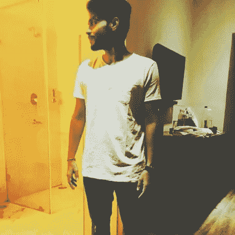

Akshay Bahadur.

但我认为在过去的 3 年里，LinkedIn 社区在分享数据科学领域的伟大内容方面表现出色，从分享经验到关于如何在现实世界中进行机器学习或深度学习的详细帖子。我总是向进入这个领域的人推荐成为一个社区的一部分，LinkedIn 是最好的，你会发现我一直在那里:)。

# 从深度学习和计算机视觉开始

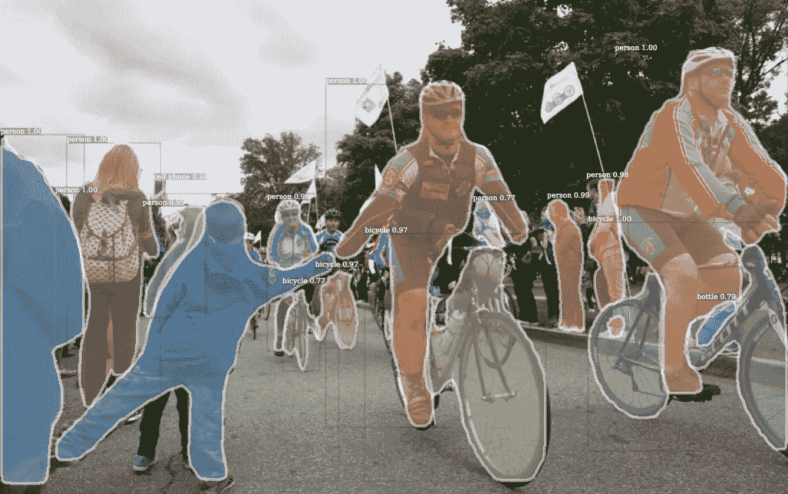

[https://github.com/facebookresearch/Detectron](https://github.com/facebookresearch/Detectron)

深度学习领域的研究对图像中的事物进行分类，检测它们并在它们“看到”某些东西时采取行动，这十年来一直非常重要，取得了惊人的成果，例如在一些问题上超越了人类水平的表现。

在这篇文章中，我将向你展示阿克谢·巴哈杜尔在计算机视觉(CV)和深度学习(DL)领域所做的每一篇文章。如果您不熟悉这些术语，您可以在此处了解更多信息:

[](/a-weird-introduction-to-deep-learning-7828803693b0) [## 深度学习的“怪异”介绍

### 有关于深度学习的惊人介绍、课程和博文。但这是一种不同的介绍。

towardsdatascience.com](/a-weird-introduction-to-deep-learning-7828803693b0) [](/two-months-exploring-deep-learning-and-computer-vision-3dcc84b2457f) [## 两个月探索深度学习和计算机视觉

### 我决定熟悉计算机视觉和机器学习技术。作为一名 web 开发人员，我发现…

towardsdatascience.com](/two-months-exploring-deep-learning-and-computer-vision-3dcc84b2457f) [](/from-neuroscience-to-computer-vision-e86a4dea3574) [## 从神经科学到计算机视觉

### 人类和计算机视觉 50 年回顾

towardsdatascience.com](/from-neuroscience-to-computer-vision-e86a4dea3574) [](/computer-vision-by-andrew-ng-11-lessons-learned-7d05c18a6999) [## 吴恩达的计算机视觉——11 个教训

### 我最近在 Coursera 上完成了吴恩达的计算机视觉课程。Ng 很好地解释了许多…

towardsdatascience.com](/computer-vision-by-andrew-ng-11-lessons-learned-7d05c18a6999) 

# 1.使用 OpenCV 的手部运动

[](https://github.com/akshaybahadur21/HandMovementTracking) [## akshaybahadur 21/hand movement tracking

### 在 GitHub 上创建一个帐户，为 HandMovementTracking 开发做出贡献。

github.com](https://github.com/akshaybahadur21/HandMovementTracking) 

来自阿克谢:

> 为了执行视频跟踪，算法分析连续的视频帧并输出帧之间的目标运动。算法多种多样，各有优缺点。在选择使用哪种算法时，考虑预期用途很重要。视觉跟踪系统有两个主要组成部分:目标表示和定位，以及过滤和数据关联。
> 
> 视频跟踪是使用摄像机在一段时间内定位一个移动对象(或多个对象)的过程。它有多种用途，其中一些是:人机交互、安全和监控、视频通信和压缩、增强现实、交通控制、医学成像和视频编辑。

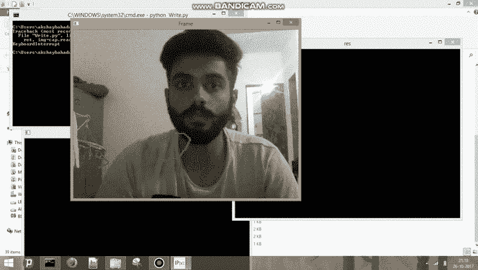

这是复制它所需的所有代码:

```
import numpy as np
import cv2
import argparse
from collections import deque

cap=cv2.VideoCapture(0)

pts = deque(maxlen=64)

Lower_green = np.array([110,50,50])
Upper_green = np.array([130,255,255])
while True:
	ret, img=cap.read()
	hsv=cv2.cvtColor(img,cv2.COLOR_BGR2HSV)
	kernel=np.ones((5,5),np.uint8)
	mask=cv2.inRange(hsv,Lower_green,Upper_green)
	mask = cv2.erode(mask, kernel, iterations=2)
	mask=cv2.morphologyEx(mask,cv2.MORPH_OPEN,kernel)
	#mask=cv2.morphologyEx(mask,cv2.MORPH_CLOSE,kernel)
	mask = cv2.dilate(mask, kernel, iterations=1)
	res=cv2.bitwise_and(img,img,mask=mask)
	cnts,heir=cv2.findContours(mask.copy(),cv2.RETR_EXTERNAL,cv2.CHAIN_APPROX_SIMPLE)[-2:]
	center = None

	if len(cnts) > 0:
		c = max(cnts, key=cv2.contourArea)
		((x, y), radius) = cv2.minEnclosingCircle(c)
		M = cv2.moments(c)
		center = (int(M["m10"] / M["m00"]), int(M["m01"] / M["m00"]))

		if radius > 5:
			cv2.circle(img, (int(x), int(y)), int(radius),(0, 255, 255), 2)
			cv2.circle(img, center, 5, (0, 0, 255), -1)

	pts.appendleft(center)
	for i in xrange (1,len(pts)):
		if pts[i-1]is None or pts[i] is None:
			continue
		thick = int(np.sqrt(len(pts) / float(i + 1)) * 2.5)
		cv2.line(img, pts[i-1],pts[i],(0,0,225),thick)

	cv2.imshow("Frame", img)
	cv2.imshow("mask",mask)
	cv2.imshow("res",res)

	k=cv2.waitKey(30) & 0xFF
	if k==32:
		break
# cleanup the camera and close any open windows
cap.release()
cv2.destroyAllWindows()
```

是的，54 行代码。很简单吧？你需要在你的电脑上安装 OpenCV，如果你有 Mac 来检查这个:

[](https://www.learnopencv.com/install-opencv3-on-macos/) [## 在 MacOS 上安装 OpenCV 3

### 在本帖中，我们将提供在 MacOS 和 OSX 上安装 OpenCV 3.3.0 (C++和 Python)的逐步说明…

www.learnopencv.com](https://www.learnopencv.com/install-opencv3-on-macos/) 

如果你有 Ubuntu:

[](https://docs.opencv.org/3.4.1/d2/de6/tutorial_py_setup_in_ubuntu.html) [## OpenCV:在 Ubuntu 中安装 OpenCV-Python

### 现在我们有了所有需要的依赖项，让我们安装 OpenCV。安装必须使用 CMake 进行配置。它…

docs.opencv.org](https://docs.opencv.org/3.4.1/d2/de6/tutorial_py_setup_in_ubuntu.html) 

如果你有窗户:

[](https://docs.opencv.org/3.0-beta/doc/py_tutorials/py_setup/py_setup_in_windows/py_setup_in_windows.html) [## 在 Windows - OpenCV 3.0.0-dev 文档中安装 OpenCV-Python

### 在本教程中，我们将学习在您的 Windows 系统中设置 OpenCV-Python。以下步骤是在 Windows 7-64 中测试的…

docs.opencv.org](https://docs.opencv.org/3.0-beta/doc/py_tutorials/py_setup/py_setup_in_windows/py_setup_in_windows.html) 

# 2.睡意检测 OpenCV

[](https://github.com/akshaybahadur21/Drowsiness_Detection) [## akshaybahadur 21/睡意检测

### 在 GitHub 上创建一个帐户，为睡意检测的发展做出贡献。

github.com](https://github.com/akshaybahadur21/Drowsiness_Detection) 

这可以被倾向于长时间驾驶可能导致事故的骑手使用。这个代码可以检测你的眼睛，并在用户昏昏欲睡时发出警报。

## 属国

1.  cv2
2.  免疫系统
3.  dlib
4.  scipy

# 算法

每只眼睛由 6 个(x，y)坐标表示，从眼睛的左上角开始(就好像你正看着这个人一样)，然后围绕眼睛顺时针旋转:。

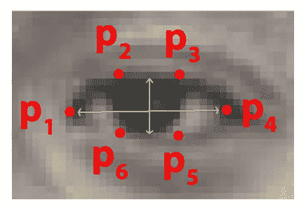

## 情况

它检查 20 个连续帧，如果眼睛纵横比小于 0.25，则生成警报。

## 关系

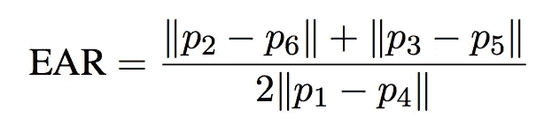

## 总结

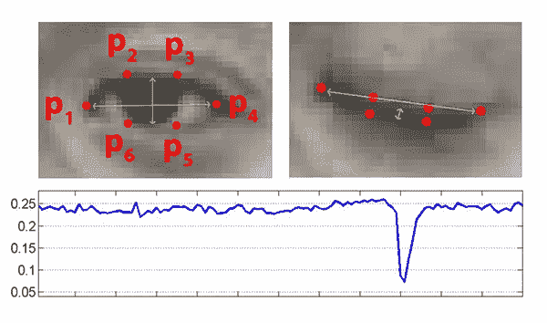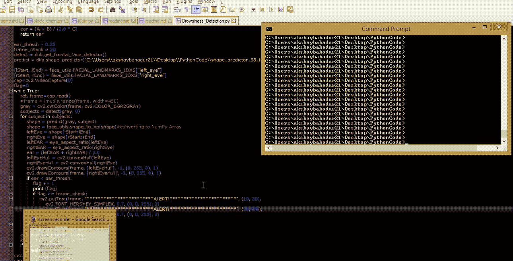

# 3.使用 Softmax 回归的数字识别

[](https://github.com/akshaybahadur21/Digit-Recognizer) [## akshaybahadur 21/数字识别器

### 用于识别数字的数字识别器机器学习分类器。

github.com](https://github.com/akshaybahadur21/Digit-Recognizer) 

此代码帮助您使用 softmax 回归对不同的数字进行分类。您可以安装 Conda for python，它可以解决机器学习的所有依赖性。

## 描述

Softmax Regression(同义词:多项式逻辑回归、最大熵分类器或多类逻辑回归)是逻辑回归的推广，可用于多类分类(假设类是互斥的)。相比之下，我们在二元分类任务中使用(标准)逻辑回归模型。

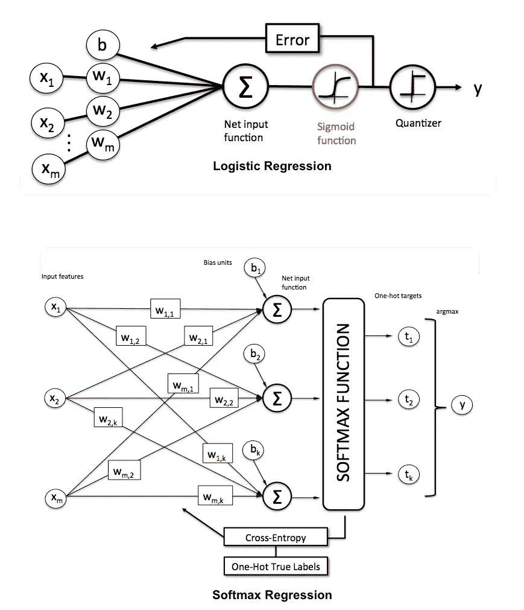

## Python 实现

使用的数据集是 MNIST，图像大小为 28 X 28，这里的计划是使用逻辑回归、浅层网络和深层神经网络对 0 到 9 的数字进行分类。

这里最好的部分之一是他使用 Numpy 编码了三个模型，包括优化、前向和后向传播以及所有的东西。

对于逻辑回归:

对于浅层神经网络:

最后是深度神经网络:

## 通过网络摄像头执行写作

要运行代码，请键入`python Dig-Rec.py`

```
python Dig-Rec.py
```

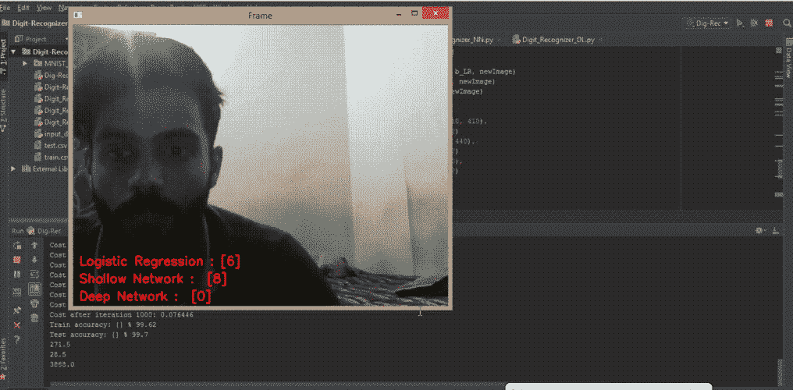

## 通过网络摄像头显示图像的执行

要运行代码，请键入`python Digit-Recognizer.py`

```
python Digit-Recognizer.py
```

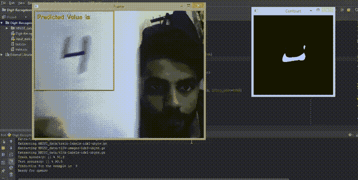

# Devanagiri 识别

[](https://github.com/akshaybahadur21/Devanagiri-Recognizer) [## akshaybahadur 21/Devanagiri-识别器

### 使用 convnet 的 Devanagiri-Recognizer -印地语字母分类器

github.com](https://github.com/akshaybahadur21/Devanagiri-Recognizer) 

这个代码帮助你使用 Convnets 对不同的印地语字母进行分类。您可以安装 Conda for python，它可以解决机器学习的所有依赖性。

## 使用的技术

> 我用过卷积神经网络。我使用 Tensorflow 作为框架，使用 Keras API 提供高级别的抽象。

## 体系结构

conv 2d→max pool→conv 2d→max pool→FC→soft max→分类

## 其他几点

1.  你可以去额外的 conv 层。
2.  添加正则化以防止过度拟合。
3.  您可以向训练集中添加额外的图像以提高准确性。

## Python 实现

数据集- DHCD (Devnagari 字符数据集)，图像大小为 32 X 32，使用卷积网络。

要运行代码，键入`python Dev-Rec.py`

```
python Dev-Rec.py
```

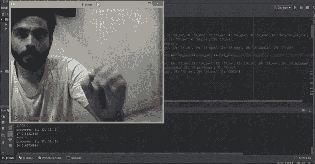

# 4.使用 FaceNet 进行面部识别

[](https://github.com/akshaybahadur21/Facial-Recognition-using-Facenet) [## akshaybahadur 21/使用 Facenet 进行面部识别

### 使用 Facenet 实现面部识别。

github.com](https://github.com/akshaybahadur21/Facial-Recognition-using-Facenet) 

这个代码有助于使用 face nets(【https://arxiv.org/pdf/1503.03832.pdf】T4)进行面部识别。面网的概念最初是在一篇研究论文中提出的。主要概念谈到三重损失函数来比较不同人的图像。这个概念使用了已取自源码的 inception network 和取自 deeplearning.ai 的 fr_utils.py 作为参考。为了提供稳定性和更好的检测，我自己增加了几个功能。

# 代码要求

您可以安装 Conda for python，它可以解决机器学习的所有依赖性，您将需要:

```
numpy
matplotlib
cv2
keras
dlib
h5py
scipy
```

# 描述

面部识别系统是一种能够从来自视频源的数字图像或视频帧中识别或验证人的技术。面部识别系统有多种工作方法，但一般来说，它们通过将从给定图像中选择的面部特征与数据库中的面部进行比较来工作。

## 添加的功能

1.  只有当你睁开眼睛的时候才能识别人脸。(安全措施)。
2.  使用 dlib 的 face align 功能在直播时进行有效预测。

## Python 实现

1.  使用的网络-初始网络
2.  原创论文 Google 的 Facenet

## 程序

1.  如果你想训练网络，运行`Train-inception.py`，但是你不需要这样做，因为我已经训练了模型，并保存为`face-rec_Google.h5`文件，在运行时加载。
2.  现在，您需要在数据库中有图像。代码检查`/images`文件夹。你可以把你的照片粘贴在那里，也可以用网络摄像头点击它。要做到这一点，运行`create-face.py`图像被存储在`/incept`文件夹中。您必须手动将它们粘贴到`/images folder`中
3.  运行`rec-feat.py`来运行应用程序。

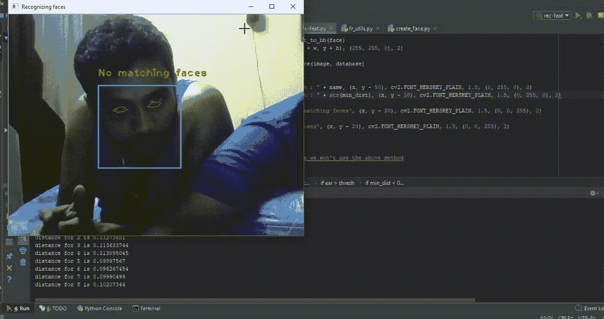

# 5.表情符号

[](https://github.com/akshaybahadur21/Emojinator) [## akshaybahadur21/Emojinator

### 一个简单的人类表情分类器。

github.com](https://github.com/akshaybahadur21/Emojinator) 

这个代码可以帮助你识别和分类不同的表情符号。截至目前，我们只支持手部表情符号。

# 代码要求

您可以安装 Conda for python，它可以解决机器学习的所有依赖性，您将需要:

```
numpy
matplotlib
cv2
keras
dlib
h5py
scipy
```

# 描述

表情符号是在电子信息和网页中使用的表意文字和表情符号。表情符号存在于各种类型中，包括面部表情、常见物体、天气的地点和类型以及动物。它们很像表情符号，但表情符号是实际的图片，而不是印刷字体。

## 功能

1.  检测手的过滤器。
2.  CNN 训练模型。

## Python 实现

1.  使用的网络-卷积神经网络

## 程序

1.  首先，你必须创建一个手势数据库。为此，运行`CreateGest.py`。输入手势名称，你将得到 2 帧显示。看轮廓框，调整手，确保捕捉到手的特征。按“c”键捕捉图像。一个手势需要 1200 张照片。尝试在框架内移动您的手一点，以确保您的模型在训练时不会过度配合。
2.  对您想要的所有功能重复此操作。
3.  运行`CreateCSV.py`将图像转换为 CSV 文件
4.  如果要训练模型，请运行“TrainEmojinator.py”
5.  最后，运行`Emojinator.py`通过网络摄像头测试你的模型。

## 贡献者

阿克谢·巴哈杜尔和拉格夫·帕特内恰。

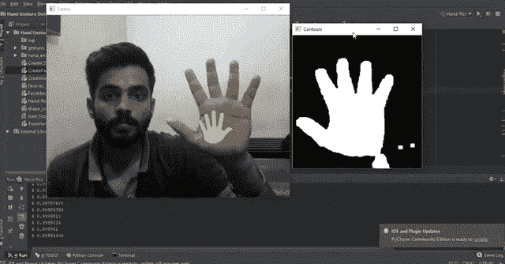

# 最后的话

我只能说这些项目给我留下了难以置信的印象，所有这些你都可以在你的电脑上运行，或者如果你不想安装任何东西，在 [Deep Cognition 的](http://deepcognition.ai/)平台上运行更容易，它可以在线运行。

我要感谢阿克谢和他的朋友们为开源做出的巨大贡献，以及即将到来的所有其他贡献。尝试它们，运行它们，并获得灵感。这仅仅是 DL 和 CV 所能做的令人惊奇的事情的一个小例子，并且取决于你是否能把它变成能帮助世界变得更好的东西。

永不放弃，我们需要每个人都对许多不同的事情感兴趣。我认为我们可以让世界变得更好，改善我们的生活，改善我们工作、思考和解决问题的方式，如果我们现在就调动我们所有的资源，让这些知识领域为更大的利益而共同努力，我们就可以对世界和我们的生活产生巨大的积极影响。

## 我们需要更多感兴趣的人，更多的课程，更多的专业，更多的热情。我们需要你:)

感谢你阅读这篇文章。希望你在这里发现了一些有趣的东西:)

如果您有任何问题，请在 twitter 上添加我:

[](https://twitter.com/FavioVaz) [## 法维奥·巴斯克斯(@法维奥·巴斯克斯)|推特

### Favio Vázquez 的最新推文(@FavioVaz)。数据科学家。物理学家和计算工程师。我有一个…

twitter.com](https://twitter.com/FavioVaz) 

和 LinkedIn:

[](http://linkedin.com/in/faviovazquez/) [## Favio Vázquez —首席数据科学家— OXXO | LinkedIn

### 查看 Favio Vázquez 在世界上最大的职业社区 LinkedIn 上的个人资料。Favio 有 15 个工作职位列在…

linkedin.com](http://linkedin.com/in/faviovazquez/) 

那里见:)


我是一名物理学家和计算机工程师，研究大数据、数据科学和计算宇宙学。我热爱科学、哲学、编程和数据科学。现在，我作为 Oxxo 的首席数据科学家，正在研究数据科学、机器学习和深度学习。我喜欢新的挑战，和优秀的团队一起工作，解决有趣的问题。我是 Apache Spark collaboration 的一员，在 MLLib、Core 和文档方面提供帮助。我喜欢运用我在科学、数据分析、可视化和数据处理方面的知识和专长来帮助世界变得更美好。