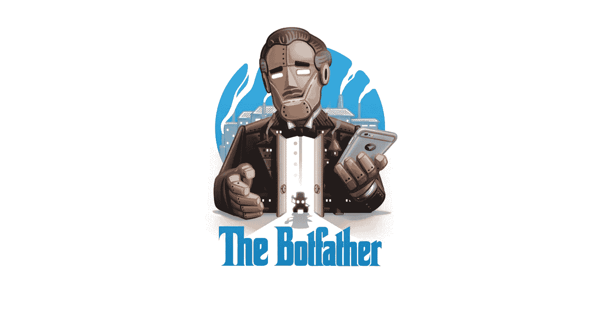
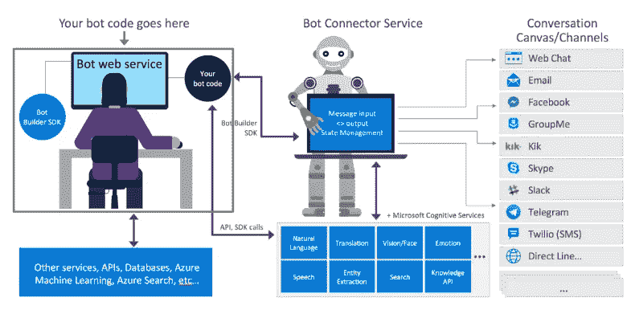
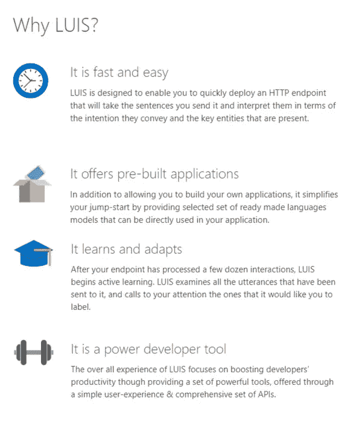
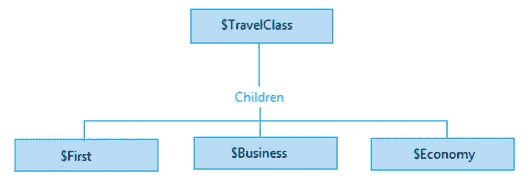
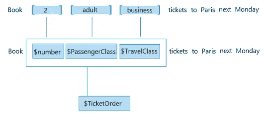
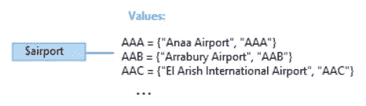

# DIY(第 1 部分):如何创建自己的。网络机器人

> 原文：<https://towardsdatascience.com/diy-part-1-how-to-create-your-own-net-bot-69f38302b88b?source=collection_archive---------4----------------------->

你已经听到了很多关于机器人、人工智能和机器学习的嗡嗡声。也许，你想知道一个. NET 机器人有多实用，你是否应该采用这种新的、流行的技术。总而言之，关于机器人和所有支持它们的技术，你应该知道一件事。机器人技术将会继续存在！主要原因:他们比你当地的工人便宜。如果你需要证据，可以看看我们精彩的博客帖子——[人工智能机器人正在为你的测试工作而来](http://devcom.com/tech-news/ai-bots-are-coming-for-your-testing-jobs/?utm_source=medium&utm_campaign=DIY1.NET)或者只是浏览网页。

机器人会帮你省钱。尽管媒体上充斥着各种高科技，但它们的制作并不复杂。**我们会告诉你如何创造你自己的。NET bot 的 6 个简单步骤和 2 篇简短博文:**

**DIY(第一部分)**

1.  的 Bot 框架介绍。网
2.  创造你的第一个。网络机器人
3.  让机器人更聪明

**DIY(第二部分)**

1.  让你的机器人活起来
2.  将机器人连接到频道
3.  给你的机器人一个声音

# 的 Bot 框架介绍。网

让我们从一开始就把一切说清楚。当我们使用“机器人”这个词时，我们指的是用户以对话方式与之交互的应用程序。你总是可以从头开始创建一个合适的机器人，但是让我们把它留给数字穴居人吧。现在所有的软件都有一个框架，尤其是机器人。而且，**这个。NET bot 框架将通过提供**来解决一些基本问题:

*   基本输入输出(输入输出处理)
*   语言和对话技巧
*   与用户的连接
*   语言支持

**这个。NET bot 框架本身包含以下工具和功能:**

*   Bot Builder(带 SDK。网)
*   Bot 框架仿真器
*   开发者门户
*   Bot 连接器服务
*   渠道 API

这一切是如何运作的？简单到你都不会相信。**首先**，你已经有了用于实际编码的 Bot Builder SDK，以及用于 API、数据库、Azure、机器学习等附加服务的开发者门户。此外，还有一个用于测试代码的 Bot 框架模拟器。

**其次**，您有一个用于管理输入输出消息传递的 Bot 连接器服务

**第三**，有一整套渠道 API，包括社交媒体。如果你想把机器人添加到没有提供的通道中(下图)，记住这里有一个自定义的 API 构建器。换句话说，你已经得到了你第一次所需要的一切。网络机器人。

# 创造你的第一个。网络机器人

好了，理论说够了！让我们进入正题。遵循以下步骤:

第一步。通过 [Nuget 包管理器](https://www.nuget.org/)安装 Bot Builder SDK

**第二步**。将 [Bot 应用程序模板](http://aka.ms/bf-bc-vstemplate)安装到您的 Visual Studio 中

**第三步**。使用 GitHub 的[源代码](https://github.com/Microsoft/BotBuilder/tree/master/CSharp)获得一个现成的机器人

**第四步**。使用[机器人框架模拟器](https://emulator.botframework.com/)，以测试你的机器人

最后一步是保护你新造的机器人。这将需要一些额外的措施。然而，获得一个好的软件总是有回报的。

**有几条规则可以保证你的机器人安全:**

*   仅使用 HTTPS 端点
*   通过注册您的 bot 以获取 Microsoft 应用 ID 和密码来启用 Bot 框架身份验证
*   在你的 bot 的 web.config 文件中指定它的应用 ID 和密码(寻找提示)
*   使用 Bot Builder SDK 时，使用[BotAuthentication]属性指定身份验证凭据。网

*提示:身份认证是这样的。您可以在适当的字段中添加 Microsoft App ID。等待初始身份验证。将新生成的 BotID 添加到适当的字段和配置(Bot 句柄)中。就是这样！*

还不解？[点击这里获取微软关于如何构建你的机器人的教程](https://docs.microsoft.com/en-us/bot-framework/dotnet/bot-builder-dotnet-quickstart)。

此外，在其 Bot 框架中，微软提供了一个精彩的词汇表，其中包含了所有可能不熟悉的概念:[https://docs . Microsoft . com/en-us/Bot-Framework/dot net/Bot-builder-dot net-concepts](https://docs.microsoft.com/en-us/bot-framework/dotnet/bot-builder-dotnet-concepts)**。**

希望在本章结束时，你已经准备好创建你的第一个机器人了。如果不是这样，请联系我——这篇文章的作者——奥莱赫·罗曼纽克@ Linkedin 点击这里。我会确保你有一个合适的。NET bot 已创建！

# 让你的机器人更聪明

祝贺你——你已经走到这一步了。你的机器人还活着，你是一个骄傲的机器人父亲。然而，该机器人仍然是原始的，几乎没有用。在这一点上，微软提供了一整套解决方案来增强你的机器人的大脑，特别是用于语言理解的 5 种不同的 API。

不知道选哪个？不要惊慌。第一个是最有用的。我叫路易斯。[**【LUIS(语言理解智能服务)**](https://azure.microsoft.com/en-us/services/cognitive-services/language-understanding-intelligent-service/) 能够使用预先构建或定制训练的语言模型来处理自然语言。它有一堆非常适合你的优点(如下图)。

没有任何进一步的介绍，让我们开始计划你的 LUIS 应用程序。你的机器人和你的生意的目的是什么？你如何看待你的机器人帮助你的客户？

# 对于教导机器人的聪明计划，让我们经历以下步骤:

**第一步。确定你的领域**——LUIS 的工作方式通常围绕特定领域的主题展开。比如你有一个卖票的 app，或者一个追踪你健身情况的 app。它们都将是不同领域的应用程序，它们需要不同的 LUIS 设置。此外，还有 20 个为您提供便利的预建域名，您可以在这里找到。

**第二步。确定你的意图**——意图是解释你的客户想要什么的关键词。如果你的顾客写“买票”,显然这就是他想要的。如果健身机器人在对话中看到“脉搏”这个词，很可能客户需要了解他或她的脉搏。简单明了地说，列出你的客户在与你的机器人对话时可以使用的所有关键词，并从机器人方面将它们与适当的动作联系起来。

**第三步。识别你的实体**——为了预订你的航班，你需要一些信息，比如目的地、日期、航空公司、机票类别和舱位等级——这就是实体。你必须添加它们，才能真正实现一个意图。

# 所以，这就是所有乐趣的开始。您可以创建多种类型的实体:

*   *简单实体—* 简单实体描述一个概念。

*   *分层实体—* 分层实体代表一个类别及其成员。

*   *复合实体—* 复合实体由构成整体一部分的其他实体组成。

*   *预建实体—* LUIS 为 Number 等常见类型提供了[预建实体](https://docs.microsoft.com/en-us/azure/cognitive-services/luis/pre-builtentities)，您可以使用它们来表示门票订单中的门票数量。

*   *列表实体—* 列表实体是明确指定的值列表。每个值由一个或多个同义词组成。在旅游应用程序中，您可以选择创建一个列表实体来表示机场名称。

规划你的 LUIS 应用程序？确定你将使用什么意图和实体？完美！不要担心，如果你不确定所有的事情，你可以在事后改变设置。现在是时候创建一个真正的路易斯应用程序，让你的机器人更聪明！

# 要直接为机器人创建 LUIS 应用程序，请点击这里的按照[微软手册一步一步来。](https://docs.microsoft.com/en-us/azure/cognitive-services/luis/luis-get-started-create-app)

如果你已经对你的路易斯有了一个清晰的计划，创作部分不会很复杂，最多需要 10 分钟。

*祝你在创建和使用你的机器人上好运。如果您在上面写的任何内容或。NET Bot Framework，你可以在 Linkedin 上随意称呼我—* [奥勒赫·罗曼纽克，营销经理@ DevCom](https://www.linkedin.com/in/oleh-romanyuk-devcom/) *。此外，如果上面写的一切对你来说似乎是一门火箭科学，或者你只是没有时间自己做，你总是可以在这里 *用请求* [寻址 DevCom。哦，别忘了看看我们的，这是一个精彩的娱乐。具有机器学习能力的网络机器人。最后，感谢访问 DevCom 博客并保持安全！](http://devcom.com/TriviaChatBot/?utm_source=medium&utm_campaign=DIY1.NET)*

*继续阅读* [DIY(第二部分):如何自己创作。网络机器人](http://devcom.com/tech-news/create-net-bot-diy-part-2/?utm_source=medium&utm_campaign=DIY1.NET)

[*链接到原博文*](https://devcom.com/tech-news/diy-part-1-create-net-bot/?utm_source=medium) *。随意订阅。*

*作者:* [奥莱赫·罗曼纽克](https://www.linkedin.com/in/oleh-romanyuk-devcom/) *，营销经理@ DevCom*