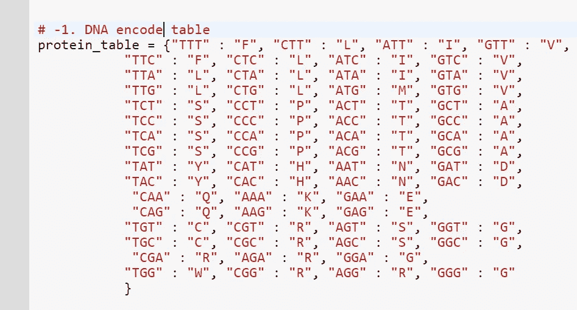
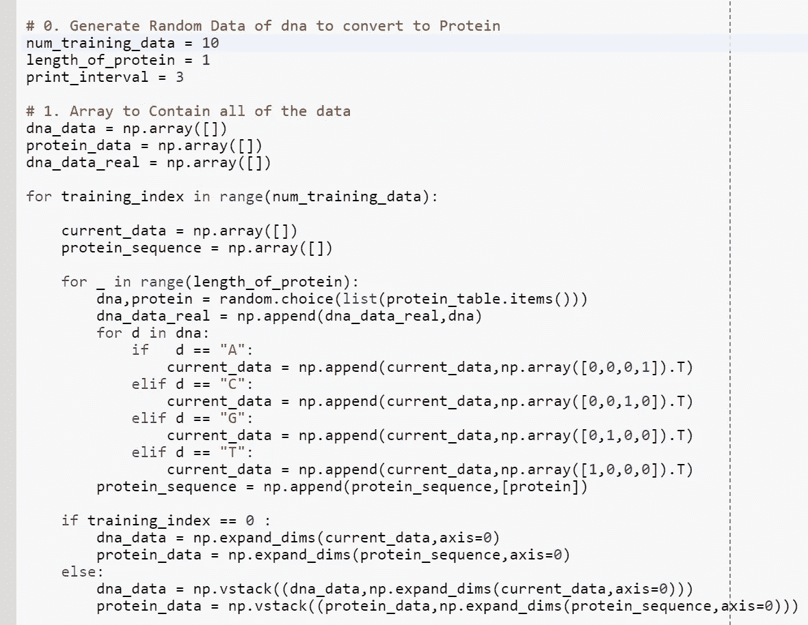
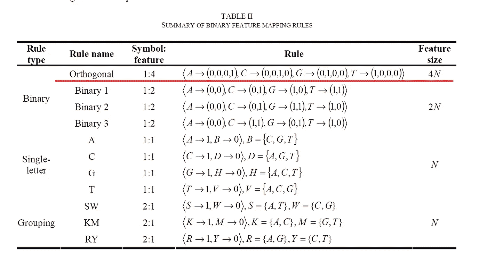
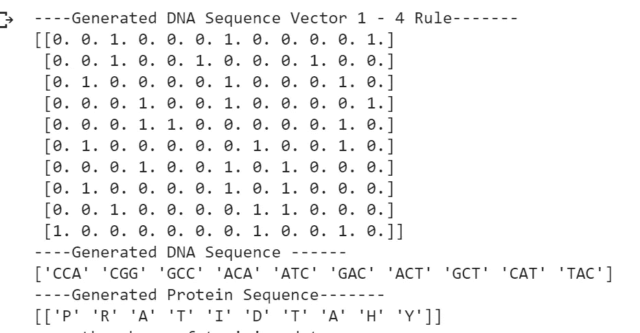
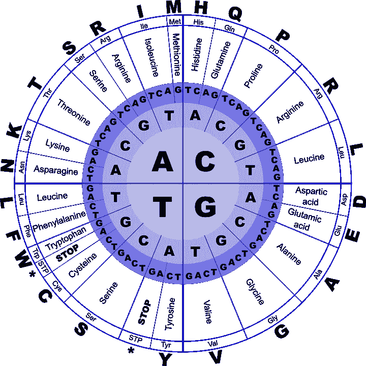
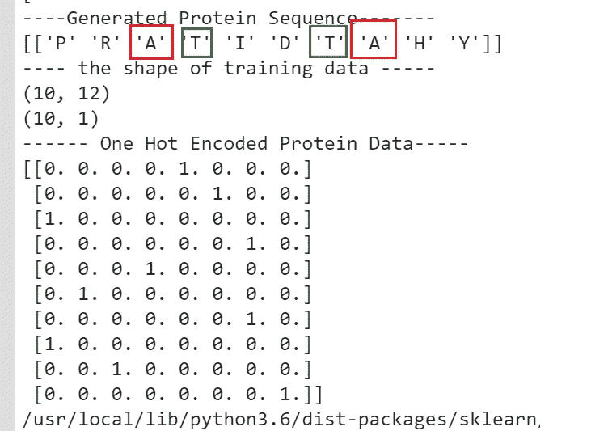
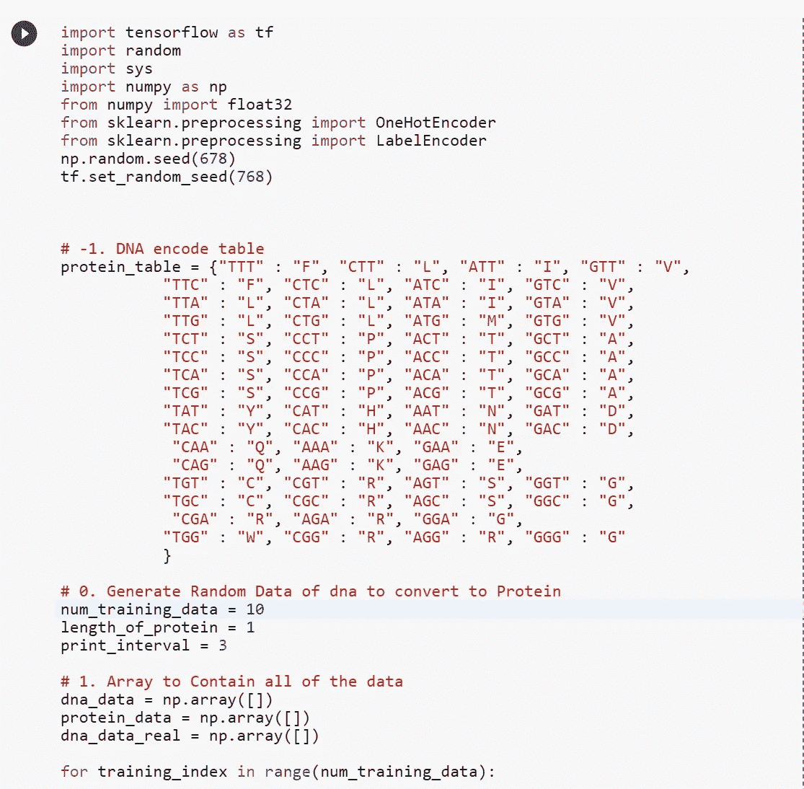

# 用于具有交互式代码的机器学习任务的 DNA /蛋白质表示

> 原文：<https://towardsdatascience.com/dna-protein-representation-for-machine-learning-task-with-interactive-code-6aa065b69227?source=collection_archive---------5----------------------->

Image from [pixabay](https://pixabay.com/en/eggs-raw-dairy-wooden-wood-3183410/)

所以在今天的帖子中，我不打算执行任何机器学习任务，而是它是 DNA 和蛋白质数据的预处理步骤。

请注意，我从[这篇博文](/starting-off-in-bioinformatics-turning-dna-sequences-into-protein-sequences-c771dc20b89f)和[这篇博文](https://machinelearningmastery.com/how-to-one-hot-encode-sequence-data-in-python/)中截取了部分代码。所以，如果你想了解更多关于生物信息学或热门编码的知识，去看看那些博客吧。

**第 0 步——获取 DNA 和蛋白质表**

所以上面的字典代码直接来自 [Vijini Mallawaarachchi](https://towardsdatascience.com/@vijinimallawaarachchi?source=post_header_lockup) 的[开始于生物信息学——将 DNA 序列转化为蛋白质序列](/starting-off-in-bioinformatics-turning-dna-sequences-into-protein-sequences-c771dc20b89f)，做了一些小的改变。没有终端信号，这是因为在我要执行的机器学习任务中不需要它。

**步骤 1——生成 DNA 序列和蛋白质序列**

如上所述，我们已经声明了一些超参数，表示训练数据的数量或蛋白质序列的长度。我们将从步骤 0 中声明的字典中随机选择一对 DNA 序列和蛋白质。

**步骤 1.5——使用 1–4 法则对 DNA 进行编码**

Image [from Paper](http://ieeexplore.ieee.org/abstract/document/4670503/)

因此，有几个 DNA 映射规则来编码 DNA，然而在这篇文章中，我将使用 1-4 规则。这里我们给每一个 DNA 序列分配(1*4)个向量。下面是生成的 DNA 序列，以及编码的数据。

**步骤 2——验证生成的蛋白质序列**

Genetic Code Chart for DNA ([http://www.geneinfinity.org/sp/sp_gencode.html](http://www.geneinfinity.org/sp/sp_gencode.html))

我们可以通过查看上图来验证生成的蛋白质序列是正确的。

**步骤 3——蛋白质序列的一次热编码**

**红框→** 重复蛋白 A
**绿框→** 重复蛋白 T

因此，由于我们有两个重复的蛋白质，我们只需要(1*8)个向量来表示每个蛋白质。

这就是了！非常简单，但对于机器学习来说是完美的。

**交互代码**

为了交互代码，我搬到了 Google Colab！所以你需要一个谷歌帐户来查看代码，你也不能在谷歌实验室运行只读脚本，所以在你的操场上做一个副本。最后，我永远不会请求允许访问你在 Google Drive 上的文件，仅供参考。编码快乐！

要访问代码[，请点击此处。](https://colab.research.google.com/drive/17cTHGw2lL0GHXbtetivzS4U4CFmyZ1qz)

**最后的话**

由于期中考试，我不能写机器学习的帖子。然而，一旦这结束了，我会回去写那些！

如果发现任何错误，请发电子邮件到 jae.duk.seo@gmail.com 给我，如果你希望看到我所有写作的列表，请[在这里查看我的网站](https://jaedukseo.me/)。

同时，在我的 twitter [这里](https://twitter.com/JaeDukSeo)关注我，并访问[我的网站](https://jaedukseo.me/)，或我的 [Youtube 频道](https://www.youtube.com/c/JaeDukSeo)了解更多内容。如果你感兴趣的话，我还做了解耦神经网络[的比较。](https://becominghuman.ai/only-numpy-implementing-and-comparing-combination-of-google-brains-decoupled-neural-interfaces-6712e758c1af)

**参考**

1.  从生物信息学开始——将 DNA 序列转化为蛋白质序列。(2017).走向数据科学。检索于 2018 年 3 月 9 日，来自[https://towards data science . com/starting-off-in-bio informatics-turning-DNA-sequences-into-protein-sequences-c 771 DC 20 b 89 f](/starting-off-in-bioinformatics-turning-dna-sequences-into-protein-sequences-c771dc20b89f)
2.  不平衡 DNA 序列中启动子识别的二元特征映射规则分析。(2018).中等。检索于 2018 年 3 月 9 日，来自[https://medium . com/@ SeoJaeDuk/analysis-of-binary-feature-mapping-rules-for-promoter-recognition-in-balanced-DNA-sequence-C4 b 557 FB 3105](https://medium.com/@SeoJaeDuk/analysis-of-binary-feature-mapping-rules-for-promoter-recognition-in-imbalanced-dna-sequence-c4b557fb3105)
3.  j . brown lee(2017 年)。如何在 Python 中对序列数据进行热编码-机器学习掌握？机器学习精通。检索于 2018 年 3 月 9 日，来自[https://machine learning mastery . com/how-to-one-hot-encode-sequence-data-in-python/](https://machinelearningmastery.com/how-to-one-hot-encode-sequence-data-in-python/)
4.  [1]2018.【在线】。可用:[https://www . research gate . net/publication/224347982 _ Analysis _ of _ binary _ feature _ mapping _ rules _ for _ promoter _ recognition _ in _ unbalanced _ DNA _ sequence _ datasets _ using _ Support _ Vector _ Machine。](https://www.researchgate.net/publication/224347982_Analysis_of_binary_feature_mapping_rules_for_promoter_recognition_in_imbalanced_DNA_sequence_datasets_using_Support_Vector_Machine.)【访问时间:2018 年 3 月 7 日】。
5.  遗传密码。(2018).Geneinfinity.org。检索于 2018 年 3 月 9 日，来自 http://www.geneinfinity.org/sp/sp_gencode.html