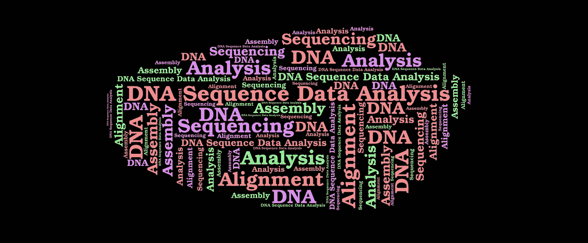
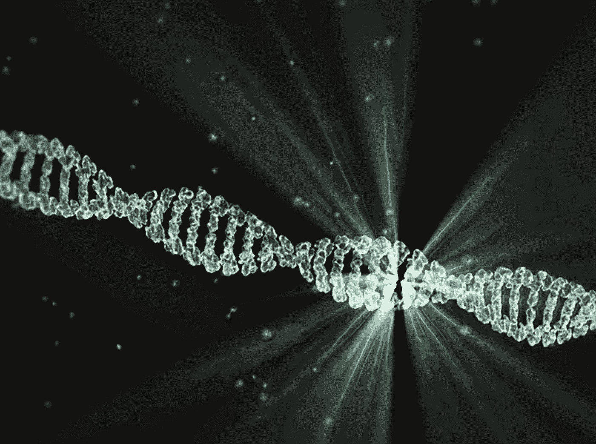
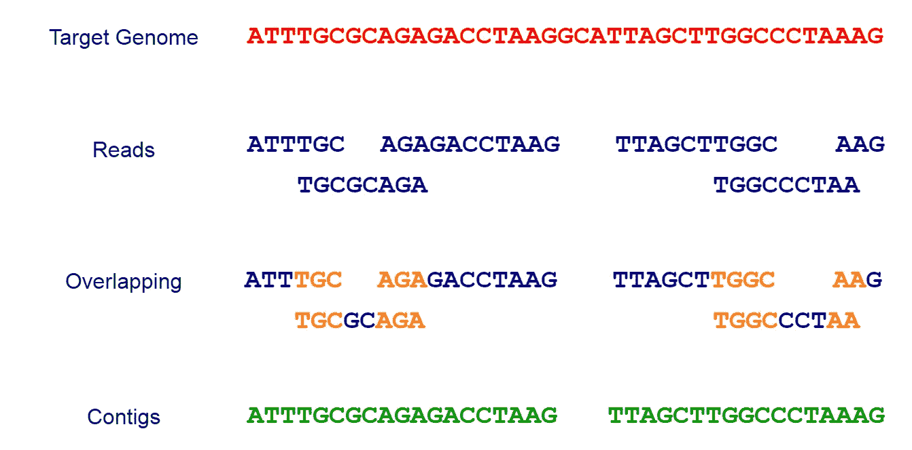
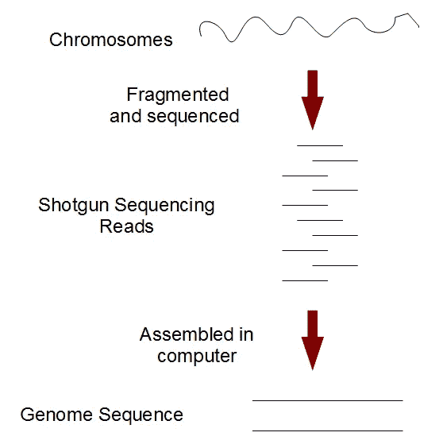

# DNA 序列数据分析——从生物信息学开始

> 原文：<https://towardsdatascience.com/dna-sequence-data-analysis-starting-off-in-bioinformatics-3dba4cea04f?source=collection_archive---------1----------------------->

在我的[上一篇文章](https://medium.com/towards-data-science/starting-off-in-bioinformatics-dna-nucleotides-and-strands-8c32515271a8)中，我已经介绍了 DNA、核苷酸及其排列的基础知识。你可能想知道我们如何确定 DNA 分子核苷酸的精确顺序。这就是 **DNA 测序**发挥作用的地方。

# 什么是 DNA 测序？

**测序**是确定给定 DNA 分子核苷酸精确顺序的操作。用于确定一条 DNA 中四个碱基 ***【腺嘌呤(A)******鸟嘌呤(G)******胞嘧啶(C)******胸腺嘧啶(T)****的顺序。*

*DNA 测序用于确定生物体的单个基因、完整染色体或完整基因组的序列。DNA 测序也成为测定 RNA 或蛋白质序列的最有效方法。*

**

*DNA Molecule (Image Source: [https://pixabay.com](https://pixabay.com))*

# *测序的历史*

*英国生物化学家弗雷德里克·桑格完成的工作为蛋白质测序奠定了基础。1955 年，桑格完成了胰岛素中所有氨基酸的测序。他的工作提供了证据，证明蛋白质由具有特定模式的化学实体组成，而不是物质的混合物。*

**

*Frederick Sanger (Image Source: [https://en.wikipedia.org/wiki/DNA_sequencing](https://en.wikipedia.org/wiki/DNA_sequencing))*

*后来，弗雷德里克·桑格和他的同事在 1977 年发明了一种叫做桑格测序的方法，这种方法可以通过产生片段来对 DNA 进行测序。这是大约 40 年来最广泛使用的测序方法。*

# *全基因组测序和序列组装*

*DNA 测序反应产生一个几百个碱基长的序列。基因序列通常有数千个碱基长。已知最大的基因是与[杜氏肌营养不良](https://en.wikipedia.org/wiki/Duchenne_muscular_dystrophy)相关的基因。长度大约为*240 万碱基*。为了研究一个完整的基因，科学家们使用了一种简单的策略，称为鸟枪测序。长 DNA 序列由一系列较短的重叠序列组装而成。让我们看看鸟枪测序法会发生什么。*

## *猎枪测序*

**

*Shotgun Sequencing*

*被称为**测序机器**的特殊机器被用来从我们希望确定的特定基因组中提取短随机 DNA 序列(**目标基因组**)。目前的 DNA 测序技术不能一次读取一个完整的基因组。它能读取 20 到 30000 个碱基的小片段，这取决于所用的技术。这些小片段被称为**读作**。特殊的软件被用来根据它们如何**重叠**来组合这些读数，以产生被称为**重叠群**的连续串。这些重叠群可以是整个目标基因组本身，也可以是基因组的一部分(如上图所示)。*

*为了重建原始序列，排列和合并较长 DNA 序列片段的过程被称为**序列组装**。*

*为了获得整个基因组序列，我们可能需要产生越来越多的随机读数，直到重叠群与靶基因组匹配。*

# *序列装配问题*

*顺序装配问题可以描述如下。*

> *给定一组序列，找出包含该组所有成员的最小长度字符串作为子字符串。*

**

*Image Source: [http://www.homolog.us/Tutorials/index.php?p=1.3&s=1](http://www.homolog.us/Tutorials/index.php?p=1.3&s=1)*

*由于基因组中重复序列的存在以及它们之间的替换或突变，这个问题变得更加复杂。*

*序列组装问题可以与现实生活场景进行比较，如下所示。*

> *假设你拿了一本书的许多副本，用不同的刀具将每一份通过碎纸机，然后你试图通过将碎片粘在一起将书的文本重新组合在一起。很明显，这项任务相当困难。此外，还有一些额外的实际问题。原文可能会有很多重复的段落，碎纸过程中可能会修改一些碎纸出现错别字。另一本书的部分内容可能也加入了进去，有些碎片可能完全无法辨认。*

*这听起来很令人困惑，而且很难实现。这个问题被称为 **NP 完全**。NP 完全问题是状态未知的问题。对于任何 NP 完全问题，还没有发现多项式时间算法，也没有人能够证明对于它们中的任何一个都不存在多项式时间算法。然而，有**贪婪算法**来解决序列组装问题，其中实验已经证明在实践中表现相当好。*

*解决序列拼接问题和进行序列数据分析的一种常用方法是**序列比对**。*

# *序列对比*

***序列比对**是一种排列 DNA、RNA 或蛋白质序列以识别相似区域的方法。被鉴定的相似性可能是序列之间的功能、结构或进化关系的结果。*

*如果我们比较两个序列，它被称为**成对序列比对**。如果我们比较两个以上的序列，这被称为**多序列比对**。*

# *下一代测序*

***下一代测序(NGS)** ，也称为**高通量测序**，是用于描述许多不同现代测序技术的统称，例如，*

*   *[Illumina](https://www.illumina.com/science/technology/next-generation-sequencing/illumina-sequencing-history.html) (Solexa)测序*
*   *[罗氏](https://www.ebi.ac.uk/training/online/course/ebi-next-generation-sequencing-practical-course/what-next-generation-dna-sequencing/454-seque) 454 测序*
*   *[离子洪流](https://www.ebi.ac.uk/training/online/course/ebi-next-generation-sequencing-practical-course/what-next-generation-dna-sequencing/ion-torre)质子/ PGM 测序*
*   *[固体](https://www.thermofisher.com/us/en/home/life-science/sequencing/next-generation-sequencing/solid-next-generation-sequencing.html)测序*

*这些最新技术使我们能够比以前使用的桑格测序更快更便宜地对 DNA 和 RNA 进行测序，并彻底改变了基因组学的研究。*

# *最后的想法*

*序列数据分析已经成为基因组学领域中一个非常重要的方面。生物信息学通过提供不同的软件解决方案和省去所有繁琐的手工工作，使生物学家的分析任务变得更加容易。*

*你可以从 [*这里*](http://www.bioinformatics.org/wiki/DNA_sequencing) 找到用于 DNA 测序的软件工具列表。此外，你可以在 这里找到 [*的序列比对软件列表。*](https://en.wikipedia.org/wiki/List_of_sequence_alignment_software)*

*希望你对序列数据分析有了一个基本的概念。*

*在我的下一篇文章中，我将带你浏览**双序列比对**的细节和一些在该领域使用的常见算法。*

*因为我对这个领域还很陌生，所以我想听听你的建议。😇*

*感谢阅读…😃*