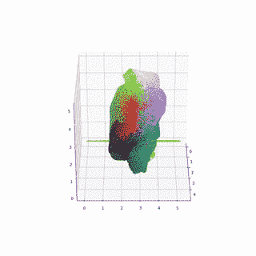
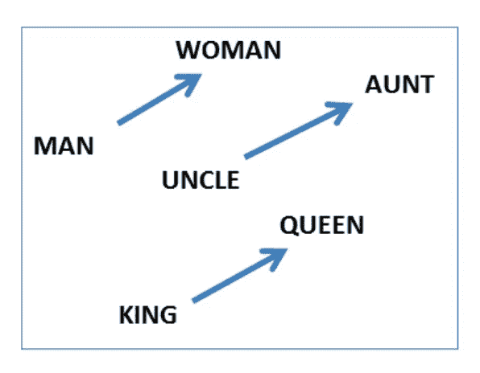
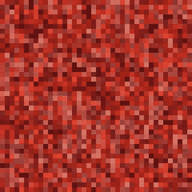
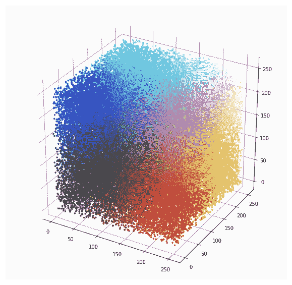
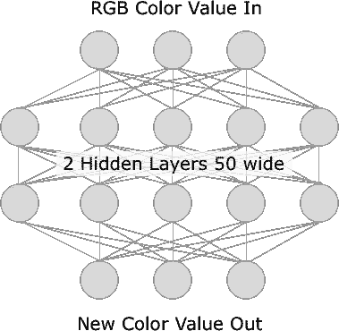
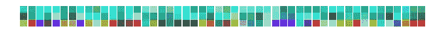
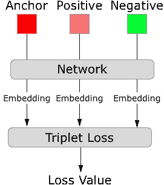
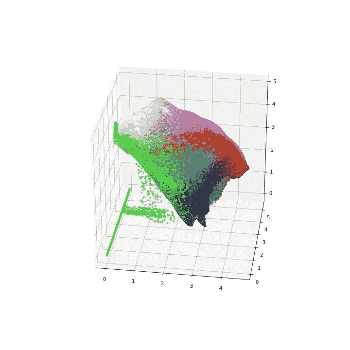

# 机器人会看到电蓝色吗？—视觉化色彩感知的潜在空间

> 原文：<https://towardsdatascience.com/do-androids-see-electric-blue-visualizing-the-latent-space-of-color-perception-fcd46fb8848e?source=collection_archive---------20----------------------->

Visualization of the learned color space

## TL；速度三角形定位法(dead reckoning)

我想更好地理解使用神经网络将数据映射到潜在向量空间的过程。我记得这个[调查要求人们说出随机呈现的颜色](https://blog.xkcd.com/2010/03/01/color-name-survey/)。因为颜色能产生引人注目的视觉效果，而且我以前没见过这样的效果，所以我认为这是一个很好的训练范例。神经网络的任务是将具有相同名称的颜色分组到新颜色空间的相似区域中。通过在学习的颜色空间中绘制每种颜色的新位置来可视化结果。

## 介绍

在机器学习中，向量空间可以用于对语义相似的项目进行分组。例子包括人脸识别、句子相似度和内容创建。其思想是获取可变的输入数据，例如不同光照条件下同一张脸的照片，并将其映射到向量空间中相同或相似的区域。我将使用颜色感知调查的数据来说明这个概念。以前没见过这样做的，真的很兴奋的跟大家分享。

那么，什么是潜向量空间呢？

本质上，潜在向量空间是一种输入的表示，它被编码成语义上有意义的。语义相似的条目应该被映射到相似的空间区域，即使原始输入数据非常不同。

让我们把定义分解一下:向量就是一组数字。在向量空间中，每个数字代表一个独立轴上的位置。你可以想象一个指向一个位置的向量，或者一个点，在多维空间里。潜在的被定义为“(指某种品质或状态)存在但尚未发展或显现；隐藏的或隐蔽的”。在潜在向量空间中，轴的含义是通过训练过程发现的，而不是事先确定的。

一个常见的例子是 [word2vec](https://blog.acolyer.org/2016/04/21/the-amazing-power-of-word-vectors/) ，其中单词被编码成一个向量。一个词的意思完全由句子中与其相邻的词来决定。这个新向量空间的轴编码了有趣的语义属性。下图显示了性别轴。

有了潜在的向量空间，我们希望发现一些隐藏的，但却存在的数据的形状或顺序。

## 映射颜色

理解发现这些隐藏性质的过程的一种方式是从我们已经知道的向量空间开始。这就是颜色的由来。颜色通常用 3 个数字的向量来表示，分别代表红、绿、蓝(RGB)的值。其他常见的颜色空间有 [HSV、YUV、CIE 等。](https://en.wikipedia.org/wiki/List_of_color_spaces_and_their_uses)

训练网络需要执行一项任务，比如给一张照片贴标签，或者预测句子中的下一个单词。Word2Vec 和句子向量就是这样构造的。在[单词袋](https://iksinc.online/tag/continuous-bag-of-words-cbow/)模型中，一个句子片段被呈现，其中一个单词被移除。网络试图根据相邻的单词来猜测丢失的单词。

## 数据清理和数据集创建

网络漫画 XKCD 进行了一项[调查](https://blog.xkcd.com/2010/03/01/color-name-survey/)，参与者被要求说出展示的颜色。原始调查数据由每种呈现的颜色和参与者输入的姓名组成。在使用这些数据之前，需要进行一些清理。我冒昧地组合了我认为明显是相同颜色名称的条目。例如，我组合了蓝色和浅蓝色、砖红色和砖红色、褐色和紫红色的条目。有兴趣的可以看看这个[笔记本](https://github.com/briandw/ColorEmbeddings)看看我到底做了什么。

Sample of the colors labeled “red”

Plot of the input colors from the survey

## 训练神经网络

我使用的网络是一个完全连接的网络，有一个输入，两个隐藏层和一个输出。输入层采用 3 个浮点数，对应于我们原始的 RGB 颜色值，输出 50 个值。两个隐藏层的宽度也是 50 个值。输出层将从第三层获取 50 个隐藏值，并输出 3 个浮点数。输出将是我们新的颜色空间。

当训练神经网络时，对输出进行评分，看它根据输入预测正确结果的程度。这个分数叫做损失函数。最简单的损失函数是 L1 损失，它是输出和期望值之差的绝对值。你可以在这里阅读更多关于损失函数的内容。在这种情况下，损失函数更有趣一些。我们不能使用通常的猜测游戏，因为我们要求网络创建一个新的向量，而不是对已经标记的数据进行分类。任务是为相似的输入创建彼此靠近的向量，为不相似的输入创建彼此远离的向量。实现这一点的一种方法是使用三重边际损失函数。

Sample of the triplet dataset colors. The top, middle and bottom are the anchor, positive and negative colors respectively

三重损失以三个值作为输入，输出一个分数。这三个值是锚值、正值和负值。锚色是有问题的颜色，正片是与锚色同名的颜色，底片是不同名称的颜色。训练网络时，这三个值在网络中运行，一次一个，并保存输出。然后将这三个值提供给损失函数，该函数根据锚色和正色的距离以及负色的距离产生一个分数。然后这被用作反向传播中的误差值。在每批颜色通过网络后，相似的颜色将具有彼此更接近的矢量，而不相似的颜色将相距更远。

一旦这个过程完成，我们应该有一个新的彩色地图。

但是什么地图？

在培训之前，我看到了以下几种可能性:

1)网络不训练，也就是说损失值永远不下去，网络没有学到什么有用的东西。

2)网络训练并且损失函数减小，但是结果是无意义的。这将是过度拟合的结果。

3)网络训练并产生可理解的感知色彩空间。

4)网络训练并产生颜色空间，该颜色空间对颜色进行分组，但在其他方面是独特的。

5)网络训练并产生与原始颜色值相似的 RGB 值。

在训练开始前，我的猜测是第四名。

## 培训结果

在训练网络和绘制颜色之后，我会说结果是#3 和#4 的混合。绿色和红色相距甚远，正如你对人类色觉所知的那样。似乎也有一个暖/冷轴以及一个亮/暗轴。绿色似乎比其他颜色占据更大的体积。一点绿色偏见也是有道理的。我不知道角落里的绿点是怎么回事。

One view of the 3D color space

## 结论

这就是，一台机器从调查数据中学习色彩空间。我认为这说明了机器学习系统从大量数据中提取意义的能力。这里的信号很小，只是单独的颜色/名称对，但有了如此大量的数据，就可以学习更大的结构。从头再来一次训练，看看结果会有多大的不同，这将会很有趣。如果结果非常相似，那么在给定输入和网络拓扑的情况下，最终结构不可避免地会有一些问题。

请鼓掌👏如果你喜欢这篇文章，并希望看到更多类似的。