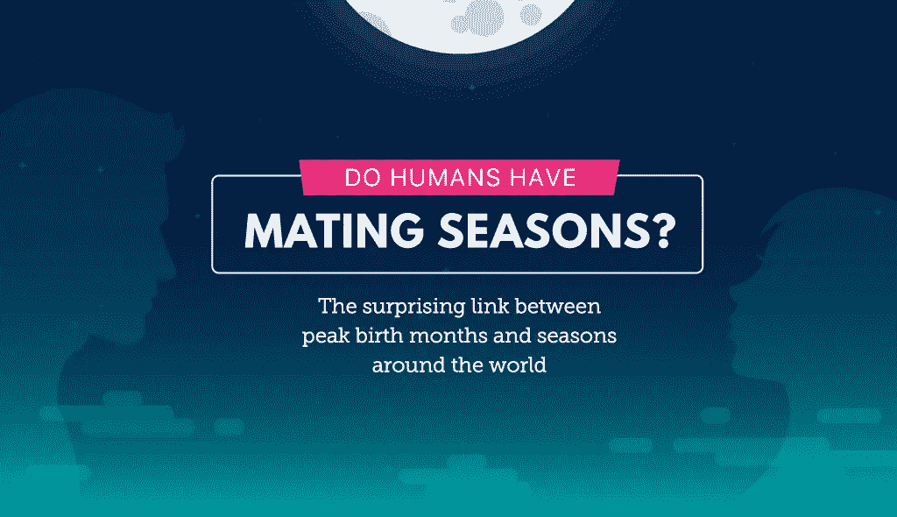
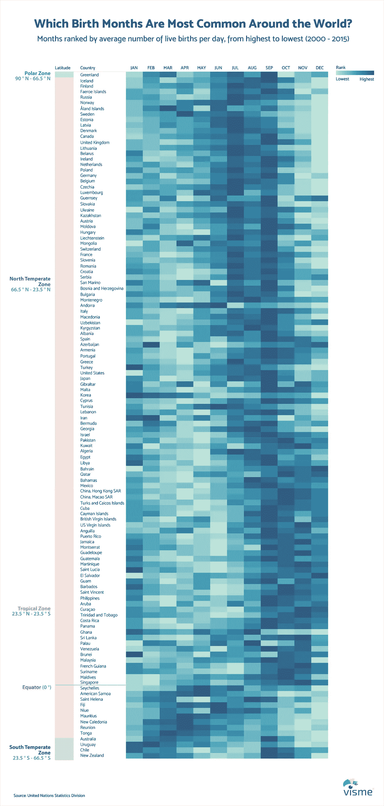
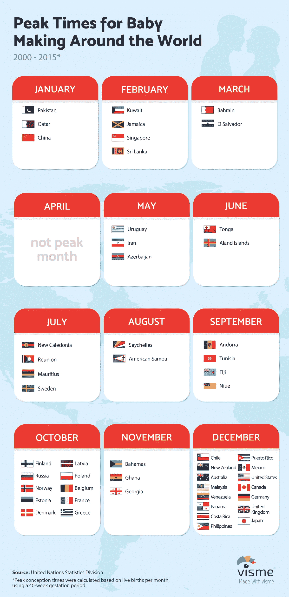
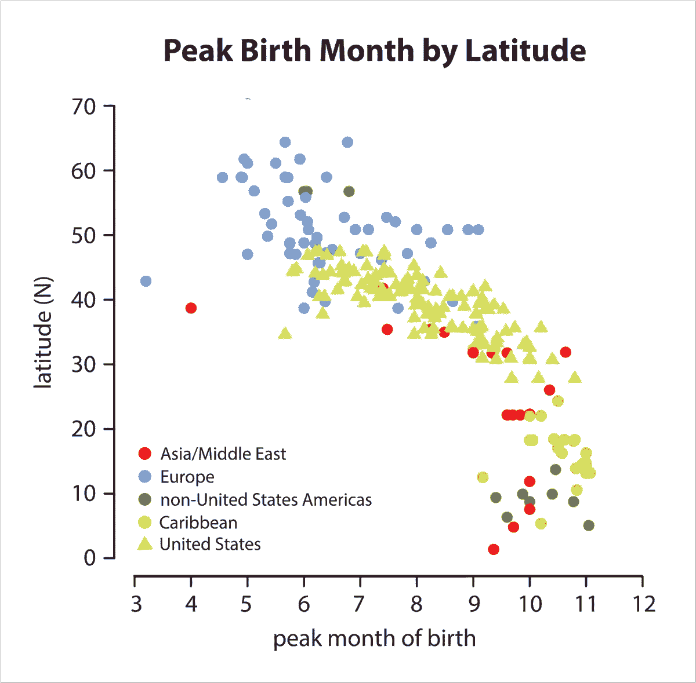

# 人类有交配季节吗？这张热图揭示了生日和季节之间惊人的联系

> 原文：<https://towardsdatascience.com/do-humans-have-mating-seasons-a723cad43500?source=collection_archive---------1----------------------->

动物本质上是季节性动物:鹿在秋天交配，所以它们的幼鹿正好在食物变得更加丰富的春天出生。北极熊在春末夏初寻找配偶，并在 12 月至 1 月间产下幼崽。

但是人类呢？我们是唯一没有真正交配季节的动物吗？毕竟，人类全年都有性生活，不用担心他们的婴儿是否有足够的食物过冬。

看起来我们有——某种程度上。

这张由 [Visme](https://www.visme.co/make-infographics/) 基于最新的[联合国活产数据](http://data.un.org/Data.aspx?d=POP&f=tableCode%3A55#POP)绘制的热图不仅揭示了出生高峰月份和季节之间令人惊讶的联系，还揭示了出生高峰月份和纬度之间令人惊讶的联系(纬度是赤道以北或以南的距离，以度为单位):

你注意到北半球高纬度国家的一致模式了吗？平均每天出生人数最多的月份是七月、八月和九月。

当你向下移动国家列表，从最高纬度到最低纬度排序，你可以清楚地观察到**出生高峰期越来越向右移动，发生在一年的晚些时候**。

一旦你进入中纬度地区，或热带地区，9 月和 10 月就成为平均每天活产婴儿数量排名最高的月份，其次是 11 月和 12 月，有些会延续到下一年。

排名垫底的是南半球的国家，这些国家在 3 月至 5 月期间每天平均出生人数最高。

当这些数据转化为受孕日期时，使用 40 周的妊娠期，我们还可以看到，在俄罗斯、挪威、芬兰和丹麦等高纬度国家，制造婴儿的高峰时间是 10 月，如下面用 Visme 制作的图[所示。](https://www.visme.co/)

根据同样的数据，在很多国家，12 月是另一个受孕高峰月，包括美国、英国、澳大利亚、加拿大、墨西哥和日本。

使用这个 DIY 工具，在几分钟内创建您自己的令人难忘的信息图表。[免费试用](https://www.visme.co/make-infographics/?vc=In-Text-Blog-CTA)

# 这些趋势意味着什么？

虽然这很容易归因于长期以来的假设，即较冷的温度会让我们在身体亲密关系中找到温暖，但可能的科学解释要复杂一些。

根据发表在《生殖节律杂志》上的一项[研究](https://academic.oup.com/humrep/article-abstract/7/6/735/724626/Seasonality-in-human-reproduction-an-update)，一年中受孕的理想时间是当太阳出来 12 个小时，温度在 50 到 70 华氏度之间。出于不完全清楚的原因，这些是受孕的[完美条件](http://www.nytimes.com/1990/10/02/science/seasons-sway-human-birth-rates.html)，要么因为它们刺激精子生成或排卵——要么两者兼而有之。

其他研究的发现也与从这张热图中获得的见解一致。例如，发表在《英国皇家学会学报 B》上的对[人类出生季节性](http://rspb.royalsocietypublishing.org/content/281/1783/20132438)的综合分析得出结论，出生高峰期出现在一年中你越往南走的晚些时候，如下图所示。

[Image Source](http://rspb.royalsocietypublishing.org/content/281/1783/20132438/)

邓波儿在她为 Slate 撰写的[文章中也做了计算，并得出结论，北纬度国家在秋季怀孕的频率更高，而更靠南的国家则在冬季怀孕，这也在一定程度上与我们的研究结果一致。](http://www.slate.com/articles/health_and_science/science/2014/04/birth_rates_vary_by_season_and_latitude_what_explains_the_peaks.html)

其他研究，比如这项关于性活动季节性变化的研究，得出的结论是，事实上“在圣诞节前后，性活动和不安全性行为有所增加。”甚至对谷歌搜索[的分析](https://www.ncbi.nlm.nih.gov/pubmed/22810997)，作为性活动的替代指标，也表明与性和交配行为相关的查询在冬季和初夏达到高峰。

所有这一切似乎表明，这里有环境和生物两方面的因素在起作用，而且最终，我们可能无法精确地找到这些模式存在的确切原因。

我们可以肯定的是，尽管人类似乎有一个准交配季节，但这并不是一个真正的季节，因为女性全年都容易接受性行为，每 28 天排卵一次，而不是每年。与其他动物不同，人类隐瞒了排卵，因为他们没有表现出任何生物生育的外在迹象，这对科学家来说仍然是一个谜。

# 方法学

为了创建上面的热图，我们按月份过滤了最新的[联合国活产数据，以获得 2000 年至 2015 年之间的数据(这是列出的所有国家中数据量最大的时期)。](http://data.un.org/Data.aspx?d=POP&f=tableCode%3A55#POP)

为了说明每个日历月天数的差异，我们计算了每个月每天活产婴儿的平均数量，并对一年中的每个月进行了排名。

例如，对于美国，计算每个月每天的平均活产数。然后根据每天活产婴儿的平均数量，从最高到最低对每个月进行排名。由于 9 月份是这一时期每天平均出生人数最多的月份，因此该月份的排名为 1；八月展示了第二高的总数，因此获得了 2 的排名；诸如此类。

然后，使用与每个月的等级值(从 1 到 12)相对应的色标创建热图。通过这种方式，彩色编码的可视化将使得国家和半球之间的比较变得容易。否则，一个国家与另一个国家之间的活产婴儿数量的巨大差异将产生一个范围太广的色阶，使观众无法进行快速的视觉比较。

# 轮到你了

你对这些受孕和生育趋势有什么看法？你认为除了气候和季节之外还有其他外部因素吗？请在下面的评论区告诉我！

*本帖* [*原版*](http://blog.visme.co/most-common-birthday/) *最早出现在 Visme 的* [*视觉学习中心*](http://blog.visme.co/) *。*