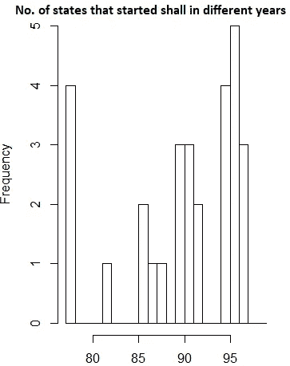
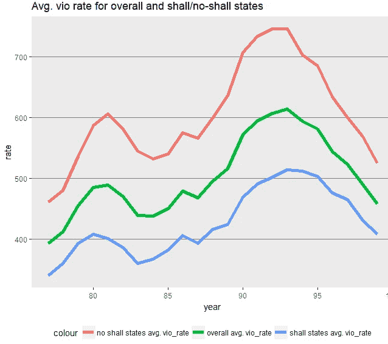
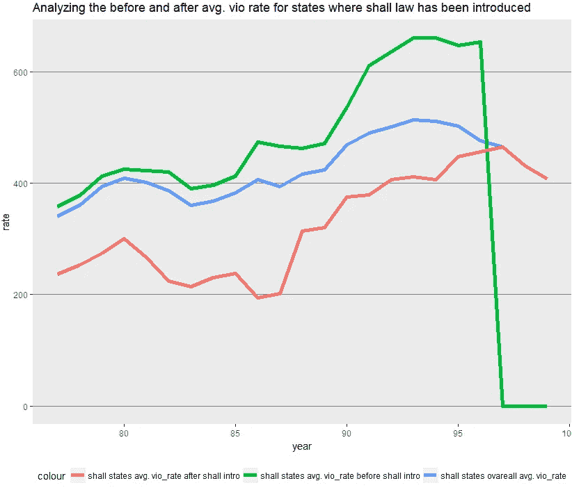
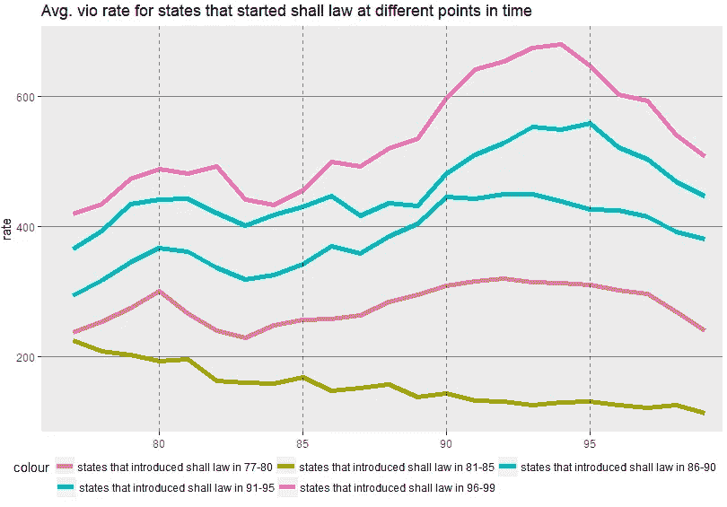
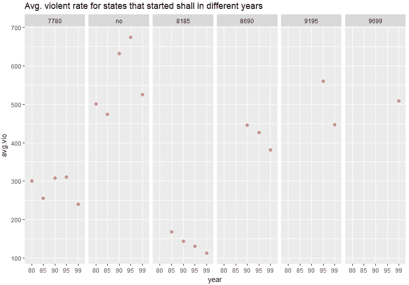

# 更多的枪支会降低暴力犯罪率吗？(第一部分:数据可视化)

> 原文：<https://towardsdatascience.com/do-more-guns-reduce-violence-crime-rate-part-i-data-visualization-fb3fd6a918a5?source=collection_archive---------6----------------------->

携带权利法要求美国政府向任何符合必要标准的申请人发放隐蔽携带手枪许可证。这是增加了暴力犯罪率还是降低了暴力犯罪率？

枪支对美国犯罪的影响引发了许多公众辩论。两个方向似乎都有足够的研究(说明法律有效和无效)，人们总是可以挑选一个研究来支持他们的立场。事实上，在这篇文章中，一个可视化给出了一个与最终结论不同的矛盾见解。

这一系列的文章是关于分析法律的影响，在这一时期的可用数据。这篇文章(第一部分)有视觉表现，以了解携带权利法是否减少了暴力犯罪。在后面的部分，面板回归将被用来估计携带权利法对暴力犯罪率的影响。

我的 GitHub 上的 r 代码和数据:

 [## saivishnuk/数据科学

### 在 GitHub 上创建一个帐户，为数据科学的发展做出贡献。

github.com](https://github.com/saivishnuk/Data-Science/tree/master/Do_more_guns_reduce_violence_crime_rate) 

更多我的博客，请查看我的 [**中**](https://medium.com/@saivishnu_k) 和我的 [**GitHub**](https://github.com/saivishnuk/) **。**

**探索性数据分析**

**数据字典:**数据是 1977-1999 年美国 50 个州加上哥伦比亚特区(总共 51 个“州”)的平衡面板。每个观察值都是给定年份的一个状态。总共有 51 个状态× 23 年= 1173 个观测值。

**图表 1:** 不同州何时出台了承运权法？

**图表 1 中的见解:**

*   在观察期间，51 个州中只有 29 个州有有效的携带权法律
*   在这 29 个国家中，有 4 个国家的运载权法律从观察期开始时就已经生效
*   超过 50%的州在观察期的后半段实施了该法律

> 在引入该法律的州，暴力犯罪率降低了吗？

**图表 2:** 在观察期内至少实施过一次运载权法律的国家被视为应国，其余被视为非应国

*   **图表 2 中的见解:**平均值的趋势。“应”和“非应”州的暴力率与“总体平均”类似。暴力犯罪率”和平均犯罪率的上升或下降。这些年来，各州的犯罪率一直居高不下
*   **假设一:**这个图没有得出足够的证据，因为 avg 没有划界。shall 州引入 shall 法前后的暴力犯罪率

**图 3(检验假设一):**将已经实施法律的州的犯罪率分为法律出台前和出台后。

例如，如果 1990 年在州“1”中引入了该法律，则在 1990 年之前，州“1”将被计入“应州平均”。在“应介绍”之前的暴力率和 1990 年之后的状态“1”将被认为是“应说明平均”。暴力 _ 率后应介绍”。

“应说明平均值。从 1997 年开始，暴力发生率将为零，因为法律实施的最后一年(观察期内)是 1997 年。

*   **从图表 3 中洞察:**“应州平均值”的趋势。谋杀率后，应介绍“增加了多年。
*   假设 2: 虽然这表明法律在降低犯罪率方面并不有效，但这也可能是因为在观察的初始阶段采用 shall 法律的州的平均犯罪率更低。暴力率高于在观察期后期实施该法律的州。

**图表 4(检验假设 2):** 在观察初期采用了该定律的州是否 avg 较少。暴力率比那些在观察期后期采用运载权法律的州高吗？
对于已经引入该法律的州，数据已经根据该法律引入的年份分成几个箱，每个箱有 5 年。

*   **图表 4 中的见解:**在(77–80)、(81–85)、(86–90)中引入法律的州的平均犯罪率低于在(91–95)、(96–100)中引入法律的州，这表明在观察的初始阶段采用法律的州的平均犯罪率更低。暴力率高于后一时期实施该法律的各州。

所有上述图表都没有给出法律是否有效的结论性证据。将“图 4”分成不同的子图，每个子图显示一个趋势，可以更好地理解。

**图表 5(图表 4 的分割):**假设有 4 个州在(77-80)期间实施了 shall 法律，那么在引入期之后(即从 80 到 99)分析这 4 个州的平均暴力率。

*   **图表 5 中的洞见:**在法律已经跨不同时间段实施的州中，平均。据观察，法律出台后，暴力率有所下降。这表明携带权利法在降低暴力犯罪率方面是有效的。

这只是一个直观的表象，可能有更多的因素导致暴力犯罪率的上升或下降。面板回归方法用于说明第二部分中的每个因素。下面是第二部分的链接。

 [## 更多的枪支会降低暴力犯罪率吗？(第二部分:R 中的面板回归)

### 携带权利法是要求美国政府颁发隐蔽携带手枪的法律…

towardsdatascience.com](/do-more-guns-reduce-violence-crime-rate-part-ii-panel-regression-in-r-d3f0eafdf401) 

## 谢谢你的阅读。如果你喜欢这篇文章，给它一些掌声👏。希望你有一个伟大的一天！