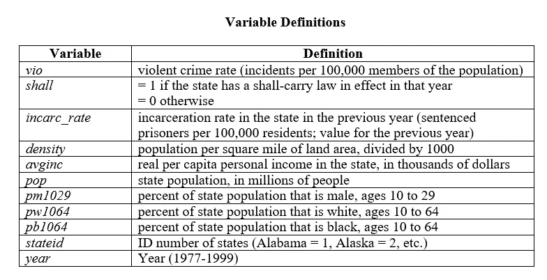
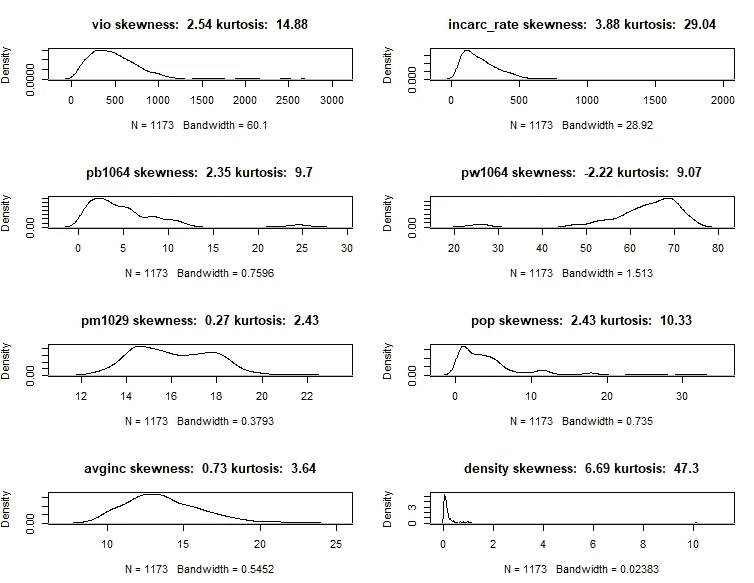
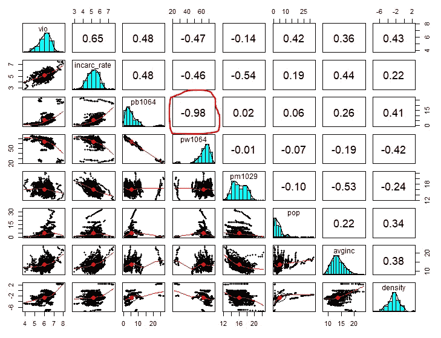
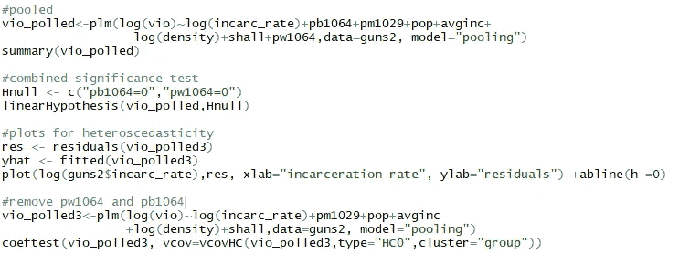
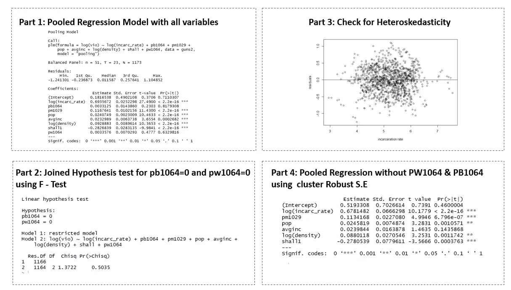
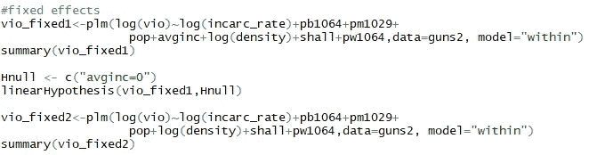
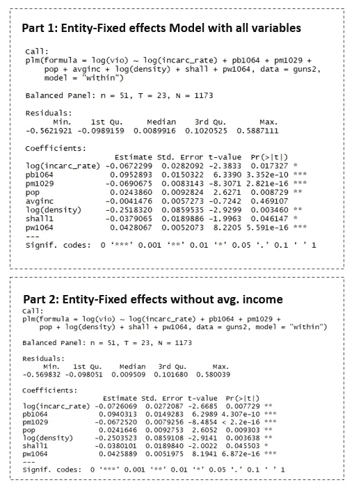
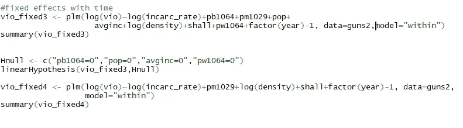
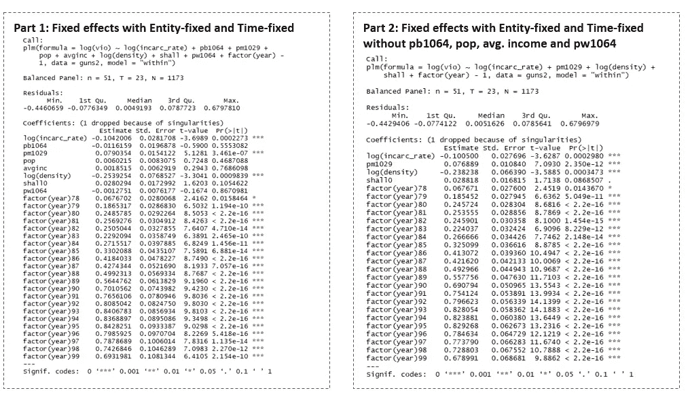

# 更多的枪支会降低暴力犯罪率吗？(第二部分:R 中的面板回归)

> 原文：<https://towardsdatascience.com/do-more-guns-reduce-violence-crime-rate-part-ii-panel-regression-in-r-d3f0eafdf401?source=collection_archive---------5----------------------->

携带权利法要求美国政府向任何符合必要标准的申请人发放隐蔽携带手枪许可证。这是增加了暴力犯罪率还是降低了暴力犯罪率？

这是本系列的第二篇文章，在第一部分中，数据可视化被用来理解携带权利法对暴力犯罪率的影响。下面是第 1 部分的链接。

 [## 更多的枪支会降低暴力犯罪率吗？(第一部分:数据可视化)

### 第一部分有视觉表现，以了解携带权利法是否减少了暴力犯罪。在后来…

towardsdatascience.com](/do-more-guns-reduce-violence-crime-rate-part-i-data-visualization-fb3fd6a918a5) 

在这一部分，将使用面板回归方法来了解基于监禁率、携带权利法、人口等因素的暴力犯罪率的变化..

我的 GitHub 上的 r 代码和数据:

 [## saivishnuk/数据科学

### 在 GitHub 上创建一个帐户，为数据科学的发展做出贡献。

github.com](https://github.com/saivishnuk/Data-Science/tree/master/Do_more_guns_reduce_violence_crime_rate) 

更多我的博客，请查看我的 [**中**](https://medium.com/@saivishnu_k) 和我的 [**GitHub**](https://github.com/saivishnuk/) **。**

在本文中:

*   将用于面板回归的所有变量的定义
*   检查每个变量的正态性
*   执行变量转换
*   检查成对相关性
*   面板回归(将使用混合和固定效应模型)
*   归纳不同面板回归模型的结果

**不同变量的定义**

如果运输权法在某一州和某一年有效，则变量“应”等于 1，否则“应”等于 0。

**使用密度图的每个变量的正态性**

*   暴力率、监禁率和人口密度具有较高的偏态性(大于 2.5)
*   这三个变量已经使用对数函数进行了转换

**变量之间的成对相关性**

*   pb1064(该州 10-64 岁黑人人口的百分比)和 pw1064(该州 10-64 岁白人人口的百分比)高度负相关(-0.98)
*   包含高度相关的独立变量会导致标准误差的扩大

**面板回归**

1.  **以 log(暴力率)为因变量的混合普通最小二乘法**

**代码**

**结果**

*   **第 1 部分:**Pb 1064 和 Pw1064 的估计值与零没有显著差异，有携带权利法的暴力率比没有携带权利法的暴力率降低了 28%。
*   **第二部分:**联合假设检验，H-Null 为 Pb1064 =0 & Pw1064=0，表明两个变量都不显著
*   **第三部分:**模型的监禁率-残差图具有锥形结构，这表明异方差的存在。因此，使用聚类稳健的标准误差来校正标准误差。
*   **第 4 部分:**使用聚类稳健 S.E 的无 Pb1064 和 Pw1064 的混合回归模型显示，所有变量在 p 值为 0.15 时都是显著的，有携带权法律比没有该法律减少了 28%的暴力率。这似乎是一个非常高的估计，这可能是因为忽略了变量偏差。

**2。具有实体固定效果的固定效果模型**

固定效应模型不受遗漏变量偏差的影响，遗漏变量偏差来自于随时间恒定的变量，并且在各州之间变化，而不在各州内变化。例如，人们对犯罪的文化态度不能用混合 OLS 模型来量化。

**代码**

**结果**

*   **第 1 部分:**实体固定效应模型显示，平均收入的估计值与零没有显著差异，有携带权利法比没有携带权利法减少了 3.7%的暴力率
*   **第 2 部分:**没有平均收入的实体固定效应表明，有携带权利法比没有携带权利法减少了 3.8%的暴力率，估计值仅在 0.04 的高 p 值下有意义。估计值与民意测验的估计值大相径庭。

**3。具有实体固定和时间固定效果的固定效果模型**

仍然可以省略变量，这些变量可能随时间变化，但在不同状态下是恒定的。通过为时间创建虚拟变量，使用具有时间固定和实体固定效应的固定效应模型，将从这些省略的变量中消除偏差。

**代码**

**结果**

*   **第 1 部分:**实体固定和时间固定效应模型显示，Pb1064、pop、平均收入和 pw1064 的估计值与零没有显著差异，没有携带权利法比有携带权利法增加了 2.8%的暴力率
*   H-Null 为 Pb 1064 = 0 & pop = 0 & avg . income = 0 & pw 1064 = 0 的联合假设检验表明，所有四个变量都不显著
*   **第二部分:**没有 Pb1064、pop、avg.income 和 pw1064 的实体固定和时间固定效应模型表明，没有携带权法律比有携带权法律增加暴力率 2.8%，这也意味着有携带权法律比没有携带权法律减少暴力率 2.8%。“应”变量也很重要，估计值与集合模型相比有很大不同

**结论**

*   对“具有实体固定和时间固定的固定效应”和“具有实体固定的固定效应”模型的估计表明，有携带权法律比没有携带权法律降低了暴力犯罪率，但仅降低了不到 4%
*   这也与第一部分的调查结果一致，即“携带权法律在降低暴力犯罪率方面是有效的”
*   还有其他研究表明，更多的枪支导致抢劫率(入室盗窃率)上升。这项研究只关注暴力犯罪率

## 谢谢你的阅读。如果你喜欢这篇文章，给它一些掌声👏。希望你有一个伟大的一天！