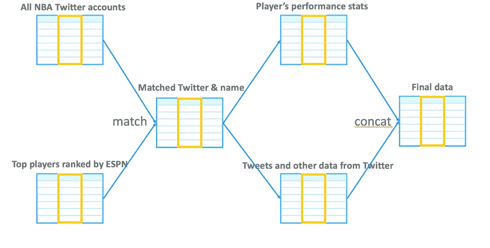
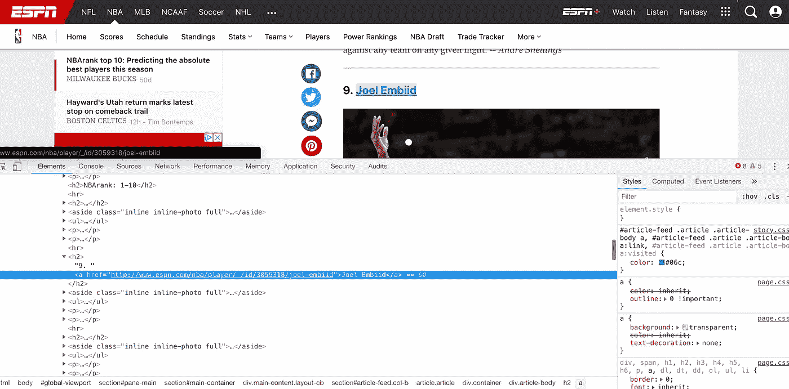
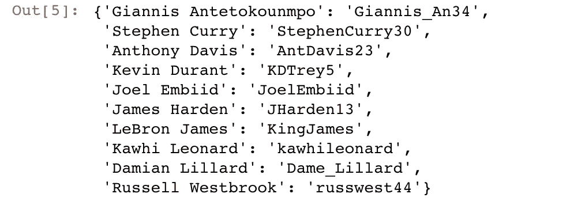
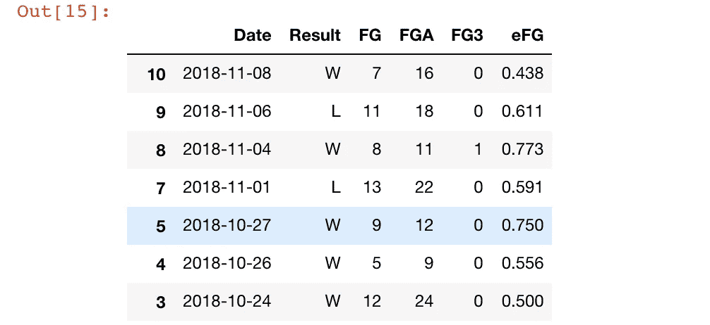
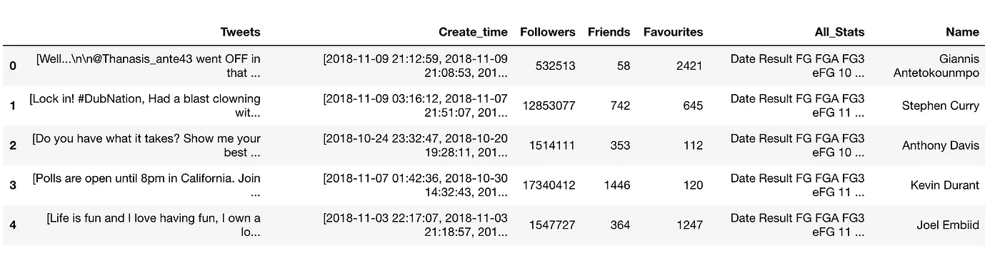

# NBA 顶级球员推特账户的情感分析——第一部分数据收集

> 原文：<https://towardsdatascience.com/do-tweets-from-nba-leading-players-have-correlations-with-their-performance-7358c79aa216?source=collection_archive---------24----------------------->

*<本文其他部分的快速链接>*

*第一部分数据收集*

[*Part2 推文数据清理*](/sentiment-analysis-on-nba-top-players-twitter-account-part2-tweets-data-cleaning-aa2cf99519b3)

[*Part3 情感分析&聚类*](/sentiment-analysis-on-nba-top-players-twitter-account-part3-sentiment-analysis-clustering-5e5dcd4d690f)

[*Part4 绩效之间的相关性测试&情绪*](/sentiment-analysis-on-nba-top-players-twitter-account-part4-correlation-tests-between-f9bdbe224779)

# 摘要

我们知道，一个团队中的领军人物对赢得比赛起着至关重要的作用。因此，我们很好奇球员在比赛前的情绪是否会与他们的表现甚至比赛结果相关联。为了衡量这种影响，我们选择 twitter 作为衡量球员情绪的工具，因为大多数 NBA 球员都在 Twitter 上发表自己的观点或想法。

但是，评价联盟中每个球员的推文是很费时间的；因此，我们将只关注根据[ESPN.com](http://www.espn.com/nba/story/_/id/24668720/nbarank-2018-19-1-10-best-players-season)排名的前 10 名玩家。现在有人可能会开始争论为什么这些人是每支球队中最好的球员，但是这里我们使用了一个示例网站，而不是任何个人偏好。

在分析中，我将使用 Python 作为编程语言，这个主题将涉及诸如 **web 抓取、聚类、数据可视化和自然语言处理**等技术。

# 韵律学

既然最终目的是衡量情绪和游戏表现的相关性。这里的情感评分是通过基于**极性**和**化合价**计算正面或负面评分。我们稍后将讨论这一点。

至于性能，我们在本文中使用**高效场目标(eFG)** ，因为它在简单性和准确性之间取得了良好的平衡。

eFG 公式:***(FG+0.5 * 3P)/FGA***

# 第 1 部分的先决条件

在我们开始之前，这部分需要这些包:

不要慌！包的细节将在整篇文章中解释。

但是在事情开始之前，记住你应该已经有一个 Twitter 开发者账户，否则你不能继续这个过程。

请注意，consumer_key、consumer_secret、access_token 和 access_secret 应该使用您的令牌。不要与任何人分享！！

# 数据收集的步骤

知道我们正在寻找球员的推文和表现之间的关系。在我们开始分析之前，将有四个资源来完成数据收集。

1.  从[ESPN.com](http://www.espn.com/nba/story/_/id/24668720/nbarank-2018-19-1-10-best-players-season)获得前 10 名玩家的名字
2.  从 reference.com[收集 NBA 球员的推特账号和他们的名字列表，将前 10 名球员的名字和他们的推特匹配](https://www.basketball-reference.com/)
3.  废弃 reference.com[上匹配玩家的统计数据](https://www.basketball-reference.com/)
4.  抓取玩家的推文以及每条推文的创建时间。

下图显示了这些数据是如何连接和匹配的:

数据的前三部分将通过网页抓取技术收集。这里我们使用 Python 的 ***请求*** 和***beautiful soup***包进行提取。Requests 包是 Python 的高级 HTTP API，其中一半的抓取任务可以在这个函数中完成:**requests . get(yout _ URL _ link)**。这个功能下载 HTML 内容到你的电脑，不做任何修改。

然后，我们需要的是应用 BeautifulSoup 来解析数据。我们只需右键单击您想要的内容，然后单击“检查”然后网页源代码瞬间出来，通过 ***标签*** 找到确切内容。注意，标签是一种可以被搜索引擎检测到的标记词。通常，标签会附上不同种类的单词，称为属性。例如，术语“*是标记， ***href*** 是属性名，URL 后面是属性 href 的值。当然，*就是我们要找的内容。**

**现在，这才是开始！**

****

**Image from ESPN.com**

## **1.从[ESPN.com](http://www.espn.com/nba/story/_/id/24668720/nbarank-2018-19-1-10-best-players-season)获得前 10 名玩家的名字**

## **2.收集 NBA 球员的推特账号和他们的名字**

**上述结果以如下的字典格式存储:**

**这些名字是字典的关键，他们的 Twitter 账户就是这些值:**

****

## **3.废弃[reference.com](https://www.basketball-reference.com/)上匹配玩家的统计数据**

**现在，这部分是关于提取球员在球场上的表现的数据。我们正在统计 2016-2019 赛季的数据，但在这里我们遇到了一些问题。每个 URL 会根据每个玩家的不同而不同，URL 没有固定的模式。因此，我现在想到的唯一方法是列出每个玩家的所有 URL。之后，我们根据每个玩家的网址计时，得到我们需要的全部网址。**

**在我生成 URL 之后，我将它们发送到下面的函数中。在这里，我们收集了比赛时间、比赛结果、投篮命中率(FG)、尝试投篮命中率(FGA)和三分球命中率(FG3)。此外，我们有很多“如果…否则”语句的原因是，[reference.com](https://www.basketball-reference.com/)用特定的词标记记录，如果玩家没有玩游戏，例如“不活动”或“没有玩”**

**然后，我们将列表类型的数据改造成数据框架。在这里，我们还将数据类型转换为正确的格式，并通过将“int**”**类型指定为“int16”来最小化数据大小。回想一下，我们衡量玩家的表现和他们的推文。我们定义的绩效是**有效飞行目标(eFG)，**，公式是 **(FG + 0.5 * 3P) / FGA** 。**

**该图显示了我们收集的一个玩家数据:**

****

**现在，Twitter 来了，我们开始根据刚刚得到的账户抓取推文数据。**

## **4.获取玩家的推文以及他们每条推文的创建时间**

**这里的功能看起来很复杂，但它只是获取推文、关注者数量、朋友数量、最爱数量，并将他们的表现和球员姓名的统计数据组合到一个巨大的数据框架中。**

**注意:**

**记住添加 **tweet_mode = 'extended'** 以获得完整的字符数，否则每条 tweet 上只能获得前 **140 个字符**。此外，只有 **tweepy。光标()。items(1000)** api 可以访问超过 200 条推文。 **api.user_timeline(id = ID，count = 200)** API 有这个限制。**

**此外，我们发现科怀·伦纳德已经很多年没有发微博了。所以我们需要删除科怀·伦纳德。抱歉莱纳德。**

****

**[***数据收集到此结束，在下一章，我们将对 tweets 进行一些数据操作。***](/sentiment-analysis-on-nba-top-players-twitter-account-part2-tweets-data-cleaning-aa2cf99519b3)**