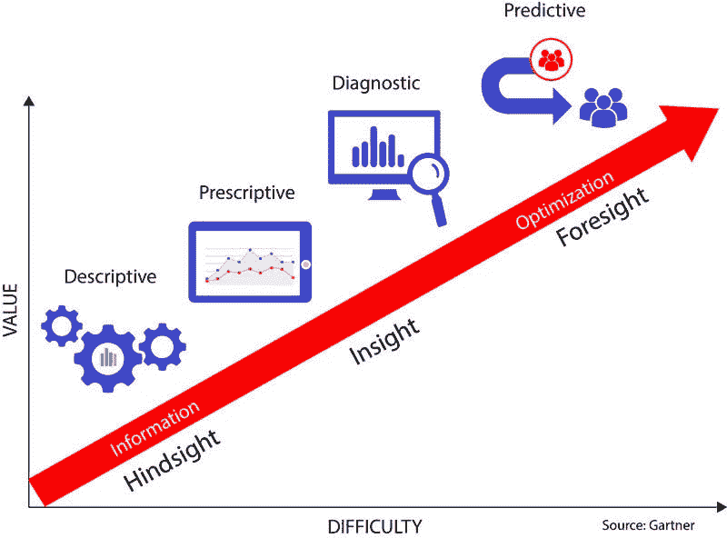
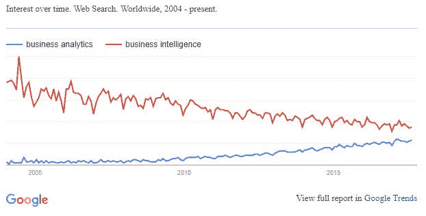
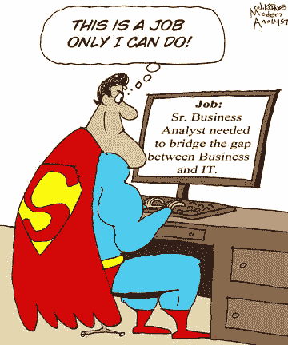

# 你的团队中有数据英雄吗？

> 原文：<https://towardsdatascience.com/do-you-have-a-data-hero-on-your-team-e4ddc318926e?source=collection_archive---------7----------------------->

## 商业分析和商业智能

您知道每天会产生惊人的 15pb 新数据吗？如果你想把它形象化，这相当于大约 3 亿个四屉文件柜的纸。企业如何处理所有这些数据？

答案可能会让你大吃一惊。今天的企业每天都在发现收集和使用数据的新方法，这意味着发展解释数据的能力可以在几乎所有可以想象的业务运营中做出更明智的决策。

业务分析涉及通过统计和定量分析、数据挖掘、预测建模以及其他用于识别趋势和理解推动业务变革的信息的技术，对来自许多后端系统的历史数据进行探索和分析。商业分析是使用任何东西发现洞察力的行为:任何你可以使用的工具或服务。

商业分析位于商业和数据科学的交叉点。它通过统计和运营分析获取业务数据(如客户关系指标)，并得出对各种业务功能的见解。业务分析使组织更加知情，并为更好的决策提供洞察力。业务分析通过混合使用数据、统计和定量分析以及解释性和预测性建模来帮助制定可行的决策，从而使业务领导者具备提高业务绩效的技能、洞察力和理解力。此外，业务分析可以提高成本效率。它帮助组织快速响应用户对数据可用性的需求，提高竞争力，并生成组织或业务信息的单一统一视图。业务分析为能够发现、分析和监控大数据的组织提供了巨大的价值。

业务分析包括数据挖掘、预测分析、应用分析和统计，并作为适合业务用户的应用程序交付。这些分析解决方案通常附带针对行业业务流程(例如，索赔、承保或特定监管要求)的行业解决方案。

虽然它通常被称为商业智能领域，但在过去 10 年中，谷歌搜索“商业分析”的数量急剧上升，而“商业智能”的数量略有下降。

业务分析的使用在所有领域都呈指数级增长，包括医疗保健、保险、政府、零售、电子商务、媒体、制造业和服务业。

在当今不断变化的业务环境中，业务分析师的角色正在从一个专注于收集需求的角色转变为一个帮助调整和推动组织战略的角色。传统的商业智能(BI)主要集中在报告信息上。在这种方法中，报告由少数人创建，通常是报告开发人员，许多人可能知道这些职位是 SQL 报告编写人员，因为这正是他们所做的，从 SQL 数据库生成报告。然后，这些报告被分发给整个部门或组织，以采取有利于业务的行动。目前的趋势是远离这种实践，更多地进入真正的业务分析，而不是为那些对自己的数据有疑问的人提供工具来获得他们自己的答案。现在是让商业人士自己成为分析师。

其结果是，越来越需要具有分析管理方法的员工，他们能够利用数据，理解统计和定量模型，并能够做出更好的数据驱动的业务决策。

如今，企业的每个部门都应该使用业务分析。首席信息官们明白这一点，并看到这一点在他们的预算中得到了体现，各行各业中有 64%的首席信息官在大数据方面进行了大量投资。这些数据用于指导销售、营销、产品开发、生产、客户服务等。大数据洪流需要一位能够帮助职能部门从数据中获得最大洞察力的首席信息官。

由于大数据的使用和分析只是在最近几年才出现，因此很少有经理具备数据领域的高级专业知识。即使是新的管理者和领导者也不具备整合数据驱动战略的技能。大多数组织需要一种精通数据驱动的业务领域的新型人才基础。一份[麦肯锡报告](https://www.mckinsey.com/business-functions/digital-mckinsey/our-insights/big-data-the-next-frontier-for-innovation)估计，到 2018 年，美国将面临 14 万到 19 万数据科学专业人员的短缺。即使是现在，公司也必须支付非常高的薪水来雇佣数据分析师。

**数据英雄**

这种新方法是对*数据英雄*的发展:在日益以数据为基础的商业环境中，数据英雄是不可或缺的资产。数据英雄需要了解业务，并在支持业务流程的系统如何工作方面有经验，同时能够解释流程、数据和数据使用方式之间存在的依赖关系。这个人需要成为解决问题的专家:当某件事“做不到”时，他们会挺身而出去完成任务。数据英雄将为统计分析准备数据，执行基本的探索性和描述性分析，并应用统计技术分析数据，以进行商业建模和决策。

业务分析的目标是开发成功的分析模型。它模拟场景来预测未来的情况。这是一种预测未来趋势的非常技术性的方法。这个过程有助于在分析以前和当前的数据后找到模式。该分析用于设计未来的行动方案。数据英雄、商业分析专家使用数据挖掘、描述性建模和模拟。

商业智能使用不同类型的软件应用程序来分析原始数据。在这个领域工作的专业人士研究商业信息。他们与决策经理密切磋商。他们识别现有的业务问题，分析过去和现在的数据，以确定性能质量。他们使用 KPI 和其他指标，并准备易于阅读的报告。这些报告提供了对业务运作的独特见解，并使组织能够做出最佳的业务决策。

商业分析专家帮助预测未来会发生什么。他们用数据来分析在某些特定条件下会发生什么。他们可以预测接下来的趋势和结果。

另一方面，商业智能专家帮助跟踪和监控数据和商业指标。他们能正确地识别出发生了什么和现在正在发生什么。他们可以发现某件事发生了多少次，以及这些事件是何时发生的。

随着商业智能和商业分析领域的不断发展和壮大，组织必须意识到这些术语之间的区别，并理解它们的价值。商业智能和分析工具的采用和使用没有放缓的迹象。理解这些概念对于做出最佳商业决策、保持所有行业的竞争优势以及让公司获取运营和战略价值至关重要。