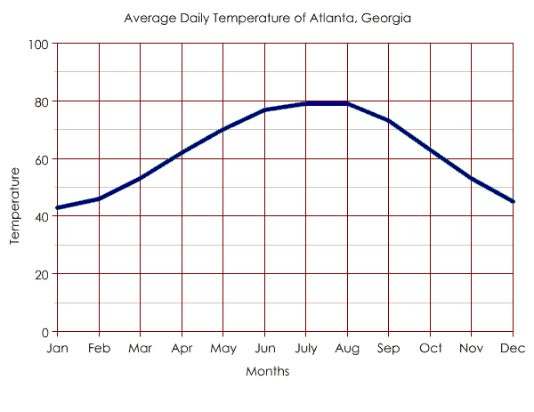
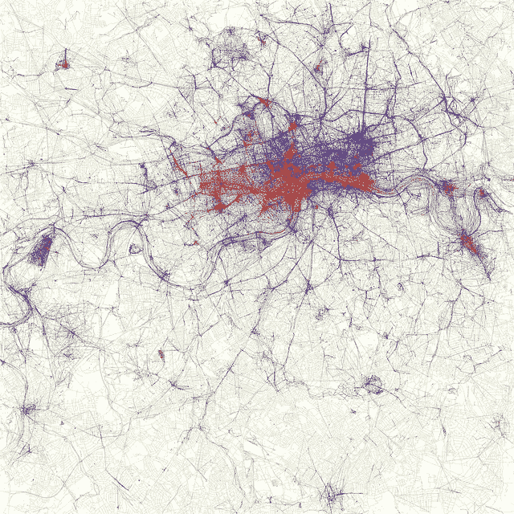

# 您知道数据可视化中“显示数字”的三种不同方法吗？

> 原文：<https://towardsdatascience.com/do-you-know-the-three-different-approaches-to-show-the-numbers-in-data-visualization-f5ab59faba83?source=collection_archive---------9----------------------->

Photo by [Marius Masalar](https://unsplash.com/@mariusmasalar?utm_source=medium&utm_medium=referral) on [Unsplash](https://unsplash.com?utm_source=medium&utm_medium=referral)

## 你是想获得洞见、交流还是做艺术？

随着大数据的出现，可视化数据变得越来越流行。使用视觉通道来思考数据和获得洞察力的想法并不新鲜。1854 年，一位名叫约翰·斯诺的伦敦医生是第一批使用点阵地图来识别霍乱受害者的人之一。通过在地图上将霍乱的受害者标为一个点，并将其与附近的水井进行对比，他可以得出结论，这些水井可能是传染性细菌的来源。

> 然而现在，数据可视化通常包括在 Excel 中快速绘制成条形图或时间线的销售数字。

使用数据可视化有区别吗？我认为使用视觉来与数据互动有三种不同的用途，它们服务于不同的目的，但经常被混淆和互换。

首先，你可以使用数据可视化来获得洞察力 Snow 先生在这个例子中就是这么做的。

**其次，你可以使用可视化来表明观点——支持一个论点，或者在数据本身中提出一个论点。**

**最后，数据可视化可以是纯粹的艺术，你可以从你的数据源生成美丽的颜色星座。**

# 探索者:获得洞察力

我们收集的大多数数据，无论是在科学领域还是其他领域，都是由简单的值点字段组成的。如果你出去记录一天中每小时的温度，你会得到 24 组数据点:时间和温度。记录这些数据很可能是以表格的形式。此刻你唯一使用的渠道是数字和文本。当你用软件或简单的纸笔以任何方式绘制这些数字时，有趣的飞跃就来了。你会得到一条曲线，让你从测量中获得洞察力。正常夏日的温度曲线可能是从凉爽的早晨到炎热的下午平稳上升，随后是太阳落山时的凉爽期。平均每天的温度，并在一年内重复这项运动，你会得到一条相似的曲线，一条显示夏季和冬季之间差异的曲线。

[https://en.wikipedia.org/wiki/File:AtlantaWeatherGraph.PNG](https://en.wikipedia.org/wiki/File:AtlantaWeatherGraph.PNG)

由于我们是非常视觉化的动物，将数据以视觉形式呈现出来通常能让我们看到在成堆的数字中我们无法发现的模式和联系。数据变得越大，我们就越必须依靠算法(又名机器学习)来指出显著的统计联系，或者我们必须找到将数据可视化的方法，“自己去看”。

许多科学和商业报告利用数据的展示来显示数字，但往往让读者去提取关键信息。

# 沟通者:表达观点

一旦你把你的数据放入一个表格，允许你检索你能得到的任何“证据”，你就可以用这些数据来支持你的主张。不幸的是，我们从未真正学会如何做到这一点——从“展示”数据到“使用”数据作为额外的证据。然而，它应该是我们交流的核心:作为作者，你有责任提出你的观点，并添加支持它的信息。

那为什么统计数据和其他可视化数据往往被置之不理，没有评论或亮点？

> 夸张一点，就像说:这是我的论点，后面是 300 字的清单。你可以选择这些单词中的哪些来支持我的论点。

听起来很傻？然而，在糟糕的数据可视化中，没有焦点和亮点，这几乎是读者或听众必须做的事情。

“看这些线，它们各自向上的斜度就是我所说的证据”。

如果您选择交流您的见解，并希望使用数据来支持论点，请为相关数据添加亮点，注释要点，并帮助读者理解您的图表。可读性和清晰性是这一步的重点。更多还可以在我的文章中找到********。********

# ****艺术家:作为艺术的数据****

****除了产生“有用”的见解，数据还可以产生艺术。我们真的不能指望从这些展示中学习任何东西，或者用它们来建立论点。然而，数据艺术和巧妙的数据可视化可以作为思考数据在我们世界中的重要性的一个有趣的切入点。****

********

****[https://www.flickr.com/photos/walkingsf/4671589629/in/album-72157624209158632/](https://www.flickr.com/photos/walkingsf/4671589629/in/album-72157624209158632/) Locations of pictures taken by locals and tourists.****

****无处不在的数据收集会对我们的生活产生什么影响？如果我们免费提供我们的数据，这是监视吗？可以通过哪些积极和消极的方式利用这些数据？我记得有一个例子，美国军事基地出现在公共地图上，因为一个健身跟踪设备服务收集并在网上发布数据供所有人查看。****

# ****结论****

****视觉通道对于思考我们收集的数据很重要。如果你在处理数据，花点时间思考一下你目前的步骤是什么:你在探索数据吗？你是否试图利用这些数据进行交流——如果是的话，你是否强调了数据中的信息以帮助读者？或者你只是在寻找一种方法让数据看起来有趣而巧妙？****

****如果你喜欢这篇文章，请按几下“鼓掌”按钮或发表评论。我会定期在我的个人资料上发布关于技术、科学、数据可视化和创新的内容，如果这些内容与你相关，请关注我。****