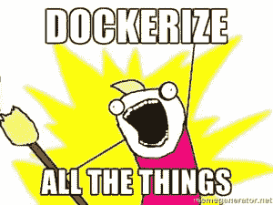

# 数据科学家的 Docker

> 原文：<https://towardsdatascience.com/docker-for-data-scientists-5732501f0ba4?source=collection_archive---------8----------------------->

 [## 想在数据科学方面变得更好吗？

### 当我在我发布独家帖子的媒体和个人网站上发布新内容时，请单击此处获得通知。](https://bobbywlindsey.ck.page/5dca5d4310) 

Docker 在开发人员中很热门，虽然数据科学家不是严格意义上的软件开发人员，但 Docker 有一些非常有用的功能，从数据探索和建模到部署。由于 AWS 等主要服务支持 Docker 容器，因此使用 Docker 实现持续集成和持续交付更加容易。在这篇文章中，我将向您展示如何在数据科学环境中使用 Docker。

# Docker 是什么？

这是一个软件容器平台，为我们提供了一个隔离的容器，让我们拥有运行实验所需的一切。本质上，它是一个轻量级的 VM，由一个可以进行版本控制的脚本构建而成；因此，我们现在可以对我们的数据科学环境进行版本控制了！开发人员在与同事进行代码协作时使用 Docker，他们也用它来构建敏捷软件交付管道，以便更快地交付新功能。这听起来耳熟吗？

# 码头术语

我有数学背景，所以很难避免定义！

容器:非常小的用户级虚拟化，帮助你构建、安装和运行你的代码

**图片**:你的容器的快照

**Dockerfile** :一个基于 yaml 的文件，用来建立你的形象；这是我们可以控制的版本

Dockerhub : GitHub 为你的 Docker 图片；您可以将 Dockerhub 设置为在 GitHub 中更新 Dockerfile 时自动构建映像

# 为什么 Docker 对数据科学如此重要


Source: [developermemes](http://www.developermemes.com/2013/12/13/worked-fine-dev-ops-problem-now/)

听过你同事的这些评论吗？

*   “不知道为什么它不能在你的电脑上工作，但它能在我的电脑上工作。”
*   “从零开始为 Linux、Windows 和 MacOS 安装所有东西，并试图为每个操作系统构建相同的环境，这是一件痛苦的事情。”
*   "不能安装你用过的软件包，你能帮我吗？"
*   “我需要更强的计算能力。我可以使用 AWS，但安装所有这些软件包和配置设置就像我在机器上安装它一样，需要很长时间。”

在很大程度上，Docker 很容易解决这些问题。目前的例外是 GPU 对 Docker 图像的支持，它只能在 Linux 机器上运行。除此之外，你很棒。

# Python 和 Jupyter 笔记本的 Docker

看看这个[文档](https://github.com/bobbywlindsey/docker-data-science/blob/master/Dockerfile)。

```
# reference: [https://hub.docker.com/_/ubuntu/](https://hub.docker.com/_/ubuntu/)
FROM ubuntu:16.04# Adds metadata to the image as a key value pair example LABEL version="1.0"
LABEL maintainer="Your Name <some_email@domain.com>"# Set environment variables
ENV LANG=C.UTF-8 LC_ALL=C.UTF-8# Create empty directory to attach volume
RUN mkdir ~/GitProjects# Install Ubuntu packages
RUN apt-get update && apt-get install -y \
    wget \
    bzip2 \
    ca-certificates \
    build-essential \
    curl \
    git-core \
    htop \
    pkg-config \
    unzip \
    unrar \
    tree \
    freetds-dev# Clean up
RUN apt-get clean && rm -rf /var/lib/apt/lists/*# Install Jupyter config
RUN mkdir ~/.ssh && touch ~/.ssh/known_hosts
RUN ssh-keygen -F github.com || ssh-keyscan github.com >> ~/.ssh/known_hosts
RUN git clone [https://github.com/bobbywlindsey/dotfiles.git](https://github.com/bobbywlindsey/dotfiles.git)
RUN mkdir ~/.jupyter
RUN cp /dotfiles/jupyter_configs/jupyter_notebook_config.py ~/.jupyter/
RUN rm -rf /dotfiles# Install Anaconda
RUN echo 'export PATH=/opt/conda/bin:$PATH' > /etc/profile.d/conda.sh
RUN wget --quiet [https://repo.anaconda.com/archive/Anaconda3-5.2.0-Linux-x86_64.sh](https://repo.anaconda.com/archive/Anaconda3-5.2.0-Linux-x86_64.sh) -O ~/anaconda.sh
RUN /bin/bash ~/anaconda.sh -b -p /opt/conda
RUN rm ~/anaconda.sh# Set path to conda
ENV PATH /opt/conda/bin:$PATH# Update Anaconda
RUN conda update conda && conda update anaconda && conda update --all# Install Jupyter theme
RUN pip install msgpack jupyterthemes
RUN jt -t grade3# Install other Python packages
RUN conda install pymssql
RUN pip install SQLAlchemy \
    missingno \
    json_tricks \
    bcolz \
    gensim \
    elasticsearch \
    psycopg2-binary# Configure access to Jupyter
WORKDIR /root/GitProjects
EXPOSE 8888
CMD jupyter lab --no-browser --ip=0.0.0.0 --allow-root --NotebookApp.token='data-science'
```

如果你曾经在 Ubuntu 中安装过软件包，这应该看起来很熟悉。简而言之，这个 Dockerfile 是一个脚本，用于自动构建和设置一个轻量级版本的 Ubuntu，其中包含使用 Jupyter 笔记本进行[我的]数据科学探索所需的所有必要的 Ubuntu 包和 Python 库。最好的一点是，无论我是在 MacOS、Linux 还是 Windows 上，这都将以相同的方式运行——无需编写单独的安装脚本和第三方工具来在每个操作系统中拥有相同的环境。

要从这个 Docker 文件构建 Docker 映像，您需要做的就是执行

```
docker build -t bobbywlindsey/docker-data-science .
```

鲍勃是你的叔叔。要运行映像，您有两种选择—您可以交互运行映像(这意味着您将实时看到 Jupyter 笔记本服务器的输出)，也可以在分离模式下运行映像(在这种模式下，您可以进入映像的终端进行操作)。

要在 Windows 上以交互方式运行映像，请执行

```
docker run -it -v ~/GitProjects:/root/GitProjects --network=host -i bobbywlindsey/docker-data-science
```

否则，

```
docker run -it -v ~/GitProjects:/root/GitProjects -p 8888:8888 -i bobbywlindsey/docker-data-science
```

要在 linux 的分离模式下运行映像，请执行以下操作:

```
docker run -d --name data-science -v ~/GitProjects:/root/GitProjects --network=host -i bobbywlindsey/docker-data-science
docker exec -it data-science bash
```

或者对于 MacOS 和 Windows:

```
docker run -d --name data-science -v ~/GitProjects:/root/GitProjects -p 8888:8888 -i bobbywlindsey/docker-data-science
docker exec -it data-science bash
```

不算太差！我意识到键入这些运行命令可能有点麻烦，所以我看到了几个选项。您可以给这些命令起别名，也可以使用 docker-compose 文件。

# 使用多个容器



[Source](https://www.google.com/url?sa=i&source=images&cd=&cad=rja&uact=8&ved=2ahUKEwi4trnPp6TcAhVQKawKHfayAKwQjxx6BAgBEAI&url=https%3A%2F%2Fhub.docker.com%2Fr%2Fmonitoringartist%2Fdocker-killer%2F&psig=AOvVaw23qhvR2c-y1jCPiPCErl4a&ust=1531854164638537)

我不会在这里过多地讨论 Docker Compose，但是作为一个例子，我必须运行一个 docker-compose 文件，用于一个 [Jekyll 博客](https://github.com/bobbywlindsey/docker-jekyll):

```
version: '3'
services:
  site:
    environment:
      - JEKYLL_ENV=docker
    image: bobbywlindsey/docker-jekyll
    volumes:
      - ~/Dropbox/me/career/website-and-blog/bobbywlindsey:/root/bobbywlindsey
    ports:
      - 4000:4000
      - 35729:35729
```

有了这个文件，您的运行命令就变成了:

```
docker-compose run --service-ports site
```

但是 Docker Compose 比仅仅用它来代替运行命令要强大得多。您的 docker-compose 文件可以配置多个映像，并且通过使用一个命令，您可以一次创建并启动所有服务。例如，假设您构建了一个 Docker 映像来预处理数据，另一个用来建模数据，另一个用来将模型部署为 API。您可以使用 docker-compose 来管理每个映像的配置，并使用一个命令来运行它们。

# 结论

即使 Docker 可能需要一些数据科学家的学习曲线，我相信这是非常值得的努力，并且不会伤害到这些 DevOps 技能。您在数据科学工作中使用过 Docker 吗？

*如果你喜欢我在这里写的东西，一定要看看我的个人博客*[](https://bobbywlindsey.com)**，我在那里有一些在媒体上看不到的文章。**

**原载于 2018 年 7 月 16 日*[*bobbywlindsey.com*](https://www.bobbywlindsey.com/2018/07/16/docker-for-data-scientists/)*。**