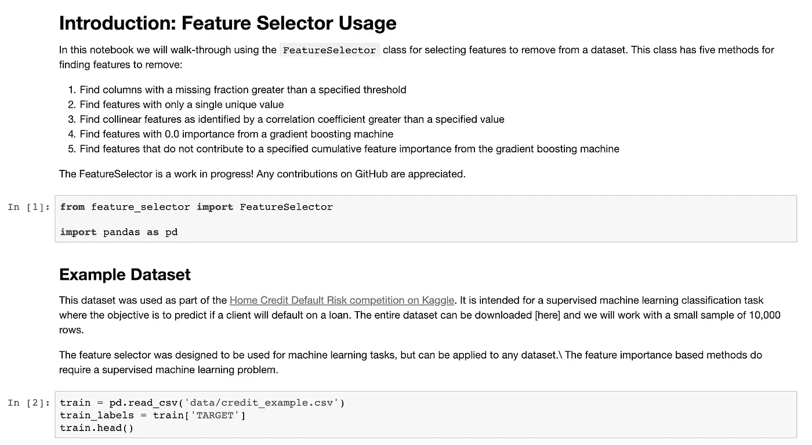
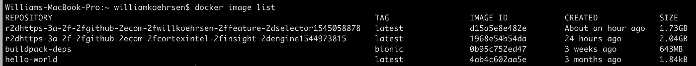

# 轻松获得数据科学的 Docker

> 原文：<https://towardsdatascience.com/docker-without-the-hassle-b98447caedd8?source=collection_archive---------12----------------------->


[(Source)](https://www.pexels.com/photo/black-and-white-dolphin-on-body-of-water-during-daytime-51964/)

## 如何使用 repo2docker 自动构建 docker 映像

如果您没有使用 [docker 进行数据科学](/docker-for-data-science-4901f35d7cf9)，那么您可能应该使用。Docker 最好被认为是一个运行映像——环境——的轻型虚拟机，其中包含项目的所有库、数据和代码。Docker 对于可再生的数据科学来说是非常棒的，因为它使得共享代码更加容易:不用发送代码和需求，你可以制作一个 Docker 映像，当其他人运行你的映像时，你的项目就可以在他们的机器上工作。这解决了每当人们试图共享代码时不可避免地出现的“依赖地狱”问题:“它在我的机器上工作”现在是一个过去的短语，感谢 Docker。

即使拥有 Docker 的明显优势，许多数据科学家仍然没有接受这项技术。制作 Docker 映像需要[编写一个](https://docs.docker.com/engine/reference/builder/) `[Dockerfile](https://docs.docker.com/engine/reference/builder/)with the`命令来构建映像。虽然这并不困难，但是[仅仅](https://pip.pypa.io/en/stable/reference/pip_freeze/) `[pip freeze > requirements.txt](https://pip.pypa.io/en/stable/reference/pip_freeze/)`一个 Python 环境并使用它要容易得多(不是最佳实践，但总比没有好)。幸运的是，多亏了 Jupyter 项目[的](https://github.com/jupyter)`[repo2docker](https://repo2docker.readthedocs.io/en/latest/)`工具，从 GitHub 库创建 Docker 映像的过程现在只需要一行代码。

## **使用方法:极短版本**

1.  [安装对接器](https://www.docker.com/products/docker-desktop)
2.  [安装 repo2docker](https://github.com/jupyter/repo2docker) : `pip install jupyter-repo2docker`
3.  运行`repo2docker repo-link`并在几分钟内获得图像:

```
repo2docker [https://github.com/WillKoehrsen/feature-selector](https://github.com/WillKoehrsen/feature-selector)
```

如果这对你来说足够了，那就去[开始吧](https://repo2docker.readthedocs.io/en/latest/)！否则，请继续阅读更多细节。

## Repo2Docker 基础知识

Repo2Docker 的工作方式是检查 GitHub 库中的[任意数量的配置文件](https://repo2docker.readthedocs.io/en/latest/config_files.html)，例如 Python 库的`[requirements.txt](https://repo2docker.readthedocs.io/en/latest/config_files.html#requirements-txt-install-a-python-environment)`、Conda 的`[environment.yml](https://repo2docker.readthedocs.io/en/latest/config_files.html#environment-yml-install-a-python-environment)`或构建 Python 包的`[setup.py](https://repo2docker.readthedocs.io/en/latest/config_files.html#setup-py-install-python-packages)`。然后，它将这些内容翻译成 Dockerfile 文件并构建图像。最后，它运行映像并启动一个 Jupyter 服务器，在那里您可以访问 Jupyter 笔记本(甚至 RStudio)。所有这些都在一个命令中完成！

有关 repo2docker 的更多信息，请查看: [Intro post](https://blog.jupyter.org/introducing-repo2docker-61a593c0752d) 、 [documentation](https://repo2docker.readthedocs.io/en/latest/) 或 GitHub [repository](https://github.com/jupyter/repo2docker) (随时欢迎投稿)。(repo2docker 也是 `[binder](https://mybinder.org/)`背后的技术[，Jupyter 的另一个项目值得一试。)](https://mybinder.org/)

## 如何使用:稍微友好的版本

1.  首先安装 docker。您的[机器的说明可以在这里找到](https://www.docker.com/products/docker-desktop)。 [docker 入门指南](https://docs.docker.com/get-started/)对于学习 docker 如何工作是有用的，尽管我们不需要细节来有效地使用它
2.  确保 docker 正在运行。如果`docker run hello-world`显示信息`Hello from Docker!`，那么你就可以开始了。
3.  用`pip install jupyter-repo2docker`安装`repo2docker`。通过键入`repo2docker -h`调出帮助选项，确认它可以工作。
4.  找到一个至少有一个`requirements.txt`文件的 GitHub 库。例如，我正在为`[feature-selector](https://github.com/WillKoehrsen/feature-selector)`使用 repo，这是我为[机器学习特征选择](/a-feature-selection-tool-for-machine-learning-in-python-b64dd23710f0)制作的一个工具，它有一个`setup.py`文件。
5.  运行 magic line `repo2docker repo-link`，它会自动创建一个新的 docker 映像，安装所有需要的依赖项，最后在环境中启动一个 jupyter 服务。这可能需要 5-10 分钟，但请记住，这可以节省您的工作时间和挫败感。
6.  命令完成后，复制 url 并导航到 docker 容器中运行的 Jupyter 记事本。

命令和最终输出将如下所示:

```
repo2docker [https://github.com/WillKoehrsen/feature-selector](https://github.com/WillKoehrsen/feature-selector)... Lots of steps ...
... while your Docker image ...
... is built and run ...Final output:Copy/paste this URL into your browser when you connect for the first time,
    to login with a token:
        [http://127.0.0.1:65375/?token=](http://127.0.0.1:65375/?token=c23a4e26bb5a8cfd7c818eb2747198f207bead7512b71eb1)randomstringofcharacters
```

运行笔记本，惊叹使用 docker 和`repo2docker`是多么容易



Notebook running in a docker container

## 重要注意事项

docker 容器运行后，打开一个新的 shell 并键入`[docker ps](https://docs.docker.com/engine/reference/commandline/ps/)`来查看容器进程。获取`CONTAINER_ID`然后运行`docker exec -it CONTAINER_ID /bin/bash`在运行容器中打开一个[交互外壳](https://docs.docker.com/engine/reference/commandline/exec/) *。在 shell 中，您可以在命令行上做任何事情，比如列出文件、运行 python 脚本或监控进程。*

当您完成会话后，您可以使用 ctrl + c 或`[docker stop](https://docs.docker.com/engine/reference/commandline/stop/) CONTAINER ID`关闭 Jupyter 服务器和容器。好消息是，当我们想要重启容器时，我们不必再次重新运行`repo2docker repo-link`。整个环境被保存为我们机器上的 docker 图像，我们可以用`docker image list`看到。



Output of docker image list

要再次启动该容器，选择`IMAGE ID`并运行命令:

```
docker run -p 12345:8888 IMAGE ID jupyter notebook --ip 0.0.0.0 
```

这将启动容器，将容器的端口 8888 发布到主机端口 12345，并运行可在 127.0.0.1:12345 访问的 jupyter 笔记本。您可以再次在浏览器中访问 Jupyter 笔记本，所有要求都已准备就绪。(感谢 t [他在 GitHub](https://github.com/jupyter/repo2docker/issues/450) 上的问题提供了这个解决方案。此外，更多选项请参见 [docker 上的文档](https://docs.docker.com/engine/reference/run/)

`repo2docker`正在[持续工作](https://github.com/jupyter/repo2docker)，如果 GitHub 库中的配置文件没有改变，有[主动拉取请求](https://github.com/jupyter/repo2docker/pull/511)自动使用预建镜像。上述命令始终有效，也可用于不是通过`repo2docker`创建的图像。一旦你从`repo2docker`学会了基础知识，试着阅读一些 [Docker 指南](https://docs.docker.com/get-started/)，看看如何有效地利用 Docker。

# 结论

正如在 Keras 中构建神经网络时不必担心反向传播的细节一样，您也不必掌握复杂的命令来实践可再现的数据科学。幸运的是，数据科学的工具继续变得更好，使得采用最佳实践更容易，并有望鼓励更多不同的人进入该领域。

Repo2docker 是这些技术中的一种，它将使你作为一名数据科学家更加高效。当然，你可以是那个满腹牢骚的老人:“我花了那么多时间学习 docker，而现在这些年轻人甚至不会写 docker 文件”，或者你可以走大路，庆祝不断增加的抽象层。这些层将您从繁琐的细节中分离出来，使您能够专注于数据科学的最佳部分:通过数据做出更好的决策。

一如既往，我欢迎反馈和建设性的批评。可以通过推特 [@koehrsen_will](http://twitter.com/@koehrsen_will) 联系到我。