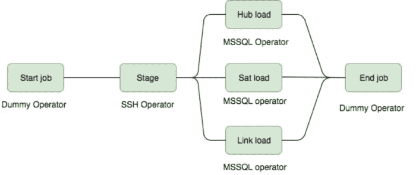

# 停泊气流

> 原文：<https://towardsdatascience.com/dockerizing-airflow-58a8888bd72d?source=collection_archive---------5----------------------->

## 面向本地工作负载的 Docker 上的 Apache 气流


Photo by [Koushik Chowdavarapu](https://unsplash.com/@koushikc?utm_source=medium&utm_medium=referral) on [Unsplash](https://unsplash.com?utm_source=medium&utm_medium=referral)

[Airflow](https://airflow.apache.org/) 是大多数数据工程师工具箱中事实上的 ETL 编排工具。它为强大的后端提供了一个直观的 web 界面，以便为您的 ETL 工作流安排和管理依赖关系。

在我的日常工作流程中，我用它来维护和管理建立在 [AWS S3](https://aws.amazon.com/s3/) 之上的数据湖。我的 Airflow DAGs 中的节点包括多节点 [EMR Apache Spark](https://aws.amazon.com/emr/) 和 [Fargate](https://aws.amazon.com/fargate/) 集群，这些集群从数据湖中聚合、删减并产生副数据。

由于这些工作流是在分布式集群(20 多个节点)上执行的，并且具有很强的依赖性(一个 ETL 的输出作为输入提供给下一个 ETL)，所以使用气流来编排它们是有意义的。然而，它没有意义，有一个中央气流部署，因为我将是唯一一个使用它。

因此，我选择[对接](https://www.docker.com/)气流，这样我就可以旋转容器，轻松运行这些[工作流](https://airflow.apache.org/concepts.html#workflows)，而不必担心气流部署。

在这篇文章中，我将回顾一下我是如何做到这一点的，并简单解释一下设计过程中的一些决定。

# 气流部件

在气流 ETL [中，工作流](https://airflow.apache.org/concepts.html#workflows)被定义为[有向非循环图](https://en.wikipedia.org/wiki/Directed_acyclic_graph) ( [气流 DAG](https://airflow.apache.org/concepts.html#dags) )，其中每个节点都是独立的 ETL，每个下游节点都依赖于上游节点的成功完成。



Simple Airflow DAG

气流有三个展开组件:

*   web 服务器( [Flask](http://flask.pocoo.org/) 后端用于触发和监控 Dag)
*   调度程序(调度和运行 DAG 执行程序的守护进程)
*   数据库(DAG 和 DAG 实例定义的前置层)

# 气流快速启动

用气流启动快速简单；

```
# airflow needs a home, ~/airflow is the default,
# but you can lay foundation somewhere else if you prefer
# (optional)
export AIRFLOW_HOME=~/airflow# install from pypi using pip
pip install apache-airflow# initialize the database
airflow initdb# start the web server, default port is 8080
airflow webserver -p 8080
```

在运行这些命令时，Airflow 将创建一个`$AIRFLOW_HOME`文件夹，并放置一个`airflow.cfg`文件，其默认设置可以让您快速运行。您可以在`$AIRFLOW_HOME/airflow.cfg`中或者通过`Admin->Configuration`菜单中的 UI 来检查文件。网络服务器的 PID 文件将存储在`$AIRFLOW_HOME/airflow-webserver.pid`中，如果由 systemd 启动，则存储在`/run/airflow/webserver.pid`中。

开箱即用，Airflow 使用一个 sqlite 数据库，您应该很快就能适应，因为使用这个数据库后端不可能实现并行化。它与只顺序运行任务实例的`SequentialExecutor`协同工作。虽然这非常有限，但它允许您快速启动并运行，浏览 UI 和命令行实用程序。

下面是几个将触发几个任务实例的命令。当您运行下面的命令时，您应该能够在`example1` DAG 中看到作业的状态变化。

```
# run your first task instance
airflow run example_bash_operator runme_0 2018-01-01
# run a backfill over 2 days
airflow backfill example_bash_operator -s 2018-01-01 -e 2018-01-02
```

# 停泊气流

一个容器的主要运行过程是`ENTRYPOINT`和/或`Dockerfile`末端的`CMD`。通常建议您通过对每个容器使用一个服务来分隔关注的区域。

然而，由于我们想让`Airflow Webserver` &和`Airflow Scheduler`进程都运行，我们将使用`supervisord` 作为进程管理器。

这是一种中等重量级的方法，要求您将`supervisord`及其配置打包到 docker 映像中(或者基于包含`supervisord`的映像)，以及它管理的不同应用程序。

然后你启动`supervisord`，它为你管理你的进程。首先我们需要定义`supervisord.conf`:

```
[supervisord]                       
nodaemon=true[program:scheduler]                       
command=airflow scheduler                       stdout_logfile=/var/log/supervisor/%(program_name)s.log                       stderr_logfile=/var/log/supervisor/%(program_name)s.log                       autorestart=true[program:server]                       
command=airflow webserver -p 8080                       stdout_logfile=/var/log/supervisor/%(program_name)s.log                       stderr_logfile=/var/log/supervisor/%(program_name)s.log                       autorestart=true
```

然后我们将使用`supervisord`作为 docker 文件的`ENTRYPOINT`:

```
FROM python:3.6.3# supervisord setup                       
RUN apt-get update && apt-get install -y supervisor                       COPY supervisord.conf /etc/supervisor/conf.d/supervisord.conf# Airflow setup                       
ENV AIRFLOW_HOME=/app/airflowRUN pip install apache-airflow                       
COPY /dags/response_rate_etl.py $AIRFLOW_HOME/dags/RUN airflow initdbEXPOSE 8080CMD ["/usr/bin/supervisord"]
```

构建 Docker 映像:

```
docker build . -t airflow
```

运行容器:

```
docker run -d -p 8080:8080 --rm \
   --name airflow_container \
   airflow
```

启动 DAG:

```
docker exec airflow_container airflow trigger_dag example_bash_operator
```

监控 DAG 运行:

打开浏览器并导航至`http://localhost:8080`以监控 DAG 实例运行。

这就是所有人，请继续关注未来的帖子，在那里我将深入定义 AWS EMR dags，定义自定义气流操作符，注入 AWS 凭证等等！