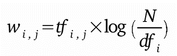
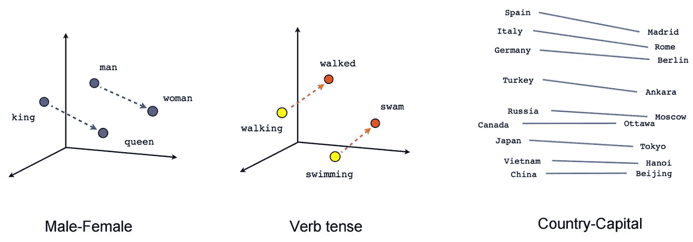

# 文档特征提取和分类

> 原文：<https://towardsdatascience.com/document-feature-extraction-and-classification-53f0e813d2d3?source=collection_archive---------0----------------------->

E 非常分类问题在[自然语言处理](https://en.wikipedia.org/wiki/Natural_language_processing) (NLP)中被大致归类为**文档**或**令牌**级分类任务。这是关于如何用 python 实现这一切并理解其背后的理论背景和用例的两部分博客的第一部分。这篇博客的所有[代码、数据和结果](https://github.com/ishaan007/vector_space_modelling)都可以在我的 **GITHUB** 个人资料中找到。这篇文章专门讨论文档分类，随后的部分将讨论标记级分类，也称为解析。

文档只不过是一组(不止一个)令牌。每一个有监督的机器学习算法都要求每一个文本文档都以向量的形式表示，以开始对这些文档进行训练，这是通过[向量空间建模](https://en.wikipedia.org/wiki/Vector_space_model) (VSM)来完成的。

## VSM 很大程度上可以通过两种独特且截然不同的技术来实现

1.  使用 TF-IDF 的传统词汇方法(在本博客中)
2.  像 doc2vec 这样的单词嵌入

> 在这个博客中，我使用了路透社新闻分类数据集，每个新闻文件都属于 8 个类别中的一个。我使用 tf-idf 和 doc2vec 进行特征提取，然后在 75:25 的训练:测试分割上使用逻辑回归和朴素贝叶斯分类器对这些向量进行分类

因此，工作流程是首先将所有文档转换为矢量。保留这些向量中的大部分用于训练，其余的用于测试，然后应用各自的监督分类技术。

# 使用 BOW :: TF-IDF 的特征提取

术语频率-逆文档频率使用数据集中的所有标记作为词汇。词汇中的标记在每个文档中的出现频率由术语频率组成，标记出现的文档数量决定了逆文档频率。这确保的是，如果一个标记在文档中频繁出现，该标记将具有高 TF，但是如果该标记在大多数文档中频繁出现，那么它将减少 IDF，因此像 *an、the、i* 这样频繁出现的停用词将受到惩罚，而包含文档本质的重要词将得到提升。特定文档的这些 TF 和 IDF 矩阵相乘并归一化以形成文档的 TF-IDF。

TF-IDF formulation

> 你必须浏览一下[克里斯蒂安·佩罗尼](https://twitter.com/tarantulae)的这个[博客](http://blog.christianperone.com/2011/10/machine-learning-text-feature-extraction-tf-idf-part-ii/)，在那里他用实现细节很好地解释了这个概念。

# 使用单词嵌入的特征提取::doc2vec

Doc2vec 是与 tf-idf 完全不同的算法，TF-IDF 使用 3 层浅深度神经网络来测量文档的上下文，并将相似的上下文短语关联在一起。

关于 doc2vec 需要注意的重要一点是，它不是像单词包那样的单片算法，它有两种不同的变体 SKIP GRAM 和 CBOW，它还可以与其他变体一起使用，如带或不带负采样和带或不带分层 softmax。

最后，doc2vec 应该在一个足够大和高质量的数据集上进行训练，以使模型生成合理的嵌入，这将导致良好的特征生成。

Doc2Vec [Source](https://www.distilled.net/resources/a-beginners-guide-to-word2vec-aka-whats-the-opposite-of-canada/)

# 结果

整个练习的结果都符合预期。TF-IDF 逻辑回归优于 doc2vec 逻辑回归，因为 doc2 vec 的训练集不够丰富或大，不足以让模型学习实际的上下文关系来生成合理的嵌入。虽然 doc2vec LR 的表现比 TF-IDF 朴素贝叶斯要好。

值得一提的是，对于 tf-idf，实现了多项式朴素贝叶斯，对于 doc2vec 使用了高斯朴素贝叶斯，因为多项式朴素贝叶斯对于在 doc2vec 中生成的负值是失败的，并且在 tf-idf 的情况下特征肯定是非负的，因为出现频率不能是负的。

在下一篇博客中，我将尝试使用单词包技术进行令牌分类，并通过特征哈希来扩展它，实现 word2vec 嵌入。

> 请在 contact.ishaanarora@gmail.com 联系我，或者在这个 [github repo](https://github.com/ishaan007/vector_space_modelling) 上开一个问题，讨论这个帖子中的任何事情，甚至是一般的生活:P 如果你已经到了这一步，你太棒了！

