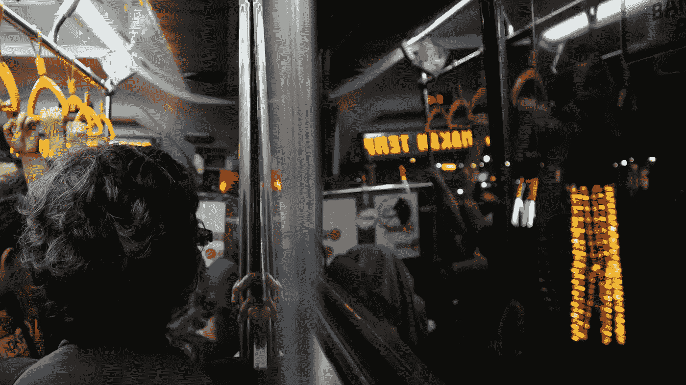
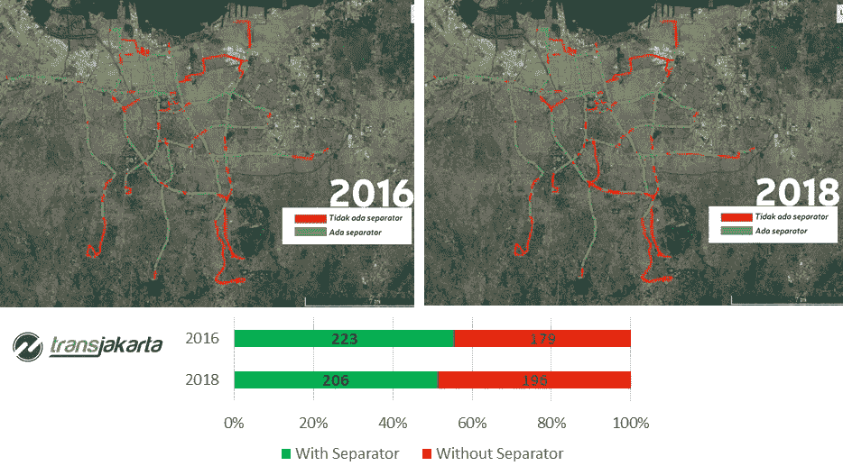
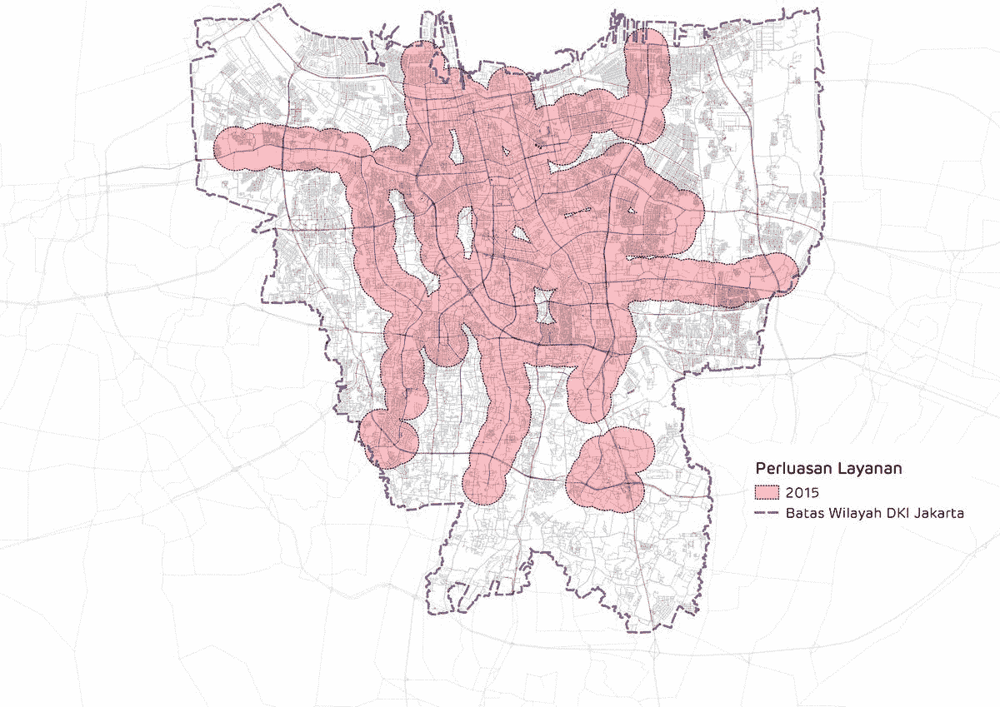
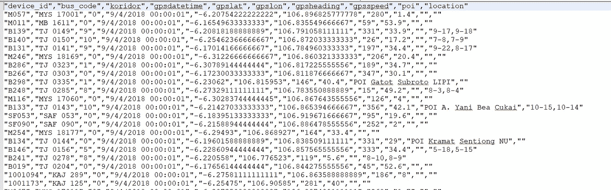
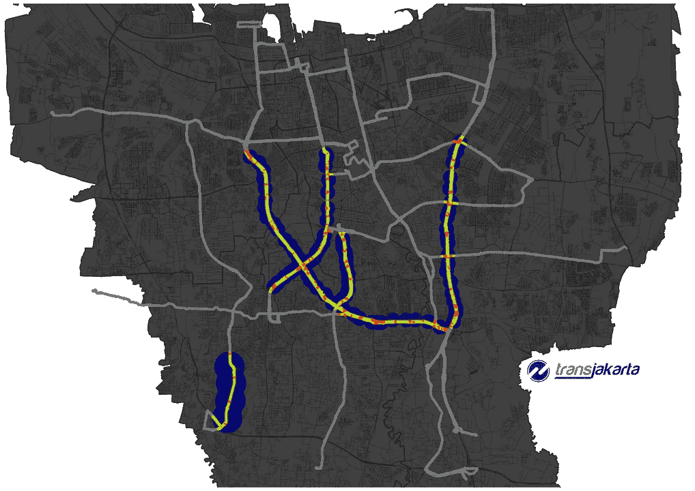
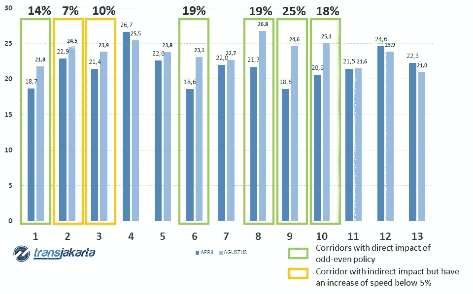
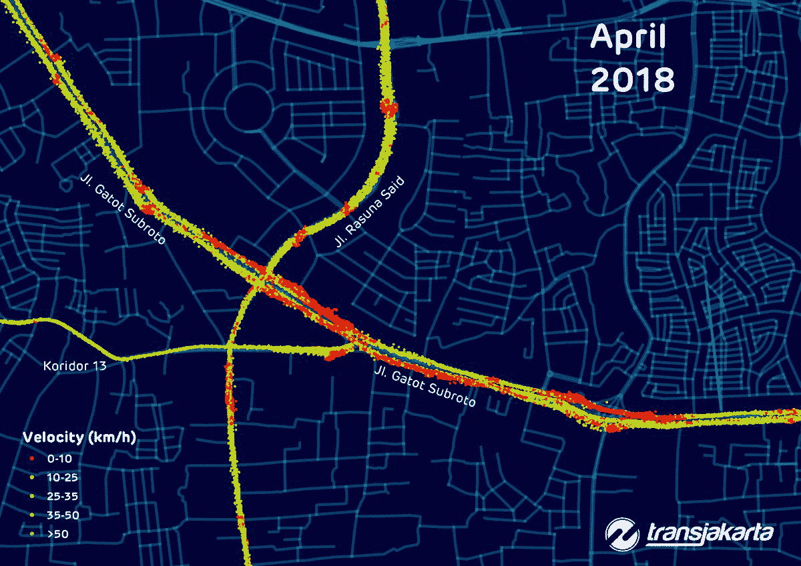
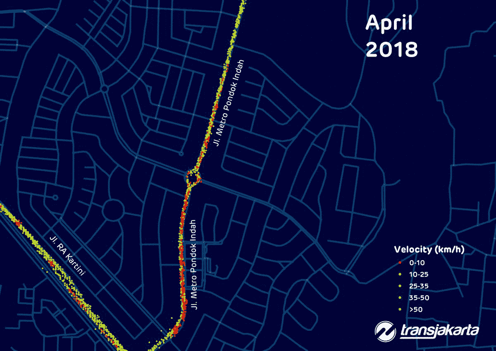

# 记录看不见的雅加达交通

> 原文：<https://towardsdatascience.com/documenting-the-unseen-jakarta-traffic-7f4c64be4cca?source=collection_archive---------9----------------------->

## 量化政府政策结果的实验。

*潘迪托·普拉塔马-毛拉娜·伊奇桑·吉图里*

credit image: Maulana Ichsan Gituri

西安亚运会和亚残运会已经结束。与之配套的政策也是如此，单双号政策。在许多城市交通讨论中，经过长时间的辩论、批评和讨论，直到最近在印度尼西亚 ITDP[的讨论，邀请了 Polda Metro Jaya 的交通总监、雅加达交通局局长、大雅加达交通管理局局长以及雅加达 PT Transportasi 的总裁，该政策成为社会的热门话题，也引发了一些问题，如:亚残运会后该政策是否会继续？如果是的话，这项政策是否会采用与以前相同的方案？政策真的让城市动起来更快了吗？](http://www.itdp-indonesia.org/utd9)

## 在我们跳进许多假设和偏见之前，让我们开始分析可以量化政策影响的数据。

首先，要量化政府政策的表现，我们不仅要从私家车方面看，也要从公共交通方面看。因为公共交通方面是政府可以直接采取行动的一方，而且由于其可承受的价格，它可以方便任何人。然后，我们必须着眼于最广泛的交通网络来代表雅加达道路上的所有公共交通。(通勤线路每天可能会有更多的乘客，但单双号政策只出现在基于道路的运输中。)

它实际上始于记录人们每天在交通中看到的东西的精神，而没有一个组织良好的数据文档。

看看雅加达最广的交通网络，Transjakarta。我们称这个系统为快速公交系统。简而言之，**公交车**有一条专用车道，使得它们**快速**。我们可以说，雅加达的任何人都知道，公共汽车可以与其他车辆分开行驶，因为他们有分离器，一旦你用自己的汽车/摩托车占用车道，你可能会被罚款，公众知道，不是所有的车道都有分离器。但是他们真的了解专用车道的改造吗？他们真的注意到网络的扩张了吗？我和毛拉娜以这种方式开始真正让这个雅加达的巨人有据可查。

Jakarta BRT Corridor “healthiness”, changes of the alignment of separation occur due to the many mega projects in several parts

Transjakarta’s Network Growth 2015–2018

从地图上可以看出，该网络已经快速发展了 4 年。目前，Transjakarta 不仅提供 BRT 服务，还提供支线服务，可以到达路权较小的道路。鉴于这一事实，外雅加达并不总是有无菌车道，主干道上的交通对外雅加达的表现有很大影响。

# 但我们如何量化单双号政策期间公共交通的表现呢？

由于谷歌地图 API 只提供私人车辆的交通流量，我们不能用它来评估公共交通的表现。幸运的是，每辆雅加达的公交车都有一个 GNSS 接收器(或者人们通常称之为 GPS，但 GPS 是美国版的 GNSS，实际上接收器捕捉到的信号可能来自伽利略，欧洲 GNSS，或 Glonass，俄罗斯 GNSS，甚至北斗，中国 GNSS，谢谢我后面的琐事:p)

GNSS raw data from Transjakarta bus

我们决定从四月和八月的几天收集数据。为什么是四月和八月？我们发现，4 月份是雅加达没有单双号政策干预的情况，4 月份我们找不到任何独特的交通季节性行为，因为没有斋月和伊斯兰长假，8 月份是该政策在 7 月份试行一个月后有效应用的地方。

这些数据是海量的数据，每天包含数百万条记录。所以电子表格不是处理我们所有数据的好主意。然后，我们使用 R 来过滤、规范化和生成我们需要的信息。过滤是必要的，因为对于这项研究，我们决定只包括在走廊的高峰时间和公共汽车的数据。所以我们清理了所有不属于这个类别的数据。不幸的是，在我们第一次尝试在地图上绘制数据时，数据移动了几米，因此我们需要先将它们标准化，这样它们才能回到正轨。最后，我们计算了四月和八月每个走廊的速度，结果相当令人惊讶。

如果你不熟悉雅加达，这是显示交通状况的地图，以及该政策实际适用的地方。

Map of Jakarta with odd-even policy segment highlighted

每一个有奇偶直接影响的走廊，速度都显著提高。

## 你可能想知道，单双号政策对分隔车道有什么影响？

答案是，并非所有的雅加达走廊都与其他交通分开。他们中的一些是混合交通，他们中的一些有几个路口和红绿灯，他们中的一些成为警察自由裁量权政策的受害者。所以没错，单双号政策对雅加达走廊有相当大的影响。

如果您想知道速度提升后是什么样子，这里我们将为您提供两个奇偶政策效果的空间可视化示例。

Tendean Intersection, before and after odd-even policy

Metro Pondok Indah, before and after odd-even policy

好吧，这些算好消息吗？事实上，他们是，任何大都市地区的公共交通的愿景之一是缩短旅行时间，增加市民的流动性，上面所有的地图都反映了这些愿景。

# 发现未知，下一步是什么？

是的，我们确实研究了这项政策对公共交通方面的影响，我们实际上担心其他部门可能会把这项政策视为一场噩梦。

零售？商业？财产？我们相信这不是一个零和游戏，所有受影响的人可能会经历一个大的冲击，因为这仍然是新的，但如果在这一点上的一致性和承诺，我们相信我们可以适应并形成一个更好的新常态。

但我们能否先欣赏一下政府为实现这一目标所表现出的勇气？现在这项政策即将结束，在此之后，单双号政策仍然适用，但不是一天一夜，从明天开始直到年底，这项政策只适用于早晚高峰，但感谢上帝，他们没有消除任何路段，仍然一样。

在这里，我们只是试图量化一项政策如何影响许多人生活的普通公民。决定一个城市的进步需要政治支持，有时，这些进步不是通过演讲，而是通过签署一揽子政策文件来实现的。