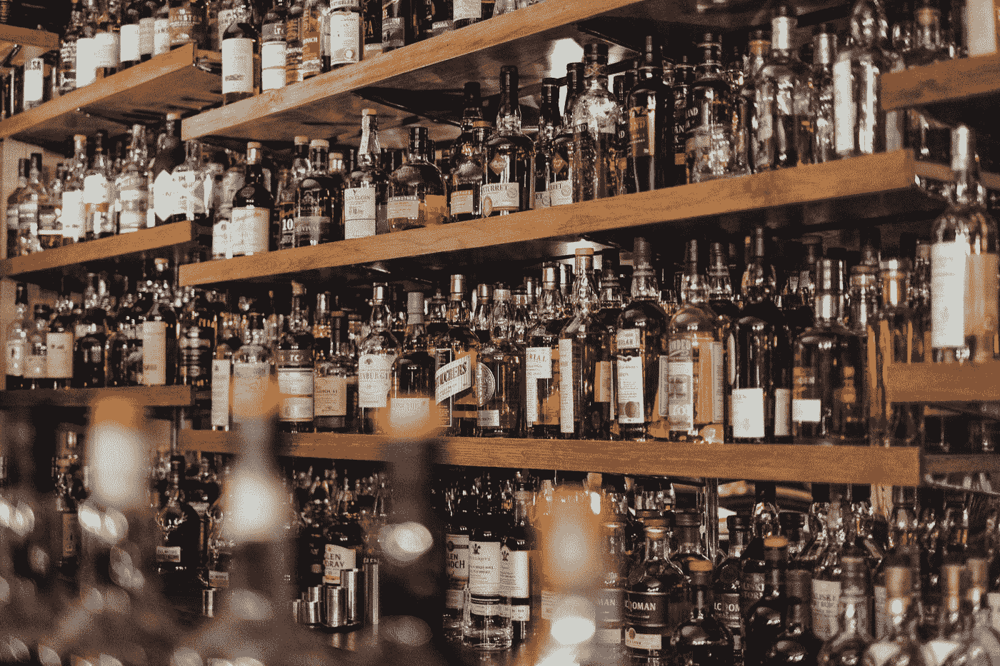
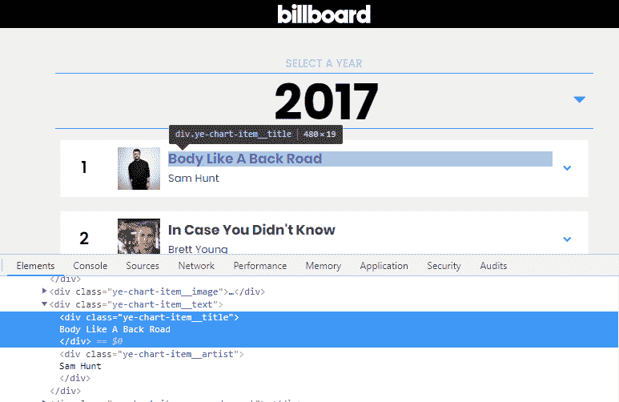
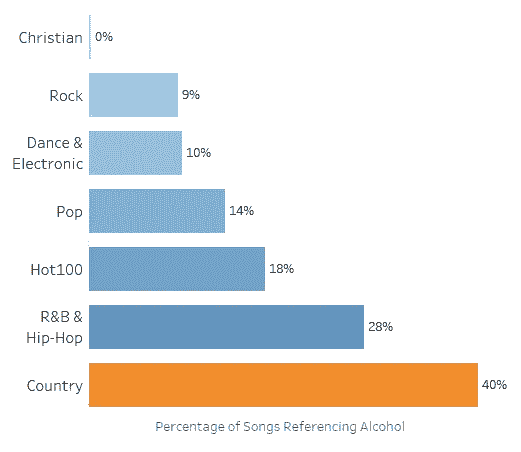
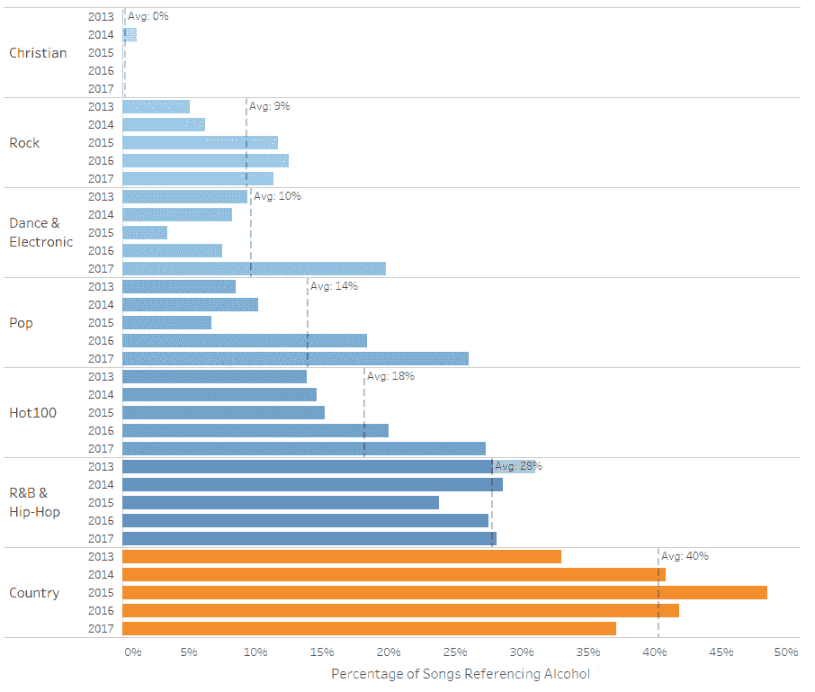
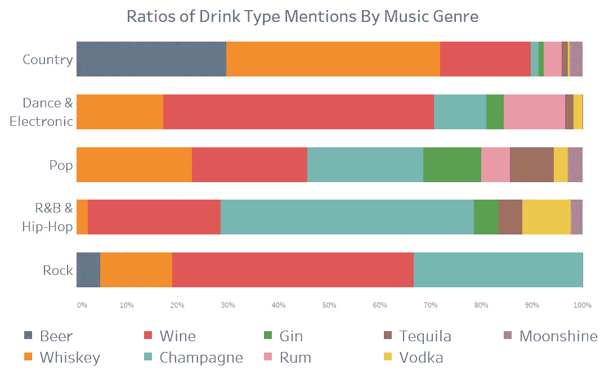
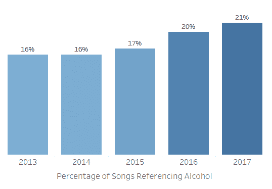

# 乡村音乐比其他流派喝的多吗？调查 5 年的歌词来找出答案

> 原文：<https://towardsdatascience.com/does-country-music-drink-more-than-other-genres-a21db901940b?source=collection_archive---------13----------------------->

From [Adam Wilson](https://unsplash.com/@fourcolourblack?utm_source=medium&utm_medium=referral) on [Unsplash](https://unsplash.com?utm_source=medium&utm_medium=referral)

感谢 Spotify 的[热门乡村](https://open.spotify.com/user/spotify/playlist/37i9dQZF1DX1lVhptIYRda)和[乡村之夜](https://open.spotify.com/user/spotify/playlist/37i9dQZF1DWXi7h4mmmkzD)播放列表，我最近进入了一个听乡村音乐的不寻常阶段。摇滚通常更适合我，所以这对我来说是第一次。在我立即意识到乡村是多么吸引人之后，真正让我震惊的是似乎有 ***那么*** 很多地方提到酒精和饮酒！

从下面克里斯·斯台普顿的诗句中汲取灵感。你认为他知道不含酒精的东西也可以用于比较吗？

> 你像田纳西威士忌一样柔滑，你像草莓酒一样甜美，你像一杯白兰地一样温暖
> 
> 田纳西威士忌——克里斯·斯台普顿

或者奥斯本兄弟的这些台词。真的不是他们的错吗？

> 把威士忌归咎于啤酒把啤酒归咎于威士忌把早晨归咎于夜晚
> 
> 这不是我的错——奥斯本兄弟

当我想到乡村音乐时，啤酒和威士忌是我脑海中的一部分，但并不比摇滚或说唱/嘻哈音乐更多。我想知道我听到更多关于酒的提及，是因为我刚到这个国家，还是不同流派之间的提及真的有可测量的差异。

我想我需要做的就是找出答案。

*   从 Billboard 网站获得不同音乐流派的流行歌曲列表，该网站有摇滚、流行、乡村等流派的具体图表。
*   获取他们的歌词
*   获取酒精和饮酒相关词汇的列表
*   数一数有多少首歌提到了这些词

这个过程可能比这四个简短的要点所表明的时间要长一点，但是下面是这个过程、分析和发现的一个步骤，希望你能喜欢！

# 数据收集和清理

## 刮了五年的图表

第一步是为每个流派创建一个歌曲数据集。我决定使用 Billboard 网站上的年终排行榜，因为它们通常有 100 个条目，所以会提供大量数据，我可以肯定它们代表了人们在这些流派中真正听的东西。这些是美国的图表，但是，由于美国往往会引领世界潮流(不管我们喜欢与否)，并且拥有最大的乡村音乐听众，我觉得它们是这个项目的最佳数据源。

Billboard 网站上有[摇滚](https://www.billboard.com/charts/year-end/2017/hot-rock-songs)、[乡村](https://www.billboard.com/charts/year-end/2017/hot-country-songs)、[流行](https://www.billboard.com/charts/year-end/2017/pop-songs)、 [R & B/Hip-Hop](https://www.billboard.com/charts/year-end/2017/hot-r-and-and-b-hip-hop-songs) 、[舞蹈/电音](https://www.billboard.com/charts/year-end/2017/hot-dance-electronic--songs)、[基督教](https://www.billboard.com/charts/year-end/2017/hot-christian-songs)的排行榜，我也决定把非流派特定的整体 [Hot 100](https://www.billboard.com/charts/year-end/2017/hot-100-songs) 排行榜收录进来，以供参考。我没有包括拉丁或国际图表，因为非英语歌曲会影响后来的分析结果。

上面的链接是 2017 年年终图表，但它们都至少可以追溯到 2013 年。我决定收集过去五年的数据，这样我就可以研究一段时间内的趋势。

我主要使用每个流派的“热门”排行榜，除了流行音乐没有“热门”排行榜。热门排行榜包括广播剧、实体销售和信息流，而流行排行榜只在广播剧中出现。但在所有情况下，它们都应该很好地代表人们在每一个流派中听到的和正在听的内容。

有些歌曲可能会出现在多个图表或年份中。我不会删除任何重复的内容，因为我不想改变任何图表的内容。

我使用 Python Beautiful Soup library 来帮助从每个网页的 html 中提取每个图表条目的歌曲和艺术家姓名。这和你在 Chrome 的网页上按 Ctrl+Shift+i 看到的 html 是一样的。

Example of song information in html from Billboard’s website

我在这样做的时候发现了一些问题，比如 2015 年 R & B/Hip-Hop 图表只有 25 个条目，而其他年份通常有 100 个。或者说 [2016 热 100](https://www.billboard.com/charts/year-end/2016/hot-100-songs) 因为#87 缺失只有 99 个条目。不知道这些问题背后的原因，但我确实考虑到，当我稍后进行分析时，图表长度可能会有所不同。

## 获取 2840 首歌曲的歌词

图表抓取找到了 3019 个图表条目，我使用 Genius.com 的 API 得到了其中 2840 个的歌词。你只需要注册就可以免费使用。在我的代码中，我使用了[lyricsgius](https://github.com/johnwmillr/LyricsGenius)Python 包，使得 Genius.com 的 API 非常容易使用。

在这个阶段，我遇到的问题是如何将 Genius 使用的歌曲和艺术家名字与 Billboard 匹配。例如，当一首歌由多位艺术家创作时，就会出现很多问题。Billboard 有很多组合艺人名字的方法，比如“特色”，“x”(比如 Kygo x Selena Gomez)，“With”等等。但是天才更挑剔，所以我不得不尝试不同的组合。

最终，尝试发现这些问题所花费的时间不再值得。2，840 是总条目的 94%,因此我决定继续前进。下面是每张图中找到的带有歌词的歌曲数量。

> *摇滚:483
> 乡村:490
> 舞蹈/电子:442
> 流行:240
> 火爆 100:476
> R&B/嘻哈:379
> 基督教:322*

发现不同数量的事实不会影响后面的结果，因为分析比较的是百分比。

## 歌词清理

为了避免一个单词的多种时态、复数或变体导致遗漏或错误计数，我使用了 [leammatisation](https://en.wikipedia.org/wiki/Lemmatisation) 将单词分组到它们的词根形式。例如，动词“walked”、“walks”和“walking”都可以归为“walk”。

要做到这一点，所有的单词都需要标注词性。这些标签可以是动词、形容词、副词或名词/其他。通常情况下，你会将句子传递到词性标注器中，但在这种情况下，由于歌曲中缺少标点符号，我将歌词分成几行并传递它们。

对于这两个任务，我使用了 Python NLTK 库，它非常成功。多达 6 个单词被组合成一个共同的源单词。例如，"去"、"去"、"去了"、"去了"、"去了"和"去了"都被组合成"去"。

# 分析

## 创建饮酒和酒精词汇列表

我寻找一个预先存在的与酒精相关的关键词列表，但不幸的是没有找到任何关键词。我发现的一些研究使用了关键词列表，但没有分享它们。所以我用高度科学的方法想出了我能想到的所有关键词，并用谷歌搜索同义词试图找到更多。

我把“喝”和“射”从这个列表中排除了，因为它们对饮酒不够具体。我第一次尝试使用它们，但是它们导致了一些高错误率。这对基督教歌曲尤其不利，因为这两个词，11 首歌曲中有 8 首被识别为假阳性。

我得出的最终名单是:

> 醉*，喝*，酒精，酒精，宿醉，宿醉，白酒，鸡尾酒，豪饮，烈酒，瓶子，啤酒，苹果酒，麦芽酒，龙舌兰酒，伏特加，葡萄酒，杜松子酒，威士忌，苏格兰威士忌，朗姆酒，波旁酒，香槟，莫吉托，马提尼，代基里，雅格，雅格啤酒，百威啤酒，米勒，库尔斯，喜力，百加得，斯米尔诺夫，酩悦，轩尼诗，酒吧，品脱，消防水，霍奇，月光，烈酒，swig，烈酒

“喝醉了”和“喝了”不会计算过去时态动词“喝了”的出现次数，因为那些“喝醉了”和“喝了”会被解释为“喝了”。不过它们也可以用于其他用途，比如在“[我醉了](https://genius.com/Brett-eldredge-drunk-on-your-love-lyrics)”中作为形容词，或者在“[我可以带酒来](https://genius.com/The-weeknd-wicked-games-lyrics)”中作为名词。

## 测量饮酒和酒精提及

我使用的衡量标准是至少一次提到饮酒或酒精相关词汇的歌曲的百分比。

闲话少说，Billboard 排行榜中提及饮酒的歌曲比例如下:

**哇！**乡村音乐歌曲似乎更经常提到酒精。在我看来，40%的歌曲以某种方式提及酒精确实很高，所以我手动检查了 2017 年的乡村歌曲，发现只有一个误报(由罗素·迪克森的《你的瓶子》中的“瓶子”引起)，我觉得这是一个可以接受的错误率。如果您记住年终图表用于此分析，那么高的结果更有意义。因此，这并不一定意味着所有乡村音乐歌曲中有 40%提到了饮酒，只是说过去五年中有 40%的热门歌曲提到了饮酒。

## 差异显著时的假设检验

是时候回答我最初的问题了:是不是更多的乡村音乐歌曲比其他类型的歌曲更多地提到了酒精和饮酒。

如下图所示，乡村音乐和其他音乐类型之间有明显的差异。然而，如果你测量两个不同的组，你会期望结果仅仅因为随机变化而有一点点不同。我想确认差异大到足以具有统计学意义，这是不太可能由随机变异引起的另一种说法。

我放弃了这个测试的热门 100 和基督教排行榜结果，因为热门 100 不是特定的流派，基督教排行榜是一个离群值，它很少提到酒精，至少对我来说，不是一个主流流派。

由于数据是分类数据，我将使用卡方检验来检验统计显著性。这是分类数据，因为歌曲要么提到要么没有提到酒精，没有中间值。巧合的是，这也是我在[上一篇文章](https://medium.com/@macardle/investigating-loss-aversion-in-world-cup-penalty-shoot-outs-8bd2ba48ce86)中使用的测试，用来衡量惩罚中的损失厌恶。

该测试输出一个称为“p 值”的置信度指标，如果它低于我选择的显著性水平，那么可以说测量值不同，测量的差异不是由随机变化引起的。我选择 0.05 的显著性水平，这意味着只有 5%的可能性结论是错误的。无效假设是乡村音乐中提及酒精的歌曲数量与其他流派没有区别。

结果是:

> p 值= 2.71698301e-34

## 结论:差异显著

*e-34* 表示在 271…偶数开始之前，小数点后有 33 个零。对于 p 值来说，这是一个很小的结果，远远低于 0.05 的要求！无效假设可以被拒绝**可以得出结论，乡村音乐歌曲比其他类型的歌曲更有可能提到酒精**。

按年份来看提及酒精的歌曲的百分比进一步说明了这种差异，因为可以看出乡村音乐每年都领先。

# 有趣的事实

## **喝酒有哪些不同的流派？**

苏格兰威士忌和波旁威士忌等提及率很低的饮料类型被排除在该图表之外。

这是 Psy 和 Snoop Dogg 的热门歌曲[宿醉](https://www.youtube.com/watch?v=HkMNOlYcpHg)，不可思议的被提及了 154 次。几乎所有的提及都来自于在合唱中一遍又一遍重复的“宿醉”。

## **哪首乡村歌曲的饮酒关键词被提及次数最多？**

这是一个三人平手的局面，德克斯·本特利的《醉在飞机上》[、布雷特·艾尔缀奇的《醉在你的爱上》](https://www.youtube.com/watch?v=QrM39m22jH4)[、克里斯·斯台普顿的《田纳西威士忌》](https://www.youtube.com/watch?v=pxdOHJjjNek)各被提及 14 次。田纳西威士忌还成功登上了 2015 年、2016 年和 2017 年的排行榜。

## 酒精提及有趋势吗？

是的，酒精提及率在过去 5 年中上升了 5 个百分点。

*在我的 Github* [*这里*](https://github.com/MarkMacArdle/music_by_genre_analysis) *上，图表和歌词的数据集可以作为 csv 文件，以及生成它们的 python 工作簿获得。柱状图是用 Tableau workbooks 制作的，可以在* [*这里*](https://public.tableau.com/profile/mark.macardle#!/) *下载。*